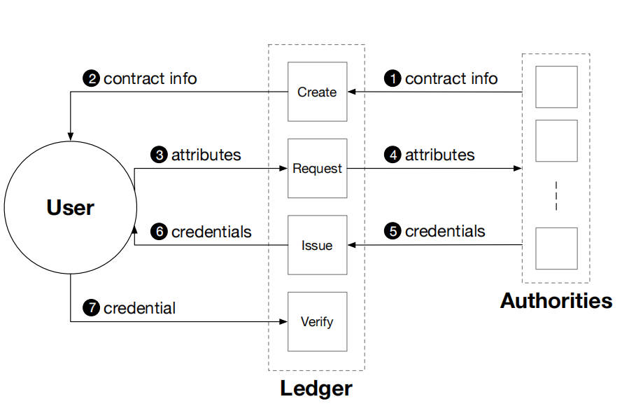
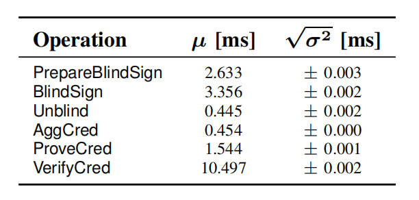
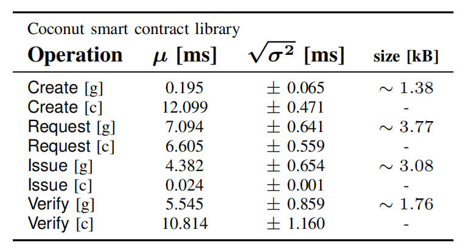

## 作者

Alberto Sonnino\*†, Mustafa Al-Bassam\*†, Shehar Bano\*†, Sarah Meiklejohn\* 和 George Danezis\*†

\* 英国伦敦大学学院

† chainspace.io

## 摘要

Coconut 是一种新型的选择性披露凭证方案，支持分布式门限签发、公共与私有属性、重新随机化，以及多种不可链接的选择性属性披露。Coconut 与区块链集成，以确保即使在部分凭证签发机构存在恶意或处于离线状态时，也能保证机密性、真实性和可用性。我们实现并评估了一个适用于 Chainspace 和 Ethereum 的通用 Coconut 智能合约库；并展示了三个与匿名支付、电子请愿，以及用于抗审查的代理分发相关的应用。Coconut 使用简短且计算高效的凭证，我们的评估结果表明，大多数 Coconut 密码学原语的运行平均仅需几毫秒，其中验证耗时最长（10 毫秒）。

## I. 引言

选择性披露凭证 [16], [19] 允许向用户签发凭证，并随后以不可链接的方式披露（或“展示”）其所编码的一些属性给验证者，以用于认证、授权或实现电子现金。然而，现有的方案存在缺陷。一些方案将凭证签名密钥委托给单个签发方，这会使得恶意的签发方能够伪造任何凭证或电子货币。其他方案则无法提供实现实用化选择性披露凭证所需的效率、重新随机化或盲签发等属性。没有任何现有方案能够同时具备效率、门限分布式签发、私有属性、重新随机化，以及不可链接的多次展示选择性披露。

缺乏高效的通用选择性披露凭证会影响支持“智能合约”的平台，例如 Ethereum [53]、Hyperledger [15] 和 Chainspace [1]。它们都有一个共同的限制，即可验证的智能合约只能执行记录在公共区块链上的操作。此外，这些系统的安全模型通常假设在存在一定数量不诚实或失效节点（拜占庭容错）的情况下，仍能保持完整性；同样的假设对于多个凭证签发方（门限签发）而言也是理想的。

通过智能合约签发凭证将非常理想：智能合约可以有条件地签发凭证，取决于区块链的状态，或者证明关于通过合约操作的用户的一些声明——例如他们的身份、属性，甚至是钱包的余额。这在当前是不可能的，因为现有的选择性凭证方案要么将签发委托给单个签发方，要么无法提供足够的效率、重新随机化、盲签发和选择性披露能力（如门限签名 [3] 的情况）。例如，Hyperledger 系统通过一个受信任的第三方签发方支持 CL 凭证 [16]，这展示了它们的有用性，但也暴露了其在签发方恶意时的脆弱性。Garman 等人 [26] 提出了一种去中心化的匿名凭证系统，将其集成到分布式账本中；它们能够在没有中心化签发方的情况下签发可公开验证的声明，但并不关注门限签发或通用凭证，而且展示凭证需要昂贵的双离散对数证明。

Coconut 解决了这些挑战，它允许一部分去中心化的、互不信任的权威机构联合签发凭证，这些凭证可以是公共或私有属性的。此类凭证不能被用户或潜在的少量恶意签发方伪造。凭证在展示选定属性之前可以被重新随机化，即使在所有权威和验证者串通的情况下，也能保护隐私。Coconut 方案基于一种门限签发签名方案，该方案允许将部分声明聚合到一个单一凭证中。映射到许可链和半许可链的上下文中，Coconut 允许负责维护区块链或基于联合挂钩的侧链 [3] 的权威集合联合签发选择性披露凭证。

Coconut 使用简短且计算高效的凭证，并提供高效的属性选择性披露与验证协议。每个部分凭证和合并后的凭证都由恰好两个群元素组成。无论属性数量或权威/签发方数量多少，凭证大小保持不变。此外，在一个一次性设置阶段中，用户从权威方收集并聚合门限数量的验证密钥后，属性展示与验证在加密计算和加密材料通信方面的复杂度均为 O(1)，且与权威方数量无关。我们对 Coconut 基元的评估结果非常有前景。验证大约需要 10 毫秒，而签署私有属性的速度大约快 3 倍。当客户端从分布在全球的 10 个权威机构聚合部分凭证时，延迟约为 600 毫秒。

**贡献** 本文的三项主要贡献是：

- 我们描述了 Coconut 所基于的签名方案，包括密钥生成、分布式签发、聚合与验证签名的操作方式（第 II 和 III 节）。该方案是 Waters 签名方案 [52]、BGLS 签名 [9] 和 Pointcheval 与 Sanders 签名方案 [43] 的扩展与混合。这是我们所知的第一个支持通用、完全分布式门限签发、可重新随机化、多次展示的凭证方案。
- 我们使用 Coconut 为 Chainspace [1] 和 Ethereum [53] 实现了通用智能合约库，支持公共与私有属性签发、聚合、重新随机化与选择性披露（第 IV 节）。我们在这些平台上评估了其性能与成本（第 VI 节）。
- 我们基于 Coconut 合约库设计了三个应用：一个提供支付匿名性的币混合器；一个保护隐私的电子请愿系统；一个为抗审查系统提供代理分发的系统（第 V 节）。我们在 Chainspace 平台上实现并评估了前两个应用，并提供了安全性与性能评估（第 VI 节）。

## II. Coconut 概述

图 1：Coconut 架构的高级概览

Coconut 是一种选择性披露凭证系统，支持门限凭证签发（包括公共和私有属性）、凭证的重新随机化以支持多次不可链接的披露，以及有选择性地披露部分属性的能力。它被嵌入到一个智能合约库中，可以由其他合约调用来签发凭证。

Coconut 的体系结构如图 1 所示。任何 Coconut 用户都可以向一组 Coconut 签发机构发送一个 **request** 命令；该命令指定一组要写入凭证的公共属性或加密的私有属性（①）。然后，每个权威机构用一个 **issue** 命令进行回应，交付一个部分凭证（②）。任何用户都可以收集到门限数量的份额，将它们聚合成一个单一的合并凭证，并对其进行重新随机化（③）。凭证在认证中的用途仅限于知道凭证中嵌入的私有属性（例如私钥）的用户。拥有凭证的用户可以执行 **show** 协议，有选择性地披露属性或关于这些属性的声明（④）。展示协议是公开可验证的，并且可能会被公开记录。

Coconut 具有以下设计目标：

- **门限权威机构（Threshold authorities）**：只需要一部分权威机构来签发部分凭证，以便允许用户生成一个合并凭证。**request** 和 **issue** 协议的通信复杂度是 O(t)，其中 t 是权威机构子集的大小。此外，从少于 t 个部分凭证生成合并凭证是不可能的。
- **盲签发与不可链接性（Blind issuance & Unlinkability）**：权威机构在签发凭证时不会获知凭证中嵌入的私有属性的任何额外信息。此外，不可能将同一凭证的多次展示相互关联，也不能将其与签发记录关联，即便所有权威机构串通（参见 III-B 节）。
- **非交互性（Non-interactivity）**：权威机构可以彼此独立运行，只需进行一次简单的密钥分发和设置阶段来就公共安全与密码参数达成一致——它们不需要同步或进一步协调活动。
- **活性（Liveness）**：只要有一个门限数量的权威机构保持诚实，并且密钥分发满足弱同步假设 [33]，Coconut 就能保证活性。
- **高效性（Efficiency）**：凭证及协议中涉及的所有零知识证明都是简短且计算高效的。在聚合和重新随机化之后，属性展示与验证仅涉及一个单一的合并凭证，因此在加密计算和加密材料通信方面的复杂度都是 O(1)，与权威机构数量无关。
- **短凭证（Short credentials）**：每个部分凭证以及合并凭证都由恰好两个群元素组成，无论权威机构数量或凭证中嵌入的属性数量是多少。

因此，可以使用大量权威机构来签发凭证，而不会显著影响效率。

## III. Coconut 构造

我们逐步介绍支持 Coconut 架构的密码学原语，从 Pointcheval 和 Sanders [43] 以及 Boneh 等人 [10], [9] 的设计开始，最终到完整的 Coconut 方案。

- **步骤 1**：我们首先回顾（III-C 节）Pointcheval 等人 [43] 针对单属性凭证的方案。我们介绍了该方案的局限性——这些局限性阻碍了它满足第二节中提出的设计目标，并展示了如何结合 Boneh 等人 [10] 的原理来克服这些局限。
- **步骤 2**：我们引入（III-D 节）Coconut 门限凭证方案，该方案同时具备 Pointcheval 和 Sanders [43] 以及 Boneh 等人 [10] 的所有特性，并使我们能够实现所有的设计目标。
- **步骤 3**：最后，我们扩展（III-E 节）我们的方案，以支持同时嵌入 qqq 个不同属性 (m1,…,mq)(m_1, \ldots, m_q)(m1,…,mq) 的凭证。

### A. 符号与假设

我们在本文其余部分中使用以下符号，以及我们的原语所依赖的安全性假设。

#### a) 零知识证明

我们的凭证方案使用**非交互式零知识证明**来断言在离散对数值上的知识与关系。我们使用 Camenisch 等人 [17] 引入的符号来表示这些非交互式零知识证明：
$$
\text{NIZK}\{(x, y, \ldots) : \text{statements about } x, y, \ldots \}
$$
这表示在零知识下证明秘密值 $(x, y, \ldots)$（所有其他值是公开的）满足冒号后给出的声明。

#### b) 密码学假设

Coconut 需要素数阶 $p$ 的群 $(\mathbb{G}_1, \mathbb{G}_2, \mathbb{G}_T)$，以及双线性映射 $e: \mathbb{G}_1 \times \mathbb{G}_2 \to \mathbb{G}_T$ 并满足以下性质：

1. **双线性性**（Bilinearity）：对所有 $g_1 \in \mathbb{G}_1, g_2 \in \mathbb{G}_2$ 以及 $a, b \in \mathbb{F}_p^2$，有

   $e(g_1^a, g_2^b) = e(g_1, g_2)^{ab}$

2. **非退化性**（Non-degeneracy）：对所有 $g_1 \in \mathbb{G}_1, g_2 \in \mathbb{G}_2$，有 $e(g_1, g_2) \neq 1$。

3. **高效性**（Efficiency）：映射 $e$ 是可高效计算的。

4. 此外，$\mathbb{G}_1 \neq \mathbb{G}_2$，并且在 $\mathbb{G}_1$ 和 $\mathbb{G}_2$ 之间不存在高效同态映射。类型 3 配对是高效的 [25]。它们支持 XDH 假设，即在 $\mathbb{G}_1$ 和 $\mathbb{G}_2$ 中的计算型协同 Diffie-Hellman（co-CDH）问题，以及在 $\mathbb{G}_1$ 中的判定型 Diffie-Hellman（DDH）问题都是困难的 [10]。

Coconut 还依赖于一个密码学安全的哈希函数 $H$，将 $\mathbb{G}_1$ 的一个元素哈希到 $\mathbb{G}_1$ 的另一个元素上，即
$$
H: \mathbb{G}_1 \to \mathbb{G}_1
$$
我们实现该函数的方法是序列化输入点的 $(x, y)$ 坐标，并应用一个全域哈希函数将此字符串哈希为 $\mathbb{G}_1$ 的一个元素（如 Boneh 等人 [10] 所述）。

#### c) 门限与通信假设

Coconut 假设诚实多数（$n/2 < t$）以防止恶意权威机构任意签发凭证。Coconut 权威机构之间不需要通信；用户等待 $t$ 份（按任意顺序或到达时间）回复后，将它们聚合为一个合并凭证；因此，Coconut 隐式假设是一个异步环境。然而，我们当前的实现依赖 Kate 等人 [33] 的分布式密钥生成协议，该协议要求（i）弱同步性以保证活性（但不是安全性），以及（ii）最多不超过三分之一的不诚实权威机构。

### B. 方案定义与安全性质

我们给出构成门限凭证方案的协议：

- **Setup**$(1^\lambda) \rightarrow (\text{params})$：定义系统参数 $\text{params}$，该参数依赖于安全参数 $\lambda$。这些参数是公开可用的。
- **KeyGen**$(\text{params}) \rightarrow (\text{sk}, \text{vk})$：由权威机构运行，根据公开的 $\text{params}$ 生成其私钥 $\text{sk}$ 和验证密钥 $\text{vk}$。
- **AggKey**$(\text{vk}_1, \ldots, \text{vk}_t) \rightarrow (\text{vk})$：由希望验证凭证的任意方运行，将任意 $t$ 个验证密钥 $\text{vk}_i$ 聚合成一个单一的合并验证密钥 $\text{vk}$。AggKey 只需运行一次。
- **IssueCred**$(m, \phi) \rightarrow (\sigma)$：这是用户与每个权威机构之间的交互协议，用户获得一个凭证 $\sigma$，其中嵌入了满足声明 $\phi$ 的私有属性 $m$。
- **AggCred**$(\sigma_1, \ldots, \sigma_t) \rightarrow (\sigma)$：由用户运行，将任意 $t$ 个部分凭证 $\sigma_i$ 聚合成一个单一的合并凭证。
- **ProveCred**$(\text{vk}, m, \phi') \rightarrow (\Theta, \phi')$：由用户运行，计算一个证明 $\Theta$，证明其拥有一个凭证，该凭证证明私有属性 $m$ 满足声明 $\phi'$（基于对应的验证密钥 $\text{vk}$）。
- **VerifyCred**$(\text{vk}, \Theta, \phi') \rightarrow (\text{true/false})$：由希望验证凭证的任意方运行，验证凭证中嵌入的私有属性是否满足声明 $\phi'$，使用验证密钥 $\text{vk}$ 和由 ProveCred 生成的密码材料 $\Theta$。

一个门限凭证方案必须满足以下安全性质：

- **不可伪造性（Unforgeability）**：对于对手用户来说，应该无法说服一个诚实的验证者相信其持有一个实际上并没有的凭证（即，他们没有从至少 $t$ 个权威机构获得有效的部分凭证）。
- **盲性（Blindness）**：对于对手权威机构来说，在执行 IssueCred 协议期间，不应能够获得关于属性 $m$ 的任何信息，除了它满足声明 $\phi$ 这一事实。
- **不可链接性 / 零知识（Unlinkability / Zero-knowledge）**：对于对手验证者（可能与对手权威机构协作）来说，应该无法获得关于属性 $m$ 的任何信息，除了它满足 $\phi'$ 之外；也无法将一次 ProveCred 协议的执行与另一次 ProveCred 协议的执行相联系，或者将 ProveCred 协议的执行与 IssueCred 协议（对于给定的属性 $m$）的执行相联系。

### C. Coconut 的基础

在给出完整的 Coconut 构造之前，我们首先回顾由 Pointcheval 和 Sanders [43] 提出的凭证方案；它们的构造具有与 CL 签名 [16] 相同的性质，但效率更高。该方案在三型双线性群 $(\mathbb{G}_1, \mathbb{G}_2, \mathbb{G}_T)$ 中工作，双线性映射为 $e: \mathbb{G}_1 \times \mathbb{G}_2 \rightarrow \mathbb{G}_T$ 如 III-A 节所述。

* **P.Setup**$(1^\lambda) \rightarrow (\text{params})$：选择一个阶为 $p$ 的双线性群 $(\mathbb{G}_1, \mathbb{G}_2, \mathbb{G}_T)$，其中 $p$ 是一个 $\lambda$-位的素数。令 $g_1$ 为 $\mathbb{G}_1$ 的生成元，$g_2$ 为 $\mathbb{G}_2$ 的生成元。系统参数为$\text{params} = (\mathbb{G}_1, \mathbb{G}_2, \mathbb{G}_T, p, g_1, g_2)$。

- **P.KeyGen**$(\text{params}) \rightarrow (\text{sk}, \text{vk})$：选择一个随机的私钥 $\text{sk} = (x, y) \in \mathbb{F}_p^2$。解析参数 $\text{params} = (\mathbb{G}_1, \mathbb{G}_2, \mathbb{G}_T, p, g_1, g_2)$，并公开验证密钥 $\text{vk} = (g_2, \alpha, \beta) = (g_2, g_2^x, g_2^y)$。

- **P.Sign**$(\text{params}, \text{sk}, m) \rightarrow (\sigma)$：解析 $\text{sk} = (x, y)$。选择一个随机数 $r \in \mathbb{F}_p$，并令 $h = g_1^r$。输出 $\sigma = (h, s) = (h, h^{x+ym})$。
- **P.Verify**$(\text{params}, \text{vk}, m, \sigma) \rightarrow (\text{true/false})$：解析 $\text{vk} = (g_2, \alpha, \beta)$ 和 $\sigma = (h, s)$。如果 $h \neq 1$ 且 $e(h, \alpha \beta^m) = e(s, g_2)$ 则输出 **true**；否则输出 **false**。

签名 $\sigma = (h, s)$ 可以通过选择一个随机数 $r' \in \mathbb{F}_p$ 并计算 $\sigma' = (h^{r'}, s^{r'})$ 来重新随机化。上述方案可以修改以向私有属性颁发凭证：用户首先选择一个随机数 $t \in \mathbb{F}_p$，计算消息 $m$ 的承诺值 $c_p = g_1^t Y^m$ 其中 $Y = g_1^y$，并将其与一个零知识证明（用于证明该承诺的正确性）一起发送给单个权威机构。权威机构验证该证明后，选择一个随机数 $u \in \mathbb{F}_p$，返回 $\tilde{\sigma} = (h, \tilde{s}) = (g^u, (X c_p)^u)$ 其中 $X = g_1^x$。用户通过计算 $\sigma = (h, \tilde{s}(h)^{-t})$ 来取消盲化，该值即为凭证。

该方案具备盲性、不可链接性、高效性和短凭证等特性；但它不支持门限签发，因此无法满足我们的设计目标。这一限制源于 **P.Sign** 算法——签发机构使用私钥和自生成的随机数 $r$ 来计算凭证，这使得该方案无法在多权威环境中高效分布化。为克服这一限制，我们利用 BLS 签名 [10] 引入的一个概念；使用哈希函数 $H : \mathbb{F}_p \rightarrow \mathbb{G}_1$ 计算群元素 $h = H(m)$。下一节将描述 Coconut 如何结合这些概念来实现所有设计目标。

### D. Coconut 门限凭证方案

我们介绍 **Coconut** 门限凭证方案，允许用户在私有或公共属性 $m$ 上获得部分凭证 $\sigma_i$。在一个拥有 $n$ 个权威机构的系统中，一个 $t-out-of-n$ 的门限凭证方案提供了极大的灵活性，因为用户只需收集 $n/2 < t \le n$ 个部分凭证即可重新计算出合并凭证（$t$ 和 $n$ 都是方案参数）。

#### a) 密码学原语

为了简单起见，我们下面描述一个由可信第三方执行的密钥生成算法 **TTPKeyGen**；该协议也可以通过分布式方式执行，例如 Gennaro 等人 [27] 所示的同步假设下，或者 Kate 等人 [33] 所示的弱同步假设下。增加或移除权威机构需要重新运行密钥生成算法——这种限制继承自底层 Shamir 秘密共享协议 [48]，可以通过 Herzberg 等人 [29] 引入的技术进行缓解。

------

- **Setup**$(1^\lambda) \rightarrow (\text{params})$：选择一个阶为 $p$ 的双线性群 $(\mathbb{G}_1, \mathbb{G}_2, \mathbb{G}_T)$，其中 $p$ 是一个 $\lambda$ 位的素数。令 $g_1, h_1$ 为 $\mathbb{G}_1$ 的生成元，$g_2$ 为 $\mathbb{G}_2$ 的生成元。系统参数为 $\text{params} = (\mathbb{G}_1, \mathbb{G}_2, \mathbb{G}_T, p, g_1, g_2, h_1)$。

- **TTPKeyGen**$(\text{params}, t, n) \rightarrow (\text{sk}, \text{vk})$：选择两个次数为 $t-1$ 的多项式 $v, w$，其系数在 $\mathbb{F}_p$ 中，并设 $(x, y) = (v(0), w(0))$。为每个权威机构 $i \in [1, \ldots, n]$ 分配私钥 $\text{sk}_i = (x_i, y_i) = (v(i), w(i))$ 并公开验证密钥 $\text{vk}_i = (g_2, \alpha_i, \beta_i) = (g_2, g_2^{x_i}, g_2^{y_i})$。

- **IssueCred**$(m, \phi) \rightarrow (\sigma)$：凭证签发由三个算法组成：

  * **PrepareBlindSign**$(m, \phi) \rightarrow (d, \Lambda, \phi)$：用户生成一个 El-Gamal 密钥对 $(d, \gamma = g_1^d)$；选择一个随机数 $o \in \mathbb{F}_p$，计算承诺值 $c_m$ 和群元素 $h \in \mathbb{G}_1$:
    $$
    c_m = g_1^m h_1^o \ \ \ \ \ and \ \ \ \ \ h = H(c_m)
    $$
    随机选择 $k \in \mathbb{F}_p$，计算 $m$ 的 El-Gamal 加密：
    $$
    c = Enc(h^m) = (g_1^k, \gamma^k h^m)
    $$
    输出 $(d, \Lambda = (\gamma, c_m, c, \pi_s), \phi)$，其中 $\phi$ 是 $m$ 满足的应用特定谓词，$\pi_s$ 为零知识证明：
    $$
    \pi_s = NIZK\{(d, m, o, k) : \gamma = g_1^d \wedge c_m = g_1^m h_1^o \wedge c = (g_1^k, \gamma^k h^m) \wedge \phi(m) = 1\}
    $$

  * **BlindSign**$(\text{sk}_i, \Lambda, \phi) \rightarrow (\tilde{\sigma}_i)$：权威 $i$ 解析 $\Lambda = (\gamma, c_m, c, \pi_s)$，$\text{sk}_i = (x_i, y_i)$，以及 $c = (a, b)$，重新计算 $h = H(c_m)$ 并用 $\gamma, c_m, \phi$ 验证 $\pi_s$。若验证通过，构造 $\tilde{c}_i = (a^{y}, h^{x_i} b^{y_i})$ 输出 $\tilde{\sigma}_i = (h, \tilde{c}_i)$；否则输出 $⊥$ 并终止协议。

  * **Unblind**$(\tilde{\sigma}_i, d) \rightarrow (\sigma_i)$：用户解析 $\tilde{\sigma}_i = (h, \tilde{c})$ 和 $\tilde{c} = (\tilde{a}, \tilde{b})$，计算 $\sigma_i = (h, \tilde{b}(\tilde{a})^{-d})$ 输出 $\sigma_i$。

* **AggCred**$(\sigma_1, \ldots, \sigma_t) \rightarrow (\sigma)$：解析每个 $\sigma_i = (h, s_i)$，输出$(h, \prod_{i=1}^t s_i^{l_i})$ 其中 $l$ 为拉格朗日系数：
  $$
  l_i = \left[ \prod_{j=1, j \neq i}^t (0-j) \right] \cdot \left[ \prod_{j=1, j \neq i}^t (i-j) \right]^{-1} \bmod p
  $$

* **ProveCred**$(\text{vk}, m, \sigma, \phi') \rightarrow (\Theta, \phi')$：解析 $\sigma = (h, s)$ 和 $\text{vk} = (g_2, \alpha, \beta)$，随机选择 $r', r \in \mathbb{F}_p^2$，令 $\sigma' = (h', s') = (h^{r'}, s^{r'})$，构造 $\kappa = \alpha \beta^m g_2^r$，$\nu = (h')^r$，输出 $\Theta = ((\kappa, \nu, \sigma', \pi_v), \phi')$，其中 $\phi'$ 是一个由 $m$ 满足的特定应用谓词， $\pi_v$ 则是零知识证明：
  $$
  \pi_v = NIZK\{(m, r) : \kappa = \alpha \beta^m g_2^r \wedge \nu = (h')^r \wedge \phi'(m) = 1\}
  $$

- **VerifyCred**$(\text{vk}, \Theta, \phi') \rightarrow (\text{true/false})$：解析 $\Theta = (\kappa, \nu, \sigma', \pi_v)$ 和 $\sigma' = (h', s')$，使用 $\text{vk}$ 和 $\phi'$ 验证 $\pi_v$。若验证成功且 $h' \neq 1$ 且 $e(h', \kappa) = e(s'\nu, g_2)$，则输出 **true**，否则输出 **false**。

#### b) 正确性与说明

**Setup** 算法生成公共参数。凭证是 $\mathbb{G}_1$ 的元素，而验证密钥是 $\mathbb{G}_2$ 的元素。图 2 展示了协议交互过程。

图 2：Coconut 门限凭证协议交互过程

为了使属性 $m \in \mathbb{F}_p$ 对权威机构保密，用户运行 **PrepareBlindSign** 生成 $\Lambda = (\gamma, c_m, c, \pi_s)$。他们创建一个 El-Gamal 密钥对 $(d, \gamma = g_1^d)$，选择一个随机数 $o \in \mathbb{F}_p$，并计算承诺值 $c_m = g_1^m h_1^o$。然后，用户计算 $h = H(c_m)$ 以及 $h^m$ 的加密：
$$
c = Enc(h^m) = (a, b) = (g_1^k, \gamma^k h^m)，其中 \ k \in \mathbb{F}_p
$$
最后，用户将 $(\Lambda, \phi)$ 发送给签发者，其中 $\pi_s$ 是一个零知识证明，用于证明 $m$ 满足应用特定谓词 $\phi$，并且 $\gamma, c_m, c$ 的正确性（①）。Coconut 所需的所有零知识证明均基于标准 sigma 协议，用于展示离散对数表示的知识；它们基于 DH 假设 [17]，且不需要任何可信设置。

为了对属性进行盲签名，每个权威 $i$ 验证证明 $\pi_s$，并利用 El-Gamal 的同态性质生成加密
$$
\tilde{c} = (a^y, h^{x_i} b^{y_i}) = (g_1^{ky_i}, \gamma^{ky_i} h^{x_i + y_i \cdot m})
$$
需要注意的是，每个权威必须在相同的元素 $h$ 上进行操作。从直观上看，从 $h = H(c_m)$ 生成 $h$ 等价于计算 $h = g_1^{\tilde{r}}$，其中 $\tilde{r} \in \mathbb{F}_p$ 对用户来说是未知的（如 Pointcheval 和 Sanders [43] 所述）。然而，由于 $h$ 是确定性的，每个权威都可以独立地推导它，并防止伪造，因为不同的 $m_0$ 和 $m_1$ 不可能导致相同的 $h$。正如 III-C 节中所述，Pointcheval 和 Sanders 的盲签名方案直接从属性的承诺构造凭证，并由权威机构秘密选择一个盲化因子；这不适合门限凭证的签发。我们通过在方案中引入 El-Gamal 密文 $c$ 并利用其同态性来规避此问题，如上所述。

当用户收到 $\tilde{c}$ 时，他们使用 El-Gamal 私钥 $d$ 解密它，以恢复部分凭证 $\sigma_i = (h, h^{x_i + y_i \cdot m})$。此过程由 **Unblind** 算法（②）执行。然后，用户可以调用 **AggCred** 算法来聚合任意 $t$ 个部分凭证。该算法使用拉格朗日基多项式 $l$，可通过多项式插值重构原始的 $v(0)$ 和 $w(0)$：
$$
v(0) = \sum_{i=1}^t v(i) l_i \quad\text{以及}\quad w(0) = \sum_{i=1}^t w(i) l_i
$$
然而，这个计算发生在指数中——无论是权威机构还是用户都不需要知道 $v(0)$ 和 $w(0)$ 的具体值。可以很容易地验证 **AggCred** 聚合 $t$ 个部分凭证 $\sigma_i = (h_i, s_i)$ 的正确性，如下所示：
$$
s = \prod_{i=1}^t (s_i)^{l_i} = \prod_{i=1}^t (h^{x_i + y_i \cdot m})^{l_i} = \prod_{i=1}^t (h^{x_i})^{l_i} \cdot \prod_{i=1}^t (h^{y_i \cdot m})^{l_i} = \prod_{i=1}^t h^{x_i l_i} \cdot \prod_{i=1}^t h^{y_i l_i \cdot m}= h^{v(0)+w(0)\cdot m} = h^{x+y\cdot m}
$$
在验证之前，验证者收集并聚合权威机构的验证密钥——这一过程只进行一次，并且在验证之前完成。**ProveCred** 和 **VerifyCred** 算法实现了验证过程。首先，用户通过选择一个随机数 $r' \in \mathbb{F}_p$，计算 $\sigma' = (h', s') = (h^{r'}, s^{r'})$ 来随机化凭证；然后，他们根据属性 $m$、盲因子 $r \in \mathbb{F}_p$，以及聚合验证密钥计算：
$$
\kappa = \alpha \beta^m g_2^r \quad \text{以及} \quad \nu = (h')^r
$$
最后，他们将 $\Theta = (\kappa, \nu, \sigma', \pi_v)$ 以及 $\phi'$ 发送给验证者，其中 $\pi_v$ 是一个零知识证明，用于断言 $\kappa$ 和 $\nu$ 的正确性，并且凭证中嵌入的私有属性 $m$ 满足应用特定谓词 $\phi'$（③）。证明 $\pi_v$ 还确保用户实际上知道 $m$，并且 $\kappa$ 是在使用正确的验证密钥和盲因子构造的。配对验证与 Pointcheval 和 Sanders [43] 以及 Boneh 等人 [10] 类似；表达式 $h' = g_1^{\tilde{r}} \quad|\quad \tilde{r} \in \mathbb{F}_p$ 时，配对验证的左边可以展开为：
$$
e(h', \kappa) = e(h', g_2^{x+my+r}) = e(g_1, g_2)^{(x+my+r)\tilde{r}}
$$
右边为：
$$
e(s'\nu, g_2) = e(h'^{x+my+r}, g_2) = e(g_1, g_2)^{(x+my+r)\tilde{r}}
$$
由此得到 **VerifyCred** 的正确性。

#### c) 安全性

我们所需的证明系统基于标准的 sigma 协议，用于展示离散对数表示的知识，并且可以通过 Fiat–Shamir 启发式 [23] 在随机预言机模型中转化为非交互式。由于我们的签名方案继承自 Pointcheval 和 Sanders [43] 以及 BLS [10]，我们也继承了它们的假设；即 **LRSW** [37] 和 **XDH** [10]。

> **定理 1.** 在 **LRSW、XDH** 和 **随机预言机存在性** 假设下，Coconut 是一个安全的门限凭证方案，这意味着它满足以下性质：
>
> * **不可伪造性**（只要少于 $t$ 个权威机构串通），
> * **盲性**，
> * **不可链接性**。

这个证明的概要基于 Coconut 底层组件的安全性，可以在附录 A 中找到。Coconut 保证了只要少于 $t$ 个权威机构串通（即 $t > n/2$），就满足不可伪造性；并且无论有多少权威机构串通（即使验证者与权威机构串通），仍能保证盲性和不可链接性。

### E. 多属性凭证

我们扩展了我们的方案，使其能够在一个单一凭证中嵌入多个属性而不会增加其大小；这种推广直接来源于 Waters 签名方案 [52] 和 Pointcheval 与 Sanders [43]。权威机构的密钥对变为：
$$
sk = (x, y_1, \ldots, y_q) \quad \text{以及} \quad vk = (g_2, g_2^x, g_2^{y_1}, \ldots, g_2^{y_q})
$$
其中 $q$ 是属性的数量。多属性凭证由承诺 $c_m$ 和群元素 $h$ 派生如下：
$$
c_m = g_1^o \prod_{j=1}^q h_j^{m_j}, \quad h = H(c_m)
$$
凭证则推广为：
$$
\sigma = (h, h^{x + \sum_{j=1}^q m_j y_j})
$$
凭证的大小不会随着属性数量或权威机构数量的增加而增长——它始终由两个群元素组成。多属性方案的安全性证明依赖于单属性方案的归约，并且与 Pointcheval 和 Sanders [43] 类似。此外，还可以将公共属性和私有属性结合起来：在隐藏部分属性的同时，揭示另外一些属性；**BlindSign** 算法只验证关于私有属性的证明 $\pi_s$（类似于 Chase 等人 [19]）。多属性密码方案的完整原语在附录 B 中给出。

如果凭证仅包含非随机属性，验证者可能通过暴力破解验证算法而猜出其值。这个问题通过在凭证中总是嵌入一个私有随机属性来解决，该属性同时也可以作为凭证的授权密钥。

## IV. 实现

我们实现了一个用于 Coconut 的 Python 库，如第 III 节所述，并将代码作为一个开源项目发布在 [GitHub](https://github.com/asonnino/coconut) 上。我们还在 Chainspace [1] 中实现了一个智能合约库，以便其他特定应用的智能合约（见第 V 节）能够方便地使用我们的密码学原语。我们在第 IV-A 节中介绍了 Coconut 智能合约库的设计与实现。此外，我们还在以太坊 [53] 上实现并评估了 Coconut 智能合约库的一些功能（第 IV-B 节）。最后，我们展示了如何将 Coconut 集成到现有的半许可区块链中（第 IV-C 节）。

### A. Coconut 智能合约库

图3：椰子智能合约库

我们在 [Chainspace](https://github.com/asonnino/coconut-chainspace) 中实现了 Coconut 智能合约6^66（它可以被其他特定应用的智能合约调用），作为一个库，用于通过跨合约调用签发和验证可重新随机化的门限凭证。该合约有四个函数，（**Create, Request, Issue, Verify**），如图 3 所示。

首先，一组权威机构调用 **Create** 函数来初始化一个 Coconut 实例，定义 **合约信息（contract info）**；即，它们的验证密钥、权威机构的数量，以及门限参数（①）。发起智能合约可以指定一个回调合约，该合约需要由用户执行以请求凭证；例如，该回调可以用于认证。这个实例是公开的，并且用户可以读取（②）；任何用户都可以通过执行指定的回调合约来调用 **Request** 函数，并提供要包含在凭证中的公共和私有属性（③）。公共属性只是清单中的一系列明文字符串，而私有属性则按照第 III-D 节所述进行加密。每个签发权威机构始终监控区块链，寻找凭证请求。如果请求出现在区块链上（即，一个交易被执行），这意味着回调已经被正确执行（④）；每个权威机构在指定的属性上签发一个部分凭证，通过调用 **Issue** 程序（⑤）。在我们的实现中，所有部分凭证都在区块链上；然而，它们也可以离线提供给用户。用户收集门限数量的部分凭证，并将它们聚合形成一个完整凭证（⑥）。接着，用户在本地对凭证进行重新随机化。Coconut 库合约的最后一个函数是 **Verify**，它允许区块链——以及其他任何人——检查给定凭证的有效性（⑦）。

这种架构的一个局限是，权威机构持续监控区块链的效率并不高。第 IV-C 节解释了如何克服这一限制，即通过将权威机构嵌入到运行区块链的节点中。

### B. 以太坊智能合约库

为了让 Coconut 更加广泛可用，我们还在 **以太坊（Ethereum）**——一种流行的无许可智能合约区块链 [53]——上实现了它。我们将 Coconut 以太坊智能合约作为一个[开源库](https://github.com/musalbas/coconut-ethereum)发布。该库使用 **Solidity** 编写，这是一种类似于高级 JavaScript 的语言，可以编译为以太坊虚拟机（EVM）的汇编代码。以太坊最近在 EVM 中硬编码了一个预编译智能合约，用于在 **alt_bn128 曲线** [14], [45] 上执行配对检查和椭圆曲线运算，以高效验证 zkSNARKs。执行以太坊智能合约会产生一个相关的 **“gas 成本”**，这是用户为执行交易而支付给矿工的费用。Gas 成本的计算基于合约执行的操作数量；操作越多，gas 成本越高。与等效的原生智能合约相比，预编译合约的 gas 成本更低。

我们使用这个预编译合约来执行配对检查，以便在智能合约中实现 Coconut 验证。以太坊代码只实现了在 $\mathbb{G}_1$ 上的椭圆曲线加法和标量乘法，而 Coconut 验证需要在 $\mathbb{G}_2$ 上的运算。因此，我们在 Solidity 中编写了 $\mathbb{G}_2$ 上的椭圆曲线加法和标量乘法的以太坊智能合约库，并同样作为[开源发布](https://github.com/musalbas/solidity-BN256G2)。这对许多 Coconut 应用来说是一个实用的解决方案，因为验证一个只揭示一个属性的凭证仅需要一次加法和一次标量乘法。然而，验证那些不会被揭示的属性则不切实际——这需要在 $\mathbb{G}_2$ 上进行三次乘法运算，而这会超出以太坊当前的区块 gas 限制（截至 2018 年 2 月为 8M）。

不过，我们仍然可以使用以太坊合约来设计一个 **联合挂钩的侧链（federated peg for side chains）**，或者将其作为一个 **币混合器（coin tumbler）** 的以太坊智能合约，基于凭证仅揭示一个属性的情况。接下来，我们描述并实现了这个基于 Coconut Chainspace 库的混币器（见第 V-A 节），但是以太坊版本的设计略有不同，以避免使用不会被揭示的属性，我们在附录 C 中描述了这一点。该库与第 IV-A 节中描述的 Chainspace 库共享相同的函数，除了 **Request** 和 **Issue** 被移到链下执行以节省 gas 成本。由于 **Request** 和 **Issue** 函数仅作为用户与权威机构之间的通信通道，因此用户可以直接在链下与权威机构通信以请求凭证。这节省了在区块链上存储这些函数所产生的大量 gas 成本。**Verify** 函数则仅检查针对由 **Create** 函数创建的 Coconut 实例的凭证有效性。

### C. 更深入的区块链集成

第 IV-A 节和第 IV-B 节中描述的设计依赖于在链外的权威机构来签发凭证。在本节中，我们提出了将 Coconut 权威机构直接纳入一些半许可区块链基础设施中的设计。这使得凭证的签发可以作为正常系统操作的副作用完成，而不需要依赖额外的权威机构。如何将 Coconut 嵌入到基于工作量证明或权益证明的无许可系统中仍是一个未解决的问题。这类系统的节点集合高度动态，负责维护区块链状态，而这些节点不能直接映射为 Coconut 的签发权威机构。

将 Coconut 集成到 **Hyperledger Fabric** [15]——一种许可区块链平台——是直接了当的。Fabric 合约在一组私有计算节点上运行，并使用 Fabric 协议进行跨合约调用。在这种设置下，Coconut 签发权威机构可以与 Fabric 智能合约的权威机构重合。在合约设置时，它们执行系统设置和密钥分发，并在合约授权的情况下签发部分凭证。对于签发 Coconut 凭证，唯一需要保持秘密的是私有签发密钥；而合约的所有其他操作都可以被记录和公开验证。与当前 Hyperledger 中依赖单一权威的传统 CL 凭证方案相比，Coconut 显然具有优势。门限信任假设——即即使在部分权威机构遭到破坏的情况下也能保证完整性——仍然成立，并且防止了单个被破坏节点伪造凭证。

我们还可以自然地将 Coconut 嵌入到分片可扩展区块链中，例如 **Chainspace** [1]（支持通用智能合约）和 **Omniledger** [34]（支持数字代币）。在这些系统中，交易由一组“分片”权威机构分发和执行，其成员和公钥是已知的。Coconut 权威机构可以自然地与分片中的节点重合——在 Omniledger 中，一种特殊的交易类型，或者在 Chainspace 中，一个特殊的对象，可以向它们发出信号，表明某一凭证的签发已被授权。然后，权威机构生成重建 Coconut 凭证所需的部分签名，并将其附加到它们正在处理的交易中。用户可以对凭证进行聚合、重新随机化，并展示凭证。

## V. 应用

在本节中，我们提出了三个利用 Coconut 来提升安全性和隐私性的应用——一个 **币混合器**（第 V-A 节）、一个 **隐私保护的请愿系统**（第 V-B 节），以及一个 **用于抗审查的代理分发系统**（第 V-C 节）。为了保持通用性，这些应用假设权威机构位于区块链之外，但正如第 IV-C 节所描述的，它们也可以被嵌入到区块链中。

### A. 币混合器

图4：硬币翻转器应用

我们在 Chainspace 上实现了一个 **币混合器（coin tumbler 或 mixer）**，如图 4 所示。币混合是一种方法，用于将与某个地址相关联的加密货币，与公共账本中其他地址混合，从而“清洗”这些币，并模糊其追溯到原始来源地址的路径。之前类似方案的一个局限 [11], [51], [28], [38], [46], [7], [39] 在于它们要么是**中心化的**（即存在一个运行混合器的中心化权威机构，而该机构可能下线），要么要求用户彼此之间进行协调。Coconut 混合器通过一种**分布式设计**解决了这些问题（即，安全性依赖于一组多个权威机构，它们被集体信任以至少包含 $t$ 个诚实的权威），并且不要求用户彼此协调。Zcash [47] 实现了一个类似目标：它在理论上隐藏了交易的整体性，但代价是较大的计算开销，并提供了一个以明文形式廉价发送交易的选项。实际上，隐藏交易的计算开销使得这种方式不切实际，只有少数用户利用了 Zcash 所提供的可选隐私。因此，交易很容易被去匿名化 [30]，而近期的一些研究工作则致力于降低 Zcash 隐藏交易的计算开销 [12]。Coconut 提供了高效的证明，仅需几毫秒（见第 VI 节），从而使隐藏交易变得可行。Zcash 的信任假设与 Coconut 不同：Zcash 并不是假设有一个门限数量的诚实权威机构，而是依赖于 zk-SNARKs，其假设一个由可信权威机构执行的设置算法10^1010。Möbius [39]——与本工作同时开发——是一个基于以太坊智能合约的币混合器，它在匿名性和链下通信复杂性方面实现了较强的保证。Möbius 依赖环签名，使各方能够证明自己属于某个群体，而无需透露究竟是哪个公钥属于自己。

我们的混合器使用 Coconut 来实例化一个**挂钩侧链（pegged sidechain）** [3]，与原始加密货币平台相比，提供了更强的价值转移匿名性。这种匿名性通过在表示电子币的凭证与其消费行为之间建立不可链接性来实现 [20]。该混合器应用基于 Coconut 智能合约库和一个特定的智能合约（称为 **tumbler**）来构建。

一组权威机构共同创建一个 **Coconut 智能合约实例**，如第 IV-A 节所述，并指定处理底层区块链币的智能合约作为回调。具体来说，回调需要一个向缓冲账户的币转账。然后，用户执行该回调，并支付 $v$ 个币到缓冲账户，以此在公共属性 $v$ 上请求一个凭证，并在两个私有属性上请求：用户的私钥 $k$ 以及一个随机生成的序列号 $s$（①）。请注意，为了防止流量分析追踪，$v$ 应该限制在一个特定的取值集合（类似于现金面额）。只有当用户将 $v$ 个币存入缓冲账户时（②），区块链才会接受该请求。

每个权威机构都会监控区块链，并检测到该 **请求**（③）；然后向用户签发一个部分凭证（可以是链上或链下的）（④）。用户将所有部分凭证聚合成一个合并凭证，对其重新随机化，并将其作为一个“币代币”提交给商家。首先，用户生成一个零知识证明，证明自己掌握了与其私钥绑定的知识，并将证明绑定到商家的地址 $addr$。然后，用户将该证明、序列号 $s$，以及合并凭证一起提供给商家（⑤）。这些币只能在拥有相关序列号知识以及 $addr$ 拥有者的情况下才能被使用。为了接受上述支付，商家将代币提交给混合器合约，展示凭证以及一个群元素 $\zeta = g_1^i \in \mathbb{G}_1$ 同时提交一个零知识证明，证明 $\zeta$ 是格式正确的（⑥）。为了防止双花，混合器合约维护一个已展示过的所有元素 $\zeta$ 的记录。当用户展示一个嵌入新（未使用）序列号的 $\zeta$ 时，合约验证凭证和零知识证明是否正确，并检查 $\zeta$ 是否未在已花费列表中。然后，它从缓冲账户中取出 $v$ 个币（⑦），将其发送到商家账户（由 $addr$ 确定），并将 $\zeta$ 添加到已花费列表中（⑧）。为简便起见，我们保持转账金额 $v$ 以明文形式存在（作为一个公共属性），但它可以通过集成范围证明（range proof）轻松隐藏；这一点可以高效地通过 Bünz 等人 [13] 提出的技术来实现。

**安全性考量** Coconut 提供**盲签发**，它允许用户在序列号 $s$ 上获取凭证，而不会让权威机构知晓其值。没有盲性的话，任何看到用户密钥 $k$ 的权威机构都可能与用户和商家竞争，抢先消费并窃取代币——而盲性防止了权威机构窃取代币。此外，Coconut 提供了支付阶段（①）与提交阶段（⑤）（见图 4）之间的**不可链接性**，防止任何权威机构或第三方跟踪用户的交易。因此，商家能够收到商品或服务的付款，但无法识别购买者。维护所有元素 $\zeta$ 的一个全局列表，可以防止双花攻击 [31]，而无需透露序列号 sss；这避免了攻击者在提交代币阶段（⑥）利用竞态条件来锁定用户资金。最后，该应用防止了单个权威机构伪造币，从而窃取缓冲区中的所有资金。Coconut 的**门限属性**意味着，对手需要破坏至少 ttt 个权威机构才能实现攻击。少量的权威机构无法阻止代币的签发——服务被保证是可用的，只要至少有 $t$ 个权威机构在运行。

### B. 隐私保护请愿

我们考虑这样一个场景：若干管理国家 $C$ 的权威机构希望向其公民签发一些长期凭证，以便任何第三方能够组织一个隐私保护型的请愿。所有 $C$ 的公民都被允许参与，但应保持匿名，并且在不同请愿之间不可被链接。这个应用扩展了 Diaz 等人 [22] 的工作，而后者没有考虑凭证的门限签发。

图5：请愿申请

我们的请愿系统基于 Coconut 库合约和一个名为 “petition” 的简单智能合约。有三类参与方：代表 $C$ 的签发权威机构、一名请愿发起人，以及 $C$ 的公民。签发权威机构创建一个 Coconut 智能合约实例，如第 IV-A 节所述。正如图 5 所示，公民向权威机构提供一个 **身份证明**（①）。权威机构检查该公民的身份，并在她的私钥 kkk 上签发一个盲化且长期的签名。这个签名，公民只需获取一次，即可作为她的长期 **凭证** 来签署任何请愿（②）。

任何第三方都可以 **创建一个请愿**，方法是创建一个新的请愿合约实例，并成为该请愿的“所有者”。请愿实例指定一个标识符 $g_s \in \mathbb{G}_1$，它在表示上是唯一的，使其无法与方案中的其他点链接，同时还有签发凭证的权威机构的验证密钥，以及任何应用特定的参数（例如投票选项和当前投票数）（③）。为了 **签署请愿**，公民计算一个值 $\zeta = g_s^k$。然后，他们改造第 III-D 节的 **ProveCred** 算法中的零知识证明，来表明 $\zeta$ 确实是由凭证中的同一私钥 $k$ 构造的。请愿合约检查证明和凭证，并检查该签名是否是新的，即验证 $\zeta$ 不在已使用列表中。如果所有检查都通过，它会将公民的签名添加到记录列表中，并将 $\zeta$ 添加到已使用列表中，以防止公民在同一请愿中多次签名（防止双花）（④）。此外，零知识证明还确保 $\zeta$ 确实是由一个已签发的私钥 $k$ 生成的；这意味着用户正确执行了回调，从而证明他们确实是 $C$ 的公民。

**安全性考量** Coconut 的盲性属性防止了权威机构获知公民的私钥，并防止其滥用该私钥代替公民签署请愿。另一个好处是，它允许公民匿名签署请愿；公民只需经历一次签发阶段，之后便可以多次重复使用凭证，同时仍保持匿名性，并且在不同请愿之间不可被链接。Coconut 允许分布式凭证签发，消除了单一的中心化权威机构，并防止某个单独实体创建任意凭证以多次签署请愿。

### C. 抗审查代理分发

图6：抗审查代理分发系统

代理可以被用来绕过审查，但它们本身也常常成为审查的目标。我们提出了一个基于 Coconut 的系统，用于**抗审查代理分发（CRS）**。在我们的 CRS 中，志愿者 $V$ 运行代理，并通过其长期公钥为 Coconut 权威机构所知。权威机构通过一个带外机制（out of band mechanism）来建立志愿者的信誉（通过它们的公钥标识）。用户 $U$ 想要找到属于可信志愿者的代理 IP 地址，但志愿者希望隐藏其身份。如图 6 所示，$V$ 从代理获得一个临时公钥 $pk'$（①），向权威机构提供一个 **身份证明**（②），并在两个私有属性上获得一个凭证：代理的 IP 地址 $addr$、临时公钥 $pk'$，以及凭证的有效期 $\delta$（③）。

随后，$V$ 将凭证与相应的代理共享（④），代理创建代理信息（proxy info），其中包括 $pk'$、$\delta$ 和凭证；代理通过将这些信息附加到区块链上进行“注册”，并附带一个零知识证明以及验证凭证有效性所需的材料（⑤）。

用户 $U$ 监控区块链以获取代理注册信息。当找到注册时，$U$ 通过在区块链上发布一个 **请求信息（request info）** 消息来表明使用该代理的意图，该消息格式如下：用户 IP 地址使用注册条目中嵌入的 $pk'$ 进行加密（⑥）。代理持续监控区块链，并在发现指向其的用户请求时，**连接** 到用户 $U$，并展示与 $pk'$ 相关的私钥知识证明（⑦）。用户 $U$ 验证该证明、代理的 IP 地址和有效期，然后开始通过该代理中继其流量。

**安全性考量** 抗审查系统的一个常见局限是依赖于那些被**假设为能够抵抗强制**的志愿者：（i）志愿者是一个大型商业组织（如 Amazon 或 Google），审查者无法对其施加影响；和/或（ii）志愿者位于审查国家之外。然而，这两种假设都被证明是错误的 [50], [49]。所提出的 CRS 通过为来自审查者控制下的用户和权威机构的志愿者提供抗强制性，克服了这一限制。由于 Coconut 的盲性属性，志愿者可以在不向权威机构透露其 IP 地址和临时公钥的情况下，获得一个凭证。用户从志愿者处获取代理 IP 地址，但无法将其链接到志愿者的长期公钥。此外，权威机构独立运行，可以由不同实体控制，并且在一定数量的权威机构不诚实或被关闭的情况下，系统仍然具有弹性。

## VI. 评估

我们对 Coconut 门限凭证方案进行了评估；首先，我们对第 III 节中描述的密码学原语进行了基准测试，然后我们评估第 V 节中描述的智能合约。

### A. 密码学原语

我们在 Python 中使用 [petlib](https://github.com/gdanezis/petlib) 和 [bplib](https://github.com/gdanezis/bplib) 实现了第 III 节中描述的原语。双线性对定义在 **Barreto–Naehrig [32]** 曲线上，使用 OpenSSL 作为算术后端。

#### a) 时间基准

表 I：第 III 节中所描述的密码学原语的执行时间，测量的是在 10,000 次运行中针对一个私有属性的结果。AggCred 的计算假设有两个权威机构；其他原语则与权威机构的数量无关

表 I 显示了第 III 节中每个过程的执行平均值（$\mu$）和标准差（$\sqrt{\sigma^2}$）。每个结果基于 10,000 次运行，测试机器为一台八核 Dell 台式机，3.6GHz Intel Xeon。签名远快于验证凭证——因为后者涉及配对运算；验证大约需要 10 毫秒，而私有属性签名则快约 3 倍。

#### b) 通信复杂度与数据包大小

表 II：Coconut 凭证方案在签发一个公共属性和一个私有属性时的通信复杂度和交易大小（见第 III 节的图 2）

表 II 显示了 Coconut 凭证方案中每次交换的通信复杂度和大小，如图 2 所示。通信复杂度以签发权威数量 $n$ 的函数表示，每个属性的大小限制为 32 字节（SHA-2 哈希函数的输出）。一个凭证的大小为 **132 字节**。最高的事务大小是请求和验证包含私有属性的凭证；这是因为需要传输证明 $\pi_s$ 和 $\pi_v$（见第 III 节）。证明 $\pi_s$ 大约为 **318 字节**，而 $\pi_v$ 为 **157 字节**。

#### c) 客户端感知延迟

图7：采用地理分布式授权机构的椰子阈值凭证方案中客户端感知的潜伏期，针对单一属性进行100次运行测量

我们评估了 Coconut 门限凭证方案的客户端感知延迟，部署环境为 Amazon AWS [2]。用户请求一个包含一个公共属性和一个私有属性的部分凭证，来自 10 个权威机构。延迟被定义为用户等待收到 **t-out-of-10** 个部分签名的时间。图 7 展示了在阈值参数 $t$ 从 1–10 变化时的测量延迟。点表示平均延迟，误差棒表示标准化的标准差，基于 100 次运行计算。客户端位于伦敦，而 10 个权威机构分布在全球：美国东部（俄亥俄）、美国西部（北加州）、亚太地区（孟买）、亚太地区（新加坡）、亚太地区（悉尼）、亚太地区（东京）、加拿大（中部）、欧洲（法兰克福）、欧洲（伦敦）以及南美（圣保罗）。所有机器运行全新的 64 位 Ubuntu 发行版，客户端运行在 **large AWS 实例** 上，权威机构运行在 **nano 实例** 上。

正如预期，我们观察到：权威机构距离客户端越远，延迟越高，这是由于响应时间更长；最先响应的权威机构总是位于欧洲的，而悉尼和东京的延迟最大。延迟线性增长，唯一的例外是从 $t=2$ 增加到 $t=3$ 时出现大幅跳跃（约 150 毫秒）——这是因为剩余 7 个权威机构位于欧洲以外。在公共属性请求与私有属性请求之间，凭证请求的延迟开销保持恒定。

### B. Chainspace 实现

表Ⅲ：链空间（Chainspace）实现椰子（Coconut）智能合约库的时序与交易规模数据，该数据基于第四-A节描述方案，在两个权威机构及一个私有属性条件下经10,000次运行测得。其中[g]表示流程执行时间，[c]表示检查器执行时间。

我们评估了在 Chainspace 中实现的 Coconut 智能合约库，以及使用该库的币混合器（第 V-A 节）和隐私保护电子请愿（第 V-B 节）应用。正如预期的那样，表 III 显示，最耗时的过程是 **Create** 的检查器和 **Verify** 的检查器；也就是说，它们调用了 **VerifyCred** 原语，该过程大约需要 10 毫秒（见表 I）。表 III 假设有两个权威机构；**Issue** 的交易大小随着每增加一个权威机构而增加约 132 字节（即凭证的大小），而其他交易则与权威机构数量无关。

表Ⅳ：硬币混合器智能合约（如第V-A节所述）在Chainspace实现中的时间与交易规模数据，基于10,000次运行测量。交易处理与权威节点数量无关。其中[g]表示流程执行阶段，[c]代表检查器执行阶段。

表Ⅴ：隐私保护电子请愿智能合约（如第V-B节所述）在Chainspace实现中的时间消耗与交易规模数据，基于10,000次运行测试。交易处理速度与权威节点数量无关。符号[g]表示主流程执行耗时，[c]表示校验器执行耗时。

类似地，币混合器应用（表 IV）和隐私保护电子请愿应用（表 V）中最耗时的过程分别是 **InitTumbler** 的检查器和 **SignPetition** 的检查器；这两个检查器都会调用 **BlindVerify** 原语，该原语涉及配对检查。币混合器的 **Pay** 过程呈现出最高的交易大小，因为它由两个不同的交易组成：一个是币转账交易，另一个是来自 Coconut 合约库的 **Request** 交易。然而，它们都非常高效，实际运行仅需几毫秒。这些交易与权威机构的数量无关，因为签发过程要么由链下处理，要么由 Coconut 智能合约库处理。

### C. 以太坊实现

表Ⅵ：以太坊上Coconut智能合约库实现的时序与燃气成本（基于第四-B节描述方案）。测量数据来自100次运行测试，针对单一公开属性。交易处理时间与权威节点数量无关

我们评估了第 IV-B 节中描述的 **Coconut 以太坊智能合约库**，测试环境为：Go 版本的以太坊实现，运行在一台 Intel Core i5 笔记本电脑上，配置 12GB 内存，操作系统为 Ubuntu 17.10。表 VI 展示了智能合约中不同过程的执行时间和 gas 成本。**Create** 和 **Verify** 的执行时间比 Chainspace 版本（表 III）更高，这是因为两者的实现不同。在 Chainspace 中，Coconut 底层算术是通过 Python 直接绑定到 C 库来执行的，而在以太坊中，算术是在 Solidity 中定义并由 EVM 执行的。

我们还观察到，**Verify** 函数的 gas 成本显著高于 **Create**。这主要是由于椭圆曲线乘法在以太坊中被实现为原生智能合约的缘故——单独的椭圆曲线乘法就需要大约 **1,700,000 gas**，这占据了绝大部分的 gas 成本；而使用预编译合约进行配对运算只需 **260,000 gas**。这些 gas 成本对应的实际法币（USD）费用会根据以太币（Ether）的价格、网络负载，以及用户希望交易被打包进区块的速度而大幅波动。截至 2018 年 2 月 7 日：

- 如果希望交易在 **6 分钟内确认**，Verify 的交易费用约为 **$1.74**；
- 如果希望在 **45 秒内确认**，交易费用则约为 **$43.5**。

我们以太坊实现中的瓶颈在于 $\mathbb{G}_2$ 上的高层算术。然而，以太坊提供了针对 $\mathbb{G}_1$ 算术运算的预编译合约。我们可以通过交换所有 $\mathbb{G}_1$ 和 $\mathbb{G}_2$ 上的运算来重写我们的密码学原语，代价是需要依赖 **SXDH 假设 [44]**（它比我们当前使用的标准 **XDH 假设** 更强）。

## VII. 与相关工作的比较

表 VII：Coconut 与其他相关密码学构造的比较。签名方案的可聚合性定义如下：○：不可聚合;◎：顺序可聚合;●：可聚合;签名大小以渐进方式或凭证由多少群元素构成来衡量（对于常数大小的凭证而言）；q 表示凭证中嵌入的属性数量，v 表示凭证可被不可链接地展示的次数。

我们在表 VII 中比较了 Coconut 的密码学构造与系统和相关工作，比较的维度包括 Coconut 所提供的关键属性——**盲性（blindness）**、**不可链接性（unlinkability）**、**可聚合性（aggregability）**（即是否有多个权威机构参与凭证签发）、**门限聚合（threshold aggregation）**（即凭证是否能够由一部分权威签发的签名聚合而成）、以及**签名大小**（见第 II 和第 III 节）。

### a) 短且可聚合签名

**Waters 签名方案 [52]** 为我们的原语提供了基本框架，并提出了一种巧妙的解决方案，将多个属性聚合到短签名中。然而，原始的 Waters 签名不支持盲签发或不可链接性，也不可聚合，因为它们没有被设计用于多权威环境。**Lu 等人的方案**，通常称为 **LOSSW 签名方案 [36]**，同样基于 Waters 签名，并改进为可以顺序聚合。在一个顺序聚合签名方案中，聚合签名是由各个签发权威依次生成的；这要求权威机构之间必须进行通信，从而导致更高的延迟与成本。**BGLS 签名 [9]** 构建在 **BLS 签名** 之上，因其短小的签名大小而显著——签名仅由一个群元素组成。BGLS 方案具有一些理想的特性，因为它可以在无需签发权威间协调的情况下实现聚合，并且可以扩展到门限环境中 [8]。此外，**Boneh 等人**展示了如何构造**可验证加密签名 [9]**，这与我们的需求接近，但并不适合用于匿名凭证。

### b) 匿名凭证

**CL 签名** [16], [35] 和 **Idemix** [6] 是最著名的基础构造之一，它们启发了从直接匿名证明 [21], [5] 到电子现金 [18] 的应用。它们通过随机化提供盲签发和不可链接性；但也带来显著的计算开销，并且凭证的大小不是常数，而是随着签名属性的数量线性增长，因此不可聚合。

**U-Prove** [41] 和 **Anonymous Credentials Light (ACL)** [4] 是计算上高效的凭证，可以在使用一次之后再次使用；因此，凭证的大小与不可链接使用次数的数量成线性关系。

**Pointcheval 和 Sanders** [43] 提出了一个构造，弥补了 **BGLS 签名方案** 的不足；它通过对承诺值签名并结合签名随机化来实现盲性和不可链接性。然而，它只支持**顺序聚合**，而不提供门限聚合。

在签发权威同时也是验证者的环境中（即没有公共可验证性时），**Chase 等人** [19] 提出了一个高效的协议。其 “GGM” 变体与 Coconut 结构类似，但通过使用消息认证码（MACs）绕过了配对运算。上述方案均不支持门限签发。

**Garman 等人** [26] 的方案虽然没有特别关注凭证的门限签发或通用凭证，但它支持在没有中心化签发方的情况下签发凭证，并支持私有属性、盲签发以及不可链接的多次选择性披露。

为了获得凭证，用户将其私钥和一组属性构建为一个向量承诺，并将其连同一个基于相同私钥构建的化名一起附加到账本中；并提供一个零知识证明，证明向量承诺和化名的正确性。

为了在不同化名下展示凭证，用户扫描账本中的所有凭证并构建一个 RSA 累加器；他们提供一个零知识证明，证明自己拥有的凭证被嵌入在累加器中。

类似地，**Zerocoin** [40] 在展示凭证时需要一个昂贵的双离散对数证明（大约 50KB [26]）；凭证方案的安全性依赖于账本的安全性。

Coconut 解决了 Garman 等人 [26] 提出的两个未解决问题：

1. Coconut 凭证的安全性不依赖于作为交易账本的安全性，因为它们是通用凭证；
2. Coconut 享有简短且高效的证明，因为它基于盲签名构建，而不需要密码学累加器。

### c) 短且支持门限签发的匿名凭证

Coconut 在之前工作的基础上进行了扩展，提出了一种**简短的、可聚合的、可重新随机化的凭证方案**；同时支持门限签发与盲签发，并支持多权威的匿名凭证方案。

Coconut 原语不需要顺序聚合，这意味着聚合操作不必由每个签发方依次完成。任何独立方都可以将任意门限数量的部分签名聚合成一个单一的聚合凭证，并验证其有效性。

## VIII. 局限性

Coconut 存在一些超出本文范围的局限性，这些问题被推迟到未来的工作中加以解决。

增加和移除权威机构意味着需要重新运行密钥生成算法——这一限制继承自底层的 **Shamir 秘密共享协议** [48]，并且可以通过 **Herzberg 等人 [29] 引入的主动秘密共享技术** 来缓解。然而，由不同密钥集合的权威机构签发的凭证是可区分的，因此频繁的密钥轮换会降低所提供的隐私性。

与任何门限系统一样，如果超过门限数量的权威机构是恶意的，Coconut 也会面临威胁；串通的权威机构可能创建币并窃取币混合器应用（第 V-A 节）中的所有资金，创建虚假身份或审查电子请愿应用（第 V-B 节）的合法用户，或者破坏我们的代理分发应用（第 V-C 节）的抗审查性。

需要注意的是，即使在权威机构串通或密钥最终被泄露的情况下，用户的隐私仍然是有保障的。

在以太坊上实现 Coconut 智能合约库代价昂贵（表 VI），因为以太坊没有为 G2\mathbb{G}_2G2 上的椭圆曲线运算提供预编译合约；通过将 G1\mathbb{G}_1G1 和 G2\mathbb{G}_2G2 上的所有运算交换，可以显著降低 gas 成本，但代价是需要依赖 **SXDH 假设 [44]**。

## IX. 结论

现有的选择性披露凭证方案并未提供完整的属性集合，尤其是在涉及效率以及如何在不牺牲理想的分布式信任假设的前提下签发通用选择性披露凭证时。这限制了它们在分布式账本等环境中的应用，并阻碍了安全工程师去实现能够有效维护完整性的职责分离策略。

在本文中，我们提出了 **Coconut** ——一种新型方案，支持分布式门限签发、公共与私有属性、重新随机化，以及多次不可链接的选择性属性披露。

我们提供了对 Coconut 系统的概述，以及其底层密码学原语；Coconut 作为智能合约库在 **Chainspace**（一个分片区块链）和 **Ethereum**（一个无许可区块链）上的实现与评估；并展示了三个多样且重要的应用：匿名支付、电子请愿和抗审查。

Coconut 在文献中填补了一个重要空白，使得能够在没有自然单一可信第三方的环境下高效使用通用选择性披露凭证，并与现代透明计算平台实现互操作。
