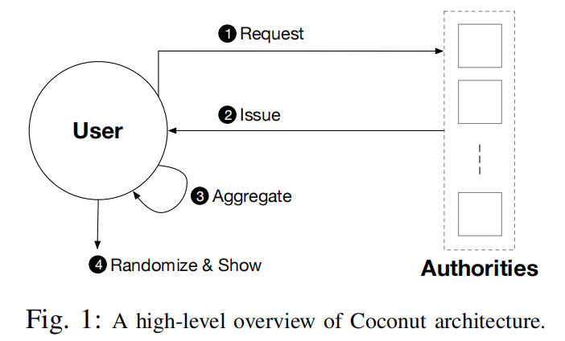

## 摘要

Coconut 是一种新型的选择性披露凭证方案，支持分布式阈值发行、公共和私有属性、再随机化，以及多个不可链接的选择性属性揭示。Coconut 与区块链集成，以确保机密性、真实性和可用性，即使当凭证发行当局的子集是恶意的或离线时。我们实施并评估了一个通用的 Coconut 智能合约库，用于 Chainspace 和 Ethereum；并呈现了三个与匿名支付、电子请愿以及用于审查抵抗的代理分发相关的应用。Coconut 使用短且计算高效的凭证，并且我们的评估显示，大多数 Coconut 密码原语平均只需几毫秒，而验证花费最长时间（10 毫秒）。

## I. 引言

选择性披露凭证 [16]，[19] 允许向用户发行凭证，以及随后不可链接的揭示（或“展示”）其编码的一些属性给验证者，用于认证、授权或实现电子现金的目的。然而，已建立的方案有缺点。有些方案委托单一发行者持有凭证签名密钥，允许恶意发行者伪造任何凭证或电子币。其他方案不提供必要的效率、再随机化或盲发行属性，这些属性对于实现实际的选择性披露凭证是必要的。没有现有的方案提供所有效率、阈值分布式发行、私有属性、再随机化以及不可链接的多展示选择性披露。

缺乏高效的通用选择性披露凭证影响支持“智能合约”的平台，例如 Ethereum [53]、Hyperledger [15] 和 Chainspace [1]。它们都共享限制，即可验证的智能合约可能仅执行记录在公共区块链上的操作。而且，这些系统的安全模型通常假设完整性应在存在阈值数量的不诚实或故障节点（拜占庭容错）的情况下保持；对于多个凭证发行者（阈值发行），类似假设也是可取的。

通过智能合约发行凭证将是非常可取的：智能合约可以根据区块链的状态有条件地发行用户凭证，或证明关于通过合约操作的用户的某些声明——例如他们的身份、属性，甚至他们的钱包余额。这是不可能的，因为当前的 selective credential 方案要么委托单一方作为发行者，要么不提供适当的效率、再随机化、盲发行和选择性披露能力（如阈值签名 [3] 的情况）。例如，Hyperledger 系统通过可信第三方发行者支持 CL 凭证 [16]，说明了它们的实用性，但也说明了它们对发行者变得恶意的脆弱性。Garman 等 [26] 提出了一种集成到分布式账本中的去中心化匿名凭证系统；它们提供发行公开可验证声明而无需中心发行者的能力，但不关注阈值发行或通用凭证，并且展示凭证需要昂贵的双离散对数证明。

Coconut 解决了这些挑战，并允许一组去中心化相互不信任的当局联合发行凭证，在公共或私有属性上。这些凭证不能被用户伪造，或被任何潜在腐败的小子集当局伪造。凭证可以在选中属性展示给验证者之前被再随机化，即使在所有当局和验证者合谋的情况下也保护隐私。Coconut 方案基于阈值发行签名方案，该方案允许部分声明被聚合成单一凭证。映射到许可和半许可区块链的上下文中，Coconut 允许负责维护区块链或基于联合挂钩的侧链 [3] 的当局集合联合发行选择性披露凭证。

Coconut 使用短且计算高效的凭证，以及高效的选中属性揭示和验证协议。每个部分凭证和整合凭证精确由两个群元素组成。凭证的大小保持恒定，而不管属性或当局/发行者的数量。而且，在一次性设置阶段之后，用户从当局收集并聚合阈值数量的验证密钥，属性展示和验证在加密计算和加密材料的通信方面都是 O(1)——不管当局的数量。我们的 Coconut 原语评估显示出非常有前景的结果。验证大约需要 10ms，而签署私有属性大约快 3 倍。延迟大约为 600 ms，当客户端从分布在世界各地的 10 个当局聚合部分凭证时。

贡献。本文做出了三个关键贡献：

* 我们描述了 Coconut 底层签名方案，包括密钥生成、分布式发行、聚合和签名验证如何操作（第 II 和 III 节）。该方案是 Waters 签名方案 [52]、BGLS 签名 [9] 以及 Pointcheval 和 Sanders 的签名方案 [43] 的扩展和混合。这是我们所知的第一个通用、全分布式阈值发行、可再随机化、多展示凭证方案。

* 我们使用 Coconut 实现了一个针对 Chainspace [1] 的通用智能合约库和一个针对 Ethereum [53] 的库，执行公共和私有属性发行、聚合、随机化和选择性披露（第 IV 节）。我们评估它们在这些平台内的性能和成本（第 VI 节）。

* 我们设计了三个使用 Coconut 合约库的应用：一个提供支付匿名的币 tumbler；一个隐私保护的电子请愿；以及一个用于审查抵抗系统的代理分发系统（第 V 节）。我们实现了前两个应用在 Chainspace 平台上，并提供了安全性和性能评估（第 VI 节）。

## II. COCONUT 概述

Coconut 是一种选择性披露凭证系统，支持阈值发行凭证的公共和私有属性、再随机化凭证以支持多个不可链接的揭示，以及将凭证嵌入到智能合约库中的能力，从而可以从其他合约调用以发行凭证。

图 1：Coconut 架构的高级概述

Coconut 用户架构是如图 1 所示。在图 1 中，Coconut 用户可发送一个 Coconut 请求命令到一组 Coconut 签名当局；此命令指定一组公共或加密的私有属性，以被认证到凭证中（❶）。然后，每个当局回答一个发行命令，传递一个部分凭证（❷）。任何用户可以收集阈值数量的份额，聚合它们以形成单一的整合凭证，并再随机化它（❸）。整合凭证用于认证的用途是受限的到用户知道嵌入在凭证中的私有属性——例如一个私有密钥。用户拥有凭证后，可以执行展示协议来选择性地披露关于它们的属性或声明（❹）。展示协议是公开可验证的，并且可能被公开记录。Coconut 具有以下设计目标：

* 阈值当局：只需当局的子集即可发行部分凭证，以允许用户生成整合凭证 [8]。通信复杂度和请求以及发行协议的大小是 O(t)，其中 t 是子集当局的大小。而且，它不可能从少于 t 个部分凭证生成整合凭证。
* 盲发行 & 不可链接性：当局发行凭证而不学习关于私有属性的任何附加信息。此外，它不可能链接多个展示与彼此，或链接发行转录，即使所有当局合谋（见第 III-B 节）。
* 非交互性：当局可以独立于彼此操作，按照一个简单的密钥分发和设置阶段——同意公共安全参数和加密图形参数——它们不需要同步或进一步协调它们的活动。
* 活性：Coconut 保证活性，只要一个阈值数量的当局保持诚实和弱同步假设对密钥分发 [33] 成立。
* 效率：协议是短的且零知识证明涉及在协议中，并且短且计算高效。聚合和再随机化后，属性展示和验证仅涉及单一整合凭证，并且因此在加密计算和通信方面都是 O(1)——无论当局的数量。
* 短凭证：每个部分凭证——以及整合凭证——精确由两个群元素组成，无论嵌入在凭证中的属性数量或当局的数量。

作为结果，大量当局可被用于发行凭证，而不会显著影响效率。

## III. Coconut 构造

我们逐步介绍支持 Coconut 架构的密码原语，从 Pointcheval 和 Sanders [43] 以及 Boneh 等 [10]、[9] 的设计到完整的 Coconut 方案。

* 步骤 1：我们首先回顾（第 III-C 节）Pointcheval 等 [43] 的单属性凭证方案。我们呈现其限制，这些限制阻止它满足我们在第 II 节中呈现的设计目标，并且我们展示如何整合来自 Boneh 等 [10] 的原则来克服它们。
* 步骤 2：我们介绍（第 III-D 节）Coconut 阈值凭证方案，该方案具有 Pointcheval 和 Sanders [43] 以及 Boneh 等 [10] 的所有属性，并且允许我们实现所有设计目标。
* 步骤 3：最后，我们扩展（第 III-E 节）我们的方案以支持同时嵌入 q 个不同属性（m1, ..., mq）的凭证。

### A. 符号和假设

我们呈现本文其余部分中使用的符号，以及我们的原语所依赖的安全假设。

a) 零知识证明：我们的凭证方案使用非交互零知识证明来断言知识和关系在离散对数值上。我们用 Camenisch 等 [17] 引入的符号来表示这些非交互零知识证明：

$\text{NIZK}\{(x,y,\dots) : \text{statements about } x,y,\dots.\}$

其中表示在零知识中证明秘密值 (x,y,...) （所有其他值是公开的）满足冒号后的语句。

b) 密码假设：Coconut 需要素数阶 p 的群$( \mathbb{G}_1, \mathbb{G}_2, \mathbb{G}_T )$带有双线性映射$e : \mathbb{G}_1 \times \mathbb{G}_2 \rightarrow \mathbb{G}_T$并满足以下性质：(i) 双线性意味着对于所有$g_1 \in \mathbb{G}_1, g_2 \in \mathbb{G}_2$和$(a,b) \in \mathbb{F}_p^2$,$e(g_1^a, g_2^b) = e(g_1,g_2)^{a b}$。(ii) 非退化意味着对于所有$g_1 \neq 1_{\mathbb{G}_1}, g_2 \in \mathbb{G}_2$,$g_2 \neq 1$；$e(g_1, g_2) \in \mathbb{G}_T$,$e(g_1,g_2) \neq 1$。效率意味着映射 e 是高效可计算的；(iv) 此外，$\mathbb{G}_1 \neq \mathbb{G}_2$，并且在$\mathbb{G}_1$和$\mathbb{G}_2$之间没有高效同态。类型-3 配对是高效的 [25]。它们支持 XDH 假设，该假设意味着计算 co-Diffie-Hellman (co-CDH) 问题在$\mathbb{G}_1$和$\mathbb{G}_2$中的难度，以及决策 Diffie-Hellman (DDH) 问题在$\mathbb{G}_T$[10] 中的难度。

Coconut 也依赖于一个密码安全的哈希函数 H，将一个元素哈希到$\mathbb{G}_1$，即$H : \mathbb{G}_1 \rightarrow \mathbb{G}_1$。我们通过序列化输入点的 (x,y) 坐标并应用一个全域哈希函数来哈希这个字符串到一个$\mathbb{G}_1$的元素来实现这个函数（如同 Boneh 等 [10]）。

c) 阈值和通信假设：Coconut 假设诚实多数$(n/2 < t)$来防止恶意当局任意发行凭证。Coconut 当局不需要彼此通信；用户等待 t-out-of-n 回复（以任何到达顺序）并将它们聚合到一个整合凭证；因此 Coconut 隐含地假设一个异步设置。然而，我们当前的实现依赖于 Kate 等 [33] 的分布式密钥生成协议，该协议要求 (i) 弱同步用于活性（但不是用于安全），以及 (ii) 至多三分之一的不诚实当局。

### B. 方案定义和安全属性

我们呈现组成阈值凭证方案的协议：

* $\text{Setup}(1^\lambda) \to (\text{params})$：定义系统参数$\text{params}$，相对于安全参数$\lambda$。这些参数是公开可用的。

* $\text{KeyGen}(\text{params}) \to (\text{sk}, \text{vk})$：由当局运行，以从公共$\text{params}$生成它们的秘密密钥$\text{sk}$和验证密钥$\text{vk}$。

* $\text{AggKey}(\text{vk}_1, \ldots, \text{vk}_t) \to (\text{vk})$：由任何想要验证凭证的人运行，以聚合任何 t 个验证密钥$\text{vk}_i$的子集到一个单一的整合验证密钥$\text{vk}$。

* $\text{IssueCred}(m, \phi) \to (\sigma)$：是一个用户和每个当局之间的交互协议，通过该协议，用户获得嵌入私有属性 m 的凭证$\sigma$，该属性满足语句$\phi$。

* $\text{AggCred}(\sigma_1, \ldots, \sigma_t) \to (\sigma)$：由用户运行，以聚合任何 t 个部分凭证$\sigma_i$的子集到一个单一的整合凭证$\sigma$。

* $\text{ProveCred}(\text{vk}, m, \phi) \to (\Theta, \phi')$：由用户运行，以计算一个证明$\Theta$，证明拥有一个凭证，该凭证认证私有属性 m 满足语句$\phi$（在相应的验证密钥$\text{vk}$下）。

* $\text{VerifyCred}(\text{vk}, \Theta, \phi') \to (\text{true}/\text{false})$：由任何想要验证嵌入私有属性的凭证的人运行，该属性满足语句$\phi'$，使用验证密钥$\text{vk}$和由$\text{ProveCred}$生成的密码材料$\Theta$。

一个阈值凭证方案必须满足以下安全属性：

不可伪造性：对于一个对抗性用户来说，必须是不可行的，即说服一个诚实验证者他们拥有一个凭证，如果他们事实上没有（即，如果他们没有从至少 t 个当局收到有效的部分凭证）。

盲性：对于一个对抗性当局来说，必须是不可行的，即在$\text{IssueCred}$协议的执行期间学习关于属性 m 的任何信息，除了 m 满足$\phi$的事实。

不可链接性 / 零知识：对于一个对抗性当局来说，必须是不可行的，即学习关于属性 m 的任何事情，除了它满足$\phi$，或链接$\text{ProveCred}$的执行与另一个$\text{ProveCred}$的执行或与$\text{IssueCred}$的执行（对于一个给定的属性 m）。

### C. Coconut 的基础

在给出完整的 Coconut 构造之前，我们首先回顾 Pointcheval 和 Sanders [43] 提出的凭证方案；他们的构造具有与 CL-签名 [16] 相同的属性，但更高效。该方案在类型 3 的双线性群$( \mathbb{G}_1, \mathbb{G}_2, \mathbb{G}_T )$中工作，带有双线性映射$e : \mathbb{G}_1 \times \mathbb{G}_2 \to \mathbb{G}_T$，如第 III-A 节所述。

* $\text{P.Setup}(1^\lambda) \to (\text{params})$：选择一个双线性群$( \mathbb{G}_1, \mathbb{G}_2, \mathbb{G}_T )$，其阶为 p，其中 p 是一个 λ-位素数。让$g_1$是$\mathbb{G}_1$的生成元，以及$g_2$是$\mathbb{G}_2$的生成元。该系统参数是$\text{params} = ( \mathbb{G}_1, \mathbb{G}_2, \mathbb{G}_T, p, g_1, g_2 )$。
* $\text{P.KeyGen}(\text{params}) \to (\text{sk}, \text{vk})$：选择一个随机秘密密钥$\text{sk} = (x, y) \in \mathbb{F}_p^2$。解析$\text{params} = ( \mathbb{G}_1, \mathbb{G}_2, \mathbb{G}_T, p, g_1, g_2 )$；并发布验证密钥$\text{vk} = (g_2, \alpha, \beta) = (g_2, g_2^x, g_2^y)$。
* $\text{P.Sign}(\text{params}, \text{sk}, m) \to (\sigma)$：解析$\text{sk} = (x, y)$。挑选一个随机$r \in \mathbb{F}_p$并设置$h = g_1^r$。输出$\sigma = (h, s) = (h, h^{x + y m})$。
* $\text{P.Verify}(\text{params}, \text{vk}, m, \sigma) \to (\text{true}/\text{false})$：解析$\text{vk} = (g_2, \alpha, \beta)$和$\sigma = (h, s)$。如果$h \neq 1$并且$e(h, \alpha \beta^m) = e(s, g_2)$，则输出 true；否则输出 false。

签名$\sigma = (h, s)$是可随机化的，通过选择一个随机$r' \in \mathbb{F}_p$并计算$\sigma' = (h^{r'}, s^{r'})$。上述方案可以被修改以获得关于私有属性的凭证：为了运行$\text{IssueCred}$，用户首先挑选一个随机$t \in \mathbb{F}_p$，计算承诺$c_m = g_1^t Y^m$到消息 m，其中$Y = g_1^y$；并将其发送到一个单一当局，连同一个零知识证明关于该承诺的开承诺。该当局验证该证明，挑选一个随机$u \in \mathbb{F}_p$并返回$\tilde{\sigma} = (h, \hat{s}) = (g_1^u, (X c_m)^u)$其中$X = g_1^x$。用户通过计算$\sigma = (h, \hat{s} h^{-t})$来解盲该签名，并且这个值充当凭证。

该方案提供盲性、不可链接性、效率和短凭证；但它不支持我们的设计目标。这种限制来自于$\text{P.Sign}$算法——发行当局使用一个私有且自我生成的随机数 r 来计算凭证，这阻止了该方案被高效地分布到一个多当局设置。为了克服该限制，我们利用由 BLS 签名 [10] 引入的一个概念；利用一个哈希函数$H : \mathbb{F}_p \to \mathbb{G}_1$来计算群元素$h = H(m)$。下一节描述 Coconut 如何整合这些概念来实现我们所有的设计目标。
