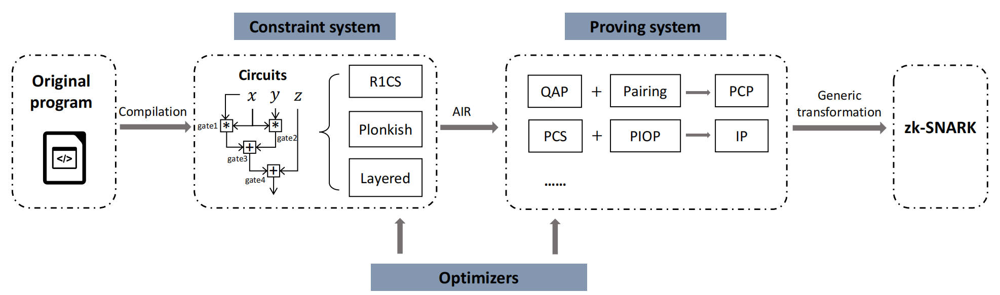
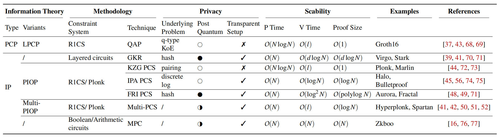

## 作者

Junkai Liang¹,，Daqi Hu¹,，Pengfei Wu²,*，Yunbo Yang³，Qingni Shen¹,†，Zhonghai Wu¹,†

¹ 北京大学，² 新加坡管理大学，³ 华东师范大学

## 摘要

零知识、简洁、非交互式的知识论证（zk-SNARK）作为一种强有力的技术，用于证明计算的正确性，并已引起研究人员的高度关注。学术界和工业界提出了大量具体方案与实现。不幸的是，zk-SNARK 的内在复杂性在研究人员、开发者与用户之间造成了差距，因为他们对这项技术的关注点并不相同。例如，研究人员致力于构建新的高效证明系统，使其具有更强的安全性和新的性质。与此同时，开发者与用户更关心实现所依赖的工具链、可用性与兼容性。这一差距阻碍了 zk-SNARK 领域的发展。

在这项工作中，我们对 zk-SNARK 从理论到实践进行了全面研究，明确指出其中的差距与局限。我们首先提出一个“总配方”，以统一将程序转换为 zk-SNARK 的主要步骤。随后，我们按照关键技术对现有的 zk-SNARK 进行分类。我们的分类刻画了现有 zk-SNARK 方案在具有实际价值的性质上的主要差异。我们调研了自 2013 年以来超过 40 种 zk-SNARK，并提供了一张参考表，列出其类别与性质。按照该“总配方”的步骤，我们进一步调研了 11 个通用且广泛使用的库，并详细阐述了这些库的可用性、兼容性、效率及其局限性。鉴于安装与运行这些 zk-SNARK 系统具有挑战，我们还提供了一个完全虚拟的环境，可在其中为每个系统运行其编译器。我们发现，在密码学学术界，证明系统是主要关注点；相对地，在工业界，约束系统形成了瓶颈。为弥合这一差距，我们提出了若干建议，并呼吁开源社区加强文档、标准化与兼容性建设。

## 1 引言

*设想你有一位红绿色盲的朋友，她怀疑红色和绿色其实并不是不同的颜色。你想向你的朋友证明这两种颜色确实不同。我们的问题是：在不泄露你所使用物体的真实颜色的前提下，你要如何做到这一点？*

上述“色盲验证者”[1] 是一个在用日常情境思考零知识证明（ZKP）时的经典问题。其解法也很容易理解：你为你的朋友准备一个红球和一个绿球，并让她选一个作为她的最爱。随后她把两只球都遮住，随机选出一个，问你它是不是她最喜欢的那个。如果红色和绿色确实不同，你可以以概率 1 成功；否则，你只能以概率 1/2 成功[3]。你的朋友可以重复这个过程，以使她相信“纯属巧合”的概率可以忽略不计。

对上述思想实验进行自然的形式化，会得到 ZKP 的一种交互式形式，在这种形式中，验证者与证明者之间有一轮或多轮交互[2]，也就是所谓的交互式证明（IP）。IP 是 ZKP 领域的一项突破，因为它被用来证明对所有属于非确定性多项式时间（NP）类问题的解的“知识”，从而把 ZKP 的能力从日常情境扩展到了计算模型[3]。IP 功能强大，但可能需要多轮交互，这会增加通信负担，并且对某些应用（例如区块链或保密机器学习）来说并不现实。非交互式零知识（NIZK）证明关注的是这样一类协议：证明者只向验证者发送一条消息（即证明），验证者据此决定是否接受。NIZK 的主要目的在于解决交互性带来的时延问题。幸运的是，可以通过通用的变换把 IP 与 NIZK 桥接起来，例如 Fiat–Shamir 变换[4]，它允许证明者生成哈希值，仿佛这些哈希值是由验证者给出的随机消息。沿着这些理论进展，已经有人提出了用于“三可着色问题”和“3-可满足性问题”的 IP 与 NIZK 协议[3,5]。然而，这些工作在渐近开销上很大，因而并不实用。为更好地应对真实世界场景，NIZK 还被进一步要求具备“简洁性”，也就是说证明者与验证者所用的时间与内存都是有界的。具备简洁性的 NIZK（亦即 zk-SNARK）已成为面向实际应用的 ZKP 研究主流。ZKP、NIZK 与 zk-SNARK 之间的关系见图 1。

图 1：ZKP、NIZK 与 zk-SNARK 的包含关系。

源自 ZKP 和 NIZK，zk-SNARK 提供了一种机制，使不互信的一方能够证明自己对 NP 关系的知识，而生成的证明不泄露任何关于私有见证的信息。这一宝贵性质使 zk-SNARK 成为强大的密码学基元，使得在不暴露私有输入的情况下验证计算正确性成为可能。过去几年间，围绕 zk-SNARK 应用涌现出一波突破性的科学成果，范围包括但不限于金融服务（如区块链支付 [6,7,8]）、智能合约 [9,10]，以及机器学习 [11,12]、多方计算 [13,14,15] 和后量子密码学 [16,17] 等学术领域。zk-SNARK 还拥有可观的市场前景。迄今为止，基于 zk-SNARK 的、被广泛使用的区块链已有 10 余条，并有估计认为，到 2030 年仅用于生成 ZK 证明的交易费用就将达到 100 亿 [18]。除区块链服务外，Axiom [19]、FedML [20] 与 Giza [21] 等众多公司也在合作构建面向隐私保护型机器学习及其他应用的 ZK 生态系统。

尽管 zk-SNARK 具有很强的通用性、简洁性，并像加密与签名算法那样具备广泛应用的潜力，但研究与实践之间仍存在差距，阻碍了 zk-SNARK 的发展。研究者与从业者在 zk-SNARK 的三个概念上关注点不同：约束系统、证明系统与编译器。约束系统表示我们希望被证明的问题，例如某些具体的 NP 关系（如 3-可满足性）。证明系统表示生成该关系证明的具体密码学技术。编译器是将我们想要证明的高级程序转换为数学形式的约束系统的实用工具。

研究人员主要致力于为不同的约束系统设计不同的证明系统，以达到特定性质。迄今为止，已有一些方案具备非常实用的性质，例如常数大小的证明、线性复杂度的证明者、后量子安全性以及透明设置。然而，这些性质并未集成到同一个方案中，彼此之间存在取舍。要理解这些取舍，需要具备大量 zk-SNARK 的数学背景知识；从实务角度看，这相当艰难，致使从业者难以为其应用选择合适的方案。此外，对从业者而言，最耗时且最容易出错的环节在于使用编译器。正如文献 [22,23,24,25] 所报道的那样，程序员在正确实现自身的 zk-SNARK 应用方面屡屡受挫，并且由于误解编译器语言而产生了数以百计的漏洞。

我们在 zk-SNARK 领域识别出学术界与工业界视角之间的若干鸿沟：（1）用户在选择方案时需要专家级知识；（2）编译器的重要性被低估。为此，我们关注以下研究问题：

> **RQ1：** 如何给出一份统一的“总配方”，以梳理不同 zk-SNARK 背后的设计原则与优化？
> **RQ2：** 能否针对不同的真实场景提供选择 zk-SNARK 的指导？
> **RQ3：** 基于总配方与实验，并细致审视既有工作，我们能否为学术研究者与库的设计者提供新的洞见？

**我们的工作：** 为回答这些问题，我们对 zk-SNARK 及其库进行了系统性综述。首先，我们提出一份统一的总配方，用以勾勒主流 zk-SNARK 的设计原则。该配方包含关键步骤：将高级程序编译为电路，将电路交由证明系统以生成一个 IP（交互式证明），并应用通用变换以产生最终的 zk-SNARK。除此之外，我们还探讨 zk-SNARK 的主要应用，如保密区块链、零知识机器学习以及密码学用途。

依照总配方，我们对证明系统进行分类，并在各类别中追踪其演化。这有助于非专家用户选择合适的 zk-SNARK 方案。随后，我们基于性能与可用性评估了全部 11 个最先进的 zk-SNARK 库。通过性能分析，我们针对不同需求给出实现 zk-SNARK 的最佳实践建议。此外，我们识别出当前库中的常见问题，并呼吁改进文档与标准化。

我们强调，本论文及其开源材料面向四类读者：（1）希望通过理解最先进的库，从理论走向实践的研究人员；（2）希望将某个组件实现为 zk-SNARK 工具包的开发者；（3）希望实现自有 zk-SNARK 应用的程序员；以及（4）希望了解某个 zk-SNARK 应用是否满足自身需求的用户。我们认为这些工作是必要的，并能够促进实践者更好地利用 zk-SNARK 的成果。

**贡献概述：** 虽然我们并非首次综述该主题，但我们将本工作定位为首个对过去十年研究与实践进行系统化梳理的工作，着眼于借助最先进的库来应对新出现的挑战。概括而言，我们有五点主要贡献：

* 我们给出了一份统一的总配方，展示了一个高级程序如何从起点到终点被转换为 zk-SNARK。在该总配方之内，我们在第 3 节建立了一个全面综述，涵盖实际 zk-SNARK 中使用的不同电路、约束系统、技术与应用。
* 在总配方的指导下，我们进一步调研了 40 余种 zk-SNARK，并提供了证明系统的全面对比表；我们讨论了总配方与本次调查如何有助于弥合这些差距。
* 我们调研了全部 11 个 zk-SNARK 库，并基于性能与可用性进行比较；我们提出最佳实践的实现方案，并分析各库的架构、工具集与文档。
* 我们在 Docker 容器中提供了精心设计的测试代码示例；我们相信这将有助于 zk-SNARK 开源社区的发展，并帮助用户利用 zk-SNARK 领域的成果。我们所有代码与文档已发布在永久仓库，获取地址为：https://doi.org/10.5281/zenodo.14682405。
* 基于全面分析，我们从三个视角给出关键洞见与建议：面向非专家的库选择与编程指南、研究者的未来方向，以及对库设计者的建议。

**相关工作：** 以往关于 ZKP 的综述大体分为两类。**其一**，关于 zk-SNARK 的构造与理论应用的综述。例如，Feng 和 Mcllin【26】介绍了 zk-SNARK 的基础及其在 NP 计算中的用法；Nituslescu【27】聚焦于基于二次算术程序（QAP）的 zk-SNARK；Li 等【28】按技术对 zk-SNARK 进行分类，但更关注诸如约束系统和分层电路等小众实现。也有其他工作【29，30】讨论范围证明并提供实践性建议。然而，这些工作只覆盖了 zk-SNARK 的一小部分，而且主要偏学术性。与之相对，我们的工作贯通理论与实践，提供更广泛的洞见。**其二**，关于实际 zk-SNARK 实现中漏洞的综述。既有研究强调了电路层【23，31，32】、编译阶段【24】以及面向具体应用的完整性层【33，34】存在的问题；Chaliasos 等【25】对这些漏洞作了全面总结。我们的工作不同之处在于，为 zk-SNARK 实践者提供一份全面的操作指引，并着重可用性、效率、兼容性与库的选择，旨在在强调软件安全的同时，减少对密码学不熟悉的实践者出现错误。

表 1：缩写及对应全称

| 缩写     | 全称                                                         |
| -------- | ------------------------------------------------------------ |
| AIR      | 算术中间表示（Arithmetic Intermediate Representation）       |
| CRS      | 公共参考字符串（Common Reference String）                    |
| DEIP     | 双重高效交互式证明（Doubly Efficient Interactive Proofs）    |
| (e)DSL   | （嵌入式）领域特定语言（(embedded) Domain-Specific Language） |
| FFT      | 快速傅里叶变换（Fast Fourier Transform）                     |
| FRI      | 快速 Reed–Solomon 邻近性 IOP（Fast Reed–Solomon IOP of Proximity） |
| HDL      | 硬件描述语言（Hardware Description Language）                |
| I(O)P    | 交互式（预言机）证明（Interactive (Oracle) Proof）           |
| IPA      | 内积论证（Inner Product Argument）                           |
| ITP      | 信息论证明（Information-Theoretic Proof）                    |
| MPC      | 多方计算（Multi-Party Computation）                          |
| NIZK     | 非交互式零知识（Non-Interactive Zero-Knowledge）             |
| NP       | 非确定性多项式时间（Non-deterministic Polynomial Time）      |
| PL       | 编程语言（Programming Language）                             |
| (L)PCP   | （线性）概率可检验证明（(Linear) Probabilistically Checkable Proof） |
| PCS      | 多项式承诺方案（Polynomial Commitment Scheme）               |
| PIOP     | 多项式交互式预言机证明（Polynomial Interactive Oracle Proof） |
| QAP      | 二次算术程序（Quadratic Arithmetic Program）                 |
| QSP      | 二次跨度（张成）程序（Quadratic Span Program）               |
| R1CS     | 秩-1 约束系统（Rank-1 Constraint System）                    |
| STARK    | 可扩展透明的知识论证（Scalable Transparent ARguments of Knowledge） |
| ZKP      | 零知识证明（Zero-Knowledge Proof）                           |
| ZKML     | 零知识机器学习（Zero-Knowledge Machine Learning）            |
| zk-SNARK | 零知识、简洁、非交互式知识论证（Zero-Knowledge Succinct Non-Interactive Argument of Knowledge） |
| zk-VM    | 零知识虚拟机（Zero-Knowledge Virtual Machine）               |

## 2 背景

在本节中，我们聚焦于 zk-SNARK 的概念，并在第 2.1 节介绍其定义，同时在第 2.2 节介绍主流技术。此外，我们在表 1 中汇总了所有缩写及其全称。借助这些符号，我们讨论 zk-SNARK 的研究发展。

### 2.1 IP、NIZK 与 zk-SNARK 的概念

这里我们介绍 ZKP 领域中广泛使用的 IP【35】、NIZK【36】与 zk-SNARK【37】的形式化概念。它们的相似之处在于：对于一个固定的 NP 关系 $R$，证明者可以使验证者信服，即对公开输入 $x$，他们知道一个见证 $w$，使得 $(x, w) \in R$。不同之处在于，IP 允许多轮通信，而 NIZK 与 zk-SNARK 是非交互式的。此外，zk-SNARK 还进一步具有效率方面的要求。

**定义 2.1（IP）。** 设 $R$ 是由某个 NP 语言 $L$ 所诱导的二元关系。给定公共输入 $x$ 与证明者的输入 $w$，我们把证明者 $P$ 与验证者 $V$ 之间的交互记作 $\langle P(w),V\rangle(x)$。若存在一个可忽略函数 $\varepsilon$ 使得下述性质成立，则称二元组 $(P, V)$ 是 $L$ 的一个 IP 系统：

- **完备性（Completeness）：** 若 $(x,w)\in R$，则 $\Pr[\langle P(w),V\rangle(x)=1]=1$。
- **可靠性（Soundness）：** 若 $(x,w)\notin R$，并且对于任意恶意证明者 $P^{\ast}$，都有 $\Pr[\langle P^{\ast}(w),V\rangle(x)=1]\le \varepsilon(|x|)$。

**定义 2.2（NIZK）。** 一个 NIZK 证明由三个算法组成（$\mathrm{Setup},\ \mathrm{Prove},\ \mathrm{Verify}$），定义如下：

- $\mathrm{Setup}(pp)\to (pk,vk)$：在输入公共参数 $pp$ 时，输出证明密钥与验证密钥 $pk,vk$。
- $\mathrm{Prove}(pk,x,w,R)\to \pi$：在输入 $pk$、实例与见证对 $(x,w)$，以及关系 $R$ 时，输出证明 $\pi$。
- $\mathrm{Verify}(vk,x,\pi)\to {0,1}$：在输入 $vk,x,\pi$ 时，输出 $1$ 或 $0$，分别表示是否接受 $\pi$。

此外，NIZK 证明需要满足以下三个性质：

- **完备性（Completeness）：** 给定 $(x,w)\in R$，诚实的证明者将使验证者输出 $1$。
- **可靠性（Soundness）：** 给定 $(x,w)\notin R$，与验证者交互的恶意证明者只能以可忽略的概率使其输出 $1$。
- **零知识（Zero knowledge）：** 给定 $(x,w)\in R$，存在一个模拟器，能在与一个（可能是恶意的）验证者交互的情形下，产生与诚实证明者“视图”等价的输出；该视图在计算上与真实执行（证明者与验证者之间的实际交互记录）不可区分。注意：模拟器拿不到 $w$，而证明者拿到 $w$；因此从验证者视角看，证明并不包含关于 $w$ 的信息。

当**证明大小**与**验证时间**都被待证陈述规模所界定时，NIZK 被称为 **zk-SNARK**：

- 证明大小相对于电路规模是**多对数级**（polylogarithmic）的；
- 验证时间相对于电路规模也是**多对数级**的。

此外，还存在其他概念，如**可扩展透明的知识论证**（STARK）【38】与**双重高效交互式证明**（DEIP）【39】——它们给出了与 zk-SNARK 类似的 ZKP 体系。实际上，这些概念可视作 zk-SNARK 的变体，主要区别在于引入了新的性质。例如，STARK 要求**透明设置**、**标准模型**下的构造以及**后量子安全性**；DEIP 要求证明端具有**近线性**的复杂度。为简明起见，本文用 **zk-SNARK** 统称高效的 NIZK 证明。

### 2.2 密码学技术

在本节中，我们介绍**交互式预言机证明**（interactive oracle proof, **IOP**），它是 **IP** 的一种推广。我们也介绍**多项式承诺方案**（polynomial commitment scheme, **PCS**），它可以在 **IOP** 中实例化预言机。我们之所以重视 **IOP** 与 **PCS**，是因为它们有助于搭建主流证明系统的结构。更多信息（包括具体构造）参见文献【40】。

**定义 2.3（IOP）。** 设公共输入为 $x$（验证者与证明者皆知），见证串为 $w$（仅证明者所知），并令**轮复杂度** $r(x)\in\mathbb{N}$。一个具有 $r(x)$ 轮的 IOP 系统规定：在每一轮中，证明者向验证者发送一条消息（该消息可依赖见证 $w$ 以及先前消息），验证者具有**预言机访问**（oracle access），随后验证者向证明者返回一条消息。与证明者交互结束后，验证者的输出要么是 $\mathsf{accept}$，要么是 $\mathsf{reject}$。

更具体地，设 $R$ 是由某个 NP 语言 $L$ 所诱导的二元关系，且**可靠性误差**为 $\varepsilon\in[0,1]$。若一对交互式随机算法 $(P,V)$ 满足下列性质，则称其是 $L$ 的、误差为 $\varepsilon$ 的 IOP 系统：

- **完备性（Completeness）：** 若 $(x,w)\in R$，则
   $$\Pr\big[V(\langle P(x,w)\rangle,x)=\mathsf{accept}\big]=1.$$
- **可靠性（Soundness）：** 若 $(x,w)\notin R$，则对任意证明 $\pi$，都有
   $$\Pr\big[V(\pi,x)=\mathsf{accept}\big]\le \varepsilon.$$

作为 IOP 的一个特例，**多项式 IOP（PIOP）** 表示一种类似的交互过程：证明会生成能够对次数低于给定上界的多项式进行求值的预言机。为保证隐私，PIOP 通常通过 **PCS** 来实例化，定义如下。

**定义 2.4（PCS）。** PCS 允许证明者先对一个多项式 $f$ 进行承诺，随后在指定点上证明该被承诺多项式的求值是正确的。PCS 由四个算法组成：$\mathrm{Setup}$、$\mathrm{Commit}$、$\mathrm{Open}$ 与 $\mathrm{VerifyPoly}$。

- $\mathrm{Setup}(1^{\kappa})\to \mathrm{ck}$：输入安全参数 $\kappa$，输出承诺密钥 $\mathrm{ck}$。
- $\mathrm{Commit}(\mathrm{ck},f)\to \mathrm{com}$：输入 $\mathrm{ck}$ 与多项式 $f$，输出对 $f$ 的承诺 $\mathrm{com}$。
- $\mathrm{Open}(\mathrm{ck},f,\mathrm{com},i)\to \big(f(i),\pi\big)$：输入 $\mathrm{ck},f,\mathrm{com}$ 及给定点 $i$，输出取值 $f(i)$ 与证明 $\pi$。
- $\mathrm{VerifyPoly}(\mathrm{ck},\mathrm{com},i,f(i),\pi)\to\{0,1\}$：输入 $\mathrm{ck},\mathrm{com},i,f(i),\pi$，若接受则输出 $1$，否则输出 $0$。

我们强调：以 **PCS** 实例化的 **PIOP** 是当前构建 **zk-SNARK** 的主流技术。通过不同的 PCS 实例化，可以实现 zk-SNARK 所需的性质（例如短证明、透明性以及后量子安全性）。此外，还有其他技术，如**二次算术程序**（QAP），可用于把**常数大小的概率可检验证明**（PCP）构造成 zk-SNARK【37】。下文我们将对这些技术作简要介绍。

**定义 2.5（PCP）。** 设 $R$ 为由某个 NP 语言 $L$ 所诱导的二元关系，且令 $,\varepsilon\in(0,1),$ 为一个概率。若存在用于验证者的**随机化多项式时间**算法 $V$ 满足下述性质，则称 $R\in \mathrm{PCP}(r,q)$：

- **效率（Efficiency）：** 在由见证 $w$ 生成证明 $\pi$ 之后，$V$ 在验证时至多使用 $r$ 个随机硬币，并且至多读取 $\pi$ 的 $q$ 位。
- **完备性（Completeness）：** 若 $(x,w)\in R$，则 $\Pr\big[V(x,\pi)=1\big]=1$。
- **可靠性（Soundness）：** 若 $x\notin L$，则对所有 $\pi$，都有 $\Pr\big[V(x,\pi)=1\big]<\varepsilon$。

IP、PCP 与 IOP 统称为**信息论证明**（Information-Theoretic Proof，ITP），它作为最终 zk-SNARK 方案的抽象。它们之间有两点不同：其一，IP 与 IOP 允许在**不显式生成**证明 $\pi$ 的情况下进行交互，而 PCP 是**非交互式**的；其二，PCP 与 IOP 使用验证者可以自由访问的**预言机**。这些预言机作为黑箱为验证者提供额外的计算能力，并简化协议设计。为便于理解这些概念，我们在**附录 A** 中给出一个数独示例。

> 附录A  ITP 的数独示例
>
> **情景：** 当需要说服他人某个数独题只有一个解时，我们可以分别使用 IP、PCP 或 IOP，并比较它们的差异。
>
> **IP：** 验证者可以向拥有完整解的证明者随意提问，例如：
>  • “第 3 行第 5 列的数字是什么？”
>  • “为什么数字 8 不能出现在第 7 个宫里？”
>  • “解释一下你是如何推得第 2 行第 1 列的数字的？”
>
> **PCP：** 证明者把完整解写在一张很大的纸上（即 PCP 证明）。验证者被允许**随机**选择若干格进行检查（对该证明进行随机的“预言机式”访问）：
>  • “检查第 2 行第 8 列的数字。”
>  • “检查第 6 行第 3 列的数字。”
>  • “检查第 9 行第 9 列的数字。”
>
> **IOP：** 证明者同样提供类似 PCP 的预言机，但验证者拥有更多的交互方式。
>  • 首先，证明者在若干张纸上写下一些提示（预言机），例如“每一行与每一列的数字之和为 45”、“每个宫包含 $1$ 到 $9$ 的数字”，或某个具体的推理步骤。
>  • 然后，验证者可以就这些提示发问，例如“给我看一下第 3 行数字的排列”，或“给我看一下第 5 个宫里的数字”。
>  • 最后，验证者可以随机抽查所提供提示的部分内容。

**定义 2.6（QAP）。** 在域 $\mathbb{F}$ 上的一个 QAP $Q$ 包含三组 $m+1$ 个多项式，$L=\{l_k(x)\}$、$R=\{r_k(x)\}$、$O=\{o_k(x)\}$（其中 $k={0,\ldots,m}$），以及一个目标多项式 $q(x)$。当且仅当 $q(x)$ 整除 $p(x)$（其商记为 $t(x)$）时，我们称赋值 $(c_1,\ldots,c_m)$ 满足 $Q$，其中
$$
p(x)=L(x)\cdot R(x)-O(x),\tag{1}
$$
$L(x)=l_0(x)+\sum_{k=1}^{m}\big(c_k\cdot l_k(x)\big),$
$R(x)=r_0(x)+\sum_{k=1}^{m}\big(c_k\cdot r_k(x)\big),$
$O(x)=o_0(x)+\sum_{k=1}^{m}\big(c_k\cdot o_k(x)\big).$

尤其地，带有加法门与乘法门的电路（算术电路）可以通过对这些多项式进行实例化而被 QAP 直接表示。凭借这一性质，QAP 被广泛使用，并被抽象为一种称作 **R1CS** 的约束系统。本文中我们不区分这两个概念。

## 3 概览

在本节中，我们介绍构造 zk-SNARK 的**总配方**，并讨论图 2 中各个组成部分的发展。要为通用程序构造 zk-SNARK，首先将原始程序（以某种特定的高级语言编写）转换为电路形式，这一步称为**编译**。随后，使用不同的约束系统把电路可满足性问题用数学形式表示，即**算术中间表示**（Arithmetic Intermediate Representation，AIR）。接着，我们需要密码学协议来证明某个 AIR 的可满足性。例如，给定一个 R1CS，我们需要一个**信息论协议**来实际完成证明。用于实例化此类协议的技术在很大程度上决定了最终 zk-SNARK 的性质，如透明性、后量子安全性与效率；这些性质也是我们的主要分类标准。最后，我们采用一个**通用变换**，把已实例化的信息论证明转化为 zk-SNARK。尽管工具与实现细节各不相同，zk-SNARK 中的大多数研究主题都可归入我们的总配方之中；下文将对每个组成部分逐一详述。

图 2：总配方。 将高级程序转换为 zk-SNARK 的一般步骤。

**编译高级程序（Compiling High-level Programs）：** 一般而言，zk-SNARK 实现中的编译器会把一个高级程序编译为适配某一特定约束系统的 **AIR**。目前，这些编译器只编译 **特定于 ZK** 的语言。这些语言不同于常用的通用型语言（如 C 和 Python）。它们的行为专门用于**定义电路**，而常用语言中的工具与库**不能**被 ZK 编译器识别。

**约束系统（Constraint Systems）：** 借助高效的编译器，高级程序被编译成电路的 **AIR**，其中包含了描述程序**输入与输出关系**的全部密码学表达。一般地，电路是高级计算的抽象，而约束系统则是我们希望证明的**数学 NP 断言**。在大多数情况下，这两者是相似的，且在本文中我们**不加区分**。下面我们展示一个经典示例：把一个“类电路”的函数转换为 NP 语言 **R1CS**。设我们想要证明函数 $f(w,a,b)=w\cdot(a+b)+(1-w)(a\cdot b).$ 若把变量 $y$ 作为输出，我们可通过增设中间变量把计算表示为如下约束：
$$
w\cdot(a+b)=y_1,\qquad (1-w)\cdot a=y_2,\qquad b\cdot y_2=y_3,\qquad (y_1+y_3)\cdot1=y.
$$
 依照**定义 2.6** 中的 QAP 定义，R1CS 形式的约束系统为
$$
\big(l_0(x)+\sum_{k=1}^{m}\big(c_k\cdot l_k(x)\big)\big)\cdot
 \big(r_0(x)+\sum_{k=1}^{m}\big(c_k\cdot r_k(x)\big)\big)
 =\big(o_0(x)+\sum_{k=1}^{m}\big(c_k\cdot o_k(x)\big)\big).
 \tag{2}
$$
由于一共包含 $6$ 个变量 $w,a,b,y_1,y_2,y_3$，因此令 $m=6$。另外，注意共有 $4$ 个约束。多项式 $l_i,r_i,o_i$ 在 $4$ 个点上取值，其取值应当等于相应变量的系数。例如，令 $w$ 对应 $c_1$，则有 $l_1(1)=1$ 且 $l_1(2)=-1$；而在 $l_1$ 的其他取值点上为 $0$，因为在那些约束里 $w$ 并未出现。

常见的约束系统包括 **R1CS**【37】、**plonk 电路**【40】及其变体（如**分层电路**【38,41】与 **custom plonk**【42】）。这些约束系统在支持高级计算的**代数结构**上彼此不同，使得非专家开发者难以完全掌握。举例来说，在 **plonk** 电路中，所有数值都作为**域中的元素**进行求值；而在 **R1CS** 中，求值仅编码了变量的**存在性**及其**系数**。在大多数库中，用于定义电路的语言与其底层约束系统紧密相关，开发者被要求理解这些系统。

**证明系统（Proving Systems）：** 证明系统指的是证明者与验证者之间的协议，用于证明一个定义良好的电路的正确性。针对上面的 R1CS 示例，文献【37】给出的一个具体证明系统利用了**双线性群**。其基本思想是：证明者生成群元素 $g^{L(x)},g^{R(x)},g^{O(x)}$ 与 $g^{t(x)}$，随后验证者检查是否

$$
e\big(g^{L(x)},g^{R(x)}\big)=e\big(g^{t(x)},g^{q(x)}\big)\cdot e\big(g^{O(x)},g\big), \tag{3}
$$

其中 $L(x),R(x),O(x),q(x),t(x)$ 见**定义 2.6**，$e$ 为双线性映射函数，$g$ 为该群的生成元。此类证明系统的优点在于：证明仅由少量群元素构成。

证明系统是 zk-SNARK 的核心组件，并已被广泛研究。选择证明系统时的主要考量是期望性质，如可扩展性、透明性、后量子安全性以及通用设置。目前，**证明大小为常数且验证快速**的实用 zk-SNARK 多基于 **QAP** 技术【37，43】或**基于配对的 PCS**【40，44】；这些 zk-SNARK 需要**可信设置**。为消除可信设置，亦有利用**基于离散对数问题的 PCS**【45，46，47】或**结合码理论的哈希函数**【48，49】的 zk-SNARK。上述方案的证明者均较慢，时间复杂度为**近线性**。为实现**线性时间**的快速证明者，若干工作【42，50，51，52】设计了**多线性 IOP**与**多线性 PCS**。然而，这些方法需要更多通信轮数，从而显著增大证明大小。由于 zk-SNARK 门类复杂，要为特定应用选择合适方案，需要对其底层构造具备专家级知识。我们在第 4 节通过对现有证明系统进行全面分类来解决这一问题。

**优化器（Optimizers）：** 当下，基于 PIOP 的 zk-SNARK 通过引入**线性时间的证明者**、**次线性的证明大小**与**次线性的验证者**，已在通用电路上达到了优化后的**渐近复杂度**。然而，在特定情形下的效率仍然可以提升。例如，**递归**【53，54，55】或**聚合证明**【45，56】可在验证者需要验证一系列计算时**缩小证明大小**。**弹性证明**【57】与**并行证明**【58】允许证明者在证明过程中**动态调整内存与时间**。**查找表**【59】通过限定见证的取值范围来**缩小生成电路的规模**。此外，还可以通过**优化椭圆曲线运算**【60】来提升现代 CPU 架构与特定方案的性能。

**应用（Applications）：** 通用 zk-SNARK 可用于多种应用并证明不同的计算：（1）在**保密区块链**中，zk-SNARK 可用于证明一笔交易是**有效**的（例如，发送方是否有足够资金、交易是否被正确签名以及金额是否处于某一范围内），而**不向公众披露交易细节**，从而解决比特币中的隐私问题。已有区块链应用包括 zcash【6】、Ethereum【61】、zkSync【62】与 Aztec【63】等。（2）在**零知识机器学习（ZKML）\**中，zk-SNARK 可在\**不泄露底层数据**的情况下**验证训练过程的正确性**。这使得证明者无需共享其本地数据集，也能以可验证的方式训练模型。现有 ZKML 应用主要聚焦于为**决策树**【64】、**联邦学习**【65】与**卷积神经网络**【12】生成证明等。（3）在**密码学**中，zk-SNARK 已被用于构建**后量子签名**【17】、**可验证的差分隐私机制**【66】与**忘却传输**【67】等。

> **要点（Takeaways）。确定开放问题的范围——** 借助**总配方**，从业者可以更好地界定其工作的范围，定位其问题，并理解各个部件如何作为一个 zk-SNARK 协同工作。举例而言：（1）**降低证明者时间**的最新工作包括：开发更高效的**证明系统**、改进**电路编译器**以及利用**硬件加速**（优化器）。（2）文献【43】提出了一个**为 zk-SNARK 寻找最优证明大小**的理论问题。这里的建议是：在**证明系统层**，在理解了其他组件的功能之后，读者可以把注意力聚焦于其进展，而不被其他因素分散。

## 4 证明系统的分类

在本节中，我们讨论作为 zk-SNARK 领域核心的**证明系统**。我们依据**信息论证明**将 zk-SNARK 划分为两大类：**PCP** 与 **IP**。我们分别讨论每一类中用于构造 zk-SNARK 的技术，并总结对研究者与开发者都至关重要的性质，例如**透明性**、**后量子安全性**、**通用设置**与**效率**。完整的分类表见**表 2**。

表 2：从不同视角对 ZKP 的分类

> Post Quantum：**○** 表示**非**后量子安全，**●** 表示**可能**后量子安全，**◐** 表示**该类别中部分工作**后量子安全。
> Scalability：对 **R1CS**，电路规模 $N$ 表示乘法门的个数；对 **plonk** 电路，$N$ 为加法门与乘法门之和；对**分层电路**，电路规模 $N=dg$，其中 $d$ 与 $g$ 分别为电路的深度与宽度。在这些电路中，$l$ 表示输入规模。表中可扩展性的渐近复杂度取该类别中的优化方案。

### 4.1 基于 PCP 的 zk-SNARKs

**概率可检验证明**（PCP，见**定义 2.5**）只需随机抽查证明中的极小一部分，即可在极高概率下完成验证。这与传统的证明验证（需要读完整个证明）形成鲜明对比。

早期有关 PCP 的工作【36，78】在渐近复杂度上很高，且不聚焦于通用计算模型。2013 年，Gennaro 等【37】提出了首个面向通用电路的高效 zk-SNARK，采用**二次跨度程序**（quadratic span program，亦称 **QSP**，是 **QAP** 的弱化形式）技术。该类方法的基本思想，是构造一组多项式方程，并用配对来验证这些方程。举例而言，要检查**公式 (3)** 的正确性，需要四个群元素 $g^{L(x)}$、$g^{R(x)}$、$g^{O(x)}$ 与 $g^{t(x)}$（在实例化 QAP 时，$q(x)$ 可预先给定）。不过，还需更多元素来确保上述四个元素确实源自多项式系数的线性组合。此外，还要保证每个线性组合中使用的是**相同的一组系数**，这被称为**一致性检查**。这些检查基于**指数知识假设**（Knowledge of Exponent, **KoE**）【79】；而关于群运算的安全性保证则采用 **q-type** 假设，详见【37】。具体地，一致性检查包括两个方面：

- **多项式一致性检查：** 证明者计算 $g^{L(x)}$ 与 $g^{\alpha L(x)}$，验证者检查 $e\big(g^{L(x)},g^{\alpha}\big)=e\big(g^{\alpha L(x)},g\big)$ 是否成立。对所有多项式（如 $R(x)$、$O(x)$ 与 $t(x)$），证明者同样给出相应的群元素并执行该检查。
- **变量一致性检查：** 设可信设置给出了随机值 $\beta_{l},\beta_{r},\beta_{o}$，证明者在证明中计算 $\prod_{i}^{m}\Big(g^{\beta_{l} l_{i}(x)+\beta_{r} r_{i}(x)+\beta_{o} o_{i}(x)}\Big)^{c_{i}},$ 记作 $g^{Z(x)}$。验证者检查 $e\big(g^{L(x)},g^{\beta_{l}\gamma}\big)\cdot e\big(g^{R(x)},g^{\beta_{r}\gamma}\big)\cdot e\big(g^{O(x)},g^{\beta_{o}\gamma}\big)=e\big(g^{Z(x)},g^{\gamma}\big).$

为缩小证明大小，Danezis 等【68】用三个基本群元素 $g_{l},g_{r},g_{o}$ 取代了 $g^{\beta_{l}},g^{\beta_{r}},g^{\beta_{o}}$。这种替换省去了对 $\gamma$ 的需求，并从证明中删去一个元素。2016 年，Groth【43】把有效性检查以及上述多项式与变量一致性检查整合为**一个等式**，且仅需**三次配对**，将证明大小进一步优化到**三个元素**。在这些理论进展之后，实践工作转向具体实现，重点是为 QAP 设计编译器【68，80，81】。由于 **Groth16**【43】在理论上是基于 QAP 的优化方法，后续工作进一步分析了其安全性质【82】并在不同模型下将其用于具体应用，例如**多方设置**【83】、**通用参考字符串（URS）**【69】以及**递归证明**【84】。

在这类系统中，证明大小为**常数**，证明者时间为**线性**。这些特性在现实部署中尤为有利，已促成如 **ZCash**【6】与 **Pinocchio coin**【68】等实现。尽管如此，QAP 系统的一个显著限制在于：证明者的运行时间与内存消耗开销较大，给面向**大规模陈述**的扩展带来挑战；此外，每个待证陈述都需要**单独的可信设置**。

### 4.2 基于 IP 的 zk-SNARKs

**交互式证明**（IP）是 **PCP** 的一种推广，在其中验证者可以在多轮中向证明者发送随机消息。**IP** 的构造分为两步：（1）构造一种证明，把证明者发送的消息建模为 **预言机**；以及（2）使用定义良好的密码学技术来**实例化这些预言机**。第一部分也称为 **PIOP**，在其中证明者需要发送一个对 **多项式** 的承诺。第二部分所用的技术是 **PCS**，它使验证者相信由证明者发送的多项式的 **求值** 是正确的。**IP** 能够消除 **QAP** 型 zk-SNARK 中的 **可信设置**、冗长的 **公共参考字符串（CRS）** 以及 **缓慢的证明者**，因此它已成为最先进证明系统设计中的 **主流**。

#### 4.2.1 基于 GKR 的分层电路 IP

早期的 IP 主要是为**分层电路**而设计，在这类电路中，每个门只能与其上一层相连。Goldwasser–Kalai–Rothblum（**GKR**）协议【85】被设计为通过**逐层**证明的方式来证明此类电路的可满足性。该类方法的基本思想是：对每一层，证明者要证明该层中每个门的输出由上一层的输出**被正确计算**得到。记第 $i$ 层的门的数量为 $S_i$，并令 $s_i=\log S_i$；将导线的标签记为 $a$，第 $i$ 层中标签为 $a$ 的导线的取值记作 $V_i(a)$；导线谓词记为 $\mathrm{ADD_i}(a,b,c)$ 与 $\mathrm{MUL_i}(a,b,c)$（当 $a,b,c$ 分别构成加法门或乘法门时返回 $1$）。GKR 证明者对每一层 $i$ 的每一条导线 $c$，证明如下等式成立：
$$
V_{i+1}(c)=\sum_{a,b\in\{0,1\}^{s_i}}
 \Big(\mathrm{ADD}_i(a,b,c)\cdot\big(V_i(a)+V_i(b)\big)
 +\mathrm{MUL}_i(a,b,c)\cdot V_i(a),V_i(b)\Big).
 \tag{4}
$$
最初的 GKR 协议的证明者复杂度为**立方级**，其通过发送电路取值 $V_i(c)$ 及其**线性组合**的承诺来证明等式（4）。随后的一系列工作【39，41，70，71】将等式（4）中的函数 $V$、$\mathrm{ADD}$、$\mathrm{MUL}$ 扩展为**多项式**（仿佛它们定义在一个大域上），并利用**多项式求值**将证明者复杂度优化到**近线性**。基于 GKR 的方法是**双重高效**的：它们既拥有近线性的证明者，又拥有高效的验证者，其中验证者的时间与分层电路的**输入规模线性相关**。尽管 GKR 协议已有诸多进展，一个重要局限在于它只适用于**分层电路**；当用**占位（虚拟）门**将一般电路填充为分层电路时，会引入显著的开销。

#### 4.2.2 面向通用电路的 PIOP

为了为通用电路（例如 **R1CS** 与 **plonkish** 电路）构造 zk-SNARK，人们提出了一种新的 IP 构造。它使用 IP 的一种广义形式 **PIOP**，把证明者发送的消息建模为**多项式预言机**，预言机返回多项式的**取值**。要得到一个 IP，需要用 **PCS** 来实例化 PIOP 中的预言机；PCS 能在某个给定点上对多项式进行求值，并同时保证**可靠性**与**隐私性**。我们将讨论面向**一元 PIOP**的三种不同 PCS 构造的特征，并简要勾勒**多元 PIOP**的思路。

**一元 PIOP（Univariate PIOP）：** 一元 PIOP 的思想是把通用电路中的计算建模为一个多项式，然后证明其性质。证明者使用一个多项式 $T$ 来编码整个计算轨迹中的数值（例如输入和导线取值），并用一个门多项式 $S$ 来编码所有加法门与乘法门，例如：若 $a$ 为加法门，则 $S(a)=0$；$S(a)=1$ 表示乘法门。证明者通过下面的等式来证明电路的可满足性（对任意 $y$）：
$$
S(y)[T(y)+T(\omega y)]+\big(1-S(y)\big)T(y)T(\omega y)=T(\omega^{2}y) \tag{5}
$$
其中 $\omega$ 是门的偏移量，$T(y)$、$T(\omega y)$、$T(\omega^{2}y)$ 分别表示门 $y$ 的左输入、右输入与输出。为了保证电路正确，还会给出与 $T$ 和 $S$ 相关的多种多项式关系，例如**零测试**、**乘积测试**与**置换测试**。所有这些测试都借助 **PCS** 来证明：证明者先发送这些多项式的**承诺**，然后在验证者给定的点上进行**零知识求值**。这些测试的可靠性与隐私性由底层 PCS 保证，而 PCS 可分为三大类。

`配对型 PIOP（PIOP with pairing）：`Kate–Zaverucha–Goldberg（**KZG**）多项式承诺【86】的求值证明只包含**一个双线性群元素**，验证一次求值也仅需**一次配对**。要在点 $u$ 上验证 $f(u)=v$，证明者构造 $f(x)-v=(x-u)t(x)$ （其中 $t(x)$ 是某个多项式），并把证明计算为 $\pi=g^{t(s)}$，其中 $s$ 是在可信设置中得到的秘密值。验证通过一次配对完成： $e(\mathrm{com}/g^{v},g)=e(g^{s}/g^{u},\pi),$ 其中 $\mathrm{com}$ 是在设置阶段生成的对该多项式的承诺。需要注意，这种在渐近意义下**最优**的性能以**可信设置**为代价：设置会输出 $g^{s}$ 和 $s$，并且生成后必须删除。

已经有大量工作将 **KZG PCS** 集成进 zk-SNARK。**Plonk**【40】利用该 PCS 来验证**公式 (5)**，从而获得**短证明**与**近线性且快速的证明者**。与 Plonk 的技巧相似，**Marlin**【44】使用 KZG PCS 来实例化 PIOP，以证明 **R1CS** 的可满足性；对于能很好映射到 R1CS 的某些计算类型（例如**加法门**不计入 R1CS 的复杂度），其效率更优。还有其他工作【87, 88, 89, 90】为该类 zk-SNARK 增添了更多特性，如**可更新设置**与**加速器**等。

`基于内积论证（IPA）的 PIOP。`为了消除基于配对的 PCS 中的可信设置，BulletProof【45】使用基于 IPA 的技术，通过一种新的 PCS 来实例化 PIOP。IPA PCS 的思想运用代数技巧。通过证明一个次数为 $m$ 的多项式 $f$ 在点 $u$ 处等于 $v$（即 $f(u)=\sum_{i=0}^{m} c_i u^{i}=v$，其中 $c_i$ 为系数），证明者将该多项式折叠为两部分，写作 $f(u)=f_L(u)+u^{m/2}f_R(u)$。先证明折叠的正确性，然后递归地调用这一过程，证明者即可得到**对数级**大小的证明，并使与多项式次数相关的证明与验证时间为**线性**。

沿用这一技术，Hyrax【39】用一个矩阵表示这些系数，将证明者复杂度改进为 $O(\sqrt{m})$ 作为一种细化。Dory【91】通过对多项式系数做线性组合，将验证者时间改进为**对数级**。其他工作进一步优化了该类别的性能，使证明者与验证者两侧都达到**对数级**时间【46，92，93，94】。有多项工作发现 IPA PCS 适用于**范围证明**，并在区块链场景中持续设计了优化器，如**聚合证明**、**递归证明**与**可更新证明**【53，56，75，92，95，96，97】。由于 IPA PCS 建立在**离散对数问题**的困难性之上，由此得到的方案**不具备后量子安全性**。

`基于编码理论（code theory）的 PIOP。`为了同时获得**透明设置**与**后量子安全性**，Ligero【98】利用编码理论中的**线性码**来构造 PCS。在线性码中，一个 $[n,k,\Delta]$-码具有三条性质：（1）它可以把任意消息编码为一个**码字**；（2）任意两个码字之间的最小距离（汉明距离）为 $\Delta$；（3）码字的任意线性组合仍是一个码字。在 Ligero 中，使用 **Reed–Solomon** 码【99】：它把消息视为一个 $k-1$ 次多项式，把码字视为该多项式在 $n$ 个固定点上的取值。在 PCS 中，这个多项式的 $m+1$ 个系数首先被编码为 $O(\sqrt{m})$ 个码字。随后，证明者用 **Merkle 树**对这些码字做承诺，以便能够对特定码字进行“存在性检查”。为验证求值 $f(u)=v$，验证者发送消息 $(1,u,\ldots,u^{O(\sqrt{m})})$，要求证明者以该消息为系数，对这些码字做线性组合。证明者需要检查：（1）结果确由先前承诺的码字生成（借助 Merkle 树）；（2）结果仍是与编码用码字**同一类别**中的码字。由于该消息长度为 $O(\sqrt{m})$，证明者端的规模与验证者时间均为 $O(\sqrt{m})$ 复杂度。证明者端的一个瓶颈在于：对多项式进行编码需要 **FFT**，其复杂度为 $O(m)$。

后续工作将“多项式编码”的思想推广为：把多项式中的系数按**多维**划分并编码到**更多码字**中【100，101】，以实现**时间—空间权衡**。在文献【51】中，采用了不同的编码算法以进一步加速证明者。在 **Fractal**【48】及其后续工作【49，102】中，使用了一种称为**快速 Reed–Solomon 近似 IOP（Fast Reed–Solomon IOP of Proximity, FRI）**【103】的新变体。FRI 将多项式系数视为一个大小为 $O(m)$ 的向量，并通过每次**折半**递归编码，从而得到**对数级**的证明大小。综合运用上述编码理论中的先进技术，现有的基于编码的 PCS 可以实现：**对数级的验证者与证明大小**、**线性时间的证明者**，以及**后量子安全性**。

**多变量 PIOP（Multivariant PIOP）：** 尽管高效的 PCS 能缩小证明大小、减轻验证者负担，但在一元 PIOP 中用 **FFT** 构造关键多项式，会在证明者一侧引入**近线性**复杂度，成为瓶颈。为解决这一效率问题，若干工作【41，42，50，51，52，104】转向**多变量多项式求值**以**消除 FFT**。这些工作需要把 PIOP 协议与 PCS 改造成**多变量**形式，然后使用 **sumcheck 协议**进行证明。关键多项式可用**多线性扩展**技术构造，该技术只需要**线性时间**。

**“头中 MPC”（MPC-in-the-head）：** 一些工作通过让证明者**模拟多方协议**来完成计算的证明【16，76，77，105，106】。该技术被称为 **“MPC-in-the-head”**。由于它会在**证明大小**与**验证者**两侧带来很大的额外开销，这类 zk-SNARK 目前尚未得到广泛实现。

> **要点（Takeaways）。效率与安全性的权衡——** 线性 **PCP** 能实现**常数**大小的证明，但代价是需要**可信设置**。其他类别的 zk-SNARK 试图缓解这一问题，但都会带来**次线性**的证明大小。在 **PIOP** 中，与采用 **KZG PCS** 与 **IPA PCS** 相比，**基于编码的 PCS** 虽然在**渐近复杂度**上相近，却在**证明大小**与**证明者时间**上引入了显著的**常数级开销**。
>
> **选择合适证明系统的指南——** 作为本节的小结，**表 2** 可作为实践者选择合适证明系统的参考。需要关注的要点包括：
>  (1) 判断是否接受**可信设置**。若接受，还需更加谨慎地选择**可信方**；
>  (2) 判定**可扩展性**需求。例如，在区块链应用中，为节省交易费用与时间，更偏好**快速验证者**与**线性时间证明者**；此时，**PIOP + 配对型 PCS** 的设计可能是不错的选择；
>  (3) 判断是否需要**后量子安全性**；若需要，应优先选择**基于编码**的方案。

## 5 库评估（Library Evaluation）

我们调研了 11 个通用且流行的 ZK 库，它们都包含前述 zk-SNARK 协议的实现。我们的调研遵循图 2 所示步骤：首先将高级程序转换为一种中间表示（亦即电路），由某个约束系统加以规定；随后将电路交给证明系统，由其实现特定的 zk-SNARK 技术以输出证明。我们的范围限定为近十年内提出且具有开源实现的 zk-SNARK 方案。需要注意的是，该领域的工业界发展迅速，某些流行协议（如 halo2【47】与 Plonk【40】）尚无经过同行评审发表的论文。只要这些库具备实现电路的基本工具（例如 gadget 函数或编译器）、其证明系统在社区中较为流行（在我们的参考文献中至少被引用 5 次），并且被广泛使用（例如用于以隐私为重点的商业区块链项目，或在 GitHub 上拥有超过 200 个 stars 与 forks 的开源项目），我们便将其纳入本综述。在本节中，我们将从**可用性**与**效率**$^{4}$两个角度对每个库进行比较。

### 5.1 基本信息（Basic Information）

我们首先调研这些库的基本信息，包括所用**语言**、**技术**、电路的**通用性**、**编译器**与**文档**。我们的发现汇总于**表 3**。其中，“语言”指实现该库所使用的编程语言；“技术”大致分为四类，其中**基于 PIOP** 的方案最为常见；“电路通用性”表示某库是否支持**通用电路**。在第 3 节中，我们把 **R1CS** 与 **Plonk** 电路归为通用电路，而**分层电路**与**范围证明**不属于通用电路——不过后两者可以经过改造以适配通用电路，但会以**效率损失**为代价。

“编译器”指把高级语言转换为电路约束的工具；我们在第 5.3 节对其分类。我们还识别了几类有价值的文档类型：**用户文档**（安装、使用与测试）以及**示例文档**（应用的示例代码）。部分项目还通过 GitHub Issues 或电子邮件提供额外支持。

有些库面向**商业应用**（如区块链交易），而另一些则以**科研**为导向。受篇幅所限，关于每个库的基本信息、工具集与文档的详细讨论，见**附录 B**。

表 3：ZKP 实现库的对比表。

> 在“电路通用性”列中，**✓**：面向通用电路；**✗**：面向特定电路。
>
> 在“文档、示例代码与在线支持”列中，**●**：支持完备；**◐**：部分支持；**○**：不支持。

> 附录B  库调研（Library Surveys）
>
> 我们对每个库进行了详细调研，包括 **libsnark**【107】、**bellman**【108】、**libSTARK**【109】、**dalek**【74】、**libiop**【110】、**snarkjs**【111】、**gnark**【113】、**arkworks**【114】、**halo2**【53】、**Spartan**【112】与 **plonky2**【54】。我们讨论了在实现示例程序时遇到的挑战，并对表格中提到的各库**总体可用性**限制作进一步阐释。我们比较了**学术项目**与**商业项目**之间的差异，并给出改进建议以帮助开发者完善其项目。我们也回顾了这些项目在 zk-SNARK 领域中的历史与重要贡献。感兴趣的读者可在我们的开源资料中查看详细讨论：https://doi.org/10.5281/zenodo.14682405。

### 5.2 可用性问题（Usability Issues）

请注意，**表 3** 中的一些属性对应着工程中的关键挑战，下面逐一解释。

**多种语言与兼容性（Various Languages and Compatibility）：** 不同编程语言对 zk-SNARK 方案的实现支持有限。比如，Plonk【40】仅有 Rust 实现，这给用其他语言编写的应用带来使用困难。需要基于 Plonk 的方案的开发者就必须使用 Rust，这可能与其偏好不符。除此之外，现有库都没有提供用于**兼容性**的接口。虽然在代码层面可以把约束系统与证明系统拆分出来，但它们的功能与工具仍被局限在各自的库中。举例来说，我们曾尝试用 **libsnark** 生成的电路配合 **libiop** 的证明系统来测试 **Aurora** 与 **Fractal**（如【115】所建议），但由于**电路格式不兼容**且缺少可衔接的接口函数或文档，遇到了很大困难。

**电路的误用（Misuse of Circuits）：** 当前的库并非都面向**通用电路**。例如，Bulletproof【45】主要面向**范围证明**；在设计复杂应用时，它与面向通用电路的其他方案（如 R1CS）相比并不具备足够竞争力。然而，做出合适选择往往需要对**约束系统**具备专家级知识，这对程序员并不现实。我们认为，第 3 节给出的**总配方**以及第 4 节中的**分类表与说明**，能够帮助缓解这一问题，使实践者能够为其应用选择合适的方案。

**曲线的误用（Misuse of Curves）：** 各库中曲线的选择与使用往往是**隐式**的，容易使程序员忽视这一关键配置。而选择不当会降低效率，甚至引入漏洞。例如，如果计算超过了**有限域**的取值范围，系统就会变得不安全，而程序员可能还未察觉。在区块链的范围证明中，这一问题尤为常见：程序员必须确保所用曲线的**位数**大于**最大交易数值**；否则就可能产生严重的商业损失。为此，我们在调研的库中**记录了所用曲线**并给出了**配置指南**。

**缺少编译器（Lack of Compilers）：** 许多库缺乏把**高级代码**转换为**电路表示**的编译器，迫使程序员手工添加约束。在电路层面，程序员需要处理曲线运算、循环、置换等各种细节。比如，实现一个 **SHA256** 哈希函数就需要**成万上万条约束**，这对程序员是沉重负担。此外，这还要求对**编程语言**与**约束系统**都十分熟悉。

**缺少文档（Lack of Documentation）：** 在很多库中，示例文档相当有限。以算术电路为例：它们运行在某个**有限域**上，域的大小需要**预先设定**，但鲜有文档说明如何选择这个大小。避免**域溢出**的责任也落在程序员身上，而这需要对复杂的域运算具备一定的预备知识。

我们已采取了一些措施来解决或缓解上述问题。针对**语言与兼容性**挑战，我们为测试示例代码制作了可运行的 **Docker** 镜像，使程序员无需依赖“跨平台功能”即可配置开发环境。为应对**电路与曲线误用**，我们在前文给出了详尽的指导，并在项目中补充了对曲线的详细讨论。针对**编译器**相关问题，我们在各库中对现有编译器进行了归类，并分析其优劣，帮助程序员在 ZK 语境下理解编译器概念。关于**文档**，我们编写了开源材料，其中包括：一份围绕“总配方”组件整理**全部 API** 的 wiki-book，以及为每个库编写的**三篇**示例代码**手把手教程**。

### 5.3 编译器（Compilers）

我们将编译器视为 zk-SNARK 应用的**瓶颈**，原因有二。首先，在实现我们的测试代码时，大部分代码都与编译器相关，我们也把大多数调试时间花在了**编译器相关问题**上。其次，依据文献【25】的报告，超过 $90%$ 的漏洞出现在**电路层**，成因往往是对**编译器语言**的误解。下面我们讨论现有编译器的分类，便于实践者理解其特性与功能。

#### 5.3.1 分类（Categorization）

zk 领域常用的编译器可分为三类：**领域特定语言（DSLs）**、 **嵌入式领域特定语言（eDSLs）** 与 **零知识虚拟机（zk-VMs）**。
 — **DSL** 的输入是一个独立文件，其语法直接面向**电路约束**，与库函数相分离；其输出是一个**单独文件**，包含电路信息。
 — **eDSL** 的输入把与约束系统相关的库函数**组合**起来，常借助 *gadgets*（用于复杂约束的内建函数，如内积或循环规格）。*gadgets* 是**工具**而非编译器，用于辅助构造编译器输入；eDSL 的输出是供**证明系统**使用的数据结构。
 — **zk-VM** 的输入是由通用编译器编译得到的**操作码（opcode）**，其输出为电路信息。
 下文分别讨论三类编译器的优缺点。

**领域特定语言（DSLs）：** DSL 是为特定问题域设计的专用编程语言，提供**定制化语法**以高效表达 zk-SNARK 的算术电路约束。当前 DSL 大体分为**硬件描述语言（HDLs）**【116】或**编程语言（PLs）**【117，118，119，120】两类。
 — **HDL** 以**连线形式（wire form）** 直接描述电路综合，语法优雅，但由于其 **独立的连线式结构** 与 **有限的数据类型抽象**，对程序员而言有一定门槛（输入被表示为信号数据结构）。
 — **PL** 则在 **高级编程语言** 中定义约束，支持多样数据类型，风格接近 Rust 或 Python。这让不熟悉连线形式的程序员更易上手，是 **定义约束的最简路径**。但 PL 灵活的语法 **增加了漏洞风险**，也会引入 **效率问题**。此外，由于缺乏标准化、各 DSL 语法差异巨大，学习 DSL 也颇具挑战。

**嵌入式领域特定语言（eDSLs）：** 近年在 zk-SNARK 中日益流行，作为**通用编程语言中的函数**实现，因此在编程语言学语境下与传统“编译器”有所不同。本文将“编译器”泛化为：**凡能把其输入转换为电路定义的工具**。eDSL 与 HDL 一样用于描述电路综合，但目标是**连线形式电路**，同时**继承**宿主语言的数据结构与编程特性，因而更具**表达力**与**易用性**。eDSL 的实现示例包括 **Golang**【113】、**Rust**【53，54，108，114，121，122】、**C&C++**【107，110】、**Java**【123】与 **TypeScript**【124】等。它们把电路定义与证明生成**整合到同一文件**，简化代码，并使程序员能够复用既有库功能。不过，编写 eDSL 代码需要**明确区分**电路内（in-circuit）与电路外（out-of-circuit）操作，对**语言细节与库设计**也有较高要求。

**零知识虚拟机（zk-VMs）：** 面向**取指–译码–执行**周期中的 **opcode**，复刻通用程序（通常是智能合约）的**计算轨迹**并生成相应的 ZK 证明。zk-VM 支持多种**指令集架构（ISA）**，包括 **EVM**【125，126，127】、**RISC**【128，129】及**自定义 ISA**【130，131，132】。它与现有**高级语言**兼容，且可复用既有编译器（如 **gcc**）的特性。然而，尽管面向**底层操作码**，zk-VM **并不总是**与上层应用完全兼容，常需对程序做**小幅或较大修改**，这既易出错又难以维护。此外，zk-VM 采用**图灵机**而非**电路**的计算模型，带来可观的**额外开销**。因此，尽管 zk-VM 能减轻程序员书写约束的负担，但在**大规模应用**上可能面临**效率问题**。

#### 5.3.2 兼容性（Compatibility）

我们依据两项属性来评估这些编译器的兼容性：

**跨编译器兼容性（Cross-compatibility）：** 指某个编译器的编译结果能否被另一个编译器（或库）直接利用。
 DSL 编译器由于**将约束系统与证明系统分离**，因此具有**中等**的跨兼容性；一旦编译结果形成标准化，库就可以把 DSL 的输出作为输入，专注于提供证明系统。eDSL 编译器的跨兼容性较**低**，因为它在某种编程语言内部定义电路，使得这些电路难以在**其他语言**的平台上使用。即便是**同一种语言**，不同库的编译结果也可能不兼容，原因在于 *gadget* 函数并不相同（如我们在 **libiop**【110】与 **libsnark**【107】中所见）。zk-VM 的跨兼容性也较**低**，因为它通常只针对某些**特定的高级程序**而设计。

**语法兼容性（Syntax-compatibility）：** 指某个编译器的**输入语言**在语法上是否与另一套语言**相似**。语法兼容性很重要——它能让熟悉某种语言的程序员无需做大量预备学习就转向另一种语言。不幸的是，我们发现即便在**同一类别**中，各编译器使用的语言**语法大相径庭**，学习成本很高。对于 DSL，**HDL** 属于硬件电路语言，而 **PL** 更像通用编程语言；对于 eDSL，语法取决于库所依赖的**基础语言**，范围从 C、C++、Rust、Go 到 JavaScript；在 zk-VM 中，**仅有**来自**智能合约语言**的 opcode 得到良好支持，来自其它通用语言的 opcode **无法通过**编译。

> **要点（Takeaways）。缺乏统一标准化——** 目前的编译器分为 **DSL、eDSL 与 zk-VM** 三类，各有利弊。我们识别出两类与兼容性相关的问题：其一，即使在**同一类别**内，**语法差异显著**，导致项目迁移困难、并易使程序员困惑；其二，即便面对**同一电路**，编译结果也**无法**被其他库的证明系统直接使用，尽管这些编译器与证明系统在设计上是分离的。因此，我们呼吁对这些编译器进行**统一标准化**，包括**统一的语言语法**与**统一的编译输出**。

### 5.4 实验评估（Experimental Evaluation）

在本节中，我们对三个示例程序上的 zk-SNARK 性能进行基准测试。这些程序设计良好，并在真实应用中颇为常见。所有实验均在一台服务器上完成：该服务器配备 Intel Xeon Silver 4314 处理器（主频 2.40 GHz）、内存 64 GB，操作系统为 Ubuntu 20.04.6 LTS。我们的结果汇总见表 4，并在此给出两点说明。

表 4：主要结果。

> CRS：公共参考字符串大小（KB）；$N$：电路中的约束数量；$P$：生成证明的运行时间（秒）；$V$：验证证明的运行时间（秒）；$S$：证明大小（KB）。由于某些 zk-SNARK 不需要可信设置，它们没有 CRS，我们用“\”标记。由于 **Dalek-bulletproofs** 用于生成**范围证明**而非**通用电路**，我们不在其上评测 Cubic 表达式或 Hash。

首先，我们将性能结果与各方案的**渐近复杂度**进行对比，得到一个有趣的结论：**最优的理论复杂度并不总能带来更好的实际性能**。我们讨论了造成这一现象的原因，并建议研究者就其方法更充分地讨论**更合适的应用场景**。

其次，我们认为这些示例程序的定量结果可作为特定证明系统在实际应用中的**参考**；但同时强调，这些结果**并不能精确代表**各方案的性能上限。各方案所用电路在理论上并不相同，或在实践中有不同实现。此外，安全模型也各异（如透明设置、后量子安全、通用参考字符串等）；并且在学术论文中，通常只与**同类**方案进行比较。我们的评测目标，是从**工程视角**展示各方案的**共同特征**，并提供直观的对比。

#### 5.4.1 示例程序（Sample Programs）

我们精心设计了示例程序，用以评估各库的效率与可用性。

**三次表达式（A Cubic Expression）：** 我们的第一个示例是一个三次表达式的证明，证明者要证明其确知某个 $x$，满足多项式 $x^{3}+x+5=y$。该示例用于测试库的可用性，并检查在**没有编译器**的情况下，是否可以为任意小规模电路**手动添加约束**。它也用于测试各实现方案在**小电路**上的基础效率。

**范围证明（Range Proof）：** 我们的第二个示例证明某个取值 $x$ 位于区间 $[0,2^{32})$。范围证明在区块链中是一类流行应用，因为它使**保密交易**成为可能。某些系统（如 Bulletproof【45】）并非为通用电路设计，而是专门面向范围证明。该示例将此类方案与其他**通用型**方案进行比较。

**哈希函数（Hash Function）：** 我们的第三个示例是 **SHA256** 哈希函数。证明者要证明其确知某个 $x$，使得 $y=\mathrm{SHA256}(x)$，并且验证者只知 $y$。**SHA2** 哈希函数的电路效率较低，所需约束超过 **30,000**，这在**没有编译器**时几乎不可能完成。对于仅包含**证明系统**而缺少编译器的那些库，我们改为在**相同数量级的约束**下随机生成电路进行测试。该哈希示例用于评测证明系统在**大规模约束**下的效率；此外，还用于比较在表达同一函数时，不同**约束系统**（例如 **R1CS** 与 **Plonk**）的表现。

#### 5.4.2 实验设置（Experimental Setup）

在本节中，我们讨论用于选择评测方案的标准以及评估指标。

**纳入与排除标准（Inclusion & Exclusion Criteria）：** 我们旨在构建一个更为全面的基准，涵盖更多 zk-SNARK 方案，既包括在顶级加密与安全会议上接收的论文方案，也包括业界流行项目（由于评审周期较长，若干方案尚未发表，但已有多种应用）。随后，我们按照其 GitHub 主页 README 中的说明，对每一种方法做了初步运行，并采用其评测设置中记录的前端与后端编程风格。我们排除了以下两类库：（1）由作者作为论文材料而实现的库；（2）无法编译且文档或在线支持有限的库。最终，我们在 9 个库中评估了 **12** 种方案：其中 **3** 种（Groth16【43】、BCTV14【81】、GM17【133】）归入 **QAP**（见第 4.1 节）；**1** 种（Ligero【98】）归入 **GKR** 交互式证明（见第 4.2.1 节）；**8** 种（Plonk【40】、Aurora【49】、Spartan【50】、Bulletproof【45】、Halo2【47】、Plonky2【54】、Fractal【48】、FPlonk【134】）归入 **PIOP**（见第 4.2.2 节）。

**评估指标（Evaluation Metrics）：** 鉴于各方案在性质与安全模型上存在差异，我们选取五项通用指标，即：（1）公共参考字符串的大小；（2）电路中的约束数量；（3）证明者的运行时间；（4）验证者的运行时间；（5）证明大小。我们使用三类基本示例对不同方案进行评测；更复杂的情形（例如一次需要验证大量证明，或需要验证一系列范围证明的场景）被排除在外。一些优化器（如**递归**【53】或**聚合证明**【75】）可能在这些复杂场景中表现更佳，但对其进行测试超出了本文工作范围。

#### 5.4.3 性能要点（Performance Highlight）

**最佳实践（Best Practice）：** 针对不同的应用场景，我们给出相应的最佳方案及其实现。Groth16【43】适用于需要**证明者速度快、证明大小小**且**能够接受可信设置**的应用。**gnark**【113】在 Go 语言中更高效地实现了 Groth16；而 **snarkjs**【111】提供了用 Rust 实现的 Groth16，并且（借助 DSL 编译器）具有更好的**兼容性**。**Plonk**【40】则适合**需要透明设置**、且对**证明大小略有增长**不敏感的应用。对于广泛使用的**范围证明**，我们推荐 **dalek**【74】——它是专门为范围证明设计的。我们也推荐 **gnark**【113】、**arkworks**【114】、**snarkjs**【111】与 **halo2**【53】用于学习或研究目的，因为这些库文档完善，并且在这些库中运行一个证明可以**完整复现**我们的“总配方”流程。

## 6 讨论（Discussion）

根据我们的研究发现，我们主张在**文档化**、**标准化**以及**设计特定证明系统**三个方面开展工作，具体如下。

**文档化（Documentation）：** 普遍来看，使用 zk-SNARK 库时面临的最大障碍是**缺乏文档**。社区为产出本文呈现的这些成果投入了成千上万小时，但由于文档不足，使得这些贡献的**可获取性**下降。在 zk-SNARK 领域语境下，我们建议提供两类文档：其一是**用户文档**，不仅应包含在库中运行示例所需的步骤，还应包含 eDSL 中 **gadgets API** 的细节，或 DSL 中**如何定义电路**的语言语法细节；其二是**编译阶段**的文档，目前这部分的缺失使库与密码学开发者之间产生隔阂。除此之外，我们发现**在线支持**也非常有价值，在使用这些库进行实验时，**Github** 上的问题反馈解决了我们的大部分问题。我们还发现，库的开发者提供的**示例逐步讲解（walk-through）\**非常有帮助。因此，我们提倡采用\**动态文档**的形式，例如可执行代码（如我们提供的 **docker** 资源），并通过邮件或 Github 提供**充分的支持**。

**标准化（Standardization）：** 我们主张开展两类标准化工作。第一类与 zk-SNARK 领域中的**特性**相关。许多库都围绕某个特定特性而设计，例如 **libsnark**【107】中的“**小证明 + 可信设置**”、**arkworks**【114】中的“**透明且快速的证明者**”。这些库对于其核心特性的文档往往是**隐含**的，开发者需要理解**底层密码学技术**才能选择合适的方案。通过标准化，开发者可以**跨库比较**关键特性，并为性能设定**更一致的基线**。我们主张的第二类标准化是**面向编译器**的。目前各库在定义电路时采用 **DSL、eDSL 与 zk-VM** 等不同路径，由于编译器缺乏统一标准，导致**难以复用**既有工具。

**特定证明系统（Specific Proving Systems）：** 在我们的探索中，发现一些库是为**特定任务**而设计的，例如用于**递归证明**的 **halo2**【53】、**plonky2**【54】，以及用于**范围证明**的 **dalek**【74】。针对特定场景的证明系统是否会比通用证明系统表现更好，这仍是一个**开放问题**。设计此类特定证明系统，需要**理论进展**与**工程实践**之间的协同配合。

## 7 结论（Conclusion）

在本文中，我们系统性地总结了 zk-SNARK 从理论到实践的研究。我们首先给出了用于 zk-SNARK 的一份**总配方**，勾勒出构造 zk-SNARK 的关键步骤。随后，我们从**理论**与**工程**两个视角审视了该配方中的各个组成部分，并识别了它们之间的差距。我们还投入大量精力评测了不同的 zk-SNARK 库；基于我们的发现，我们向程序员与开发者提出了若干建议，同时也为未来研究提供了新的洞见。

### 致谢（Acknowledgments）

作者感谢 zk-SNARK 工程师 **Zhiwen Zhang** 与 **Yu’ao Zhou** 在准备我们的开源项目时所提供的帮助与建议。

## 8 伦理声明与遵守开放科学政策（Ethics Statements and Compliance with the Open Science Policy）

**伦理声明（Ethics Statements）：** 在本文中，所有被评测的 zk-SNARK 库均为**开源**，可在 **GitHub** 或其各自的主页**免费获取**。因此，本研究不涉及任何伦理方面的忧虑，因为其中不包含可能对个人或组织造成伤害或风险的活动。我们希望这项工作有助于弥合理论与实践之间的鸿沟，为从事 zk-SNARK 应用研究与开发的人员提供有价值的见解。

**开放科学政策（Open Science Policy）：** 我们完全遵循开放科学政策的原则，致力于促进科学研究的**透明性**与**可复现性**。遵循这些原则，我们确保所有被评测的 zk-SNARK 库在参考文献中均提供了相应链接。我们的可复现实验材料包括：一个**完全虚拟化的环境**（Docker 镜像）、为每段测试代码编写的**逐步教程**，以及一份 **API wiki 书**（用于在各系统上运行编译器）。按照会议要求，这些材料可在以下地址获得：https://doi.org/10.5281/zenodo.14682405。
