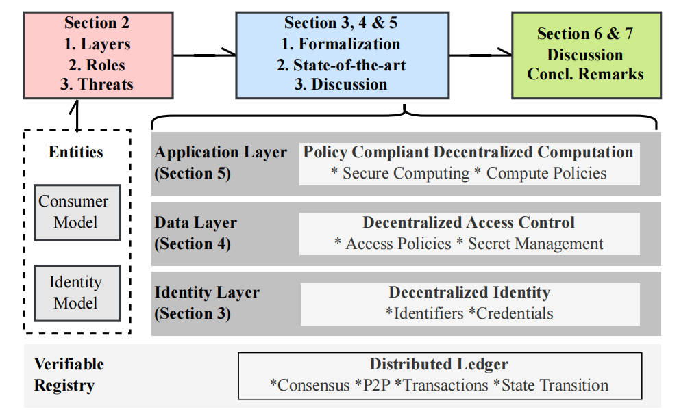
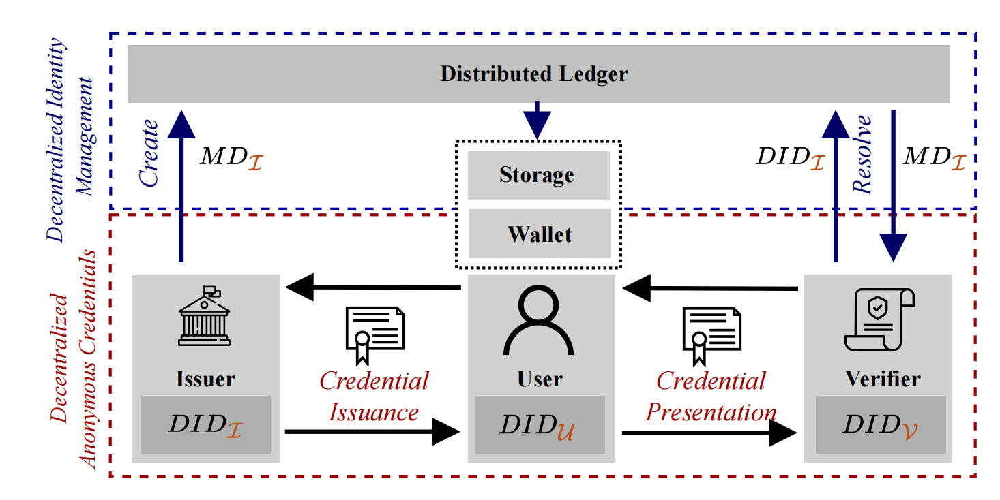

## 摘要

当今社会似乎正处于意识到在现代 Web 应用中对敏感数据进行掌控之必要性的边缘。近年来，许多系统宣称将控制权交还个体，承诺实现数据主权这一至高目标。然而，尽管该领域备受关注，学术界与产业界的研究与实践仍然碎片化，缺乏整体性的系统视角。本文首次从分散的知识体系中横向梳理数据主权，厘清其研究版图，并将其划分为三个主要方向：(i) 去中心化身份，(ii) 去中心化访问控制，以及 (iii) 符合策略的去中心化计算。我们发现现有文献缺乏一套内聚的正式定义；各子领域常被孤立考量，且因对用户控制权缺乏清晰阐释而导致产业界与学术界的优先级并不一致。为解决这一问题，我们为每个子领域提出形式化定义。通过强调数据主权超越去中心化身份的范畴，我们旨在引导后续工作从更宏观的用户控制视角展开研究。在各节中，我们结合安全与隐私属性完善定义，综述最新进展，并指出尚待解决的开放挑战。最后，我们总结各方向之间的协同效应，强调进一步发展数据主权系统所能带来的现实价值。

## 1. 引言

管理和保护与用户相关的数据是一项不可否认的重担。在物理世界中，人们深知对机密文件拥有所有权的重要性——保密、粉碎以及限制访问数十年来已是惯常做法。遗憾的是，在数字领域中隐私保护远不及实体世界成熟，且用户往往并未察觉自己的隐私正遭受侵犯 [1]。在当前的 Web（Web 2.0）中，用户数据由各类网站平台中的中心化实体所掌管。服务提供商会生成、存储并分析大量用户数据，从本质上来看，他们依旧掌控着用户的个人信息。与此同时，为保护用户数据而落实监管要求既费人力又昂贵 [2]，从而削弱了用户和服务商双方的收益。

为了改进用户数据的管理与保护，近来的研究试图同时解决两个相互交织却又独立的问题：其一，在中心化环境中赋予用户对其数据使用的足够细粒度控制，这一点既关键又长期缺失；其二，通过去中心化保证系统的安全性与可用性，使系统在无需信任任何单一实体、甚至在相当比例的参与者表现不当时仍能正常运行。这些工作推动了 Web 的进一步演化（Web 3.0），在该版本中，数据通过用户生成的权威进行管理 [3]。然而，要准确定义“用户控制”依旧是一项挑战，因为当前研究与开发的主流重心集中在*去中心化身份*之上。去中心化身份允许用户凭借一把私钥暴露敏感信息，但仍缺乏能够让用户控制数据访问与处理方式的配套方案。

在本文中，我们进一步探讨数据主权的空间，将视野扩展到目前讨论最为热烈的去中心化身份之外。我们旨在综合既有概念，突出仍需更多关注的研究领域，并通过汇聚大量既有工作与文献构建一套总体框架。我们将*去中心化访问控制*识别为一项额外且互补的关键控制要素。同时，我们观察到，现有技术（无论是去中心化身份还是去中心化访问控制）仍不足以让用户真正掌控其数据的处理流程。因此，我们提出*符合策略的去中心化计算*这一具有独立价值的概念，旨在缓解并治理数据的非竞争性问题。我们率先为去中心化访问控制和符合策略的去中心化计算这两个新概念给出了正式定义，认为它们是数据主权系统不可或缺的关键组成。

**本文的贡献主要体现在以下四个方面：**

- 我们剖离了“对数据的控制”与“去中心化”这两个概念，分别阐明其独立的重要性。
- 我们澄清了*去中心化身份*的内涵，并依托即将到来的社区标准与最新协议首次进行了形式化。
- 我们首次为*去中心化访问控制*与*符合策略的去中心化计算*给出了定义与形式化描述。
- 我们讨论了各领域的能力与局限，以及尚待探索的广阔研究空间，强调了未来可能取得的突破。

在每个形式化之后，我们都会给出协议应满足的安全与隐私属性清单。此外，我们在附录中提供了通用可组合性（UC）分析，以详述所提方案的安全保证。我们希望研究结果能帮助非专业人士更好地理解该领域，同时为领域专家识别相关研究问题提供指引。

> 图 1：数据主权概览（§ 2）。在全文中，我们假设存在一个可验证的注册表。我们对去中心化身份（§ 3）、去中心化访问控制（§ 4）以及符合策略的去中心化计算（§ 5）进行了系统化论述。在每一节中，我们先给出形式化描述，然后呈现洞见与挑战。

**Structure of the paper.** 本文余下部分的结构如下（参见图 1）。第 2 节介绍构成数据主权生态系统的各层与参与实体。第 3–5 节依次系统化 (i) 去中心化身份，并提出新概念 (ii) 去中心化访问控制和 (iii) 符合策略的去中心化计算。每节首先对 Web 2.0 与 Web 3.0 的解决方案进行对比，随后给出通用且正式的定义。接着，我们讨论最新研究成果，借助精辟洞见强调近期进展，并通过全局视角挖掘潜在协同与挑战。最后，在第 6 和第 7 节，我们重申所研究子领域之间的相互依赖关系，并为 Web 3.0 社区提出建议。

**Scope & Methodology.** 我们旨在提供一个整体视角，展示最相关的研究脉络，同时突出平台中心化的 Web 2.0 与用户中心化的 Web 3.0 之间的差异。由于目标在于系统化大量现有工作而非提供一份完整的综述，我们聚焦于关键要素与核心论文作为系统化的基础。在此过程里，我们关注能够 (i) 保留用户未共享数据和 (ii) 允许用户对个人数据的任何操作保持主动权的方案。我们不讨论分布式密钥管理、分布式存储解决方案及基于声誉与信任的系统。

## 2. 概述 — 数据主权

当前，Web 2.0 方案因依赖监管框架与中心化信任而可能失效 [4],[5]。数据主权工具与框架的总体目标，是让用户能够控制网络中其他节点**何时、何地、以何种方式**使用其个人数据。用户能够追踪并有选择地审计对其数据执行的操作，从而侦测或阻止隐私侵犯。实现这些目标的动力源于对仅由参与者自身治理的去中心化社会的向往 [6]。为明确界定数据主权，本文提出一套系统模型，引入当前系统所依托的**分层结构**、参与者可扮演的**角色**以及后续章节将会讨论的**威胁**（见图 1）。

### 2.1 分层

我们的系统模型包含四个层次（见图 1）：

- **(i) 可验证注册表**（Verifiable Registry）— 充当无需信任的第三方，保证公共数值与用户指定策略等注册信息的可用性与一致性；
- **(ii) 身份层**（Identity Layer）— 负责识别参与者；
- **(iii) 数据层**（Data Layer）— 保存用户的个人数据并据此实施授权；
- **(iv) 应用层**（Application Layer）— 指根据用户策略处理个人数据的程序集合。

**Verifiable Registry.** 可验证注册表是一种追加写的数据结构，由一组彼此不信任的节点协作维护，可视作数字公告板。其当前状态通过某种共识算法由验证者达成一致并向公众开放验证。本文余下部分将可验证注册表记为分布式账本 $L$，因为这是满足注册表需求的最常见实现形式 [7]。除非另有说明，我们假设该账本为*无需许可*账本，用户可在任何时刻自由加入或离开。

**Identity Layer.** 系统中的每位用户都关联一个标识符。要加入系统，用户需生成密钥对 $(sk,,pk)$，并用公钥 $pk$ 导出其标识符。在无需许可的分布式账本中，用户可获得多个伪匿名标识符。底层账本决定了用户是可用同一密钥对派生多个标识符，还是需为每个标识符生成新的密钥对。标识符与密钥通常由钱包统一管理。

**Data Layer.** 数据层保存与标识符关联的个人数据。我们用数据项集合 $d_i \in D^{U}$ 描述个人数据，其中每个数据项由用户 $U$ 控制。除非特别说明，本文对数据项的底层结构不作假设。数据既可以本地存储，也可以外包到分布式存储系统 [8]（例如当数据项过大而无法本地保存时）。若数据项由第三方背书，我们称其为**凭证**（credential），其由若干关于该数据主体的声明组成。本文聚焦于数据项如何通过用户指定策略保持机密性。

**Application Layer.** 只要满足用户指定策略，应用即可处理个人数据。我们将应用视作程序，可在用户本地设备上*本地*执行，也可在专用计算节点上*外部*执行。程序执行的正确性仍可通过可验证注册表进行审计。

### 2.2 系统角色

在本文调研的三个子领域中，参与方所扮演的角色各不相同：

- 在**去中心化身份**场景下，用户需就其个人数据出具断言；
- 在**去中心化访问控制**与**符合策略的去中心化计算**场景下，用户则授权他人访问其数据。

为行文清晰，我们分别为
 (a) 去中心化身份对应的**去中心化身份模型**，以及
 (b) 去中心化访问控制与符合策略的去中心化计算对应的**数据使用者模型**
 定义系统角色。用户在两类模型中都是核心角色，因此首先给出其定义。

**User.** 用户可通过 (i) 唯一标识符，或 (ii) 其个人数据所蕴含的语义来识别。通常情况下，用户既可以是个人，也可以是组织。在去中心化身份场景中，用户持有一种称为**凭证**（credential）的数字文件，该文件包含经颁发机构签名、可验证的身份属性声明。

#### 2.2.1 去中心化身份模型

在我们的去中心化身份模型中，实体可以充当**颁发者**、**验证者**或**用户**；同一实体可同时承担多个角色。

**Credential Issuer.** 颁发者以凭证形式对用户属性进行断言，对有关用户特定属性的声明有效性负责。颁发者可以是企业、政府机构或个人等。

**Verifier.** 验证者依据用户提供信息的有效性决定是否向其提供服务。为保证机密性，验证者需核实用户提交的证明。典型的验证者包括网站、安全人员及数据使用者。

#### 2.2.2 数据使用者模型

在数据使用者模型中，实体可充当**用户**、**访问控制器**、**计算节点**或**数据使用者**；同一实体亦可同时承担多个角色。用户希望限制对其个人数据的访问。

**Access Controllers.** 访问控制器通过加密用户个人数据来保管密钥 $sk$。它既可以表现为分布式委员会，也可以是运行可信硬件的中心化实体。访问控制器会依据用户指定的访问策略，将机密数据的解密密钥分发给数据使用者。

**Compute Nodes.** 计算节点根据数据使用者提供的程序，对用户个人数据执行计算。程序运行必须符合数据所有者规定的隐私要求；计算节点在成功执行后还会更新相关策略。

**Data Consumers.** 数据使用者旨在 (i) 访问加密的个人数据，或 (ii) 在用户提供的数据项上执行程序。为成功访问或处理用户数据，数据使用者必须确保其操作符合用户的策略。

### 2.3 威胁模型与假设

在给出的各项定义与性质中，我们综合考虑了对手的多种目标与能力。需要强调的是，去中心化的核心动机在于：**假设所有实体都有被攻陷的可能**，同时系统仍必须保证安全性与可用性。

- **任意偏离的对手**
  在本文余下部分，我们默认任何实体都可能为自身利益偏离协议。参与者可以随时表现为恶意或中途退出。
  - 在去中心化身份模型中，恶意颁发者可能与用户合谋签发伪造凭证，以冒充他人；用户也可能试图说服颁发者签发无效凭证。我们假设验证者与用户不会串通，因此只有合法的凭证展示才会被视为有效。
  - 在数据使用者模型中，访问控制器可能无视用户策略而试图执行程序；数据使用者可能忽略用户指定的策略访问资源；恶意用户则可能在成功认证数据使用者之后拒绝提供所需资源；计算节点可能尝试运行未经访问控制器验证的任意程序。
- **分布式账本**
  我们假设分布式账本在正确性方面值得信任，但**不**保证隐私；账本中的交易具有有界传播延迟，其当前状态对所有参与者公开可见。
- **网络与密码原语**
  我们假设标准密码学原语及安全通信信道在消息传输过程中是安全的。对手能够监听上述所有各方之间的网络流量，并可随意丢弃或延迟消息。

后续在附录 B 中给出的形式化定义均基于上述威胁模型。

## 3. 去中心化身份

**Web 2.0 — 中心化身份。** 在传统身份系统中，用户可通过回忆用户名与密码的组合来向服务提供商进行验证 [9]。为提升用户易用性，**网络服务提供商**（web service providers）常依赖**身份提供商**（identity providers | IdPs）完成用户身份验证。服务提供商将用户的身份验证委托给 IdP，因此 IdP 成为中介，为众多线上服务维护同一套用户身份。在传统系统中 [11]，[12]，用户的个人数据要么存放在 IdP，要么存放在服务提供商处，这使其仅受到内部滥用和定向攻击的有限防护 [1]。值得注意的是，当服务提供商未采用 IdP 时，会自行承担用户身份验证；结果便是，在 Web 2.0 情境下，用户身份受第三方控制。

**Web 3.0 — 去中心化身份。** 去中心化身份（Decentralized Identity）旨在通过技术手段消除传统中心化数字身份的缺陷：

1. **数字身份**可在**无中心化实体**的情况下维护；
2. 用户在身份验证时**无需依赖第三方**。

去中心化身份通过**去中心化标识符**（decentralized identifiers | DIDs） [13]与**可验证凭证**（verifiable credentials | VCs） [14]同时解决了这两大挑战。借助公开可验证的凭证，用户可以自主决定向请求方披露哪些信息。然而，由于缺乏清晰而精炼的定义，去中心化身份生态难以把握。为阐明概念，相关工作通常将去中心化身份划分为两个主要领域 [13]，[14]：
 (i) **去中心化标识管理**，其核心是将标识符与中心化注册表解耦；
 (ii) **去中心化匿名凭证**，该方向通过引入**公开可验证凭证**进一步扩展。
 目前，万维网联盟（W3C）对凭证的标准化主要关注非匿名凭证（即 Web Tokens [14]，[15]）。在本文中，我们明确聚焦去中心化匿名凭证。

### 3.1 去中心化身份管理

在本节中，我们讨论去中心化标识符（DID）的创建以及其关键操作，并首次给出去中心化身份管理所需组件的正式定义。

#### 3.1.1 形式化

我们假设存在一个公开、无需许可的分布式账本 $L$，以及第 2 节所述的数据项 $d_i^{U}$。数据项采用属性–值对 $(a,v)$（例如 $(\text{age},18)$）的形式。每个去中心化标识符 $\mathsf{DID}$ 都关联有元数据
$$
MD_{\! \mathsf{DID}}=\{(a_1,v_1),(a_2,v_2),\dots,(a_i,v_i)\}.
$$
该元数据包含密码学材料（例如验证凭证所需的公钥）及特定服务端点（如 URL）。将元数据保存在链上可确保任何人都能检查标识符信息，从而使用户声明具备**可公开验证性**。

> **定义 1（去中心化身份管理）**
> 去中心化身份管理系统实现下列算法：
>
> 1. **$Setup$** $1^{\lambda} \rightarrow pp$：给定安全参数 $\lambda$，系统输出公共参数 $pp$。
> 2. **$Generate$** $\textsf{KeyGen}(pp) \rightarrow (pk,sk)$：调用随机化算法生成一对公钥 $pk$ 和私钥 $sk$；$sk$ 仅为持有者所知。不同协议可选用各自的密钥生成流程。
> 3. **$Create$** $(sk,pk) \rightarrow (\mathsf{DID},MD_{\mathsf{DID}})$：验证 $sk$ 的所有权后，输出全局唯一、持久的标识符 $\mathsf{DID}$ 及其元数据 $MD_{\mathsf{DID}}\subseteq L$（即 DID 文档）。若标识符为公开类型，则元数据写入链上；否则保留在本地。
> 4. **$Resolve$** $(\mathsf{DID}) \rightarrow MD_{\mathsf{DID}}$：给定 $\mathsf{DID}$，解析协议返回对应元数据 $MD_{\mathsf{DID}}$。
> 5. **$Update$** $(\mathsf{DID},\,MD_{\!\mathsf{DID}})\ \longrightarrow\ MD_{\!\mathsf{DID}}$  标识符持有者可对已存在的元数据 $DID$ 调用更新函数，以生成新的元数据 $MD_{\!\mathsf{DID}}'$。
> 6. **$Deactivate$** $(\mathsf{DID})$  标识符持有者可通过调用 **Deactivate** 停用 $\mathsf{DID}$ 及其关联的 $MD_{\!\mathsf{DID}}$。自此之后，$\mathsf{DID}$ 与 $MD_{\!\mathsf{DID}}$ 均不可再用且无法恢复。

#### 3.1.2 安全与隐私属性

- **唯一性（Uniqueness）**：每个实体都拥有全局唯一的标识符；标识符通常由密码学密钥或用户钱包地址导出。
- **伪匿名性（Pseudonymity）**：若系统允许用户生成多个伪匿名标识符来隐藏真实身份，并且无法通过这些伪名单独或联合识别用户，则系统具备伪匿名性。
- **持久性（Persistence）**：除非持有者显式停用，其标识符长期有效。持久性是可移植性和互操作性的基础。

#### 3.1.3 最新进展（SOTA）——去中心化身份管理

去中心化身份管理已被写入 W3C 标准体系 [13]，并在近期正式成为 W3C 推荐规范。该规范界定了**全局唯一标识符**的通用格式，并概述了其在实践中的实现路径。虽然去中心化标识符的一般*格式*已由标准明确定义，但其*创建*与*解析*方法则依赖于具体应用场景 [16]–[18]。截至撰稿时，生态系统中已有超过 130 种方法用于生成去中心化标识符 [19]。综合现有方案，我们归纳出开发 DID 方法必须关注的三大维度：标识符创建、标识符解析与元数据存储。

**Identifier Creation（标识符创建）**
 在每种方法中，标识符的创建方式要么**显式**给出，要么**隐式**派生。最流行的以太坊方案 [20] 属于隐式派生：它将现有以太坊地址扩展为 DID 格式（如 `did:ethr:0xb9…`）。若采用显式方式，方法可能指定密钥派生算法，用以直接从公钥生成标识符 [16]。

**Identifier Resolution（标识符解析）**
 去中心化标识符通过*去中心化解析* [13] 改进了传统全球唯一标识符，确保在无中介的情况下实现密码学可验证性。解析过程将标识符映射到其元数据，元数据含有用于验证签名的密码学材料以及关联服务端点。因此，去中心化解析是去中心化身份的核心改进之一。任何解析机制都需要一个*解析器*将 DID 解析为其元数据。解析器可由用户本地运行，或通过链外 API 服务以提高可用性 [21],[22]。解析既可在**本地**完成（点对点消息传递），也可**基于账本**完成；后者要求将元数据公布在公开可用的分布式账本上 [20]，但与公共注册表通信会引入额外开销。

**Metadata Storage（元数据存储）**
 标识符本身无法保证身份真实；去中心化身份的效用与其关联信息直接相关。元数据可描述凭证验证方法及服务端点（如网站或外部存储）。常见的服务端点做法是引用公开、内容可寻址的分布式存储，以保存标识符所有者的更多数据 [8],[18],[23]。总体上，去中心化身份的存储方案可分为两类：

1. **链上存储（on‑chain）**：通过智能合约维护与标识符相关的数据 [24]–[26]；
2. **链下存储（off‑chain）**：将敏感数据保存在外部或本地存储中 [18],[23]。

选择合适的存储方案取决于共享信息的敏感度及其使用场景。相较于链上方案，外部存储为存储大规模个人数据提供了可承受的解决方案，且用户仍可安全地将加密数据保存在链下。

#### 3.1.4 讨论 — 去中心化身份管理

**备注 — 何时需要去中心化标识符？**
在一个**分布式信任**环境下，若参与者希望在**不依赖中心化注册表**的情况下完成标识符的创建、解析与停用，则 DID 具有显著优势。由此，一些早期应用已开始在实践中使用 DID：Ceramic 利用 DID 来标识写入 IPFS 的数据流 [18]；Gitcoin 则基于该系统为用户创建专属的“护照”（数据流），并按照社交资料向护照中添加“印章”（凭证），以提升信任度与抗女巫攻击能力。用户能够在**无需中央系统授权**的前提下证明护照的所有权。

**备注 — 现存局限是什么？**
当前去中心化身份的主要限制是**互操作性**。例如，若一名使用 ETH DID 的用户想与注册了 Ceramic DID 的用户通信，则双方都必须了解彼此 DID 方法的解析机制。社区提出的主流互操作解决方案是**通用解析器**（universal resolver） [21]，它由社区协作开发以提升可用性。然而，该方案在一定程度上重新引入了中心化：虽然理论上任何人都可以运行解析器，但现实中往往由大型平台托管解析服务以提高易用性。迄今，社区尚未提出一种**既通用可扩展、又根植于分布式信任**的解析机制。

**使用场景 — 去中心化 Web 应用（DWN）。**
在 Web 2.0 中，个人数据分散在各企业控制的数据孤岛内，限制了隐私与可用性；跨企业数据孤岛的整合因监管与缺乏合作而少见 [4]。借助去中心化身份管理，用户可授权服务访问其 **去中心化Web节点（DWN）** ——即个人数据存储 [27]。部署 DWN 的应用采用内容寻址式分布式存储（如 IPFS） [18],[23]。此时 DID 对于定位 DWN 至关重要，可在**无需中介**的情况下完成寻址。实际场景中，多个服务可在同一 DWN 上协同工作（例如基于同一旅行行程的多种服务）。与传统分散数据孤岛相比，基于 DWN 的去中心化 Web 应用能够提供更加个性化的网络体验。

**使用场景 — 链上账户管理。**
链上账户本质上是智能合约，可包含社会恢复、多重签名授权等任意逻辑 [28]。在该场景中，标识符即创建智能合约时生成的地址，从而提高安全钱包方案的设计灵活性；钱包甚至可以由多个密钥共同控制。进一步地，用户可将特定账户列入白名单，防止任意代币的无意识接收。

总体而言，目前尚无“一揽子”方案能够同时覆盖上述所有场景。Weyl 等人提出的**灵魂绑定代币（soulbound tokens）与信息** [6]，为与个人身份绑定的**不可转让数据项**提供了通用化概念，无论数据是以链上不可转让代币的形式，还是以链下不可转让凭证的形式存在，其定义均适用。

### 3.2 去中心化匿名凭证

尽管凭证在密码学层面已得到充分研究，但在去中心化环境中的分析仍显不足。通常的共识是：**凭证是一种已签名、不可转让的数字文档**，其中凭证颁发者的签名证明了凭证内容的有效性。去中心化匿名凭证（Decentralized Anonymous Credentials, DAC）旨在将**不可伪造的声明（凭证）\**与某一标识符关联，使其所有者能够在\**无需中介**的情况下完成身份验证。接下来的内容将剖析不同去中心化匿名凭证方案之间的协同与不足之处。

#### 3.2.1 形式化

在去中心化匿名凭证系统中，每个用户都掌管一组凭证；每份凭证由若干属性–值对组成。凭证通过颁发者的私钥生成，用户可在**无需与颁发者通信**的情况下，向**任意**验证者非交互地证明其有效性。下列定义不依赖具体密码学原语，力求保持广泛适用性。

> **定义 2（去中心化匿名凭证）**
> 在去中心化身份管理系统的基础上，引入以下参与方：
>
> 1. $\mathcal{I}$ 为颁发机构集合；
> 2. $\mathcal{U}$ 为用户集合；
> 3. $\mathcal{V}$ 为验证者集合。
>
> 并定义空间元组 $(\mathcal{C}^U,\mathcal{R}^I)$ 与下列算法，其中
>  $\mathcal{C}^U$ 为用户 $U$ 的凭证集合，
>  $\mathcal{R}^I$ 为颁发者 $\mathcal{I}$ 已撤销的凭证集合。
>
> **算法列表**
>
> 1. **REQUEST** $U \times (pp,d_i^{,U},aux,sk_U) \longrightarrow Req$
>    由用户 $U$ 执行。输入公共参数 $pp$、数据项 $d_i^{,U}$、辅助数据 $aux$（用于说明申请原因）及用户私钥 $sk_U$，输出凭证请求 $Req$。
> 2. **ISSUE** $\mathcal{I} \times (pp,Req,sk_{\mathcal{I}}) \longrightarrow cred$
>    由颁发者 $\mathcal{I}$ 执行。输入 $pp$、请求 $Req$ 和颁发者私钥 $sk_{\mathcal{I}}$，输出凭证 $cred\in\mathcal{C}^U$。颁发者对 $cred$ 中属性的有效性背书；用户可将其本地保存或上链。颁发者不知 $sk_U$，因而无法在未经用户同意的情况下伪造证明。
> 3. **PROVE** $U \times (pp,cred,sk_U,\varphi_{cred}) \longrightarrow (\pi)$
>    由用户 $U$ 执行。给定 $pp$、凭证 $cred$、私钥 $sk_U$ 与谓词 $\varphi_{cred}$，输出证明 $\pi$，表明 $cred$ 相对于 $\varphi_{cred}$ 是格式正确且有效的。
> 4. **VERIFY** $\mathcal{V} \times (pp,\mathcal{R}^I,cred,\varphi_{cred},\pi,DID_{\mathcal{I}}) \longrightarrow \{0,1\}$
>    由验证者 $\mathcal{V}$ 执行。输入 $pp$、颁发者 $\mathcal{I}$ 的撤销集 $\mathcal{R}^I$、凭证 $cred$、谓词 $\varphi_{cred}$、证明 $\pi$ 及颁发者标识 $DID_{\mathcal{I}}$，输出 $1$（验证成功）或 $0$（验证失败）。
> 5. **REVOKE** $\mathcal{I} \times (pp,cred,sk_{\mathcal{I}},\mathcal{R}^I) \longrightarrow \mathcal{R}^{I'}\cup\{\bot\}$
>    由颁发者 $\mathcal{I}$ 执行。输入 $pp$、待撤销凭证 $cred$、私钥 $sk_{\mathcal{I}}$ 及当前撤销集 $\mathcal{R}^I$，输出更新后的撤销集 $\mathcal{R}^{I'}=\mathcal{R}^I\cup{cred}$。若 $cred$ 并非由 $\mathcal{I}$ 签发，则返回 $\bot$。

#### 3.2.2 安全与隐私属性

- **不可伪造性（Unforgeability）**
  若任何恶意用户都无法构造一个证明 $,\pi,$ 使得算法 **VERIFY** 接受，则去中心化身份系统满足不可伪造性。该属性通常依赖于颁发凭证时所用底层密码学原语的不可伪造性来保证。
- **选择性披露（Selective Disclosure）**
  用户 $U$ 应能仅就凭证中的部分断言给出证明。最朴素的做法是为每次展示重新签发一张新凭证；更高效的方法是使用零知识证明实现选择性披露 [29]。
- **谓词可证明性（Predicate Provability）**
  谓词可证明性允许用户针对凭证中的属性断言满足某个谓词 $\phi_{cred}$，而无需泄露具体值。例如，可为属性–值对 $(a_1,v_1)$ 给出证明，使得 $(\text{age},\ge 18)$ 成立。关于匿名凭证谓词证明的详细讨论见 [30]。
- **不可转让性（Non‑Transferability）**
  当凭证被绑定到唯一持有者、且他人无法将其作为自己的凭证来出示时，系统支持不可转让性。实现方式可以是在私钥中编码高度敏感的信息，使持有者不愿共享 [31]，或直接在凭证内嵌入用户的公钥。
- **匿名性（Anonymity）**
  观察凭证的**出示**或**签发**过程时，若对手无法在给定用户集合 $\mathcal{U}$ 中以非可忽略概率识别出具体用户 $U$，则系统满足匿名性。在此情形下，证明 $\pi$ 不应泄露 $U$ 的身份，甚至颁发者本人也无法通过观察证明来识别持证用户。
- **不可关联性（Unlinkability）**
  若至少有两位用户 $U_1,U_2 \in \mathcal{U}$ 各执行两次 **PROVE** 或 **ISSUE**，而对手仍无法区分每份证明对应哪位用户，则系统满足不可关联性。若凭证之间不可关联，则系统可被认为支持多次出示（*multi‑show*） [32]。
- **凭证撤销（Credential Revocation）**
  系统支持撤销功能，即签发于时间 $t_1$ 的凭证可在 $t_2>t_1$ 被作废。撤销可通过设置短有效期或发布公开撤销列表来实现；撤销状态应对所有验证者和持证人可审计。关于匿名凭证撤销的综述可参见 [33]。
- **匿名撤销（Anonymity Revocation）**
  若持证用户行为不当，颁发者 $\mathcal{I}$ 有权请求识别其身份，则系统支持匿名撤销。在实践中，匿名撤销通常依赖用户与验证者之间的附加协议——该协议规定了验证者可以在何种条件下向颁发者申请解密用户身份 [31],[34],[35]。

#### 3.2.3 SOTA — 去中心化匿名凭证

近年来，学术界与工业界提出了大量匿名凭证方案，其规格与系统目标各不相同 [29]，[31]，[32]，[36]–[48]。然而，真正面向去中心化身份的方案寥寥无几 [38]，[46]–[48]。匿名凭证的核心在于：通过对经背书属性的断言进行谓词证明，可在不侵犯用户隐私的前提下完成验证。W3C 的可验证凭证（VC）标准旨在为去中心化匿名凭证提供统一接口 [14]。标准建议采用两类密码学原语——基于 **CL 签名** 和 **BBS+ 签名** 的匿名凭证 [14]。
 CL 签名方案 [29]——最早实践型匿名凭证系统的基础——其证明大小随凭证中属性数量线性增长；BBS+ 签名 [29]，[49] 则在提供同等安全性的同时，具有更短的密钥和签名长度。通常，所有匿名凭证都依赖颁发者公钥来验证凭证真伪，这促成了**去中心化身份管理**与**去中心化匿名凭证**之间的紧密联系：验证者必须在**无需中介**的情况下获取颁发者公钥（参见图 2）。然而，并非所有方案都遵循 W3C 可验证凭证规范 [36]，[50]。以下内容从**签发**与**验证**角度分析学术界与工业界的最新进展、挑战及解决方案。

> **图 2：去中心化身份模型概览。**
>
> 每个实体均由一个伪匿名 DID 标识。发行者 $I$ 向用户 $U$ 颁发凭证。
>
> 在凭证出示时，验证者 $V$ 可以通过解析发行者的 DID 来获取发行者元数据 $MD_I$，无需与 $I$ 交互，即可验证凭证的有效性。

**Credential Issuance（凭证签发）**
 通常，凭证由单一颁发者生成，其对承诺值施加群签名 [29]。Sonnino 等人指出，单一颁发者构成单点失效，因而提出了基于阈值签发的匿名凭证方案 [48]；Doerner 等人针对 BBS+ 签名提出类似的阈值协议 [51]。不过，这类方法并未消除对**辅助数据**的需求——颁发者仍需利用该数据验证用户声明。Rosenberg 等人进一步设想了无需可信颁发者公钥的方案，通过**无签名凭证** [50] 实现同一目标：在链上提交承诺，用户以零知识方式证明其已满足访问条件且打开了承诺。Maram 等人使用去中心化预言机在**无需显式授权**的情况下引导凭证生成，用户通过数据出处证明完成签发 [52]，并通过对唯一标识符（如 SSN）的去重来确保抗女巫性。

**Credential Presentation and Proof（凭证出示与证明）**
 凭证签发后，通常存储在用户钱包中；用户可就自选谓词证明其凭证断言的有效性。证明既可在**链下**经由验证者程序完成 [46]，[47]，[53]，也可在**链上**通过智能合约进行验证 [48]，[54]。值得注意的是，许多应用将**非同质化代币（NFT）\**视作在数字或元宇宙环境 [55] 中证明经验的有效手段。然而，NFT 可转让，而实际中的经历、出席等并不可转让；将这些经历与数字身份关联需要\**不可转让**的代币或凭证。链上可验证凭证有望显著拓宽 Web 3.0 的应用场景（例如，将身份作为抵押促进非过度抵押贷款），但仍需证明其效率足以支撑此类应用。

Reasoned for 3m 28s

### 3.2.4 讨论 — 去中心化匿名凭证

**备注 — 无信任凭证验证需要去中心化身份管理。**

通常，所有去中心化匿名凭证（DAC）的实现遵循相似思路：为了获得凭证，用户首先对其个人数据生成一个既隐藏又绑定的承诺；颁发者随后将自己的公钥和元数据写入公共分布式账本（即 *on‑chain*），以便任何人验证。签发凭证时，颁发者对用户的属性进行背书。为了保持匿名性，用户可以向任何实体以零知识证明 (i) 自己持有凭证中对应的私钥，并且 (ii) 凭证中披露的属性满足指定谓词 $\phi$ [29]。在验证阶段，服务提供者无需与颁发者通信，因为权威机构的公钥可通过去中心化解析直接获取。

**备注 — 兼容传统体系有助于促进 DAC 的采纳。**

凭证验证要求信任颁发者对用户属性所作的背书。然而，假设“颁发者始终在线”是一个很强的前提；未来权威机构未必会立刻接受新架构。因此，将去中心化身份生态与传统架构衔接至关重要。从传统数据生成凭证需要在不显式依赖颁发者的情况下证明数据来源，但由于用户导出个人数据必须得到权威机构许可，访问并证明持有传统数据极具挑战性。Maram 等人提出利用传输层安全协议（TLS）将凭证迁移到去中心化场景 [52, 56, 57]。通过引入向后兼容性，DID 生态的采纳率可在不要求服务器端变更的前提下得到提升。

**挑战 — 凭证的链上验证。**

鉴于匿名凭证提供强隐私保证，并且用于谓词可证明性的零知识证明（ZKP）计算开销巨大 [30]，链上验证通常成本高昂。Sonnino 等人 [48] 提出了一种可在智能合约中验证且支持谓词证明的匿名凭证，但其验证费用仍过高（例如，在撰写时链上验证 Coconut 凭证的成本约为 $950）。Rathee 等人 [54] 通过两层递归 SNARK 组合降低了验证成本。高效链上验证 DAC 仍处于早期阶段，通用 ZKP 被视为替代专用匿名凭证的一条有前景路径 [50, 54, 58–60]。预计未来的工作将更多采用通用 ZKP 来构建去中心化匿名凭证。

**挑战 — 大规模签发具抗女巫能力的凭证。**

为抵御女巫攻击，颁发者应确保任何用户都无法获得两份不同身份。抗女巫性可通过凭证去重来实现 [52]；在签发阶段依据唯一的现实世界标识符去重是可行的，因为凭证签发后，匿名性与不可关联性使得追踪重复凭证变得困难。若凭证按每人唯一标识符（如社会安全号码 SSN）签发，还可进一步证明用户的 *personhood*；否则只能通过生物特征或伪名网络来获得 *Proof of Personhood* [61]。一个固有局限是：不同颁发机构对彼此已签发的凭证并不知情，目前文献尚未讨论这些机构应如何协同以实现抗女巫属性的断言。

**应用场景 — DAC 可为去中心化应用提供 AML 与 KYC。**

在支持匿名撤销的前提下，若能高效链上验证 DAC，便可在去中心化金融中引入“以身份作抵押” [6]：协议参与者可将其身份与信誉作为抵押物，若发生违规行为，其身份将披露给监管机构。采用此范式，具有链上验证功能的凭证有望成为隐私保护型 *Know Your Customer*（KYC）解决方案，帮助去中心化应用遵守反洗钱（AML）法规 [62]。

## 4. 去中心化访问控制

**Web 2.0 — 中心化访问控制。**

访问控制通过授权和认证数据使用者来决定是否披露个人数据 [63]。迄今为止，Web 2.0 的访问控制体系依赖联合协议：中心化访问控制器代表用户处理数据保护与权限管理 [11]，[12]，[64]，[65]。用户通过在访问控制器处配置访问策略来控制数据访问；控制器随后只向满足策略的数据使用者披露个人数据。Web 2.0 访问控制的核心问题在于：(i) 用户必须完全信任第三方访问控制器来保护个人数据；(ii) 由于访问控制器采用预定义的访问策略配置，用户在指定策略时受到限制；(iii) 用户信任访问控制器能够透明且正确地公开符合法规要求的审计日志。Web 2.0 访问控制最根本的缺陷是：用户不得不信任访问控制器在提供访问与处理数据时能够如实执行。

**Web 3.0 — 去中心化访问控制。**

去中心化访问控制旨在减少用户对中心化访问控制器的依赖 [66]。在 Web 3.0 语境下，去中心化访问控制应允许用户以可验证方式掌控谁可以访问其个人数据。也就是说，用户能够基于所出示的凭证、代币所有权，或去中心化自治组织（DAO）成员资格 [67] 对数据访问进行有条件的控制。我们将去中心化访问控制的关键组成部分归纳为**链上访问策略**与**去中心化密钥管理**。链上策略可通过基于交易的用户认证来管理去中心化访问；一个由多个访问控制器组成的委员会依据策略作出决策，并相应释放密钥。数据使用者获得密钥后，即可解密加密的个人数据。基于这一洞见，接下来我们提出首个去中心化访问控制的形式化框架。

### 4.1 去中心化访问控制

在本节中，*访问控制*专指数据使用者在仅持有密文的情况下如何获得原始数据的访问权限。我们假设数据使用者可通过数据项的去中心化标识符（见 § 3.1）从个人数据存储获取密文。

#### 4.1.1 形式化

在去中心化访问控制系统中，数据项 $d_i^{U}$ 的每个密文 $c_i^{U}$ 由一个密钥 $k$ 解密。该密钥被分割为若干密钥份额，由一组密钥管理者（即访问控制器）分别持有。每个密文均关联用户定义的访问策略 $p$。数据项 $d_i^{U}$ 的策略 $p$ 包含由谓词 $\phi$ 给出的断言；满足此策略的实体组成被授权数据使用者子集 $\mathcal{C}_A\subseteq\mathcal{C}$。

> **定义 3（去中心化访问控制系统）。**
>
> 去中心化访问控制系统包含以下参与方：
>
> 1) $\mathcal{U}$ — 用户集合；
> 2) $\mathcal{C}$ — 数据使用者集合；
> 3) $\mathcal{AC}$ — 访问控制器集合。
>
> 此外，系统实现以下协议：
>
> 1. **$Setup$**：$1^{\lambda} \rightarrow pp$ 给定安全参数 $\lambda$，系统输出公共参数 $pp$。
> 2. **$Setup Shares$**：$\mathcal{U}\times(pp,k) \rightarrow (k_i^{\mathcal{AC}})$ 用户 $U$ 输入 $pp$ 与密钥 $k$，将密钥分片 $k_i^{\mathcal{AC}}$ 分发给每个访问控制器 $i\in\mathcal{AC}$。
> 3. **$SET POLICY$**：$\mathcal{U}\times(pp,d_i^{,U},k,\phi) \longrightarrow (p,c_i^{,U})$。该算法由用户 $U$ 执行。给定公共参数 $pp$、数据项 $d_i^{,U}$、密钥 $k$ 以及用户指定的谓词 $\phi$，算法输出密文 $c_i^{,U}$（即 $d_i^{,U}$ 用密钥 $k$ 加密所得），并生成链上策略 $p\in\mathcal{L}$，该策略定义了被授权的数据使用者集合 $\mathcal{C}_A$。
> 4. **$AUTHENTICATE$**：$\mathcal{C}\times(pp,p,aux) \longrightarrow (\pi_A)\cup{\bot}$。该算法由数据使用者 $C$ 执行。给定公共参数 $pp$、链上策略 $p\in\mathcal{L}$，以及辅助数据 $aux$，算法输出证明 $\pi_A\in\mathcal{L}$，用以公开表明 $C$ 已获得授权；若数据使用者 $C\notin\mathcal{C}_A$ 或不满足策略，则返回 ${\bot}$。
> 5. **$ACCESS$**：$\mathcal{AC}\times(pp,\pi_A) \longrightarrow (k_i^{\mathcal{AC}})\cup{\bot}$。该算法由访问控制器执行。给定公共参数 $pp$ 以及证明 $\pi_A$，若 $\pi_A\in\mathcal{L}$ 且数据使用者 $C\in\mathcal{C}_A$，则访问控制器向 $C$ 输出其密钥份额 $k_i^{\mathcal{AC}}$；否则返回 ${\bot}$。
> 6. **$RECONSTRUCT$**：$\mathcal{C}\times(pp,k_i^{\mathcal{AC}},c_i^{,U}) \longrightarrow (k,d_i^{,U})$。该算法由数据使用者 $C$ 执行。给定公共参数 $pp$、密钥份额 $k_i^{\mathcal{AC}}$ 以及密文 $c_i^{,U}$，数据使用者 $C$ 首先重构密钥 $k$，随后使用该密钥解密密文 $c_i^{,U}$，从而得到数据项 $d_i^{,U}$。
> 7. **$UPDATE$**：$\mathcal{U}\times(pp,p,\phi) \longrightarrow (p')$。该算法由用户 $U$ 执行。给定公共参数 $pp$、现有策略 $p$ 以及用户指定的谓词 $\phi$，算法输出更新后的链上策略 $p'\in\mathcal{L}$；新策略 $p'$ 定义了更新后的授权数据使用者集合 $\mathcal{C}_A'$.

#### 4.1.2 安全与隐私属性

我们介绍一个去中心化访问控制系统的安全与隐私属性如下：

- **数据机密性（Data Confidentiality）**：如果未授权的攻击者难以从密文 $,c_i^{U},$ 中获得关于数据项 $,d_i^{U},$ 的信息，则去中心化访问控制系统保证机密性。
- **匿名性（Anonymity）**：匿名性要求任何对手都不应能区分是授权集合 $,C_A,$ 中的哪位数据使用者 $,C,$ 访问了数据项 $,d_i^{U},$，除非审计要求。因此，在 **AUTHENTICATE** 和 **ACCESS** 过程中，数据使用者 $,C,$ 应保持匿名。
- **可审计性（Auditability）**：如果对 **AUTHENTICATE** 和 **ACCESS** 的任何调用都是公开可观察的，则去中心化访问控制系统支持可审计性。在实践中，这通过在账本 $,\mathcal{L},$ 上为 **AUTHENTICATE** 或 **ACCESS** 的每次调用发出一笔交易来实现，从而产生可审计的跟踪记录。
- **策略机密性（Policy Confidentiality）**：当且仅当访问策略仅被授权的数据使用者集合 $,C_A,$ 所能观察到时，系统才提供策略机密性。如果策略 $,p,$ 以明文形式上链，则系统不支持策略机密性 [66]。
- **公平访问（Fair Access）**：公平性对于防止依赖信息不对称（例如抢跑攻击 [68]）的攻击至关重要。公平访问意味着数据使用者能够同时从访问控制器获得密钥份额。
- **访问撤销（Access Revocation）**：若授权的数据使用者可在任何时间被撤销访问权限，则去中心化访问控制系统支持访问撤销。

#### 4.1.3 SOTA — Decentralized Access Control

作为一种原语，**去中心化访问控制**在既有工作中尚未得到正式定义。关于区块链访问控制方案的若干综述显示，大多数研究都聚焦于某一特定应用场景，而非给出通用定义 [69]。我们的形式化建立在这样的洞见之上： **用户控制（user‑control）** 要求将 *数据使用者授权* 与 *去中心化密钥管理* 相分离。下面对该领域的 **最新进展（state‑of‑the‑art）** 作一梳理。

**Access Policies.** 访问策略规定数据使用者在何种条件下可访问特定资源。除了关注访问条件的*机密性*之外，另一核心属性是描述策略所用语言的*表达能力（expressivity）*。

- Kokoris Kogias *等*提出一套去中心化访问控制系统，在牺牲表达能力的前提下支持匿名性 [66]。
- Shafagh *等*为 IoT 数据流指定了去中心化访问控制，在特定应用域内提供高粒度控制 [63]。两者皆产生可被明文观察的策略。
- Steffen *等*提出一种语言，用户可将访问条件表述为算术证明电路，使得访问条件保持机密 [70]，[71]；该隐私增益以计算效率为代价。
- 最近，Spruce [22] 给出一种实验性的访问策略语言，能够依据代币或凭证所有权为数据使用者授权 [72]。尽管其不支持策略机密性，这一方案已成为工业界开发去中心化条件访问控制的初步尝试。

**Decentralized Secret Management.** 用户依赖**分布式委员会**在无中心化中介的情况下安全地管理密钥 [66]，[73]。委员会在满足访问策略的条件下接收并披露密钥；亦可使用安全执行环境（secure enclave）发放密钥，但需要额外信任假设 [74]。一般有两种向访问控制器委员会分发密钥的策略：

1. **可验证秘密共享（VSS）**：将密钥分发给*用户自选*的委员会。为保证份额一致性，VSS 算法需具备公开可验证性；该范式被多项正交工作采用，以提升委员会的效率与主动性 [75]–[77]。
2. **分布式密钥生成（DKG）**：由固定委员会节点共同生成密钥对 $(pk, sk_i)$，每个节点持有密钥的一个份额。用户随后使用公钥 $pk$ 加密数据加密密钥，使访问控制器能够获得其份额。这一范式对用户更友好，但相较 VSS 获得的研究关注度较低，却被视为去中心化访问控制的有益补充。

#### 4.1.4 讨论 — 去中心化访问控制

**Remark — 去中心化访问控制是去中心化身份所缺失的互补要素。**
 去中心化身份阐明了用户如何在呈现个人数据时利用去中心化匿名凭证来保持隐私 [14]。验证者会创建一个请求，说明用户在出示凭证时所应用谓词的要求。然而，该方法并不适用于基于用户自定义策略的自动化验证，因为每生成一次新证明，验证者都必须为其重新创建请求。Coull 等人指出，可通过策略图 [78]，[79] 来促进对预定义且细粒度策略的验证。尽管这种方法支持更具表达力的访问控制策略，但现有方案要么 (i) 专属于所用的匿名凭证本身，要么 (ii) 无法适用于去中心化环境，因而缺乏可审计性。理想情况下，去中心化访问控制应作为去中心化身份的互补组件，依赖用户自有凭证来进行基于策略的授权 [67]。如何将二者结合，以实现端到端的**去中心化身份与访问管理**以保护个人数据，仍有待未来工作探索。

**Challenge — 表达性强且保密的策略。**
 Web 应用的访问控制研究已相当成熟，并存在多种用来编写访问控制策略的语言 [80]。*表达性*是访问策略的一项核心属性，它决定了能否为数据使用者指定细粒度权限。已有若干工作致力于将现有语言迁移到区块链上，以实现可审计的访问控制 [81]，[82]。然而，由于现有语言并不考虑策略机密性，它们在提供强隐私保证方面表现不佳。Zyskind 等人首先提出将分布式账本用于隐私保护型的去中心化访问控制，以管理由外部存储提供商托管的个人数据 [83]，[84]。后续工作在此范式上进行了扩展，通过识别“数据使用者授权”与“密钥管理”的本质分离，在分布式存储中授予对个人数据的访问权限 [63]，[66]，[85]。Goyal 等人建议将策略表述为解密所需的公共条件，数据使用者可通过提交知识证明来满足该条件 [75]。然而，最近提出的系统在隐私、表达性与效率之间仍存在未解决的张力；一个能够在高效验证用户设定条件的同时保持机密性的高表达力策略语言，依旧是未来研究课题。

**Remark — 将密钥与策略进行密码学绑定可防止重放攻击。**
 重放攻击与所采用的加密方案无关：攻击者可能诱使系统泄露与某密文关联的密钥 [66]。具体而言，攻击者取用公开可访问的密文，并创建一个将自己声明为合法数据使用者的策略。为抵御此类攻击，当前系统会将用户密钥密码学地绑定到策略 [66]；此外，更新策略的交易需包含密钥知识证明，这使得攻击者无法为同一密钥生成不同的有效策略。

**Remark — 探索密钥分发效率的改进。**
 一种直接的做法是让用户采用可验证秘密共享（VSS）向访问控制器委员会分发密钥，这是确保份额一致性的特殊秘密共享形式 [86]，[87]。近期工作展示了如何通过*主动性* [73]，[75]，[77]，[88] 和 *可扩展性* [76] 来增强这一基线。但让用户直接向选定委员会分发份额，会使交易大小随委员会规模线性增长，因为策略定义时所有加密份额都需上链供数据使用者验证 [66]。通过要求一个保持单一公钥与共享密钥的**静态**访问控制器委员会，此缺陷可得到缓解 [66]。用户可使用委员会的公钥加密其密钥，使每个访问控制器能够独立计算自身份额；如此一来，策略更新的交易大小便与委员会规模无关。然而，若需保持主动性，则必须轮次性地重新实例化委员会成员；如何为大型、动态委员会提升效率仍是未解难题。

**Challenge — 通过将区块链节点选为访问控制器来提升安全保证。**
 最新研究提出，在去中心化密钥管理框架中可自然地将区块链验证节点充当访问控制器 [75]，[77]。除了运行共识协议外，每个验证节点还参与 **动态主动秘密共享（DPSS）** 来代表用户维护密钥。然而，在 DPSS 方案中，验证时间随委员会规模线性增长。Gentry 等人 [76] 通过区分诚实与恶意节点来缩小委员会规模，但其可行性尚无系统性分析。我们预计，未来在选择委员会节点以提升去中心化密钥管理安全性方面将获得更多关注。

**Use‑Case — 针对去中心化 Web 节点的条件访问。**
 去中心化访问控制确保在任意条件下安全释放密钥，本身是极具威力的原语。然而，它在需要更强公平性与可审计性的场景中表现尤为出色。业界最近的努力正致力于开发策略语言，以便在出示代币、凭证或匿名凭证时授予访问权限 [67]，[72]。展望未来，去中心化访问控制可用于促进用户对**去中心化 Web 节点（DWN）**中个人数据的自主管理。设想一家广告公司希望分析使用智能合约完成支付的用户社交媒体数据：在收到广告商付款后，用户可披露其社交媒体标识以进行分析。然而，一旦通过纯粹的去中心化访问控制授予访问权限，数据使用者仍可随意复制并传播这些非竞争性个人数据。

## 5. 符合策略的去中心化计算（Policy‑Compliant Decentralized Computation）

我们现在将注意力转向**符合策略的去中心化计算**，该方向旨在实现一个难以捉摸的目标：在超越对单个数据项“统包式”访问的同时，保护个人数据。正因如此， **符合策略的去中心化计算（PCDC）** 相较于去中心化访问控制有了改进——数据使用者仅能获得计算结果，而非明文形式的个人数据。

**Web 2.0 — 中心化计算。**
 过去几十年里，Web 的快速扩张伴随着日益增强的中心化。少数大型公司拥有大部分系统与服务器，并据此收集大量数据。与之相伴的透明度缺失导致频繁的攻击事件和数据泄露 [89]。原始数据要么 (i) 得不到利用而滞留在数据孤岛，或 (ii) 被复制，致使数据使用控制与可审计性难以实现 [90]。因此，用户既无法掌控数据存储方式，也无法就数据产生的商业价值获得补偿。

**Web 3.0 — 符合策略的计算。**
 当前针对 Web 3.0 的机密智能合约方案允许用户在保密的情况下调用去中心化应用 [70]，[71]，[74]，[91]–[95]。然而，这些方案仅关注用户如何在本地维护数据的前提下调用程序，而未考虑第三方程序调用、数据源组合以及基于策略的数据治理。我们认为，设想中的 Web 3.0 应用与当前 Web 2.0 应用之间的差距，要求对**用户治理计算**作出正式描述。为弥合这一鸿沟，我们提出 **PCDC** 的概念，它允许用户管理任意外部程序的执行。PCDC 使一系列新的协议成为可能，用户既能利用其数据，又能获得此前难以实现的隐私与计算正确性保证。为了实现隐私并保护超越访问的数据，PCDC 依赖安全计算；数据使用者因此只能看到结果，而用作输入的个人数据只能被用户看到。为确保可审计性，PCDC 要求提供计算正确性的证明。

> **图 4：符合策略的去中心化计算（PCDC）概览。**
> 用户 $U$ 设置策略 $p$，将个人数据 $c_{\mathrm{in}}$ 存储并共享密钥。访问控制器接收程序 $\Theta$，分析其是否满足策略，然后将程序与密钥转发给计算节点；计算节点执行计算并原子性更新策略，结果随后分发给数据使用者。

从高层来看，PCDC 作为去中心化访问控制的自然扩展（参见图 4）。访问控制器会根据用户指定的策略分析程序是否合规；验证通过后，访问控制器将程序、数据解密键及相应的剩余策略发送至计算节点。计算节点执行计算、原子性地更新策略并返回结果。下文中，我们将给出 PCDC 的首个正式定义，并概述其相关的安全与隐私属性。

### 5.1. 合规的去中心化计算

#### 5.1.1. 形式化

> **图 3：去中心化访问控制概览。**
>
> 用户 $U$ 设定策略 $p$，存储其个人数据，并将密钥共享给访问控制器 $AC$。仅当数据使用者 $C$ 能够证明其行为符合 $p$ 时，方可检索到明文数据。

我们假设数据使用者 $C$ 意图通过执行程序 $\Theta$ 对数据项 $d^U_i$ 进行计算。所指定的策略 $p$ 定义了是否可以执行该计算（参见图 3）。每次程序执行都会将链上隐藏的策略从 $p$ 更新为 $p'$（$p'$ 是剩余策略）。剩余策略包括程序执行后 $d^U_i$ 的更新隐私预算。正确计算和策略更新的证明由维护账本的节点进行验证。在我们的抽象中，策略由三个谓词来指定——访问谓词 $\phi_{acc}$，用于指定对 $d^U_i$ 的访问；输入谓词 $\phi_{in}$，用于指定对数据项消费的约束；以及输出谓词 $\phi_{out}$，用于决定对计算输出的约束，例如有资格观察结果的数据使用者集合。为了简化抽象，我们假设存在一个包含所有谓词的单一策略。然而，需要注意的是，不同的谓词可能由不同方在各自的策略中指定（即数据使用策略、隐私策略和输出消费策略）。此外，访问控制器分析程序 $\Theta$ 的策略合规性，发布计算承诺 $c_{comp}$ 和程序合规性证明 $\pi_A$。访问控制器将执行程序所需的信息发送给计算节点。请注意，访问控制器和计算节点可以是同一实体。为了语义清晰，我们在定义中将它们区分——计算节点在接到访问控制器的指令后执行程序。

> **定义 4（合规的去中心化计算）**。一个合规的去中心化计算系统由一组参与者组成，其中
>
> 1. $U$ 是用户集合。
> 2. $C$ 是数据使用者集合。
> 3. $AC$ 是访问控制器集合。
> 4. $CN$ 是计算节点集合。
>
> 以及以下算法：
>
> 1. **SETUP：** $1^\lambda \to pp$。
>
>    给定安全参数 $\lambda$，系统输出一组公共参数 $pp$。
>
> 2. **COMMIT：** $U \times (pp,,d^U_i,,k^{in},,s,,\phi_{acc},,\phi_{in},,\phi_{out}) \to (c_{in},,p)$。
>
>    该算法由用户执行。给定公共参数 $pp$、对称密钥 $k^{in}$、策略加密密钥 $s$、数据项 $d^U_i$ 以及谓词 $(\phi_{acc},\phi_{in},\phi_{out})$，它输出：
>
>    - 密文 $c_{in}$，即在密钥 $k^{in}$ 下对 $d^U_i$ 的加密；
>    - 链上策略 $p \in L$，其中 $p$ 是指向 $c_{in}$ 的指针与上述谓词的串联。
>       只有持有策略加密密钥 $s$ 的实体可以更新该策略。
>
> 3. **ANALYZE：** $AC \times (pp,,p,,\Theta) \to (ct_{comp},,\pi_A)$。
>
>    该算法由访问控制器执行。给定公共参数 $pp$、用户指定的策略 $p$ 和数据使用者提供的程序 $\Theta$，它输出：
>
>    - 链上计算承诺 $ct_{comp}$，用于承诺程序 $\Theta$ 与策略 $p$ 的串联；
>    - 证明 $\pi_A \in L$，该证明断言程序符合用户指定的策略。
>
> 4. **COMPUTE：** $CN \times (pp,,s,,p,,c_{in},,k^{in},,\Theta) \to (p',,c_{out},,k^{out},,\pi_C),\cup,{\perp}$。
>
>    该算法由计算节点执行。输入包括公共参数 $pp$、策略加密密钥 $s$、当前策略 $p$、输入密文 $c_{in}$、对称密钥 $k^{in}$ 及程序 $\Theta$。算法输出：
>
>    - 更新后的剩余策略 $p' \in L$；
>    - 输出密文 $c_{out}$；
>    - 输出隐藏密钥 $k^{out}$；
>    - 正确计算证明 $\pi_C \in L$；
>       若计算失败，则输出 $\perp$。
>
> 5. **CLAIM：** $C \times (pp,,c_{out},,k^{out}) \to (d_{out}),\cup,{\perp}$。
>
>    该算法由数据使用者执行。给定公共参数 $pp$、输出密文 $c_{out}$ 和输出隐藏密钥 $k^{out}$，算法输出结果 $d_{out}$；若解密失败，则输出 $\perp$。

#### 5.1.2 安全性 & 隐私属性

我们为 PCDC 引入以下安全性 & 隐私属性：

- **机密性**：当且仅当
  1. 只有持有正确加密密钥的实体能够观察数据项 $d^U_i$；
  2. 只有被授权的数据使用者集合能够观察策略；
  3. 只有被授权的参与者能够观察被调用的函数；
  4. 输出 $d_{out}$ 仅对被授权的数据使用者可见，
      时，机密性得以保证。
- **匿名性**：
  - **用户匿名性**（User-anonymity）描述对手无法识别向程序 $\Theta$ 提供输入数据项的用户 $U \in U$。
  - **使用者匿名性**（Consumer-anonymity）描述对手无法识别接收 $\Theta$ 输出的数据使用者 $C \in C$【91】。
     注意：对于某些应用，匿名性可以是可选的。
- **计算正确性**：计算节点生成证明 $\pi_C \in L$，用于证明程序的正确计算。任何实体都应能够验证 $\pi_C$ 及更新后策略的正确性。
- **原子数据交付**：确保一旦程序执行完毕，策略会更新以反映新的策略状态 $p'$。在未获得更新策略的情况下，数据使用者无法声明输出 $d_{out}$；一旦策略被更新，数据使用者应始终能够声明该输出。
- **差分隐私**：当系统支持差分隐私时，数据集中某个用户信息的存在或不存在仅会对计算输出分布产生微小影响【96】。在 PCDC 中，隐私消耗通过剩余策略 $p'$ 进行监控，该策略反映了程序执行后的更新策略状态。

#### 5.1.3 SOTA — 合规的去中心化计算

我们概述了 PCDC 和正交技术的最前沿成果。我们讨论以下维度：

**策略规范与分析**。在执行计算之前，指定一个链上策略以概述可接受的程序执行至关重要。Bowman 等提出在可信硬件中根据预先达成的策略共享和处理数据 [97]。Wang 等描述了一个用户可配置的数据分析框架，其中策略描述了对数据项的隐私需求 [98]。通过提供一个基线策略，让用户在其基础上添加附加条件，可实现对 GDPR [99] 或 CCPA [2] 的合规。他们建议使用静态分析检测隐私违规，并通过差分隐私量化隐私降级。程序分析可以由控制访问的实体完成，也可以由程序提供者完成。如果由程序提供者进行分析，则可以通过可验证的差分隐私证明来证明策略合规 [100]。

**计算**。注意，PCDC 与机密智能合约系统不同。机密智能合约没有用户定义的策略来管理个人数据使用的概念。在 PCDC 和机密智能合约中，只有初始化状态的实体才能连续更新状态。而在 PCDC 中，计算节点还可以进一步执行任意无状态程序。Khosba 等提出通过专用链下计算节点实现机密智能合约 [101]。为优化效率，大多数后续方法依赖可信硬件来实例化链下计算节点 [74]、[97]、[102]–[104]。还有若干其他工作采用多方计算 (MPC) [105]–[107]、全同态加密 (FHE) [71]、[91] 或零知识证明 (ZKP) [94]、[108] 来减轻对可信硬件的需求，但在输入、输出以及每次计算功能的隐私定义上各有不同。有关机密智能合约的全面概述，读者可参考 [109]。我们强调，PCDC 与安全计算技术（即 MPC）和机密智能合约解决方案截然不同：PCDC 专注于基于策略的计算治理和合规审计，而机密合约执行则不具备策略合规的概念，它确保智能合约及其数据的机密性，不向攻击者泄露敏感信息。

**输出分发**。一旦计算执行完毕，计算节点将在接收者的公钥下加密输出，并更新链上策略。Wang 等通过使用剩余策略对计算输出进行重新加密，聚焦于多步骤分析，以在多个步骤中满足隐私需求 [98]。有几个子问题需考虑——计算结果与策略更新的原子交付、理性参与者的良好行为保证以及协议参与者的充分激励。Cheng 等提出一种原子输出交付协议，通过仅在链上验证状态更新后再向使用者释放密钥来实现 [74]。Das 等通过抵押系统实现经济公平，当恶意方或 TEE 操作员偏离协议时对其施以惩罚 [110]。

#### 5.1.4 讨论 — PCDC

**Remark — 策略选择可以委托给受托人。**

为合规的程序执行设置策略，使用户能够对数据处理进行控制。实际上，策略类型繁多且复杂。用户可能需要复杂的属性依赖和隐私预算，或仅仅采用公开已知程序的简单白名单。然而，选择合适的策略可能具有挑战性，因为用户在确定恰当的隐私保护时可能会遇到困难。为了提高可用性，用户可以求助于数据受托人（data fiduciaries）来选择策略【98】【125】。依赖受托人并不限制控制，也不限制可编程隐私的程度。

**Remark — 可审计的隐私预算确保用户可控的隐私降级。**

验证程序相对于数据隐私法规的合规性似乎足以保护隐私，但事实并非如此，因为攻击者可以累积计算结果【102】。使用差分隐私时，用户可以设置隐私预算（由参数 $\varepsilon$ 定量）来防止多次观察导致的信息泄漏。在我们的定义中，我们要求用户可控的隐私降级。访问控制器分析提交的程序，更新隐私预算，并生成剩余策略。

**Remark — 分析程序在函数隐私与策略机密性之间产生二分法。**

依据用户指定的隐私预算对程序进行合规性分析，可以由程序提供者或访问控制器完成。然而，这两种方法皆有尚待探索的独特陷阱。当程序提供者创建差分隐私证明时，必须了解策略细节；当访问控制器分析程序时，程序必须对其分析是已知的。此外，这表明在程序执行及策略更新的程序分析过程中，函数隐私对于 PCDC 的相关性。在不依赖可信硬件的情况下，提出一种能够化解函数隐私与策略机密性二分法的解决方案仍然是一个开放问题。

**Challenge — 并发的策略更新。**

并发描述了程序的异步、无序评估【126】。在执行程序时，计算节点需要更新策略，包括相关的隐私预算。策略更新可能导致竞争条件，即多个实体同时尝试向账本提交状态更新。所有并发智能合约的解决方案都适用于公共程序，但支持机密策略的并发更新同样是 PCDC 尚待解决的问题。然而，一些方法已展示了机密智能合约的并发执行可行性，例如通过计算输出与状态更新的原子交付【74】、执行前预排序计算【126】、以及基于账本陈旧视图拒绝过期状态更新【102】。对于 PCDC 来说，同时跟踪隐私预算十分困难，因为多次计算的隐私预算减少等同于各个计算中消耗的隐私预算之和【127】【128】。实现对机密策略和隐私预算的并发且可防重放攻击的策略更新仍是一个开放问题。

**Challenge — 跟踪数据集组成的隐私预算。**

与在单一输入上执行多个程序相对，用户可能打算对多输入执行单个程序。后者在去中心化数据科学中尤为相关。如何协调并量化合并并由多输入计算使用的各个数据集的隐私损失仍是一个开放问题。当数据集被频繁更新，且计算输出进一步用于二次计算时，解决此复杂性需要量化复杂设置的隐私损失与收益，这在实践中同样具有重要意义。

**Remark — PCDC 实现可证明的数据血统。**

PCDC 通过链上承诺在特定数据项上实现了可审计的应用计算历史。区块链的不可变性，以及 PCDC 对数据访问的限制，有助于实现数据血统——这是在隔离环境之外难以解决的问题【129】。数据血统工具跟踪数据生命周期，包括其来源、目的地以及每次连续的转换。可验证的数据血统有助于解决与数据主权相关的核心问题：通过识别对多步骤计算最终结果最关键的数据，数据使用者可以确定各方贡献并相应激励【130】。数据溯源（Data Provenance）是验证数据来源的子问题，近年来受到关注【56】【57】【131】【132】。使用 PCDC 实现可验证的数据血统仍然鲜有探索，是一个有趣的研究问题。

**Use-Case — 去中心化数据科学。**

大量数据促进了人工智能和机器学习算法的实际应用。为增强数据可用性，各种协议提出了去中心化数据市场（decentralized data marketplaces），使数据集可以发布、发现和消费【122】。然而，它们通常以原始数据进行交易，由于数据的非竞争性，用户控制退居次要地位。PCDC 作为额外的治理层，允许用户通过指定策略来限制所进行的分析。这样，PCDC 接近于一个负责的数据经济，在其中用户可以在不放弃隐私的情况下实现数据的货币化。然而，要实现这一点仍有许多开放挑战。例如，尚待解决用户如何在 DWN（参见 §3.1）中控制数据处理，例如通过白名单程序。

**Use-Case — 数据共有人。**

许多用例已通过 PCDC 涵盖了单个用户对单一数据集的治理。然而，将多个用户的数据集合并可以提高相对于各个独立数据集的效用。解决该问题需要针对数据共有人（co-ownership）的治理方案。将其数据合并以增强共用效用的用户，可通过数据 DAO（Decentralized Autonomous Organization）来治理程序执行。PCDC 可以通过 DAO 管理的共享策略来强制执行决策。通过应用多重共享方案【133】来构建治理结构，并确定数据集的共享价值，同样是一个开放的研究领域。

## 6. 讨论

> **表 1：** 行业与研究解决方案在第 3 至 5 节定义方面所提供的功能。功能要么已解决 ●，要么未解决 ○，或不适用。
>  对于去中心化身份：
>
> - † = 符合 W3C DID；
> - ‡ = 符合 W3C VC；
> - ※ = 支持链上验证；
> - ▼ = 支持隐私保护凭证。
>    如果某个解决方案支持不具备匿名性的凭证，我们用 ◆ 表示。解决方案纳入和排除的方法论在附录 A 中进行了概述。

**Comparison — 优势、弱点与联系。**

表 1 指出了每种解决方案所提供的关键功能，并标出了缺失的功能。很明显，业界特别关注去中心化身份技术。这是自然的，因为在许多方面，去中心化身份是对互联网根本价值的回归，它偏好去中心化胜过孤立的 Web 服务。此外，我们观察到，近期关于去中心化匿名凭证的工作主要依赖 SNARK 实现高效的链上验证 [50]、[54]、[58]。与此同时，去中心化访问控制和 PCDC 尚未获得广泛关注。我们预计，SNARK 的最新改进能够进一步提高数据主权应用的实用性。我们鼓励在该领域开展更多研究，并希望本分析能阐明缺失的特性和开放的研究方向。

**透明性技术。**

透明性技术提供了一种替代方案：通过要求服务提供者将请求追加到不可删改日志中来减少对其的信任，从而在其行为不端时追究责任。过去，透明日志已被应用于许多领域，如密钥透明性 [134] 或证书透明性 [135]。同样，透明日志也可增强数据主权相关技术：去中心化标识符可以通过密钥透明日志进行解析，凭证可以通过凭证透明日志由第三方透明地管理 [136]，访问控制器委员会可以利用透明日志记录对密钥的访问尝试 [137]、[138]。与可验证注册表增强安全性和隐私不同，透明日志通过在 Web 2.0 集中化与 Web 3.0 去中心化之间提供中间地带，从而提升性能。我们鼓励进一步研究用于数据主权的透明日志。

**数据真实性与溯源。**

尽管用户可能通过上述技术实现数据主权，但证明数据真实性的挑战依然存在。数据使用者关心所获得数据的有效性，而用户无法仅凭表面信息让数据使用者信服。为有效解决该问题，每个数据项都应伴随一份 **声明**（claim）和一份可独立验证的 **证明**（proof）。我们发现有三种可能的途径来克服此挑战——从声誉良好的第三方获取鉴证，证明数据溯源，或直接从数据源获取鉴证。在撰写本文时，这些方法可通过颁发凭证 [14]、使用 TLS 预言机证明数据溯源 [52]、[56]、[57]，或使用内容溯源（如近期 C2PA 标准中提出的做法 [139]）来实现。我们希望在未来几年内见证从第一种到第三种解决方案的平滑过渡。

## 7. 结论性评述

总之，我们认为，在不引入额外信任假设的前提下，同时实现隐私、透明度和效率是一项具有挑战性的任务。我们的研究结果表明，数据主权是迈向下一代网络的重要一步，在下一代网络中，所有关于个人数据的操作均由用户控制。我们相信，对隐私保护技术中效率的研究，以及对本文所研究子领域之间互操作性的工具化，将使社区能够弥合平台中心化与用户中心化网络技术之间的差距。

**致谢**

我们感谢 Deevashwer Rathee、Sriram Sridhar 和 Bryan Ford 的宝贵意见。该工作部分由伯克利负责任去中心化智能中心（Berkeley RDI）、Chainlink Labs 以及 Algorand 基金会与德国联邦教育与研究部在 “Souverän. Digital. Vernetzt.” 项目框架下管理的 Algorand 卓越中心计划共同资助。联合项目 6G-life（项目编号 16KISK002）。Canetti 的工作由 DARPA 根据协议号 HR00112020021 支持。
