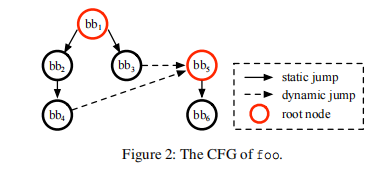
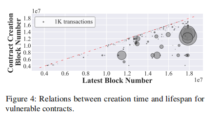
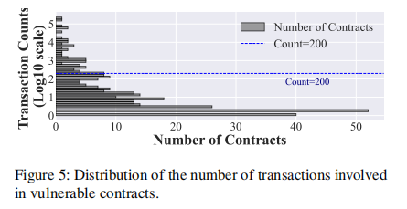
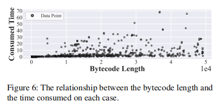

# 所有的代币都是我们的：揭秘Solidity智能合约中的地址验证漏洞

## 摘要

在以太坊中，验证传入地址的有效性是一种常见实践，这对于确保智能合约的安全执行至关重要。然而，地址验证过程中的漏洞可能会导致严重的安全问题，我们的社区也已报道了相关的实际案例。尽管如此，这类漏洞的系统研究仍未受到足够重视。为填补这一空白，本文旨在描述并检测这种新兴的漏洞。我们设计并实现了AVVERIFIER，这是一种基于静态EVM操作码模拟的轻量级污点分析工具。其三阶段检测器可根据漏洞的内在特征逐步排除误报和漏报。在一个公认且无偏的基准测试上，AVVERIFIER 在保持94.3%的准确率和100%的召回率的同时，可比现有最先进（SOTA）工具提高2到5倍的检测效率。在针对超过500万个以太坊智能合约的大规模评估后，我们共发现812个此前未被社区公开的脆弱智能合约，另有348个开源智能合约被进一步确认存在此类漏洞，这些合约锁定的代币总价值超过112亿美元。此外，我们将AVVERIFIER进一步部署为以太坊和币安智能链（Binance Smart Chain）上的实时检测工具，结果表明AVVERIFIER可在合约部署后及时发出警告。

## 引言

自从中本聪推出比特币[57]以来，各种区块链平台如雨后春笋般涌现。其中，以太坊[17]是最知名的平台之一。除了所有区块链平台共有的特征外，以太坊最引人注目的功能是智能合约（smart contract）。它可以被视为一段不可变的脚本，仅在满足预定义条件时才会以确定的方式执行。

由于智能合约中存储了价值数十亿美元的资产，识别和利用其中隐藏的漏洞成为攻击者的首要任务。根据最近的一份报告[65]，在过去一年中发生了约303起针对知名以太坊合约的大型攻击事件，造成的损失约为38亿美元。Chen等人[19]总结了以太坊智能合约中的26种主要漏洞类型，而伴随着以太坊中持续的功能引入与废弃，新的漏洞类型仍在不断涌现[45]。

以太坊智能合约漏洞的自动化识别是一个被广泛研究的主题[14,35,44,53,67,69,75]。考虑到合约数量巨大以及由漏报导致的经济损失，目前主要采用的是符号执行（symbolic execution）技术，因其在一定程度上可保证分析的可靠性。例如，Mythril [67] 是以太坊合约的字节码级别符号执行工具，而Slither [29] 是源代码级的分析工具，号称具有更高的效率和有效性。

验证输入地址的有效性是一种常见做法，也是确保智能合约安全执行的关键步骤。地址验证过程中的漏洞可能导致严重的安全问题，我们的社区已经报道了相关的实际案例[11]。具体来说，智能合约中的函数可以将地址作为参数。如果开发人员在地址作为外部调用目标时意外忽略了地址的验证，则可能导致该地址内任意操作（包括恶意操作）的调用。因此，任何链上状态修改依赖于外部调用时，都可能违背开发人员的意愿。

当前，尚无现有工具能够有效检测地址验证漏洞，并且基于现有框架实现此类漏洞检测工具也颇具挑战性。一方面，根据地址验证漏洞的特征，要有效识别这一漏洞，检测工具需要执行跨过程甚至跨合约的分析。现有工作通常在进行此类分析时，要么在效率上存在缺陷，要么在有效性上存在不足。例如，基于模式的检测工具几乎无法处理如此复杂的漏洞模式，而符号执行则会受到路径爆炸问题（path explosion）和约束求解（constraint solving）瓶颈的困扰。另一方面，大多数合约是闭源的，其字节码缺乏足够的语义信息，难以准确识别隐藏的漏洞。具体来说，地址验证漏洞需要对内存和存储区域进行细粒度的跟踪。在字节码中，很难区分存储在这两个区域中的不同变量。此外，通过符号执行跟踪变量会遭遇严重的路径爆炸问题，因为潜在的状态空间非常庞大。

本研究工作。为填补这一空白，我们旨在描述和检测这种新兴的漏洞。具体而言，我们设计并实现了AVVERIFIER，这是一个新颖的轻量级静态污点分析框架，能够高效准确地识别地址验证漏洞。其污点分析基于操作码序列的静态模拟。换句话说，AVVERIFIER 在不考虑路径可行性的情况下，通过维护数据结构（例如堆栈和内存）的值以及污点传播状态，进行静态分析模拟。这种静态模拟遍历大量路径，包括原本不可行的路径。因此，根据收集到的对应状态，AVVERIFIER 可通过三阶段检测正式识别地址验证漏洞。该方法基于漏洞的内在特征，逐步排除误报和漏报。

根据我们设计的基准测试，AVVERIFIER 在效率和有效性上明显优于现有最先进的智能合约检测工具（即Mythril、Ethainter、Jackal和ETHBMC1）。根据对超过500万个部署的以太坊合约的综合评估，AVVERIFIER 发现超过812个易受攻击的合约，并进一步确认了348个开源智能合约存在漏洞，其锁定资产总价值超过112亿美元。最后，我们将AVVERIFIER 部署为以太坊和币安智能链（BSC）上的实时检测工具，结果表明AVVERIFIER 能够及时向开发人员和社区发出预警。在真实场景中，AVVERIFIER 在攻击发生前1.5小时即发出警报，这充分证明了其有效性和效率。

本文的贡献主要体现在：

* 本文首次研究地址验证漏洞。我们设计并实现了AVVERIFIER，这是基于静态EVM模拟的一种高效准确的污点分析工具。
* 我们将AVVERIFIER 应用于以太坊超过500万个智能合约，揭示了数百个此前未被公开的易受攻击合约。这是对该类漏洞的首次大规模实际表征研究。
* 与Mythril、Ethainter、Jackal和ETHBMC等工具相比，AVVERIFIER 在保持94.3%的精确度和100%的召回率的情况下，可将分析效率提高2至5倍。
* 我们已将AVVERIFIER 作为实时检测工具部署在以太坊和BSC上，结果表明AVVERIFIER 能够在攻击者发起攻击前，合约刚部署时即发出早期预警。

## 背景

### 以太坊简介

在以太坊中存在两种类型的账户：外部拥有账户（external owned account, EOA）和智能合约（smart contract）。具体而言，EOA是一种普通账户，具有唯一的地址并由私钥控制。而智能合约则可以看作是脚本，通常以官方提出的编程语言Solidity [26]编写，且便于使用。账户之间的交互通过发起交易（transactions）实现，交易包含相应的数据。智能合约在以太坊虚拟机（Ethereum Virtual Machine, EVM）[41]中执行，EVM内嵌于以太坊客户端节点中。EVM是一种基于栈（stack）的虚拟机，所有数据都暂时或永久地存储于其中。具体而言，操作符的操作数和中间值均推入或弹出栈（stack）。内存区域（memory area）[40]只存储交易执行上下文中的临时数据，仅存储区域（storage area）[53]中的数据永久存储，即存储在链上。我们通常将包含智能合约的区块链系统称作去中心化应用程序（decentralized application, DApp）。

DApp自2016年兴起以来展现出巨大的潜力[38]。目前已涌现出许多类型的DApp，例如赌博[58]、代币交换[73]以及借贷[68]。随着智能合约中数十亿美元投资的涌入，一些传统金融工具的去中心化版本，例如交易所和保险，也出现了，这被称作去中心化金融（DeFi）。DeFi利用以太坊的去中心化、无许可和透明性特征，发展迅速。据统计，截至2022年底，DeFi资产规模已达到1630亿美元[51]。

除以太坊官方代币 Ether 外，以太坊允许用户发行代币，只要这些代币符合ERC-20标准[60]。ERC-20标准包含6个强制函数。任何实现这些函数的智能合约都可以发行能够在以太坊中流通的代币，例如USDT [15]和USDC [9]。因此，DeFi还可以发行自身的ERC-20代币，并接纳其他ERC-20代币作为有效资产。这种ERC-20代币与DeFi之间的互操作性推动了以太坊的繁荣。

### 白名单地址验证

在以太坊中，检查给定地址的有效性是一种常见做法，称为白名单地址验证（whitelisted address verification）。这种方法被广泛用于如借贷[74]和银行[6]等DeFi应用中。地址验证是确保智能合约安全性的基石。因此，以太坊著名的标准库供应商 OpenZeppelin [61] 提供了一个白名单验证方法。此外，通过对TVL（Total Value Locked，总锁仓价值）排名前40的DeFi项目的综合研究[50]，这些项目占据DeFi市场总量的95%以上，我们总结了它们所采用的验证方法。总之，主要有三种白名单地址验证方法，即硬编码比较（hard-encoded comparison）、映射验证（mapping validation）和硬编码地址枚举（hard-encoded address enumeration）。尽管我们不能保证涵盖所有采用的验证技术，但我们覆盖了最普遍的几种。考虑到智能合约中大量的复制与复用[38]，这三种机制具有代表性。

```solidity
1 function deposit(uint256 amount, address token) external {
2     require(token == usdt, "not usdt token!");
3     token.safeTransferFrom(msg.sender, address(this), amount);
4 }
```

<p style="text-align:center">Listing 1：硬编码地址对比</p>

```solidity
1 address[] public addresses;
2
3 function contains(address _address) public view returns (bool) {
4     for(uint i = 0; i < addresses.length; i++) {
5         if (addresses[i] == _address) {
6             return true;
7         }
8     }
9     return false;
10 }
11
12 function deposit(uint256 amount, address token) external {
13     require(contains(token), "not contain this token");
14     token.safeTransferFrom(msg.sender, address(this), amount);
15 }
```

<p style="text-align:center">Listing 2：硬编码地址枚举</p>

代码示例1展示了硬编码比较的机制。从示例中可以看到，在L2行传入的代币token需要等于usdt的地址，否则将抛出异常。映射验证则采用一种mapping结构动态维护白名单状态，例如 mapping(address => bool) whitelist。硬编码地址枚举则是一种变体，如示例2所示，一个名为addresses的数组保存了所有的白名单地址。因此，一旦调用了deposit函数，其参数token将传递给在L3行定义的contains函数，该函数本质上是一个基于循环的硬编码比较。从字节码层面看，这三种方法性能相似。合约首先通过CALLDATALOAD指令加载参数中的地址，并使用条件跳转指令JUMPI进行检查。如果地址在白名单内，控制流将进入fallthrough分支，否则进入jumpdest分支以处理验证失败情况。

### 智能合约污点分析
污点分析（taint analysis）是程序分析的一种基础方法，用于检测漏洞[32]并跟踪敏感信息的流向[44]。在进行污点分析之前，应明确定义source和sink，其中source指由攻击者控制的输入字段，sink指系统中可能以不安全方式使用的部分。污点分析跟踪从source到sink的数据流，并识别数据上的任何危险操作或转换。

在以太坊智能合约中，source通常是接收其他账户调用的合约函数，而sink则根据具体目标不同而变化。例如，为了检查合约是否可被销毁，Ethainter [14]以SELFDESTRUCT操作码为sink。Michael等人[32]引入了一种基于符号执行和污点分析的工具，以SSTORE操作码作为主要sink进行评估。

### 威胁模型

我们研究中的攻击者不需要额外权限。这是因为以太坊是一个无许可的区块链平台，任何非特权账户（包括恶意账户）只要支付足够的gas费用，就可以发起交易、部署智能合约以及调用已部署合约。然而，攻击者仍存在一定限制。例如，他们无法破坏以太坊网络的完整性或操纵区块生成过程，也无法访问合法账户的私钥。简而言之，我们几乎无法区分攻击者与正常账户之间的区别。

## 动机示例与挑战

### 动机示例

```solidity
1 function deposit(
2   uint256 visrDeposit,
3   address payable from,
4   address to
5 ) external returns (uint256 shares) {
6   require(visrDeposit > 0, "deposits must be nonzero");
7   require(to != address(0) && to != address(this), "to");
8   require(from != address(0) && from != address(this),
    "from");
9
10   shares = visrDeposit;
11   if (vvisr.totalSupply() != 0) {
12     uint256 visrBalance = visr.balanceOf(address(this));
13     shares = shares.mul(vvisr.totalSupply()).div(visrBalance);
14   }
15
16   if(isContract(from)) {
17     require(IVisor(from).owner() == msg.sender);
18     IVisor(from).delegatedTransferERC20(address(visr),
         address(this),
         visrDeposit
     );
19   }
20   else {
21     visr.safeTransferFrom(from, address(this),
         visrDeposit
     );
22   }
23
24   vvisr.mint(to, shares);
25 }
```

<p style="text-align:center">Listing 3：vvisr 中存在漏洞的存款功能</p>

代码清单3展示了一个由Visor Finance拥有的智能合约，该合约存在地址验证漏洞。此合约于2021年12月21日受到攻击[11]，造成了820万美元的经济损失。从示例中可见，deposit函数包含三个参数，分别为存入的代币数量（visrDeposit），付款方（from）和接收方（to）。在第6至第8行中，该函数进行了基本的合法性检查，即存款金额有效，以及from和to地址有效。随后根据totalSupply()将存款转换为相应的份额（第11到14行），从地址from到自身进行对应的代币转账（第16到22行），并向地址to铸造一定数量的visr代币（第24行）。漏洞隐藏在第16行的代码块中。具体来说，代码允许from地址为合约，并检查其owner函数是否返回交易发起者地址（第17行）。如果验证通过，则调用from中定义的delegatedTransferERC20函数。结合前面第2.4节提到的威胁模型，攻击者可以任意部署合约并发起交易。具体而言，如果from地址实际由恶意用户提供，则攻击者可以完全控制第17和18行的行为。因此，控制流最终将成功转移到第24行，visr代币被铸造给攻击者控制的to地址，而Visor Finance的开发人员原本期望的from地址的代币转账行为则被规避。

通过这一示例，我们可以总结出与地址验证漏洞相关的三个原则：

P1：漏洞函数以地址作为参数，并且对该地址的授权检查不足。攻击者可通过该地址传入自行部署或未经授权的合约。

P2：在P1中，该地址被视为外部调用的目标。通过外部调用，控制流被转移给攻击者。因此，攻击者可以完全控制外部调用的行为，包括返回值。

P3：链上状态依赖于P2中的返回值而更新。因此，通过未经授权的控制流，攻击者可以通过间接操纵链上状态（例如发起外部调用或更新余额）获得利润。

### 挑战

针对地址验证漏洞，我们在总结的原则和动机示例 (§3.1) 基础上，识别出以下挑战。

C1：语义缺失。由于字节码缺乏语义信息，难以精确确定P1中所述的地址是否得到充分验证。据统计[56]，超过99%的以太坊合约未公开其源码。字节码格式难以阅读，且几乎不包含语义信息。此外，也缺乏调试信息辅助语义恢复。传统的基于字节码的分析工具通常需要符号执行等方法来克服这一挑战[67]。

C2：跨过程的控制流和数据流分析。为了检测此漏洞，需要准确提取跨过程的控制流和数据流依赖关系。具体而言，在P2中存在针对地址的外部调用，通过参数传递。外部调用与函数入口之间由于授权验证可能多次传播。因此，必须通过数据流解析精确识别调用目标是否为参数地址之一。此外，在P3中，链上状态更新依赖于P2中外部调用的返回值，这需要识别跨变量的控制流依赖。从代码示例2中还可以看出，一些授权验证分布于不同函数，这需要进行跨过程分析。

### 现有工具的局限性

考虑到实现一个轻量且高效的地址验证漏洞检测器的目标，我们排除了动态分析工具。原因有二：一方面，动态分析需要执行时的运行环境，这需要大量资源且耗时，违背了我们的轻量目标；另一方面，动态分析通过生成的测试用例和预言（oracle）识别漏洞。对于复杂合约，尤其是跨合约分析，这种方法可能无法覆盖所有脆弱路径，从而产生漏报。因此，我们主要考虑静态方法，包括基于模式匹配、符号执行和污点分析。据我们所知，目前尚无工具能直接部署用于检测此类漏洞。尽管现有工具具备一定的漏洞检测能力，但我们观察到了一些内在局限。

基于模式的匹配。这种方法依靠开发人员总结的启发式规则。大量初步工具采用此方法，根据操作码序列[35]、交易历史[5]和调用跟踪[21]识别漏洞。然而，这种人工过程不健全且易错，甚至无法应对C1，即识别缺乏语义的情况。因此，Solidity语法的不断更新[72]和编译工具链[28]的快速迭代使得此类分析工具失效。

符号执行与模型检查。这两种技术广泛应用于智能合约漏洞分析。由于对程序进行了抽象，符号执行和模型检查能恢复一定语义信息，从而部分克服C1。然而，这些技术天生受限于路径/状态爆炸问题，导致效率极低。例如，在处理清单3的示例时，这两种工具不仅需要遍历所有可能进入deposit函数的路径，还需要从第16行到第18行进行探索，尝试所有合约调用路径。因此，它们无法有效地进行跨过程分析，这使得C2成为难以解决的挑战。此外，这些方法在内存模型方面通常过于抽象，无法精确表示内存区域，尤其是字节码层面。

污点分析。现有污点分析工具无法直接识别地址验证漏洞。首先，这些工具中的某些专注于单个漏洞类型[29]。例如，Sereum[63]仅使用动态分析监控运行时执行，Mythril[67]和Osiris[70]则依赖符号执行。Mythril尝试遍历所有路径，效率不高，Osiris仅为过程内分析。Ethainter[14]虽然解决了C1和C2，但仍受限于EVM线性内存模型的复杂性，无法有效地处理EVM的内存动态分配与释放。

我们的核心思想。正如前述，符号执行与污点分析能部分克服语义恢复和跨过程分析的问题。但考虑分析的可靠性与效率之间的平衡，我们选择采用基于静态EVM模拟的污点分析。它通过字节码的静态模拟跟踪污点传播。为减少状态爆炸问题，我们设计了三阶段检测器来对应3.1节中的三个漏洞原则。此外，为克服Ethainter的内存问题，我们设计了由He等人[39]提出的线性内存模型，将内存抽象为键值对。因此，我们的设计同时解决了C1和C2。具体而言，AVVERIFIER通过自实现的EVM模拟器高效地捕获地址传播，而动态内存参数则保守地视作符号，仅保证栈平衡，避免枚举所有可能的内存值造成的负面影响。

## AVVERIFIER的设计

本节阐述了`AVVerifier`的技术细节，该工具旨在检测以太坊智能合约中的地址验证漏洞。首先，我们在§4.1中对整体架构进行高级概述，并在§4.2中介绍相关符号定义。随后，在§4.3到§4.5分别详细描述三个主要组件。

### 概述

<p style="text-align:center"></p>

图1展示了`AVVerifier`的架构和工作流程，主要包含三个核心组件，即代码图构建器（记为`Grapher`），EVM模拟器（记为`Simulator`）和漏洞检测器（记为`Detector`）。具体来说，`AVVerifier`仅接受Solidity智能合约的字节码作为输入。`Grapher`解析字节码并生成控制流图（CFG），筛选出所有可疑指令作为候选项，并传递给`Simulator`。`Simulator`维护一个状态，该状态由两部分组成：一部分是EVM要求的数据结构，即堆栈、内存和存储空间（参见§2.1）；另一部分则是收集到的污点信息。根据CFG，`Simulator`按照opcode序列动态更新状态字段。它还采用了一种基于启发式的路径选择方法，专注于可能导致漏洞的最有价值的路径。一旦某路径的分析完成，相应的状态会被送至`Detector`，用于确定当前合约是否存在地址验证漏洞。`Detector`采用的三级联动检测策略，能够根据内在特性（P1至P3）消除误报和漏报情况。

### 符号定义

为了更好地说明`AVVerifier`的实现，现定义如下符号：

-  $$\mathcal{S}$$ ，用户可控的源集合；
-  $$\mathcal{T}$$ ，污点变量集合；
-  $$C_{\mathcal{T}}$$ ，污点变量到其源的映射；
-  $$\mathcal{F}$$ ，可疑函数集合；
-  $$Mem,Sto$$ ，EVM中的内存与存储区域；
-  $$V,EC,SM$$ ，分别代表`Detector`中的三阶段检测。每个阶段均接受一个函数 $$f$$ 及其参数 $$p$$ 作为输入。

### 组件#1：代码图构建器（Grapher）

<p style="text-align:center"></p>

通常来说，`Grapher`负责获取指定函数CFG的子树结构。给定一段字节码后，`Grapher`首先提取运行时代码（包含函数的实现部分）[38]。接着，它将这些代码解析为基本块，并依据跳转关系构建CFG。然而，某些跳转关系只能在运行时动态确定，无法在编译时静态分析获得。因此，`Grapher`只基于静态确定的跳转关系构建CFG，以确保健全性。例如图2所示，其中 $$bb_1$$ 为函数`foo`的入口，其到 $$bb_2$$ 和 $$bb_3$$ 的跳转可静态确定。然而，尽管在运行时 $$bb_3$$ 和 $$bb_4$$ 可能会跳转到 $$bb_5$$ ，但它们在编译阶段却无法确定。因此，尽管`Grapher`生成了两个根节点分别为 $$bb_1$$ 和 $$bb_5$$ 的树，但在运行时 $$bb_5$$ 实际为 $$bb_1$$ 的子节点。

为了筛选出可疑函数（可能存在地址验证漏洞的函数），`Grapher`基于启发式方法保留函数，这些函数的参数满足（P1）。具体而言，每个地址参数都与`0xFF..FF`（160位长）进行逐位与（AND）操作。识别这一特殊模式在以往研究[7]中也已广泛使用，我们以此来提取满足P1条件的函数，并添加到集合 $$\mathcal{F}$$ 中。

### 组件#2：EVM模拟器（Simulator）

基于由`Grapher`传递的集合$\mathcal{F}$，`Simulator`主要负责：（1）维护EVM所需的数据结构；（2）动态更新污点信息。具体来说， $$\mathcal{S}$$ 由用户可控变量构成，如`ORIGIN`、`CALLDATA`、`BALANCE`等。对于每个opcode，`Simulator`通过静态方式指定规则，用于更新数据结构和污点信息。不失一般性，EVM的opcode可分为四类：栈相关、加载与存储相关、调用相关、控制流相关。

#### 栈相关操作码

栈相关操作码仅与栈交互，且不改变控制流，例如 ADD、SWAP 和 DUP。以一个接受两个参数 $$(op_{uid_1},op_{uid_2})$$ 并返回一个结果 $$(op_{uid_r})$$ 的操作码 ADD 为例，除了进行必要的栈操作之外，我们也将污点传播规则（taint propagation rules）形式化如下：
$$
\{op_{uid_1}, op_{uid_2}\} \cap (\mathcal{S} \cup \mathcal{T}) \neq \emptyset 
\vdash \mathcal{T} := \mathcal{T} \cup \{op_{uid_r}\}
$$

$$
C_{\mathcal{T}}[op_{uid_r}] := \begin{cases}
\{op_{uid_1}\}, & op_{uid_1} \in \mathcal{S} \cup \mathcal{T} \\[6pt]
\{op_{uid_2}\}, & op_{uid_2} \in \mathcal{S} \cup \mathcal{T} \\[6pt]
\{op_{uid_1}, op_{uid_2}\}, & \{op_{uid_1}, op_{uid_2}\} \cap (\mathcal{S} \cup \mathcal{T}) \neq \emptyset
\end{cases}
$$

上述第一条规则表示，如果任意操作数属于集合 $$\mathcal{S}$$（用户可控源集合）或 $$\mathcal{T}$$（污点变量集合），则返回值也应被加入集合 $$\mathcal{T}$$，即标记为污点。第二条规则更新了集合 $$C_{\mathcal{T}}$$（污点变量到其源的映射），它记录了从当前操作码 $$op_{uid_r}$$ 到其直接污点前驱的污点关系。需要注意的是，虽然这一类别的其他操作码在参数数量和返回值上可能有所不同，但其传播规则是相似的。

#### 载入与存储相关操作码

正如我们在§2.1中提到的，内存和存储由EVM维护。其中的数据以不同的方式组织。具体而言，存储空间以键值对形式存放，其值通过给定的键[3]获取；而内存则是一段连续的字节数组。对内存中的数据访问则通过计算得到的偏移量实现。然而，在以太坊智能合约中，内存通常相当稀疏。因此，我们受He等人[39]提出的方法启发，将内存视作键值对集合，其中键为偏移量，值为对应的数据。因此，我们统一用索引方式表示内存与存储中的数据，如 $$Sto[key]$$ 或 $$Mem[offset]$$。

**加载相关Opcode。** 这包括 MLOAD 和 SLOAD，即从内存或存储中读取数据。这两个操作均接受一个参数 $$tar$$，即目标地址，并返回 $$ret$$，表示取得的数据。污点传播规则定义如下：
$$
tar \in \mathcal{S} \cup \mathcal{T} \vdash \mathcal{T} := \mathcal{T} \cup \{ret\}
$$

$$
C_{\mathcal{T}}[ret] := \{tar\}, \quad \text{if } tar \in \mathcal{S} \cup \mathcal{T}
$$

换句话说，如果 $$tar$$ 是污点变量，返回值 $$ret$$ 也会被标记为污点，它们之间的污点依赖关系将被保存在 $$C_{\mathcal{T}}$$ 中。此外，还存在另一种情况，即由 $$tar$$ 指定的数据本身为污点。因此，我们进一步给出污点传播规则（以下以从内存中读取数据为例）：
$$
Mem[tar] \in \mathcal{S} \cup \mathcal{T} \vdash \mathcal{T} := \mathcal{T} \cup \{ret\}
$$

$$
C_{\mathcal{T}}[ret] := \{Mem[tar]\}, \quad \text{if } Mem[tar] \in \mathcal{S} \cup \mathcal{T}
$$

**存储相关操作码。** STORE 与 MSTORE 均接受两个参数 $$val$$ 和 $$dest$$，分别表示待存储的数据及其目标地址。因此，我们可将污点传播规则形式化定义如下：
$$
\{val, dest\} \cap (\mathcal{S} \cup \mathcal{T}) \neq \emptyset \vdash \mathcal{T} := \mathcal{T} \cup \{val\}
$$

$$
C_{\mathcal{T}}[val] := \{dest\}, \quad \text{if } dest \in \mathcal{S} \cup \mathcal{T}
$$

也就是说，如果 $$val$$ 或者 $$dest$$ 任一为污点变量，最终存储的值 $$val$$ 将被标记为污点。在维护污点依赖关系时，我们仅考虑 $$val$$ 对 $$dest$$ 的依赖关系，而不会考虑从 $$val$$ 到 $$val$$ 自身的依赖关系。

#### 调用相关操作码

有一些操作码可以执行外部调用，例如 CALL、DELEGATECALL 和 SELFDESTRUCT。在所有参数中，我们最关注的是地址参数，将其记为 $$param_{addr}$$。因此，我们专门定制污点传播规则如下：
$$
C_{\mathcal{T}}.ancestor(param_{addr}) = \text{CALLDATALOAD} \vdash \mathcal{T} := \mathcal{T} \cup \{suc\}
$$

$$
C_{\mathcal{T}}[suc] := \{param_{addr}\}
$$

具体而言，我们主要关心的是 $$param_{addr}$$ 的祖先节点（ancestor）是否能从 CALLDATALOAD 产生污点，因为 CALLDATALOAD 是集合 $$\mathcal{S}$$ 中唯一能解析地址类型变量的源。因此，如果 $$C_{\mathcal{T}}.ancestor(param_{addr})=\text{CALLDATALOAD}$$ 成立，这意味着攻击者最终可以通过函数入口向外部调用传递恶意地址。

#### 控制流相关操作码

根据EVM的规范，有些控制流操作码不接受参数，例如 RETURN、STOP、REVERT 和 INVALID。因此，在模拟这些指令时，不传播污点标记。模拟器（Simulator）只会针对这些指令执行控制流模拟。例如，当模拟器遇到 INVALID 指令时，会终止当前路径的模拟并继续下一条路径。

JUMP 和 JUMPI 操作码对污点传播处理至关重要，因为它们接受跳转目标地址并显式改变控制流。其中，JUMPI 接受一个条件参数。由于 JUMP 可被视为 JUMPI 的特殊情况，以下我们仅演示 JUMPI 的处理方式。具体而言，JUMPI 接受两个参数，即 $$dest$$ 和 $$cond$$，分别表示跳转目标地址和跳转条件。它不返回任何值，直接执行控制流跳转。对于每个 JUMPI，存在两个可能的执行分支：$$fallthrough$$ 和 $$jumpdest$$。前者对应下一条指令，即当条件不满足时执行，而后者则在条件满足时执行。根据规范 [63]，$$dest$$ 不应该依赖任何参数，即在编译时确定。因此，取决于条件 $$cond$$ 是否动态确定，模拟器采用以下规则：

1. 若 $$cond$$ 是一个具体的数值，则模拟器确定性地选择执行 $$fallthrough$$ 或 $$jumpdest$$。
2. 否则，两个路径均可能：
   1. 若 $$cond$$ 的祖先节点为 CALLDATALOAD，则优先考虑 $$jumpdest$$ 路径，即令 $$cond=True$$，模拟攻击者成功绕过了条件检查的情况。
   2. 否则，同时考虑两个路径。

步骤 2(a) 中对分支的优先级处理是一种启发式方法。具体而言，一旦条件被污染为污点（tainted），则意味着它完全受攻击者控制，例如列表 3 中的第 17 行（L17），攻击者可以通过构造输入总能绕过合约中的断言（assertion）。在字节码层面，第17行的条件跳转有两个分支：一个对应列表3中未满足条件的第18行（L18），另一个则不是列表3中呈现的内容，而是对应第17行失败的 require 调用。因此，第 2(a) 步的启发式方法优先考虑跳转到 L18 的分支，即攻击者成功绕过了验证条件。与符号执行（symbolic execution）相比，符号执行会收集路径条件，并通过模拟进行求解，将生成的约束传递给后端的 SMT 求解器以获取具体解集。然而这种启发式方法的优势是双重的。一方面，收集路径条件并调用求解器进行求解是一项非常耗时耗资源的工作，这是符号执行的最大瓶颈 [24]。另一方面，符号执行有时甚至无法处理复杂的地址验证逻辑。例如，当处理列表 3 中的第17行（L17）时，符号执行器必须执行跨合约分析，调用 $$IVisor$$ 获取 $$owner()$$ 函数的返回值，而这个过程往往无法在可接受的时间内完成。尽管步骤 2(b) 可能引入一些误报，但这是效率与效果之间的权衡。在第 5.2 节中，我们证明了此方法的有效性与实用性。

至于污点传播规则，我们需要注意的是，这些控制流操作码并不返回任何值。此外，它们对内存（memory）与存储（storage）区域均没有副作用。总之，这些操作码不传播任何污点标记。

### 组件#3：漏洞检测器

基于从模拟器（Simulator）收集到的信息，即集合 $$\mathcal{F}$$ 和 $$C_{\mathcal{T}}$$，漏洞检测器（Detector）可以确定合约是否存在漏洞。具体而言，如图1所示，风险检测器包含三个顺序的检测阶段，对应于前文 §3.1 节提到的三个原则（P1 到 P3）。以下将详细介绍这三个阶段。

### 第一阶段：白名单验证检查

第一阶段旨在检查合约是否采用了白名单验证方式。因此，我们设计了一个函数 $$V(f_i, param_j)$$。该函数以可疑函数集合 $$\mathcal{F}$$ 中的第 $$i$$ 个函数和它的第 $$j$$ 个参数作为输入，验证该参数是否经过了 §2.2 节中描述的任何一种验证方式。函数 $$V(f_i, param_j)$$ 的逻辑定义如下：

1. 如果 $$param_j$$ 不是地址类型，我们认为此情况不需要进一步检查，此时函数返回 $$True$$，即：$$V(f_i, param_j)\text{returns}True;$$
2. 针对每条 JUMPI 指令，我们检查其条件 $$cond$$ 是否被参数 $$param_j$$ 污染，且进一步污点来源是否为 CALLDATALOAD。形式化而言，此情况表现为： $$param_j\inC_{\mathcal{T}}[cond]\wedge\text{CALLDATALOAD}\inC_{\mathcal{T}}[param_j]$$ 。若上述条件成立，函数同样返回 $$True$$ ，即： $$V(f_i,param_j)\text{returns}True;$$
3. 其他情况下，元组 $$(f_i,param_j)$$ 的检查返回 $$False$$ 。

注意，前两个步骤返回 $$True$$ 意味着白名单验证不适用或已正常执行。换言之，仅当函数返回 $$False$$ 时，该参数才进入下一阶段（第二阶段）的检查。

#### 第二阶段：外部调用检查

根据原则 P2，在第二阶段，我们进一步检查参数 $$param_j$$ 是否可被用于外部调用相关指令的目标地址。因此，我们实现了一个名为 $$EC(f_i,param_j)$$ 的函数。如果在函数中，该参数被用作任何外部调用指令的目标，则该函数返回 $$True$$。

在以太坊中，外部调用指令接受一个地址作为参数，并允许当前合约与该地址交互。函数 $$EC(f_i,param_j)$$ 的实现也较为直观。具体而言，如果某个外部调用指令的目标地址 $$tar$$ 的污点前驱（tainted predecessor）是参数 $$param_j$$，或者参数本身即为调用目标 $$tar$$，则函数 $$EC(f_i,param_j)$$ 返回 $$True$$；否则返回 $$False$$。形式化表示为：
$$
EC(f, p) := 
\begin{cases}
True, & p \in C_{\mathcal{T}}[tar] \lor tar = p \\[6pt]
False, & \text{otherwise}.
\end{cases}
$$
类似地，为避免无意义的资源消耗，仅当状态对应返回值为 $$True$$ 时，才会进入第三阶段检查。我们将返回值为 $$False$$ 的情况视作无价值的漏洞合约，不再进一步处理。

#### 第三阶段：调用后状态修改

根据原则 $$P3$$，我们关注的是链上状态（on-chain states）是否可能依据第二阶段检测所关注的外部调用指令的返回值而更新。因此，我们实现了函数 $$SM(f_i,param_j)$$。在以太坊中，链上状态的更新方式可归纳为两种。一方面，某些链上状态可以被视作普通变量并直接修改，例如：BALANCE。另一方面，SSTORE 指令也可以用于修改链上状态（参见 §2.1）。因此，对于所有这些可能的目标状态（即链上状态关键词、以及 SSTORE 指令中的 $$val$$ 和 $$dest$$ 参数），我们将它们统一归入集合 $$\mathcal{V}$$ 中。如果集合 $$\mathcal{V}$$ 中的任何元素 $$v$$ 存在一个污点前驱（tainted predecessor），且该前驱与外部调用的返回值（即第二阶段关注的外部调用指令）有关，则函数 $$SM$$ 返回 $$True$$；否则返回 $$False$$。形式化表示为：
$$
SM(f,p):=
\begin{cases}
True, & \exists e \in \mathcal{V}, suc \in C_{\mathcal{T}}[e] \\[6pt]
False, & \text{otherwise}.
\end{cases}
$$
因此，所有返回值为 $$True$$ 的状态将作为最终状态保留。

#### 地址验证漏洞合约

简而言之，通过上述三阶段的检测，漏洞检测器（Detector）可以有效地识别出由于地址验证漏洞（address verification vulnerability）而可能被攻击者利用的状态。我们可以形式化地总结我们的检测策略如下：

通过解析来自模拟器（Simulator）传递的状态集合（states），检测器（Detector）可获得一组可能存在漏洞的目标元组：
$$
Tuples = \{(f_i,param_j),\dots\} := parse(states)
$$
经过三阶段的检测，仅保留有价值且存在漏洞的状态：
$$
Remained = \{(f,p)\in Tuples\mid \neg V(f,p)\wedge EC(f,p)\wedge SM(f,p)\}
$$
如果合约中存在任意一个状态对应于集合 $$Remained$$ 中的某个元组，则该合约存在地址验证漏洞。

## 评估

### 实验设置与研究问题

基准工具（Baselines）。据我们所知，目前还没有现有的智能合约分析框架支持地址验证漏洞的检测。然而，为了说明 AVVerifier 工具的有效性，我们选择了四种流行的智能合约分析工具作为基准进行对比：Mythril [67] (commit: f5e2784)、Ethainter [14]、Jackal [37] (commit: 3993e53c)、以及 ETHBMC [31] (commit: e887f33)。具体而言，Mythril 是一种广泛使用的符号执行分析工具，专门用于检测以太坊智能合约的漏洞。因此，我们首先将上述相同的污点传播规则集成到 Mythril 中，然后应用与 §4.5 相同的三阶段检测逻辑。因此，Mythril 将被修改为一种基于静态符号执行的污点分析工具。对于 Ethainter，它是一个广泛使用的基于数据流的分析器，基于 Datalog 实现。给定源代码后，Ethainter 首先对合约进行完整的分析，并提取合约中的控制流与数据流依赖关系。因此，我们同样实现了一个三阶段的 Datalog 检测器，以从所有生成的状态中筛选出符合 §4.5 中所述规则的状态。对于 Jackal，它通过将以太坊智能合约的字节码反编译为中间表示，构建控制流图（CFG）用于分析。我们在 Jackal 中集成相同的污点传播规则，并采用与 §4.5 相同的三阶段检测逻辑。该修改增强了 Jackal 对地址验证漏洞的检测能力。最后，ETHBMC 使用有界模型检查和符号执行。我们也手动将上述相同的三阶段检测逻辑集成到其中，以增强其对地址验证漏洞的识别能力。由于所有工具在语义层面都遵循相同的原则集，这样的基准工具设置能够反映它们之间的有效性与效率差异。

AVVerifier 的实现（Implementation of AVVerifier）。AVVerifier 使用 Python 开发，总共约有 1.3K 行代码。如图 1 所示，它主要包含三个模块：

代码图生成器（Code Grapher）：负责将给定的字节码反汇编为操作码，并构建对应于静态调用函数所有操作码的控制流图（CFG），如 §4.3 中所述。此外，在函数选择过程中，图生成器根据启发式方法 §4.3 选出可疑函数，并获得相应的入口基本块。

EVM 模拟器（EVM Simulator）：模拟器主体为两层嵌套循环，外循环遍历图生成器收集的所有可疑函数，内循环遍历每个函数的所有操作码。根据 §4.4 所定义的污点传播规则，每个状态（state）包含 EVM 堆栈、内存、存储以及污点信息等数据结构，并不断更新。当遇到 JUMPI 指令时，AVVerifier 采用基于启发式的路径选择方法。每个路径的最终状态都传递给检测器。一旦某函数被标记为漏洞，内部循环会提前终止，改善分析效率。

漏洞检测器（Vulnerability Detector）：利用模拟器生成的状态，所有状态都经过如 §4.5 中介绍的三阶段检查。如果某状态通过了全部三阶段检查（即存在漏洞），该状态会立即返回给模拟器。

实验设置（Experimental Setup）。我们实验的运行环境为一台 48 核服务器，配备两个 Intel Xeon 6248R 处理器和 256GB RAM，每个合约的运行时间限制为10分钟。

我们提出了以下研究问题（Research Questions, RQs）：

* RQ1：AVVerifier 在识别地址验证漏洞方面的效率和有效性如何？
* RQ2：在真实环境中有多少智能合约存在漏洞，其特征又是什么？
* RQ3：AVVerifier 是否可以部署为实时检测系统？

为了回答 RQ1，我们在一个精心构建的基准测试集合与真实环境中的合约上分别运行了 AVVerifier 与上述四种基准工具，这些合约来自于以太坊主网，区块高度为 17,421,000（创建于2023年6月6日），总共约5900万份合约。在这些合约中，我们将至少参与过一次交易的合约视作待分析合约。因此，我们总共获得了 5188 个候选智能合约。为了回答 RQ2，我们从不同的角度刻画存在漏洞的智能合约，例如交易数量以及涉及的代币。为了回答 RQ3，我们在以太坊与币安智能链（BSC）上都部署了 AVVerifier，其中 BSC 是一种广泛使用的、与 EVM 兼容的区块链平台，市值高达377亿美元 [22]。我们全面评估了 AVVerifier 作为实时检测器的可用性与可扩展性。

### RQ1：有效性与效率

#### 基准测试结果评估

基准集合构建（Crafting the Benchmark）。在综合收集来自知名区块链安全公司的技术报告 [12] 后，我们确定了 6 个已确认存在漏洞的合约，并将其集合记为 $$\mathcal{P}$$。由于这些合约的源代码文件均可获取，因此我们手动修复每个合约的漏洞，组成集合 $$\overline{\mathcal{P}}$$。此外，我们从广泛使用的去中心化金融协议（DeFi）中手动选择了四个无漏洞合约，分别来自 Aave [2]、Compound [23]、ParaSpace Lending [66] 和某收益协议 [30]，将其集合记为 $$\mathcal{N}$$。选择这四个合约的原因有两个方面。一方面，它们都需要外部合约地址作为输入；另一方面，Aave 和 Compound 主要使用代币作为抵押品借入其他有价值的代币，而 ParaSpace 使用 NFT 作为抵押品；收益协议使用输入的外部合约地址生成抵押收益。由于这四个合约对传入地址都进行了必要的验证，因此它们均符合原则 $$P1$$ 和 $$P2$$。另一方面，合约中所持有的有价值代币在链上操作后可能被转移，从而可能存在 $$P3$$ 风险。同理，我们刻意移除了这些合约的地址验证，使其变得存在漏洞，构成集合 $$\overline{\mathcal{N}}$$。因此，我们共获得了 20 个基准测试合约。表1展示了评测结果，其中高亮部分为误报结果。

<p style="text-align:center"></p>

平均时间（Average Time）。AVVerifier 的平均运行时间约为 7.34 秒，而 Mythril 明显更长，平均为 28.3 秒。Ethainter 与 Jackal 位于两者之间，运行时间从 10.86 秒到 19.19 秒不等。AVVerifier 平均比 Mythril、Ethainter 和 Jackal 分别快约 3.86 倍、1.48 倍和 2.61 倍。当考虑超时情况时，AVVerifier 与 ETHBMC 均未发生超时，而 Mythril、Ethainter 和 Jackal 分别发生了 8 次、4 次和 6 次超时。此外，我们可以清楚观察到 ETHBMC 在运行时间方面表现较好。然而，在我们综合分析了输出日志之后，我们认为这是由于其基于有界模型检查（bounded model checking）的方法优先考虑效率而非完备性。换句话说，它可能遗漏了一些路径，从而影响了其对本研究所关注的地址验证漏洞的准确性。

精确率与召回率（Precision & Recall）。精确率与召回率是衡量分析工具有效性的两个关键指标，AVVerifier 在这些指标上优于其他工具。具体而言，AVVerifier 实现了 100% 的精确率与召回率，在基准测试上表现完美。对于 Mythril 和 ETHBMC 而言，主要问题在于存在漏报（false negatives）。对于那些由于时间限制未完成分析的合约，Mythril 和 ETHBMC 分别存在 50% 和 100% 的漏报率。我们推测 ETHBMC 性能不佳的原因有两点：一方面，它的有界模型检查策略本质上仅关注合约中的特定范围的路径，可能会忽略链上状态和地址验证复杂交互的情况；另一方面，它需要预定义的初始分析状态，而该状态可能并非最优，可能影响地址验证漏洞的检测性能。此外，Ethainter 与 AVVerifier 相比，也表现出较差的召回率，漏报率约为12.5%。我们认为关键因素是 Ethainter 使用了 Gigahorse 工具链 [34]，这是一种二进制分析工具链。然而，它的一个实现限制是无法完美地处理动态内存，这影响了 Ethainter 在合约广泛使用动态内存情况下的表现，最终导致漏报。

根本原因分析（Root Causes）。在基准集合上对五个工具进行分析后，我们推测造成这些工具在性能差异的根本原因有四个方面：

首先，AVVerifier 充分利用了图生成器（Grapher）中总结的原则 $$P1$$，在图生成器阶段过滤出可疑函数作为候选，这大大减少了可能的状态数量。与之相比，其他工具基于谓词的状态分析方法则受到更多状态数量的影响。

其次，如 §4.4.4 所述，模拟器采用的路径搜索策略特别针对地址验证漏洞进行了设计。这种启发式策略优先探索可能导致漏洞的路径。

第三，在处理动态内存时，其他四种工具难以准确分析复杂的动态内存行为，而 AVVerifier 由于使用了 EVM 模拟器，能够精确地跟踪地址参数，无需显式对动态内存行为建模，从而增强了其分析能力。

最后，AVVerifier 使用了一种简单的模拟方法，而非符号执行，这也提升了分析效率。此前的研究（如 KLEE [18]）表明，后端 SMT 求解器通常是性能的主要瓶颈。

#### 真实合约检测结果

为了进一步说明 AVVerifier 在真实合约上的有效性，我们对收集到的总共 5,158,101 个合约进行了分析。最终，AVVerifier 标记了其中的 812 个合约存在漏洞。为了评估 AVVerifier 的有效性，我们再次将 Mythril、Ethainter、Jackal 和 ETHBMC 作为基准工具。然而，由于字节码的不可读性，为了更有效地比较，我们尝试从 Etherscan 获取它们的源代码。最终，我们成功收集到其中 369 个合约的源代码。这五种工具在这 369 个开源合约上的最终扫描结果如表 2 所示。

<p style="text-align:center"></p>

平均运行时间（Average Time）。从所有 369 个合约的检测结果看，AVVerifier 在平均分析时间方面仍然位列第二。此外，在 10 分钟的时间限制内，AVVerifier 未发生任何超时情况。Ethainter 次之，平均运行时间为 8.74 秒，有 6 次超时。Mythril 的效率明显落后，平均耗时为 33.69 秒，并且发生了 42 次超时，居所有工具之首。Jackal 平均运行时间约为 29.96 秒，超时次数为 60 次。最后，尽管 ETHBMC 有较好的平均时间（5.43 秒），但其发生了 164 次超时，这极大地影响了其有效性。通过比较表 2 和表 1，我们可以观察到，各工具的性能在真实合约上的表现与基准集合上的表现大致一致，只是 ETHBMC 在真实合约环境中的超时情况明显更多。我们推测原因是，当无法探索到利用漏洞的路径时，它必须尝试多种不同的初始状态，从而导致效率显著降低。

精确率与召回率（Precision & Recall）。在手动重新检查所有这些合约后，各工具的误报（false positives）和漏报（false negatives）数量如表 2 所示。我们可以很容易地看到，AVVerifier 存在 21 次误报，导致其精确率为 94.3%。误报的主要原因是合约在地址验证过程中采用了一些非常规的验证方法（unconventional verification methods）。除了我们在 §2.2 中总结的三种机制外，一些合约会将地址验证委托给其他合约，这并非广泛采用的验证方式。此外，一些合约通过数字签名 [16] 或默克尔证明（Merkle proofs）[47] 进行地址验证。目前，由于效率问题，AVVerifier 并未集成此类模式。此外，跨合约分析（inter-contract analysis）对于智能合约分析工具而言始终是一个巨大的障碍 [55]，这是必须接受的权衡。相比之下，其他四个基准工具的误报情况要严重得多。尽管 Mythril 采用了类似的路径过滤方法，但其召回率仍仅为 5.1%，因为符号执行难以有效地发现利用漏洞的路径。Ethainter 和 Jackal 由于采用了 GigaHorse 框架，其召回率分别仅为 43.0% 和 59.7%。如我们在 §5.2.1 中提到，GigaHorse 在处理一些广泛使用动态内存的合约时，很难准确地构建完整的控制流图（CFG），因此表现不佳。ETHBMC 的召回率最低，仅为 1.1%，原因主要在于它采用了预定义的初始状态，如前所述。我们还开展了案例研究，说明了这些工具如何将某个漏洞合约错误地标记为无漏洞（漏报情况）。具体案例参见我们的开源报告（link）。

> RQ-1 的结论（RQ-1 Answer）
>
> 与 Mythril、Ethainter、Jackal 和 ETHBMC 相比，AVVerifier 能够将效率提升 2 到 5 倍。此外，在精心构建的基准集合与真实合约检测中，AVVerifier 的精确率至少达到 94%，召回率为 100%，而其他工具由于其设计和实现存在严重的漏报问题，表现显著较差。

### RQ2：真实合约漏洞的特征分析

为了更好地刻画真实环境中存在漏洞的合约生态，我们首先在超过 500 万个收集到的合约中说明所有漏洞合约的整体检测结果（参见 §5.3.1）。然后，我们重点关注这些漏洞合约的行为特征，包括与金融相关（financial related）和活动相关（activity related）的特征（参见 §5.3.2 和 §5.3.3）。

#### 整体结果（Overall Results）

正如我们在 §5.2.2 中提到的，我们已经将 AVVerifier 应用于所有 518 万个合约，最终识别出 812 个漏洞合约。其中，我们发现 443 个合约为闭源合约（close-sourced）。根据 MD5 校验结果，我们成功识别出其中 131 个为唯一的闭源合约。为了复核这些结果，我们反编译了这些唯一的闭源合约，并请了合约库工具 [1] 的核心开发者、一位知名的反编译工具开发者，以及两位研究该领域的博士生共同对结果进行了人工复核。人工复核未发现任何误报。然而，由于闭源字节码的不可读性，即使进行了反编译，我们也只能确认其中的 17 个闭源合约与以太坊代币有关，具体根据其函数签名判断。

至于表2 中提到的其余 348 个真实漏洞合约，我们从 Etherscan 获取了它们的源代码。同样，通过去重源代码，我们最终获得了 299 个唯一合约。经过人工复核，这些合约的分类结果如表3所示。我们可以观察到，其中几乎一半的合约与 ERC-20 标准有关，这意味着漏洞可能对以太坊生态产生潜在的金融影响。此外，还有一些合约属于去中心化应用（DApp）范畴，例如借贷市场（lending market）或交易路由器（swap router），这些应用同样可能对以太坊生态产生较大影响。

我们认为，这些开源的漏洞合约可以更准确地反映整体情况，并更具代表性。因此，在接下来的 §5.3.2 和 §5.3.3 中，我们将以这 348 个开源智能合约为研究对象，作为整体生态的下界进行分析。

#### 活动相关的指标

<p style="text-align:center"></p>

为了更好地描述这些漏洞合约的活动特征，我们首先展示了它们的部署时间分布，如图3所示。正如我们所见，该图体现了一个整体的上升趋势，这与以太坊上漏洞合约数量不断增长、漏洞传播呈现时间性特征相符。图中在2019年末和2021年末分别出现两个明显的低谷。经过深入分析，我们发现第一个低谷主要是受到了严格的加密货币监管政策影响，导致了市场流动性危机。而第二个低谷则可归因于 Luna 事件（Luna Event）[48]，该事件引发了资产的大规模清算，进一步造成了市场流动性枯竭。此外，我们还能观察到在2019年1月出现了一个峰值，这是因为2018年11月 Uniswap [71] 的诞生在 DeFi 繁荣过程中发挥了关键作用，大量合约（包括漏洞合约）的创建也随之增加。

<p style="text-align:center"></p>

我们在图4中进一步观察了这348个漏洞智能合约的生命周期（lifespan）。图中纵轴表示合约创建时的区块高度，横轴表示该合约最后一笔交易发生时的区块高度。气泡大小则与合约历史交易次数成正比。我们可以看到，大量细小的气泡位于或接近对角线红色虚线位置，这意味着有相当多的合约生命周期非常短。这种现象可能意味着以太坊生态中存在大量短期的临时合约（transient contracts），可能用于测试目的、垃圾邮件式的活动或临时活动。有趣的是，尽管一些较大的气泡分散于图中，这些合约拥有相当多的交易活动，但仍然容易受到地址验证漏洞的威胁。我们推测这些合约持续的活跃状态可能对应较低的账户余额（balance），降低了攻击者利用漏洞的动机。此外，我们还注意到一些较大的气泡分布在红色对角线附近，这表明这些合约在早期阶段曾有交易爆发期，但之后进入休眠状态。这种早期活跃与当前不活跃的鲜明对比，引起了我们对这些合约的进一步关注。因此，我们对这些漏洞合约进行了更深入的研究，从交易次数（即气泡大小）方面，选取了前50个交易次数最多的合约，进行了详细的交易分析。结果发现，其中3个合约已被利用（exploited），而其余47个合约则面临潜在风险。我们推测，造成这种情况的原因可能是这些合约当前余额较低，攻击者尚未注意到，或在等待时机以获取更大利润。

#### 金融相关的指标

<p style="text-align:center"></p>

我们进一步评估了这些漏洞智能合约的金融影响。直观来看，通过衡量一个合约所涉及的交易数量，我们在一定程度上可以反映其金融影响。图5展示了这些合约所涉及的交易数量分布。我们可以清楚地观察到，该分布符合帕累托原则（Pareto principle）[27]，即存在一个明显的长尾分布。其中超过55.46%的合约涉及的交易数少于5次，而交易数量最多的 AnySwap [8] 案例则涉及了约237,000次交易。这一结果也与 Oliva 等人的研究 [59] 相一致，即大多数以太坊合约都是非活跃的，仅有少数合约对以太坊生态的繁荣做出了巨大贡献。

此外，我们希望评估直接涉及的资产规模。对于去中心化金融（DeFi）项目，总锁仓价值（TVL, Total Value Locked）是最具代表性的指标之一。因此，对于每个合约，我们从第三方 API DeFiLlama（一个提供 DeFi 数据的浏览器工具）中获取了历史TVL数据。对于每个项目，我们提取其峰值TVL，因为该数值对应于攻击者可能获得的最大利润。总体而言，我们发现约有111.2亿美元的资产直接锁定在这些漏洞合约中。资产损失最严重的前三个以太坊项目分别为 Visor³ [11]、TempleDao⁴ [13] 和 AnySwap⁵ [62]。有趣的是，除了AnySwap之外，其他两个项目在遭受攻击后立即停止了服务。这是因为黑客利用了AnySwap合约漏洞间接窃取用户资产，而另外两个项目则是漏洞合约内的资金被直接窃取，导致服务立即停止。此外，从合约创建到相应漏洞被利用之间的时间差，说明了存在进行漏洞检测和修复的时间窗口。例如，Visor 在合约部署3个月内被利用，而 AnySwap 则在长达210天内未被攻击。这种差异可能受到实现复杂度、项目的公众关注度或漏洞本身特性的影响。然而，这一结果证明了，在攻击发生前，确实存在足够的漏洞检测和修复的窗口期。

> RQ-2 的结论（RQ-2 Answer）
>
> 约有68.4%的漏洞合约属于ERC-20或ERC-721代币合约。此外，我们还发现攻击者倾向于在合约部署数十天后才发起攻击，以获得更大收益。这表明存在一个足够的漏洞检测与修复的时间窗口。

### RQ3：实时检测

我们希望将 AVVerifier 部署为实时检测工具。因此，我们测量了几个性能指标（参见 §5.4.1）。此外，我们还给出了一个案例研究，以说明 AVVerifier 如何在攻击发生之前检测出漏洞（参见 §5.4.2）。

#### 定量分析

我们测量了两个真实场景下的性能指标。首先，我们比较了 AVVerifier 的性能与区块生成过程中合约创建的速率，这可以反映 AVVerifier 的响应能力和实时适用性。其次，我们说明了字节码长度与分析耗时之间的关系，这可以体现 AVVerifier 在合约复杂性和规模增长下的扩展性。

合约创建速率 vs. 检测速率（Rate on Contract Creation vs. Detection）。我们关注了2022年11月至2023年1月期间的数据，这是合约部署较为密集的时期（如图3所示）。根据我们的统计，这三个月的数据涵盖了从区块高度 15,870,000 到 16,518,000，总共包含了 289,238 个部署的合约。换言之，平均每个区块内会部署约0.45个合约。对于币安智能链（BSC），根据广泛使用的区块浏览器 BscScan，我们计算出每个区块的生成时间为3秒，且每个区块内部署了约2.1个合约。根据RQ1的结果，每个以太坊合约分析平均耗时约6.42秒。因此，考虑到每个区块内的合约部署数量与以太坊区块的生成速度，单核处理器即可实现AVVerifier的实时检测部署。对于BSC，每个区块的分析时间为6.42秒 × 2.1 = 13.48秒，超过了区块的生成时间。然而，AVVerifier采用的方法易于并行化，例如可同时分析多个可疑函数。因此，使用多核机器即可满足实时检测需求。

<p style="text-align:center"></p>

扩展性（Scalability）。为了评估AVVerifier的扩展性，我们随机从过去一年内部署的合约中抽取了1000个进行分析。图6展示了字节码长度与耗时之间的关系。可以清晰地看到，这两者之间并不存在明显的线性甚至指数关系。我们还观察到，大多数合约的分析时间在20秒内完成。这种高效的检测性能可归因于两个方面。一方面，检测逻辑非常高效。例如，检测器可以高效地筛选可疑函数，一旦发现漏洞便及时停止分析。另一方面，检测方法本身不存在严重的性能瓶颈。与符号执行等静态方法不同，模拟器能够快速且准确地遍历可能导致漏洞的路径。因此，每个合约的分析耗时并不与其字节码长度成严格比例关系，这体现了AVVerifier良好的扩展性。

#### 案例研究：一个真实环境的预警案例

我们以一个真实案例说明当AVVerifier部署在币安智能链（BSC）上作为实时检测器时，如何标记漏洞。由于该合约没有公开源代码，因此我们在列表4中展示了其反编译版本。此外，基于非披露原则，我们在语法层面做了轻微修改，但未影响原始语义。

```solidity
function 0xbc423deb(uint256 varg0, uint256 varg1, uint256 varg2) public payable {
    require((address(varg2)).code.size);
    v0 = address(varg2).slip(_msg, msg.sender, 0 - varg1).gas(msg.gas);
    require(v0); // 检查调用状态，若失败传播错误数据
    v1, v2 = _gem.transfer(address(varg0), varg1).gas(msg.gas);
    require(v1); // 检查调用状态，若失败传播错误数据
    emit Exit(address(varg0), varg1);
}
```

<p style="text-align:center">Listing 4：我们的实时检测器检测到的案例</p>

如列表4所示，第2行（L2）表明参数var_g2是从外部环境传入的地址，满足原则$$P1$$。在第3行（L3），函数调用了外部调用指令$$slip$$，以传入的var_g2作为目标地址，满足原则$$P2$$。然后，在第4行（L4），合约需要检查返回值，满足原则$$P3$$。最后，第5行（L5），合约调用了transfer来向var_g0指定的地址发送代币。因此，攻击者可以通过部署一个合约绕过针对v0的验证，从而窃取该合约中的资产。

值得注意的是，我们在2023年5月18日6:10 UTC检测到这一漏洞。而攻击交易发生在检测后1.5小时，即7:41 UTC。这一时间间隔充分证明了AVVerifier作为实时检测器的能力。然而，由于AVVerifier缺乏自动化的漏洞利用响应机制，未能及时介入阻止攻击，最终导致用户损失约3万美元。这一事件强调了建立自动化响应工具以降低因地址验证漏洞导致的经济损失的重要性。

> RQ-3 的结论（RQ-3 Answer）
>
> 通过定量分析，我们展示了AVVerifier作为实时检测工具的实用性与扩展性。此外，一个价值约3万美元的真实案例充分证明了其提供漏洞早期预警的能力。

## 讨论

### 有效性威胁

AVVerifier 的扩展性（Scalability of AVVerifier）。AVVerifier 是专门针对地址验证漏洞（address verification vulnerability）设计的。然而，由于其高效的污点分析方式实现，AVVerifier 可以很容易地扩展到检测其他类型的漏洞，如未经检查的外部调用（unchecked external calls）和权限检查不足（inadequate access controls）等。此外，AVVerifier 也可以部署到其他区块链平台，即 EVM 兼容链，如 BSC、TRON 和 AVAX。因此，AVVerifier 并不局限于以太坊上的地址验证漏洞。

候选合约（Candidate Contracts）。在回答 RQ1 和 RQ2 时，我们仅选择了大约500万个合约作为候选合约。根据统计，以太坊生态中实际存在数千万个合约。然而，我们认为那些已经部署但没有交易活动的合约对攻击者而言没有价值。因此，在回答RQ3时，即AVVerifier作为实时检测工具的适用性时，我们考虑了所有新部署的合约作为候选合约。

#### 局限性

动态参数验证机制（Dynamic Parameters Verification Mechanism）。一些智能合约使用动态参数验证机制，如数字签名（digital signatures），这需要将数据加载到内存中。为此，CALLDATA 的大小预先未知，这对AVVerifier造成了挑战，因为CALLDATA的长度变化导致偏移量不可预测，难以追踪动态内存中的变量参数。当前，对于这类动态参数，AVVerifier 通过对长度的具体化（concretize）来获得最终结果。由于这种方式可能引入漏报（false negatives），我们将其作为未来研究的一个方向。

扩展性（Scalability）。AVVerifier 是专门针对地址验证漏洞设计的工具。因此，它目前并不能直接用于识别其他智能合约漏洞。然而，由于我们实现了一套全面的污点传播规则（taint propagation rules），AVVerifier可以很容易地扩展到其他智能合约安全问题。

自动漏洞利用（Auto-exploitation）。尽管AVVerifier能够在入口点高效且准确地识别地址验证漏洞，但它目前并不能自动生成漏洞利用的代码。目前，所有被识别为存在漏洞的合约都需要进行人工确认，以判断它们是否可以被利用。然而，我们可以结合模糊测试（fuzzing）和符号执行（symbolic execution）等其他技术，帮助AVVerifier生成漏洞利用代码，并基于分析结果自动生成CALLDATA。我们认为这是一个有意义的研究方向。

#### 伦理考量

由于区块链的匿名特性，我们仅能联系到开源项目的开发者。因此，我们尝试通过邮件、官方网站和Twitter等一切可能的社交媒体渠道，联系了历史交易次数超过500次的漏洞合约的开发者。不幸的是，在识别出漏洞并经过人工复核后，我们向48位开发者发出了警告，但在2周内未收到任何回复。在以太坊和BSC上部署实时检测器（如§5.4.2中所示的案例）后，我们观察到AVVerifier已多次发出警报。然而，我们无法私下联系这些合约的开发者。此外，我们也无法通过交易通知开发者，因为这会同时警告恶意用户，暴露存在漏洞的情况。因此，我们呼吁与区块链安全公司合作，以安全、高效的方式披露漏洞。

## 相关工作

智能合约漏洞检测（Smart Contract Vulnerability Detection）。智能合约的漏洞检测根据输入类型和检测原则采用了多种方法。合约分析可以发生在高级源代码阶段 [33,52]，也可以在与EVM交互的字节码阶段进行 [4,36]。根据分析技术进一步分类，静态分析深入合约代码结构和固有语义以识别漏洞，通常应用于源代码评估。动态分析更多应用于字节码评估，利用模糊测试（fuzz testing）等策略，通过随机化输入对合约进行密集测试 [10,42]。此外，混合分析方法也逐渐受到关注，它结合了静态和动态分析技术以更全面地检查智能合约。通过这种结合方式，混合分析有助于识别更广泛的漏洞类型 [46,54]。此外，基于交易记录的评估（trace-based evaluations）通过分析历史交易模式，提供了一种独特视角，能够揭示真实使用模式中未发现的漏洞 [21,76]。

智能合约中的污点分析（Taint Analysis in Smart Contracts）。污点分析的早期研究推动了专门为以太坊合约定制工具的开发，这些工具擅长检测常见漏洞，如未检查调用（unchecked call）和重入攻击（reentrancy）[6,63]。其他研究则提高了污点分析的精细度，以发现数据泄漏和权限控制缺陷 [69,70]。此外，一些先进的方法结合了静态和动态分析技术，融合两种方法的优势以提供更全面的安全评估 [33,44]。这些综合进展凸显了污点分析在构建强大的智能合约安全生态系统中的关键作用。

权限检查与访问控制（Permission Checks and Access Control）。权限检查是智能合约安全的基础，防止未经授权的操作造成经济或数据损失 [20,49]。许多工具和框架现已帮助开发者验证权限 [43,64]。然而，一些高级攻击能够绕过传统的权限检查，这强调了针对上下文感知分析（context-aware analysis）的需求 [25,77]。严格的权限验证对于构建安全的智能合约环境至关重要。

## 结论（Conclusion）

在本研究中，我们提出了AVVerifier，这是一个基于静态EVM操作码模拟的污点分析工具，专门用于识别以太坊智能合约中隐藏的地址验证漏洞。在模拟器（Simulator）中，AVVerifier通过基于启发式的路径选择方法和污点传播规则，以及在检测器（Detector）中实现的三阶段形式化检测规则，显著优于Mythril，无论是在效率还是有效性方面。根据我们对超过500万个合约的综合评估及其行为特征分析，结果证明了实现AVVerifier的必要性。此外，AVVerifier在类似EVM的区块链平台上，已被证明足够高效和有效，能够作为实时检测工具，在合约部署后迅速发出早期预警。

## 可用性（Availability）

我们已公开发布AVVerifier工具及基准测试集合，详见链接（link）。

## 致谢（Acknowledgements）

我们衷心感谢会议的导师（shepherd）和匿名审稿人提出的富有洞察力的意见。本研究获得以下项目的部分支持：中国国家重点研发计划（编号：2021YFB2701000）、中国国家自然科学基金（编号：62072197）、湖北省重点研发计划（编号：2023BAB017, 2023BAB079）、武汉曙光与香港研究资助局知识创新计划（编号：PolyU15224121, PolyU15231223）。Tianle Sun与Haoyu Wang的完整署名单位为华中科技大学网络空间安全学院、湖北省分布式系统安全重点实验室、大数据安全工程研究中心。
