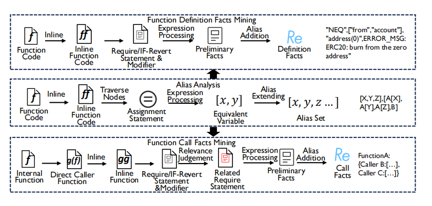
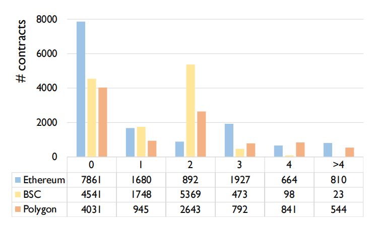

# 使用我的函数就应遵循我的检查：理解并检测智能合约中的不安全 OpenZeppelin 代码

## 摘要

OpenZeppelin 是一种在构建智能合约时广受欢迎的框架。它提供了诸如 SafeMath 之类的常用库、以太坊标准（如 ERC20）实现，以及用于访问控制和可升级性的可复用组件。然而，与传统软件库通常以静态链接或动态加载方式被引入不同，OpenZeppelin 在 Solidity 合约中是以**源代码**形式使用的。因此，开发者往往会对各自拷贝的 OpenZeppelin 代码进行定制化修改，这可能产生意料之外的安全后果。

在本文中，我们首次对**现实世界合约中 OpenZeppelin 代码的安全性**进行了系统化研究。我们特别关注官方 OpenZeppelin 库中的安全检查，并检验这些检查在真实合约的相关 OpenZeppelin 函数中是否得到忠实执行。为此，我们提出了新工具 **ZepScope**，由两大组件组成：**MINER** 和 **CHECKER**。首先，**MINER** 分析官方 OpenZeppelin 函数，提取**显式检查**（即函数内部定义的检查）与**隐式检查**（即调用函数时应满足的条件）之事实。随后，基于 MINER 提取的事实，**CHECKER** 在真实合约中定位 OpenZeppelin 函数，将其检查与事实进行匹配，并验证不一致检查所带来的后果。通过克服开发 ZepScope 的多项挑战，我们不仅构建了**首个 OpenZeppelin 检查分类体系**，还对来自三条主流区块链的 **35 882 份热门合约**进行了全面检查并给出了结果。

## 1 引言

智能合约 [9]——即运行在区块链上的软件程序——近年来迅速崛起，被广泛应用于去中心化金融（DeFi） [54]、非同质化代币（NFT） [25]等场景。鉴于区块链的不可变特性，一旦部署，智能合约就无法修改，并将在平台存续期间持续生效。这意味着任何漏洞都无法在不重新部署新版合约的情况下得到修复。智能合约中的安全缺陷可能导致巨额经济损失；2023 年发生的 *insufficient_check* 攻击便造成了 700 万美元损失 [2]。因此，在部署前确保智能合约安全至关重要。

为促进代码标准化并缓解安全问题，OpenZeppelin [15] 提供了诸如 SafeMath 等通用库、ERC20 [6] 等以太坊标准实现，以及访问控制和可升级性的可复用组件。一项研究 [34] 表明，36.3 %的已验证合约使用了 OpenZeppelin 代码。与传统编程环境通过静态或动态链接导入库不同，Solidity 中的 OpenZeppelin 通常以**克隆源码**的方式嵌入合约。开发者还可能对这些拷贝代码进行修改或嵌入自定义逻辑，从而产生意想不到的安全后果并带来重大财务风险 [18, 19]。

本文旨在系统性地研究真实世界合约中 OpenZeppelin 代码的安全性。我们聚焦于官方 OpenZeppelin 函数的两类安全检查，并检验它们在实际合约相关函数中是否得到忠实执行：一类是显式检查，即函数本体及其被调用函数中的 require 和 modifier 语句；另一类是隐式检查，即调用函数时需满足的前置条件（如调用内部 OpenZeppelin 函数时的默认角色检查）。为审查这些检查，我们提出了新工具 **ZepScope**，由 **Miner** 与 **Checker** 两个组件组成。

**Miner** 负责分析完整的 OpenZeppelin 库，以提取显式定义检查与隐式调用检查的事实。在此过程中，它克服了两大挑战：(i) 通过过程间别名分析应对检查事实在调用链中以多种形式出现的问题；(ii) 综合代码上下文与数据流信息，为可能交织在单个调用函数中的不同调用检查事实判定相关性。运行 Miner 后，我们获得了 1 435 条 OpenZeppelin 检查事实，并将其整理为包含四大类别、三级严重度的分类体系，详见 §4.6。

基于 Miner 提取的事实，**Checker** 在真实合约中检测不安全的 OpenZeppelin 代码。具体而言，Checker 首先依据函数签名与合约结构信息识别目标 OpenZeppelin 类函数，然后从中提取三类检查：require、if‑revert 以及 modifier 检查。随后，Checker 通过自定义相似度度量将提取到的代码检查与 OpenZeppelin 检查事实进行匹配，并验证潜在不安全代码的安全后果，判断攻击者是否可实际利用。

为全面评估 ZepScope 的有效性与实用性，我们同时进行了基准实验与大规模实验。在包含 51 个真实安全漏洞的基准实验中，我们将 ZepScope 的基于事实检测方法与三款最新 SOTA 工具 [27, 28, 31] 的基于模式检测方法进行比较（详见 §6.1）。结果表明，ZepScope 在检测与 OpenZeppelin 检查相关的漏洞类型上显著优于现有工具，这归功于其对 OpenZeppelin 检查事实的深入理解与利用。

在针对三条主流以太坊兼容链、共 35 882 份合约的大规模实验中，我们评估了 ZepScope 的准确性与性能。ZepScope 共分析 2 750 165 个函数，标记出 47 431 个可能包含不安全 OpenZeppelin 代码的函数，平均每份合约仅产生约 1 条告警，便于现实场景下的人工审查（其中 39 225 条为缺失零地址检查等低级告警）。由于缺乏完整的真实标签，我们随机抽取每条链各 100 条告警进行人工核查，共 300 条告警中 31 条为误报，整体准确率达 89.67%。此外，ZepScope 人均分析时间为 42.39 秒/合约，证明了其适用于大规模链上扫描。

大规模实验还揭示了四项重要安全发现。首先，在过滤并人工审查与角色检查相关的高层级告警后，我们确认了 15 个新漏洞。其次，我们发现 OpenZeppelin 相关代码普遍缺失零地址检查，共 22 448 个函数存在此问题；尽管这不会直接触发漏洞，我们在 §6.3 中提出了威胁模型，说明该疏忽可被利用进行有效钓鱼攻击。第三，我们在 BSC 链上发现了一场涉及 255 份合约的有趣活动，其特意放宽 OpenZeppelin 检查以满足自身逻辑。最后，我们探讨了三条链之间 OpenZeppelin 安全检查的差异；详见 §6.4。

**Availability.** 我们已在 https://zepscope.github.io/ 公开了代码、数据集及全部评估结果。

## 2 背景

### 2.1 面向智能合约的 OpenZeppelin

OpenZeppelin [15] 是构建安全智能合约最流行的软件包之一。它汇集了一套高质量、可复用的智能合约，可用于在以太坊上构建去中心化应用（DApp）和协议。例如，OpenZeppelin 提供了 ERC20 [6] 用于同质化代币、ERC721 [7] 用于非同质化代币，以及 ERC777 [8] 用于高级代币等实现。这些库持续演进并更新，以加入新特性并修复安全问题。OpenZeppelin 中的智能合约采用 Solidity 编写，库中还包含接口、抽象类以及虚函数，开发者可根据自身需求进行修改和实现。此外，OpenZeppelin 为每个 API 制定了一组要求，说明如何避免常见安全漏洞（如访问控制问题以及算术溢出或下溢），这些漏洞可能导致用户资产损失。然而，并非所有开发者都会遵循这些要求，这导致其智能合约出现安全漏洞 [18, 19]。

### 2.2 一个激励性示例

下面借助 Code4rena 审计报告中的一个真实漏洞 [1]，说明 OpenZeppelin 在名为 NFTX 的合约中如何被误用。Figure 6 展示了 OpenZeppelin 中 ERC20FlashMint 的原始 `flashLoan` 函数，而 Figure 1 则给出了 NFTX 中的易受攻击版本，它实现了 OpenZeppelin `flashLoan` 的简化版（具体来说省略了 `flashFeeReceiver`）。在 ERC20FlashMint 的 `flashLoan` 函数中，第 7 行通过金额检查将 `amount` 严格限制在 `maxFlashLoan(token)` 以下，确保 `amount + fee` 不会溢出。然而，NFTX 的 `flashLoan` 函数缺乏此检查，允许消息发送者任意指定 `amount`。攻击者可在第 10 行构造需铸造的 `amount`，导致 `amount + fee` 溢出为极小值甚至 0（从而绕过第 13 行的检查），间接使得能够铸造大量代币，而仅有少量在第 15 行被销毁。尽管 Solidity 0.8.0 及以上版本已内置算术溢出检查，NFTX 仍运行在 Solidity 0.6.8，因此仍易受此类攻击。

```solidity
1  function flashLoan(
2      IERC3156FlashBorrowerUpgradeable receiver,
3      address token,
4      uint256 amount,
5      bytes memory data
6  ) public virtual override returns (bool) {
7      // 漏洞点：缺少原 OpenZeppelin 库（图 6 第 7 行）的金额检查
8      uint256 fee = flashFee(token, amount);
9      _mint(address(receiver), amount);
10     require(receiver.onFlashLoan(msg.sender,
11         token, amount, fee, data) ==
12         RETURN_VALUE, "ERC20FlashMint: invalid return value");
13     uint256 currentAllowance = allowance(
14         address(receiver), address(this));
15     require(currentAllowance >= amount + fee,
16         "ERC20FlashMint: allowance does not allow refund");
17     _approve(address(receiver), address(this),
18         currentAllowance - amount - fee);
19     _burn(address(receiver), amount + fee);
20     return true;
21 }
```

<p style="text-align:center">Figure 1: NFTX 中存在漏洞的 flashLoan 函数。</p>

## 3 ZepScope 概述

<p style="text-align:center"></p>

<p style="text-align:center">Figure 2：ZepScope 的工作流</p>

在本节中，我们概述 ZepScope——首个旨在提取 OpenZeppelin 事实并检测其在智能合约中违规使用情况的工具。如 Figure 2 所示，ZepScope 由两个组件构成：**MINER** 和 **CHECKER**。其中，MINER 负责从官方 OpenZeppelin 库中挖掘检查事实，而 CHECKER 则基于 MINER 提取的事实，在真实合约中检测不安全的 OpenZeppelin 代码。ZepScope 的工作流程包括三个主要阶段：

**首先**，我们从官方代码库收集 OpenZeppelin 源码。本研究启动时，采用的是最新可用版本 4.9.3。

**其次**，在一次性的离线分析过程中，MINER 对 OpenZeppelin 库进行解析，提取两类与函数检查相关的事实：其一称为 *Function Definition Facts*（函数定义事实），其二称为 *Function Call Facts*（函数调用事实）。在 MINER 提取完两类检查之后，为提升事实的准确性与相关性，我们对其进行了人工复核，并在此基础上提出了 OpenZeppelin 检查的分类体系。

**第三**，在在线分析阶段，CHECKER 在真实合约中检测不安全的 OpenZeppelin 代码。具体而言，CHECKER 首先在合约内识别目标函数，然后依据 MINER 提取的事实，检验这些目标函数是否包含不安全的 OpenZeppelin 代码。CHECKER 还通过验证潜在不安全代码能否被攻击者利用，来评估其安全后果。

接下来，我们将在 **§4** 和 **§5** 分别介绍 MINER 与 CHECKER 的详细设计。

## 4 挖掘 OpenZeppelin 函数检查

### 4.1 提取事实的挑战

如 §3 所述，关于 OpenZeppelin 函数检查共有两类事实：**定义检查事实**，记为 $Fact_{Def}$；**调用检查事实**，记为 $Fact_{Call}$。在不牺牲清晰度的前提下，我们用下列形式来表达这些事实

```
Func_caller{check_caller; Func_target();}
Func_target{check_target; Func_callee();}
Func_callee{check_callee; Operation;}
```

对于给定目标函数 $Func_{target}$，其 $Fact_{Def}$ 被定义为 $check_{target}+check_{callee}$，而 $Fact_{Call}$ 则由 $check_{caller}$ 表示。需要注意的是，在 $Fact_{Call}$ 的场景中，显式的 $check_{caller}$ 可能不存在；对于 `internal` 函数，它往往体现为隐式的 *owner* 检查。更多细节见 §4.4。

尽管定义看似直接，实际抽取事实却颇具复杂性。具体来说，**MINER** 需要解决以下两大挑战：

**C1：$Fact_{Def}$ 可在完整调用链上以多种形式出现。**
例如，Figure 4 中展示了 `transfer` 函数的 $Fact_{Def}$ 位于被调函数 `_transfer` 内；第 11 行最初的事实形态为

```
["GTE", "fromBalance", "amount", "ERC20: transfer amount exceeds balance"]
```

然而，它无法与 Figure 5 中第 4 行提取的检查

```
["GTE", "balance", "value", "AnyswapV6ERC20: transfer amount exceeds balance"]
```

直接匹配。实际上，事实与检查都必须沿调用链向上传播，以获得其它形态，最终才可彼此对应。相关细节见 §4.2 与 §4.3。

**C2：不同的 $Fact_{Call}$ 可能交织在同一调用方函数中，难以区分。**
假设调用方函数形式为

```
Func_caller{check_a; Func_a(); check_b; Func_b();}
```

通常可以判定 $check_a$ 对应 $Func_a$，$check_b$ 对应 $Func_b$；但要进一步确认 $check_a$ 是否也与 $Func_b$ 相关，则更具挑战性。我们将在 §4.4 中详细讨论。

<p style="text-align:center"></p>

<p style="text-align:center">Figure 3：一个详细的 MINER 工作流</p>

为应对这些挑战，我们为 **MINER** 设计了如 Figure 3 所示的新流程。首先，MINER 借助 Slither [28] 为完整的 OpenZeppelin 库构建调用图。在此过程中，我们关注多种调用类型，包括 `internal` 调用、高层 API 调用、库调用以及诸如 `abi.encodeWithSignature` 之类的低级调用。随后，MINER 执行跨过程别名分析，提取 $Fact_{Def}$ 与 $Fact_{Call}$，并对抽取的事实进行统一。后续子节将对这些步骤进行详细介绍。

### 4.2 跨过程别名分析（Inter-procedural Alias Analysis）

为解决 **C1**，我们对整个 OpenZeppelin 库执行跨过程别名分析。如 Figure 3 所示，该别名分析同时服务于两个事实抽取模块，使它们能够专注于当前检查本身，而不必担心检查形式的差异。

```solidity
1  function transfer(address to, uint256 amount)
2      public virtual override returns (bool) {
3          address owner = _msgSender();
4          _transfer(owner, to, amount);
5          return true;
6  }
7  function _transfer(address from, address to,
8      uint256 amount) internal virtual {
9      require(from != address(0), "ERC20:
10             transfer from the zero address");
11     require(to   != address(0), "ERC20:
12             transfer to the zero address");
13     uint256 fromBalance = _balances[from];
14     require(fromBalance >= amount, "ERC20:
15             transfer amount exceeds balance");
16     ...
17 }
```

<p style="text-align:center">Figure 4：OpenZeppelin 库中的 transfer 与 _transfer 函数</p>

基于 Slither 构建的调用图，**MINER** 首先将 OpenZeppelin 库中的函数调用进行内联。随后，它遍历每个函数的节点；对每一次函数调用，都会将调用方函数节点加入遍历集合。接着，**MINER** 遍历集合中的赋值语句，将赋值表达式两侧的变量记录为等价变量对。对于右值（*rvalue*）表达式，**MINER** 仅记录经过字符串化（stringified）的表达式，因为此类表达式即便被进一步处理也不会影响等价变量集合。由此可获得成对的等价变量，例如 Figure 4 中的 `fromBalance` 与 `_balances[from]`。

```solidity
1  function transfer(address to, uint256 value)
2      external override returns (bool) {
3      require(to != address(0) && to != address(
4              this));
5      uint256 balance = balanceOf[msg.sender];
6      require(balance >= value,
7              "AnyswapV6ERC20:
8               transfer amount exceeds balance");
9      balanceOf[msg.sender] = balance - value;
10     balanceOf[to]        += value;
11     emit Transfer(msg.sender, to, value);
12     return true;
13 }
```

<p style="text-align:center">Figure 5：某合约中示例性的 transfer 函数</p>

此外，我们将别名分析从语句级扩展到过程级。例如，根据跨过程别名分析，第 3 行中的变量 `owner` 与函数 `_transfer` 的参数 `from` 等价。我们的别名分析还会在共享同一变量的不同行集合之间传播别名关系，如集合 `{fromBalance, _balances[from]}` 与集合 `{from, owner}` 之间的传播。结果表明，`fromBalance` 亦等价于 `_balances[owner]`，进而等价于 `_balances[owner]`、`_balances[_msgSender()]` 与 `_balances[msg.sender]`。这样，$Fact_{Def}$ 中的 `_balances[msg.sender]` 部分即可与 Figure 5 提取的检查中的 `balanceOf[msg.sender]` 高度匹配，从而解决 **C1**。

需要注意的是，当子串（如 `_balances[from]` 中的 `from`）被方括号等特殊符号包围时，我们会用变量本身替换该子串；在其他情况下，我们将其视为变量名的巧合重复而非等价。此外，为区分同一合约中重名的变量，我们还采用静态单赋值（SSA）命名与函数名进行区分。最终，经过递归扩展直至不再产生新的等价变量，我们得到等价变量的最终集合。

### 4.3 提取函数定义事实（Extracting Function Definition Facts）

借助 **§4.2** 的别名分析，$Fact_{Def}$ 的抽取可以专注于单独的 `require`、`if-revert` 与 `modifier` 语句；其他形式的事实则根据别名分析补充。如 Figure 3 所示，**MINER** 首先内联所有包含 $Fact_{Def}$ 的函数调用，然后遍历函数节点，对上述三类语句进行分析。

**表达式处理（Expression Processing）**

- **`require` 语句**：对其条件表达式递归处理，遵循以下规则：
   (i) 若表达式为 **AND**，将其拆分为两个**必要**检查；
   (ii) 若表达式为 **OR**，拆分为两个**等价**检查；
   (iii) 若表达式为二元运算，则以先序遍历方式记录字符串化节点；
   (iv) 若表达式为函数调用，记录字符串化节点及被调函数的返回值（前提是该返回值为全局变量、状态变量或常量）；
   (v) 其他情形下，继续字符串化节点并递归处理子表达式。

  同时，我们将 `require` 的错误信息作为检查事实的一部分，因为特定错误消息有助于判定检查类型。例如，Figure 4 第 11 行 `require` 语句对应的事实即
   "GTE","fromBalance","amount","ERC20:transferamountexceedsbalance""GTE", "fromBalance", "amount", "ERC20: transfer amount exceeds balance""GTE","fromBalance","amount","ERC20:transferamountexceedsbalance"。

- **`if-revert` 语句**：首先定位其对应的 `if` 表达式，然后按 `require` 处理规则抽取部分检查事实。但需根据逻辑方向进行调整：

  - 若 `revert` 出现在 `if` 或 `else if` 条件中，则因与 `require` 逻辑相反，需要**取反**已抽取的表达式；
  - 若 `revert` 出现在 `else` 分支，则保持原抽取逻辑。
     由于 `if-revert` 无错误信息，我们以 `revert` 本身的字符串化节点补足该字段。

- **`modifier` 语句**：不仅处理 `modifier` 内部的 `require` 语句，也记录 `modifier` 及其参数的字符串化节点。最终，每个函数得到一份原始检查事实列表，形式为 $[s_1, s_2, s_3, \dots , s_n]$，其中 $s_i$ 可为字符串，也可为包含等价元素的列表。

**别名补充（Alias Addition）**
对所有已抽取的事实，利用 **§4.2** 获得的等价变量进行扩展：若事实本身或其子串包含等价变量，按照早前方法直接扩展列表，并用等价变量替换子串后再次扩展。此外，我们将参数与其类型及出现顺序关联，并加入事实列表。至此，便得到基于 `require` 与 `modifier` 语句的最终检查事实集合。

### 4.4 提取函数调用事实（Extracting Function Call Facts）

为抽取 $Fact_{Call}$，我们将 $Func_{target}$ 限定为 OpenZeppelin 中 **internal** 级别的函数；因为 **public** 与 **external** 函数本就可被任何人调用，其安全性已可由前述 $Fact_{Def}$ 保证。例如，OpenZeppelin 的内部函数 `_transferOwnership` 设计上只应在合约内部被调用，意味着调用者必为合约所有者。若某个 **public** 函数在毫无限制的情况下调用该内部函数，则任何人都可触发 `_transferOwnership`，可能导致不可预测的后果。因而必须额外提取**函数调用检查事实**以避免此类违规。

与函数定义检查事实的抽取不同，首先需识别所有 **internal** 函数作为目标函数。随后，对先前构建的调用图进行反向遍历，并自每个目标函数出发深度优先搜索，找到首次调用该目标函数的 **public** 或 **external** 函数。每发现一个调用方函数，便视为一个**场景**并分别抽取其调用事实。因此，同一内部函数可能对应来自多个场景（即不同调用方函数）的 $Fact_{Call}$。

如 Figure 3 所示，我们先将调用方函数内联，然后遍历其节点以寻找 `require` 与 `modifier` 语句。接着按 **§4.3** 中相同规则递归处理这些语句的表达式，并添加变量别名。最终便获得针对内部函数调用方的检查事实。需要指出的是，我们也记录**空检查事实**，以表明在该场景下被调函数无需任何检查。

**相关性判定（Relevance Judgement）**
 本节面临的显著挑战即 **§4.1** 中的 **C2**：一个调用方函数可能包含多个被调函数。为区分不同被调函数对应的检查，我们对每条语句执行相关性判定：

- 若语句位于**两个函数调用之间**，则视为与后一个被调函数相关；
- 若语句之前**不存在函数调用**，视为与其最近的被调函数相关；
- 进一步地，若语句中的变量亦与某次函数调用相关（将语句中的变量视为“源”、函数调用中的变量视为“汇”，若存在数据流，则判定相关），同样认为该语句与该函数调用相关。

```solidity
1  function flashLoan(
2      IERC3156FlashBorrower receiver,
3      address token,
4      uint256 amount,
5      bytes calldata data
6  ) public virtual override returns (bool) {
7      require(amount <= maxFlashLoan(token),
8              "ERC20FlashMint: amount exceeds
9               maxFlashLoan");
10     uint256 fee = flashFee(token, amount);
11     _mint(address(receiver), amount);
12     require(
13         receiver.onFlashLoan(msg.sender, token,
14                             amount, fee, data) ==
15         _RETURN_VALUE,
16         "ERC20FlashMint: invalid return value"
17     );
18     address flashFeeReceiver =
19         _flashFeeReceiver();
20     _spendAllowance(address(receiver), address(
21         this), amount + fee);
22     ...
23 }
```

<p style="text-align:center">Figure 6：OpenZeppelin 中的 flashLoan 函数</p>

例如 Figure 6 所示，OpenZeppelin 的 `flashLoan` 函数用于向借款方发放代币，其中在第 9 行调用 `_mint` 铸币。此外，`flashLoan` 还调用 `_flashFeeReceiver`、`_spendAllowance` 等函数。因此，需要判断各 `require` 语句的相关性：

- 第 7 行的 `require` 位于首次函数调用 `_mint` 之前，故按规则视为与第 9 行 `_mint` 调用相关；
- 第 10 行的 `require` 中变量 `receiver` 与 `amount` 与 `_mint(receiver, amount)` 的形参与参数一致，因此同样与 `_mint` 调用相关。

由此，在 `flashLoan` 场景下，`_mint` 函数拥有两条调用检查。

### 4.5 统一事实并进行微调（Unifying Facts and Minor Adjustments）

为进一步提升检查事实的**准确性**与**简洁性**，我们对已抽取的事实进行统一化处理，因为其中部分 OpenZeppelin 检查事实存在重复或无必要的情况。

首先，我们**消除函数内部的重复检查**。在某些场景下，同一项检查会因调用链中既包含调用方又包含被调方的检查事实而被重复捕获。

其次，当等价变量追踪结果表明某些变量与 `msg.sender` 或其他常量等价时，我们即可判断相关检查是否必然满足。例如，若某条检查要求变量 `owner` 不可为 $address(0)$，而别名分析又证明 `owner` 与 `msg.sender` 等价，则由于 `msg.sender` 始终非零地址，该检查显然已被满足，因此可将其从事实列表中移除。

第三，我们对剩余事实进行**细粒度调整**以提升表达的准确性与简洁度。具体而言，删除函数级别冗余的调用检查，例如对 `_msgSender()` 函数抽取到的调用事实——该函数在调用前本就不需要任何安全检查。

经过上述步骤，我们最终得到**统一且精炼**的 OpenZeppelin 检查事实集合。

### 4.6 以分类体系理解检查事实（Understanding Facts as A Taxonomy）

在介绍了 **MINER** 的方法（§4.1–§4.5）后，本节给出将 **MINER** 应用于 OpenZeppelin 库所得到的结果。我们将这些结果整理为一个 *OpenZeppelin 检查事实分类体系*——据我们所知，这是首次给出此类发现。同时，正如 §4.4 所述，$Fact_{Call}$ 会因为不同调用方函数而呈现出不同情境（*scenarios*），因此我们也对提取出的 $Fact_{Call}$ 进行了情境分析。

经 **MINER** 自动抽取并人工复核，我们共获得 1 435 条检查事实，可划分为四大类：**Address Compliance Assurance**、**Access Control**、**Overflow/Underflow Check** 及 **Timestamp or State Check**。

① **Address Compliance Assurance.** 地址合规性是 OpenZeppelin 代码中确保交易成功的常见检查，共包含四种子检查：*address(0) 检查*（防止向 $address(0)$ 转账）、*existence 检查*（验证地址是否在合约中存在）、*logic setup 检查*（确保目标地址的逻辑实现正确），以及 *contract address 检查*（确认某地址是否为合约地址）。这些检查主要出现在函数定义事实中。

② **Access Control.** 访问控制是另一类核心检查，用以验证权限、阻止未经授权的经济损失。例如，`Ownable` 合约中的 `transferOwnership` 利用 `Ownable` 修饰符简化了权限检查。OpenZeppelin 库共包含六种访问控制检查：`onlyOwner`、`onlyGovernance`、`onlyProxy`、`onlyCrossChainSender`、`onlyRoleOrOpenRole` 与 `onlyRole for admin roles`。每类检查均针对特定权限角色，例如 `onlyGovernance` 检查调用者是否为治理账户，而 `onlyProxy` 检查调用者是否为合约代理。

③ **Overflow/Underflow Check.** 该类检查防止智能合约中的算术溢出/下溢。在 OpenZeppelin 库中，主要有三种子检查：`maxType` 检查、`balance` 检查与 `allowance` 检查。`maxType` 检查保证数值不会超过（或低于）变量类型允许的最大（或最小）值；`balance` 检查验证余额是否充足；`allowance` 检查确保调用者拥有执行交易所需的授权额度。溢出/下溢检查更多地出现在函数定义事实中。

④ **Timestamp or State Check.** 此类检查多见于与时间相关的场景，如截止时间、提案操作、交易取消或暂停等，通常由当前的时间戳或合约状态严格决定。例如，执行 *unpause* 操作前必须保证合约处于暂停状态。此类检查更常见于函数定义事实。

**Severity Analysis.** 并非所有已识别的检查都会导致严重后果，对其按严重性划分有助于整体把握 OpenZeppelin 事实，并在修复时进行优先级排序。我们将潜在攻击影响与分类相结合，得到三种严重级别：

- **高危（high-level）**：例如 *Timestamp or State Check* 中若取消了关键签名有效期检查 `require(block.timestamp <= expiry, "Votes: signature expired")`，直接影响合约安全；
- **中危（medium-level）**：例如 *Address Compliance Assurance* 中缺失“合约地址”检查会导致合约瘫痪并可能造成资金损失；
- **低危（low-level）**：例如缺失“零地址”检查通常属于低级失误。

最终，我们得到 277 条高危、858 条中危、300 条低危检查事实。

**Scenario Analysis.** 四大类检查中，**Access Control** 的情境最为丰富：

1. **关系型约束函数**——如 `transferOwnership`，其权限检查是必需的，因为此类函数应由合约所有者调用并关乎合约本身。
2. **资产流转相关函数**——如与贷款机制或隐式检查相关的函数，有时不需要显式权限检查。例如，若 `_mint` 被 **public** 函数调用，我们必须检查调用者权限；但若被 `flashLoan` 调用，则不需检查，因为 `flashLoan` 内置了还款机制。
3. **使用 `msg.sender` 作为参数的函数**，意味着函数内部隐含了身份检查。例如，`transfer` 直接使用 `msg.sender` 转移其余额，故不必额外检查调用者权限。为覆盖这类隐式检查，我们在提取调用事实时，若函数以 `msg.sender` 为参数，也将其视作调用方事实的一部分。

## 5 Detecting Insecure OpenZeppelin Code in Smart Contracts

<p style="text-align:center"></p>

<p style="text-align:center">Figure 7：CHECKER 的细节</p>

Figure 7 展示了 **CHECKER** 的高层工作流程，该流程包含四个主要组件：1) 识别目标函数，2) 在目标函数中提取检查语句，3) 将提取到的代码检查与既有事实进行匹配，以及 4) 验证潜在不安全代码的安全后果。接下来的小节将对这些组件逐一展开说明。

### 5.1 目标函数识别

识别合约中的目标函数是首要步骤，但这一任务并不容易完成。原因在于，开发者往往**不会**通过 `import` 语句直接使用 OpenZeppelin 库，而是将其源码复制到自己的合约中。在此过程中，他们可能会**重命名**合约名、函数名和参数名，甚至**修改**函数内部的逻辑。此外，即便拷贝的是官方仓库中的源码，OpenZeppelin 也存在**多个版本**可选。因此，要在保持覆盖率的同时**准确定位**合约内的目标函数极具挑战性。在当前 **CHECKER** 原型中，我们提出了两种方法来识别目标函数。

**合同名称包含的标识**
 该方法基于函数的**完整签名**（包括合约名、函数名、参数类型以及返回值类型）来匹配目标函数。只要完整签名一致，我们即将该函数视为目标函数。需要注意的是，在匹配过程中**不考虑参数变量名**，仅匹配其**类型名**。若合约从父合约继承而来、或作为同一标准的替代实现（如 *ERC20Burnable*、*ERC20Mintable*），在原始合约名无法匹配时，我们会尝试用**标准名**（即 *ERC20*）进行匹配。

进一步地，我们在函数名与参数类型上进行**细化匹配**。仍需保证合约名或其父合约名与我们的事实一致；一旦匹配成功，忽略大小写与下划线差异后，对比函数名，再对比参数类型。我们允许**参数顺序**与**类型名后缀**存在差异。例如，若参数类型为 `IERC3156FlashBorrower`（Figure 6）与 `IERC3156FlashBorrowerUpgradeable`（Figure 1），依旧视为匹配。此细化策略可处理函数名和参数类型略有修改的情形。

**基于多功能的识别**
 由于同一函数签名可能出现在多个 OpenZeppelin 合约中，仅凭“函数名 + 参数类型 + 返回类型”不足以确定其来源。为溯源此类**歧义函数**，我们引入多函数匹配法：

1. 首先在合约内匹配函数签名，并统计匹配数量。
2. 若数量**不少于预设阈值**（本文设为 3），则将该合约内所有匹配函数均视为目标函数。
3. 针对不同标准合约间的签名冲突（如开发者为 *ERC20* 引入一组与其他标准合约相同的函数），我们对这些**标准合约**的匹配函数进行过滤。
4. 最后，再次执行前述细化匹配，以函数名与参数进一步提升多函数匹配的精度。

### **5.2 在目标函数中提取检查**

在识别出目标函数后，下一步是**抽取其内部的安全检查**。对于每个目标函数，我们需要获取两组信息：一是任意场景下的 *function definition facts*，二是跨场景的 *function call facts*。然而，与在 OpenZeppelin 库内部抽取不同的是，这里只需在**调用方函数**中提取代码检查即可，因为内联后的调用方函数已经包含了目标函数本身。因此，我们的目标是找到包含目标函数的调用链中**首个 `public` 或 `external`** 函数，作为该调用链的入口。

与 §4.4 描述的流程类似，CHECKER 会先构建调用图，将图反向遍历以收集合约内全部 `public`/`external` 函数，再内联调用方函数以便后续分析。本节的检查抽取与 OpenZeppelin 库中的略有差异：对于每个调用方函数，我们专注于三类检查——`require`、`if-revert` 和 `modifier`。

------

**Require 检查**
 在 `require` 语句中，我们首先关注其**条件表达式**，并按逻辑运算符 `&&` 或 `||` 将其拆分为若干独立检查，然后采用递归先序遍历方式抽取检查。若表达式尾节点是函数调用且返回值为状态变量、全局变量或常量，则记录该节点的字符串化形式和返回值；否则仅记录字符串化节点。检查完条件表达式后：

- 若语句包含错误信息参数，则将其记录为检查末尾的错误消息；
- 若不存在错误信息参数，则记录 *“no error message”*。

对于已拆分的每条子检查，若继承自父级检查，则沿用父级错误消息。

**If-Revert 检查**
 除 `require` 外，另一个不安全场景是 *If-Revert*。开发者可能在 `if` 语句内评估条件并在满足时调用 `revert` 抛出错误。此时同样需要抽取检查，流程与 `require` 类似：按照逻辑运算符拆分并递归遍历。但由于 `if-revert` 的逻辑与 `require` **相反**，需在抽取后**取反**逻辑。当 `revert` 无错误信息参数时，只记录其字符串化节点。

**Modifier 检查**
 由于我们已内联调用方函数并从中抽取了 `require` 与 `if-revert`，理论上无需再单独处理 `modifier`。然而，为避免因代码转换导致的误报，CHECKER 仍将整个 `modifier` 视作一条检查并在后续步骤中进行匹配。

对上述三类语句抽取到的所有检查，CHECKER 还需执行 **跨过程别名分析** 并按 §4.2 描述的方法进行参数归并与扩展。最终，我们得到了与 §4 中格式一致的调用方函数检查集，为后续匹配做好准备。

### **5.3 将代码检查与事实相匹配**

接下来，我们将提取出的代码检查与从 OpenZeppelin 库挖掘的事实进行比对。针对目标函数的每一个**调用方函数**，我们分别把代码检查与其**函数定义事实**以及**各调用场景的调用事实**进行比较。如 Figure 7 所示，整个匹配流程分为三步：先匹配**错误信息**，再匹配**检查内容**，最后处理**空事实场景**。

#### 5.3.1 Matching Error Messages

错误信息（例如 “ERC20: transfer amount exceeds balance”）通常直接揭示检查条目的含义，因此能够帮助区分不同类型的检查。基于此，我们首先尝试将**提取到的错误信息**与来自 OpenZeppelin 的事实中的错误信息进行匹配。当错误信息中包含合约名前缀（如 “ERC20:”）时，我们会先将该前缀替换为通用占位符 “:”。随后，采用语义匹配的方法比较二者。具体流程如下：

1. **分词与向量化**
    我们先将两条错误信息分别分词，并使用 Word2Vec [42] 嵌入模型将每个词映射到 $d$ 维向量空间；然后求词向量的平均值，得到句级表示 $V_{M_i}$。
2. **相似度计算**
    采用 Word Mover’s Distance (WMD) [37] 评估两条句子表示 $V_{M_1}$ 与 $V_{M_2}$ 的语义距离。设 $M_1$、$M_2$ 为两条待比较的错误信息，每条信息 $M_i$（$i\in{1,2}$）含 $n_i$ 个词，表示为 $M_i={w_{i1},w_{i2},\dots,w_{in_i}}$。每个词 $w_{ij}$ 被映射为向量 $v_{ij}\in\mathbb R^{d}$ 。WMD 相似度 $sim(M_1,M_2)$ 计算公式为

$$
sim(M_1,M_2)=1-\min_{T\ge0}\sum_{i,j=1}^{n}T_{ij}\cdot c(i,j)\tag{1}
$$

其中 $T$ 为传输矩阵，$T_{ij}$ 表示将第 $i$ 个词的“质量”传输到第 $j$ 个词的量；$c(i,j)$ 为两词向量的欧氏距离。

1. **阈值过滤**
   为保证匹配的**保守性**并降低误报，我们为 WMD 相似度设定阈值 $T_{error}$。综合多组实验（§C.1 中对阈值 0.8 与 0.9 的对比），最终取 $T_{error}=0.9$。若两条错误信息的 $sim(M_1,M_2)\ge T_{error}$，则直接判定该检查已匹配；否则进入下一步进行**无错误信息**的进一步匹配。

通过以上步骤，我们即可在大多数情况下精确比对错误信息；对于 §5.3.2 所述的其余未匹配情形，将继续采用更细粒度的检查内容匹配策略。

#### 5.3.2 Matching the Checks

接下来，我们在**不考虑错误信息**的情况下匹配检查项。正如前文所述，提取出的检查及事实均表示为列表 $[s_1,s_2,s_3,\dots,s_n]$，其中 $s_i$ 可能是一个字符串，也可能是由若干等价元素组成的列表。匹配流程如下：

1. **逐元素匹配**
    依次比较 $s_{i,\text{extracted}}$ 与 $s_{i,\text{fact}}$：

   - 若两者均为字符串，则以**编辑距离**计算相似度
     $$
     \text{Similarity}=1-    \frac{edit(s_{i,\text{extracted}},s_{i,\text{fact}})}         {\min\{\lvert s_{i,\text{extracted}}\rvert,               \lvert s_{i,\text{fact}}\rvert\}}  \tag{2}
     $$
     其中 $edit(\cdot)$ 表示两字符串的编辑距离。

   - 若一方是另一方的**子串**，相似度视为 1。

   - 若 $s_{i,\text{extracted}}$ 或 $s_{i,\text{fact}}$ 为列表，则取列表元素与字符串（或另一列表）之间的**最大**相似度作为该元素的匹配度。

2. **阈值过滤**
    设阈值 $T_s$，当单个元素相似度 $\ge T_s$ 即判定匹配；否则继续尝试下一个元素。通过 §C.1 的实验对比，我们将 $T_s$ 设为 0.6。

3. **结构化相似度计算**
    在获得各元素相似度后，为避免传统 NLP 方法忽视检查结构，我们提出 **structured similarity matching**：

   - 用符号（如 “<”, “>”, “==” 等）将匹配单元划分为 *units*；
   - 对每类相似单元进行多数投票，与总单元数比较，得到整体相似度；
   - 对符号元素，视为等价单元（§5.4 将给出等价表）。

4. **动态因子**
    采用动态因素 $F$ 作为整体匹配门限
   $$
   F=\frac{\text{unit\_number}(S)}{2}+1  \tag{3}
   $$
   其中 $S$ 为提取到的事实。当两检查项中相似单元数量 $\ge F$ 时，判定为匹配。若某函数调用事实对应**多个场景**，则在该场景下达到动态因子即可视为匹配。§C.2 的实验表明，动态因子优于固定门限。

#### 5.3.3 Handling the Scenarios with Empty Facts

在不同场景的函数调用事实中，OpenZeppelin 可能**省略**某些检查，导致出现“空检查”。若直接匹配，任意提取到的检查都可能满足这些空事实，进而产生**遗漏告警**。为解决此问题，我们进一步处理空事实场景：

1. **场景化比较**
    将合约名与函数名按单词拆分，并使用重复词计数方式表示场景之间的相似度。
2. **阈值判定**
    采用式 (3) 计算场景相似度阈值；若检测场景与事实场景的相似度超过阈值，则认为该场景已匹配，并认定该场景**无需检查**。否则，继续执行完整的检查匹配流程。

### 5.4 验证安全后果

上一阶段未能匹配的检查仅表明其**潜在**存在不安全的 OpenZeppelin 代码，因为这些检查可能以显式或隐式方式被其他等价检查覆盖。因此，**CHECKER** 还需进一步验证，以评估其安全后果。本研究聚焦四类验证：**等价溢出保护**、**等价权限**、**额外 `msg.value` 检查**与**逻辑等价条件**。

**Equivalent Overflow Protection（等价溢出保护）**

在 OpenZeppelin 代码中，开发者通常使用显式判断（如

```solidity
require(amount < fromBalance);
```

）避免溢出/下溢；也可能使用隐式判断，例如

```solidity
fromBalance.sub(amount);
```

当 `fromBalance` 小于 `amount` 时 `sub` 函数将 *revert*。此外，自 Solidity 0.8.0 起，编译器已内置整数溢出/下溢检查，开发者无需为每次算术运算手动添加检查。因此，**CHECKER** 需验证等价溢出保护：

1. **确定 Solidity 版本**；若版本 ≥ 0.8.0，则可忽略部分算术检查。
2. 对于包含诸如 `amount < fromAllowance` 之类、同时兼具**溢出检查**与**allowance 检查**的事实，仍需检查函数中与 `allowance` 相关的逻辑，保证调用者有足够额度。
3. 若未发现任何显式检查，再查找隐式检查（例如 `SafeMath` 调用）。
4. 仍缺失时才发出告警。

**Equivalent Permissions（等价权限）**

如 §4.6 所述，权限检查在不同函数间差异较大：

- `ERC721` 的 `safeTransferFrom` 依赖 `_isApprovedOrOwner`;
- `ERC20` 的 `mint` 要求调用者具备 *minter* 角色。
   某些开发者会使用 `onlyOwner` modifier 实现同等效果。为了识别等价权限，**CHECKER** 建立如下**权限层级**：

1. **严格权限**：`onlyOwner` modifier 或 `require(msg.sender == owner)`
2. **次级权限**：`onlyGovernance`、`onlyAdmin` 等以及 `_isApprovedOrOwner`、`isApprovedForAll`
3. **最低权限**：其他次要检查

若检测到上级权限已满足，下级检查可视为冗余。例如，若函数已抽取到 `msg.sender == owner` 检查，则视为已满足 owner 级权限，不再报告缺失。

**Extra `msg.value` Checks（额外 `msg.value` 检查）**

某些合约在函数内部加入额外的 `msg.value` 限制来保护函数免遭任意调用。例如，为方便用户兑换代币，开发者可定义 `buy` 函数：当 `msg.value` 达到指定值时才铸造代币。在此场景下，调用者无需通过 `_mint` 的权限检查，因为 `msg.value` 已充当限制。**CHECKER** 的实现步骤：

1. 先依据事实进行常规权限匹配；
2. 若缺失权限检查，则在调用方函数中查找 `msg.value` 限制；
3. 存在该限制则标记为**已覆盖**，否则报告缺失权限检查。

**Logical Equivalence Conditions（逻辑等价条件）**

事实中二元关系通常格式化为 $[EQ,; \text{variableA},; \text{variableB},; \text{Error Message}]$，表示 *variableA* 必须等于 *variableB*。然而，开发者可能改写为等价形式，如

```solidity
variableA == variableB
```

或

```solidity
variableB <= variableA
```

因此，**CHECKER** 需验证逻辑等价条件：

1. 若事实包含关系运算符，先检查原始形式是否存在；
2. 若缺失，再验证其对偶形式，例如 *greater than* 缺失则检查 *less than*；
3. 仍缺失才发出告警。

## 6  Evaluation

在本节中，我们围绕以下研究问题（RQs），对 ZepScope 的有效性与实用性展开全面评估：

- **RQ1：** ZepScope 的检测效果与当前最先进（SOTA）的静态分析工具相比如何？
- **RQ2：** ZepScope 在大规模真实世界智能合约分析中的准确性与效率表现如何？
- **RQ3：** ZepScope 能否识别出显著的安全发现？
- **RQ4：** 在智能合约的 OpenZeppelin 检查方面，三条主流兼容以太坊链之间主要存在哪些差异？

**Experimental Setup.** 如 §3 所述，ZepScope 由 **MINER** 与 **CHECKER** 两个组件组成。我们在 Slither [28] 框架内实现各组件——该框架是诸多学术工作 [21, 41, 52] 所依赖的基础。ZepScope 在 Slither 的基础上，加入 (i) §4 中针对 OpenZeppelin 函数检查的挖掘方法，以及 (ii) §5 中检测智能合约内不安全 OpenZeppelin 代码的定制分析技术。

为减少合约编译时间，我们将 Slither 的编译阶段（即 crytic-compile [4]）与自动编译器版本选择功能拆分并独立运行。具体做法是**先编译合约，再使用 CHECKER 进行分析**。所有实验均在一台配备 80 vCPU（Intel(R) Xeon(R) Gold 6248 CPU @ 2.50 GHz × 2）与 188 GB RAM 的服务器上完成。

#### 6.1 RQ1：与 SOTA 工具的比较

在本研究问题（RQ1）中，我们将 ZepScope 与若干最先进（SOTA）的静态分析工具进行基准对比，重点关注那些声称可检测 **Access Control** 与 **Overflow/Underflow** 两类漏洞的工具——这两类问题正是使用不当的 OpenZeppelin 代码最常见的隐患；详细分类见 §4.6。我们的目标是比较 ZepScope 采用的“**事实驱动检测**”与其他 SOTA 工具所采用的“**模式匹配检测**”在识别这些关键 OpenZeppelin 相关问题上的效果差异。

按照这一目标，我们选取 **Slither** [28]、**AChecker** [31] 与 **SoMo** [27]（通过 MetaScan 平台运行）三款 SOTA 工具，与 ZepScope 进行比较。

具体而言，Slither 不仅是众多智能合约工具 [53] 的底层支撑框架，也可独立运行并内置多条检测规则；AChecker 与 SoMo 均聚焦于访问控制问题，其中 AChecker 通过静态指令级污点分析检测一般访问控制漏洞，而 SoMo 专攻可被绕过的修饰符问题并可检测溢出漏洞。由于 SoMo 并非开源，我们借助其集成于工业级扫描平台 **MetaScan** [13] 的商业服务来复现测试结果，其扫描也覆盖溢出检查。

为评估工具表现，我们**手工收集**了 51 个由不安全 OpenZeppelin 代码导致的真实安全缺陷案例，来源包括 DeFiHackLabs [5]、Twitter [18, 19]、SmartBugs 数据集 [26] 以及 Code4rena [3]、Sherlock [17]、Ethereum Commonwealth [20] 的审计报告。51 个基准漏洞中，25 个属于访问控制，5 个与算术溢出相关，1 个是前置运行（front-running），其余 20 个均因 OpenZeppelin 检查缺失导致。我们以 *函数级别* 为粒度统计结果，并要求工具检测出的漏洞类别与基准类别一致方视为命中。

**Table 1** 总结了基准结果（TP：真阳性，FP：假阳性，FN：漏报，# Failed：工具运行失败数）。

| Tool                | TP     | FP    | FN     | # Failed |
| ------------------- | ------ | ----- | ------ | -------- |
| Slither             | 8      | 32    | 43     | 0        |
| AChecker            | 0      | 0     | 43     | 8        |
| SoMo (via MetaScan) | 8      | 22    | 43     | 0        |
| **ZepScope**        | **41** | **0** | **10** | **0**    |

> **Table 1：** 在 51 个真实 OpenZeppelin 相关漏洞上，ZepScope 与三款 SOTA 工具的基准对比结果。

------

**结果分析.**

- **ZepScope** 检测到 51 个基准漏洞中的 41 个，仅漏报 10 个，且无误报。漏报原因主要为：
  1. 部分函数采用了“成员访问”形式（例如 `IERC20.SafeTransfer`）而使调用链无法解析；
  2. 脆弱逻辑隐藏在 `data` 字段中，检查结果被当前规则忽略；
  3. 少数基准函数在新版本合约中结构改动较大，导致匹配失败。
- **Slither** 仅命中 8 个漏洞，产生 32 个误报；
- **AChecker** 在可运行的 43 个案例中未检测到任何真阳性，8 个案例因工具故障而无法分析；
- **SoMo** 通过 MetaScan 同样只发现 8 个真阳性，并产生 22 个误报。

现有工具失败的主要原因包括：
 (i) 访问控制场景多样，缺失检查需依赖灵活的检测机制，而 SOTA 工具难以覆盖全部变体；
 (ii) 算术溢出仅在极端场景（如 §2.2 动机示例中第 13–15 行）触发，传统模式难以捕获；
 (iii) 其余需要深度领域知识（如 Ethereum Commonwealth [20] 提到的复杂情形）的漏洞，现有工具难以识别。

综上，ZepScope 在检测**与 OpenZeppelin 检查相关**的漏洞类型方面显著优于现有 SOTA 工具，这一优势归功于其对 OpenZeppelin 检查事实的深度理解与利用。

### 6.2 RQ2: 准确性与性能

在本研究问题（RQ2）中，我们进一步评估 ZepScope 在三条主流以太坊兼容链（Ethereum、BSC、Polygon）上**大规模真实世界智能合约**数据集中的准确性与性能。
该大规模数据集选取了每条链余额排名前 15 000 位的合约。由于通过 Etherscan、BscScan 与 PolygonScan API 爬取合约源代码可能出现下载或编译失败，我们在排除这部分合约后，共获得 **13 984** 份 Ethereum 合约、**12 486** 份 BSC 合约及 **9 955** 份 Polygon 合约，合计 **36 425** 份可编译合约。随后，使用 60 个并行进程并将单份合约的**最大扫描时间**设为 5 分钟，在一台 80 vCPU、188 GB RAM 的服务器上运行 ZepScope 进行分析。

| Chain     | # Contracts | # Failed | # Functions   | # Warnings | Sampled Accuracy |
| --------- | ----------- | -------- | ------------- | ---------- | ---------------- |
| Ethereum  | 13 984      | 150      | 911 309       | 16 873     | 84 %             |
| BSC       | 12 486      | 234      | 1 068 035     | 14 444     | 95 %             |
| Polygon   | 9 955       | 159      | 770 821       | 16 114     | 90 %             |
| **Total** | **36 425**  | **543**  | **2 750 165** | **47 431** | **89.67 %**      |

> **Table 2：** ZepScope 在 35 882 份合约上的评估结果（排除下载与编译失败后的合约数量）。

#### 准确性评估

由于如此大规模的数据集缺乏完整的真实标签，我们对每条链**随机抽取 100 条告警**（共 300 条）并进行双人交叉人工核查；若出现分歧，再由第三位作者仲裁。结果显示，共有 **31** 条为假阳性，整体准确率达到 **89.67 %**。分链来看，BSC 合约的准确率最高（95 %），Polygon 次之（90 %），Ethereum 略低（84 %）——主要因为以太坊合约往往更复杂，常扩展 OpenZeppelin 逻辑。

<p style="text-align:center"></p>

<p style="text-align:center">Figure 8：35,882 份合约的警告分布</p>

进一步分析发现，并非所有合约都会触发告警：如 Figure 8 所示，45.8 % 的合约（Ethereum 为 56.8 %）未触发任何告警，表明它们无需人工审查。针对 31 条假阳性，我们将其归为两类：*(i) 检查缺少 `revert`；(ii) 检查采用了等价表达形式*。详见附录 A。

#### 性能评估

在实验过程中，我们记录了 ZepScope 的扫描时间。由于合约已预编译，结果不包含编译时间。总计扫描 **36 425** 份合约耗时 **25 734 秒**（60 并发进程），即平均 **42.39 秒/合约**。这表明，在不考虑并行预处理的情况下，ZepScope 具备高效进行**链上大规模扫描**的能力。

### 6.3 RQ3: Security Findings

在本研究问题（RQ3）中，我们基于 §6.2 的大规模实验结果，总结并呈现了三项值得关注的安全发现。

#### 6.3.1 Newly Identified Vulnerabilities

我们首先针对与角色检查（role check）相关的高等级警告进行人工审查，以评估 ZepScope 能否发现超出既有漏洞定义的新问题。最终，我们**新识别出 15 个漏洞**。其中，3 个漏洞可直接利用代币转账或铸造获利；11 个漏洞会窃取受害者代币，造成经济损失；最后 1 个漏洞则可能使攻击者解除合约的锁定状态。若这些漏洞被攻击者利用，估算的潜在损失约为 **$ 439,333**。现有方法通常依赖固定的模式或关键操作来检测漏洞，很难覆盖多样化的业务场景（例如不同函数对 burn/mint 权限的要求）。相比之下，ZepScope 利用 OpenZeppelin 的检查事实，能够有效抽象复杂场景并检测此类漏洞。

- **Case Study 1.** 如 Appendix B 的 Figure 11 所示，合约 A 中的 `transferOwnership` 被声明为 `public`，且**没有任何角色检查**，导致任何人都能调用此函数更改合约所有者。另外，合约内存在 `setTradingStatus` 等仅受 `onlyOwner` 修饰符保护的函数，可被攻击者在取得所有权后直接调用。
- **Case Study 2.** Appendix B 的 Figure 12 展示了合约 B 中的 `burn` 函数，该函数应由合约拥有者或代币持有者调用，用于销毁代币。但在实现中**缺少权限检查**，任何人都可调用该函数销毁他人代币，从而造成重大资产损失。

> **伦理声明.** 鉴于这些漏洞尚未被公开利用，我们已按照 Ether [36] 建议的负责任披露流程联系了合约开发者。所幸这些合约的链上交易并不活跃，潜在损失有限。为避免攻击风险，本文仅提供代码片段而不透露完整合约地址。

#### 6.3.2 Pervasive Absence of Zero Address Checks

在 OpenZeppelin 库的众多函数中，开发者常通过对输入地址参数执行 `address(0)` 检查来防止误向零地址转账。例如，Figure 4 所示的 `_transfer` 函数要求 `from` 与 `to` 均不为 `address(0)`，以：

1. 避免由于人为或软件故障导致代币被**永久锁定**；
2. 区分 `_transfer` 与 `burn` 函数（将代币转至零地址即销毁）；
3. 保持总供应量准确并减少不必要的 gas 消耗。

然而，ZepScope 发现大量函数**遗漏**了 `address(0)` 检查：在全部扫描的函数中，共有 **22,448** 处存在此类疏漏。这种疏忽虽不会直接催生漏洞，却可能被用于**钓鱼（phishing）攻击**——攻击者诱导用户将代币发送到零地址，导致代币被永久销毁，而剩余代币的稀缺性及价值随之提高，攻击者从中受益。我们建议开发者在使用 OpenZeppelin 代码时始终加入 `address(0)` 检查，以降低钓鱼风险并规范交易流程。

#### 6.3.3 A Campaign of Intentionally Loosing the Checks

除前述漏洞以及“零地址检查”广泛缺失的问题之外，我们还发现一种**刻意放宽 OpenZeppelin 检查**而又不会带来安全后果的有趣情形。如 Figure 9 所示，名为 *Shiba_Inu* 的合约中 `buy` 函数在第 6 行和第 10 行两次调用 `_mint`，但**完全不做任何访问控制**，表面上违反了 OpenZeppelin 的默认检查。幸运的是，该函数在第 3 行引入了自定义的 `msg.value` 检查，要求调用者至少向合约发送 0.01 ETH/BNB，方可获得少量代币铸造额度。按照 §5.4 的安全后果验证逻辑，此类检查被归为**低级告警**：只有在进一步比较 *ETH/BNB 数额* 与 *铸造代币数量* 后，才可能引发风险。该示例表明，开发者有时会为了契合自身业务逻辑而**放松默认检查**，并用自定义检查进行补偿。

事实上，Figure 9 的场景并非孤例。我们发现仅在 BSC 链上就存在 **255** 个 `buy` 函数采用类似逻辑，且均用于空投或推广型代币，表明这可能是一种**成规模的常见做法**。更进一步，针对 **extra `msg.value` check**，ZepScope 共识别出 **8 061** 个包含此类限制的函数，这些限制要求调用时 `msg.value` 必须大于某阈值。该发现说明，除了 OpenZeppelin 默认检查之外，**通用型自定义检查**在智能合约中亦相当普遍，充分印证了 §5.4 所述安全后果验证的重要性。

```solidity
1  function buy(address _refer) payable public
2      returns (bool){
3      require(_swSale && block.number <=
4              saleMaxBlock, "Transaction recovery");
5      require(msg.value >= 0.01 ether,
6              "Transaction recovery");
7      uint256 _msgValue = msg.value;
8      uint256 _token = _msgValue.mul(salePrice);
9      _mint(_msgSender(), _token);
10     if(_msgSender() != _refer && _refer != address(0)
11        && _balances[_refer] > 0){
12         uint referToken = _token.mul(
13             referToken).div(10000);
14         uint referEth   = _msgValue.mul(_referEth
15             ).div(10000);
16         _mint(_refer, referToken);
17         address(uint160(_refer)).transfer(
18             referEth);
19     }
20     return true;
21 }
```

<p style="text-align:center">图 9：Shiba_Inu 合约中的 buy 函数</p>

### 6.4 RQ4: Cross-Chain Result Comparison

<p style="text-align:center"></p>

<p style="text-align:center">图 10：3 条链上不同级别警告的百分比</p>

在本研究问题（RQ4）中，我们探讨三条链在 OpenZeppelin 安全检查方面的差异。为此，我们利用 §6.2 中的结果并开展跨链对比，计算各链不同严重级别告警的占比，并将结果绘制于 Figure 10。

首先，我们注意到 **BSC** 的**低级告警**占比最高，达 **88.15 %**。这一激增主要归因于频繁缺失的 `address(0)` 检查——该类缺失归入低级类别。其次，**Ethereum** 的告警分布为低级 **82.04 %**、中级 **11.28 %**、高级 **6.69 %**。造成以太坊告警分布差异显著的一个重要因素是其拥有众多**旧版合约**：在 13 984 份以太坊合约中，有 1 473 份部署于 2019 年之前，1 408 份甚至早于 2018 年，这些合约可能在 OpenZeppelin 库广泛流行之前就已上线，因而安全防护较弱。最后，**Polygon** 的低、中、高级告警占比分别为 **78.70 %**、**10.69 %**、**10.61 %**。值得关注的现象是 Polygon 链上广泛使用 `functionCallValue` 函数；虽然 OpenZeppelin 库对此函数已有检查，Polygon 上的合约却倾向于**绕过**这些检查，这或许影响了其告警分布。

## 7  Related Work（相关工作）

在本节中，我们简要回顾智能合约分析领域的先前研究，重点关注**基于静态分析的漏洞检测**与**代码克隆检测**。

一般的静态分析工具（如 Slither [28]、Vandal [23]、Ethainter [22]、Zeus [33]、Securify [50] 与 4naly3er [45]）已能够识别多种智能合约漏洞。针对**变量边界值**的漏洞检测，还出现了符号执行工具，例如 Manticore [43]、Mythril [14]、Halmos [10] 与 Pyrometer [16]。这些工具通常直接对源代码或编译后字节码进行变量边界分析。与此同时，也有专门的检测器用于识别特定类别的漏洞，如**可重入攻击** [49]、**算术溢出** [48]、**状态不一致** [21] 与**访问控制问题** [27, 31, 40]。形式化验证工具（例如 Verx [44] 与 VeriSmart [46]）则在给定规格的前提下验证合约的正确性。

近期针对生态系统代码实践的研究表明，在智能合约中**代码克隆**十分普遍 [24, 29, 35, 38, 39, 47]。Khan *et al.* [34] 发现以太坊平台上高达 79.2 %的代码属于克隆。基于这一发现，Gao *et al.* [30] 与 He *et al.* [32] 提出了基于代码克隆技术的漏洞检测方法。但这些研究主要关注**类型-2 与类型-3 克隆**，往往忽视包括语义变化在内、却可能对安全产生重大影响的**类型-4 克隆**。我们的研究则基于 **MINER** 提取的 OpenZeppelin 检查事实，系统性地研究了真实合约中**不安全的 OpenZeppelin 代码**。

## 8 Conclusion（结论）

本文首次对**真实世界智能合约中不安全的 OpenZeppelin 代码**进行了系统性研究。为此，我们提出了新工具 **ZepScope**，能够从 OpenZeppelin 库中提取代码检查事实，并在真实合约中识别违背这些事实的代码。

在包含 51 个真实安全漏洞的基准实验中，ZepScope 在检测 OpenZeppelin 相关漏洞类型方面**显著优于**现有 SOTA 工具。进一步地，ZepScope 在三条主流公链共 35 882 份合约上的大规模实验中，达到了 **89.67 %** 的总体准确率，并产出多项富有洞见的结果。未来工作包括改进等价检查与目标函数识别的准确性，并将我们的方法推广到其他智能合约库。

## Acknowledgements（致谢）

我们感谢匿名 shepherd 与评审专家的建设性反馈。本研究获得了新加坡国家研究基金会（National Research Foundation, Singapore）、AI Singapore 计划（AISG Award No: AISG2-CC-2023-0028）、新加坡国防科技局（DSO National Laboratories）以及新加坡网络安全局（Cyber Security Agency）国家网络安全研发计划（NCRP25-P04-TAICeN）的资助。文中观点仅代表作者个人，不代表以上机构的立场。
