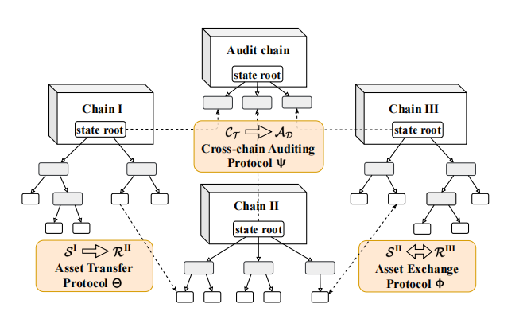
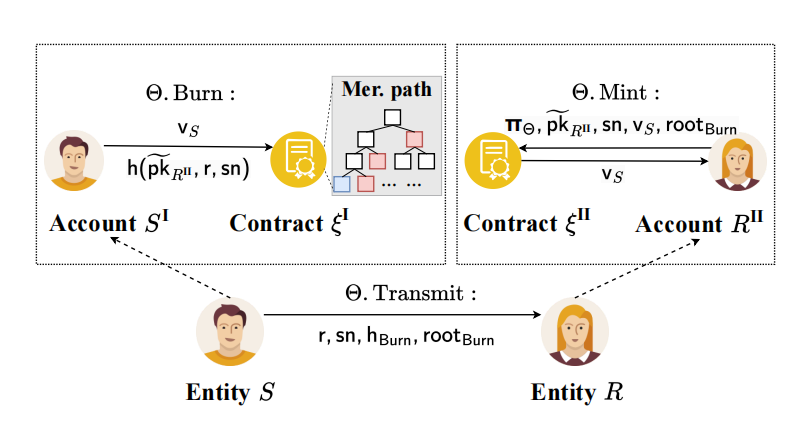
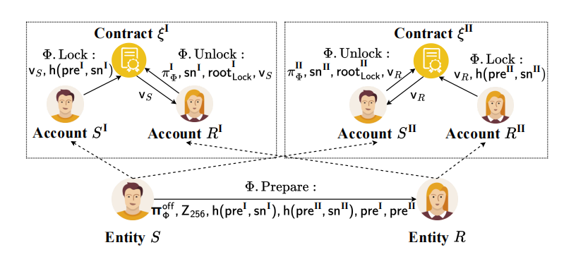
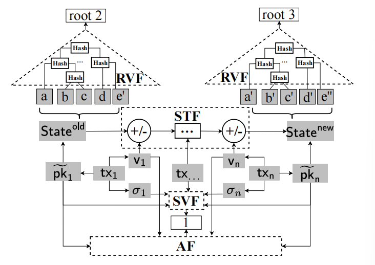
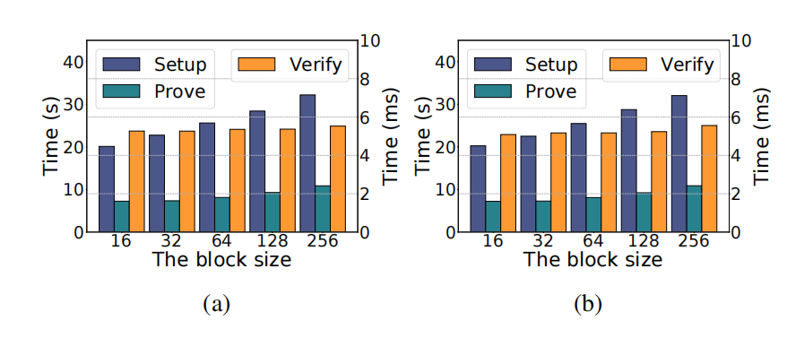

# zkCross：一种新颖的跨链隐私保护审计架构

## 摘要

区块链研究的重点领域之一是如何在不牺牲系统安全性和可信度的情况下，实现隐私保护审计。然而，同时实现审计和隐私保护这两个看似矛盾的目标具有挑战性，因为审计系统需要透明性和问责制，这可能会引入隐私和安全漏洞。在跨链场景中，来自多个链的信息孤岛进一步使问题复杂化。在本文中，我们确定了跨链隐私保护审计中的三个重要挑战，分别是跨链链接可暴露性（Cross-chain Linkability Exposure, CLE）、隐私与审计的不兼容性（Incompatibility of Privacy and Auditing, IPA）以及全面审计效率低下（Full Auditing Inefficiency, FAI）。为克服这些挑战，我们提出了 zkCross，这是一种新颖的两层跨链架构，配备了三种跨链协议以实现隐私保护的跨链审计。其中两种协议分别为转移和交换提供隐私保护，第三种协议是一种高效的跨链审计协议。这些协议建立在健全的跨链方案之上，以保证隐私保护和审计效率。我们在本地和云服务器上实现了 zkCross，并进行了全面测试，以验证 zkCross 在处理大规模隐私保护审计任务方面的适用性。我们评估了所提协议在运行时间、延迟、吞吐量、Gas 消耗、审计时间和证明大小方面的性能，以展示其可行性。    

## 1 引言

跨链技术 [2] 被视为提升独立区块链系统之间通信和互操作性的有效途径之一。位于不同区块链上的用户可以通过跨链协议实现跨链转移和交换。近期出现了许多跨链协议 [15,30,36,40]，它们主要关注通用性、安全性和效率等方面，却在很大程度上忽略了隐私和审计挑战。这一忽视可能会阻碍跨链机制的广泛应用，并导致严重的安全漏洞、隐私风险，甚至信任与信誉的丧失。

在跨链操作中，隐私保护和审计是两个至关重要的需求。随着人们对数据价值的认识不断加深，对隐私保护的需求也在增长 [23,38]。然而，跨链场景下的隐私考虑不仅需要保护跨区块链传输信息的机密性，还需保护多条链上用户交互的隐私。跨链交互关系的泄露可能导致多种隐私风险，包括追踪资金在链间流转或识别特定交易相关方，从而潜在破坏跨链系统的整体安全性 [6]。此外，审计在跨链场景中同样发挥着重要作用，例如，需要审计以确保存在合作需求但可能存在利益冲突的双方之间交互的正常进行 [22]。

然而，区块链系统中的隐私保护与审计是两个相互冲突的目标：前者要求维护数据机密性并最小化数据暴露，后者则需要透明度和数据访问。因此，同时兼顾隐私保护与审计十分困难，这长期以来已成为单链系统中的重要研究课题 [4,7,9,34,37]。在跨链环境中，这一问题更加严峻。单链系统的设计前提是假设作为区块链节点的审计者可以访问链内所有信息，而多链场景打破了这一前提 —— 某一条链的审计者无法获取其他链上的全部信息。表面上看，审计者可以在所有链上注册账户，但这极为耗费资源且不切实际，尤其是在大规模跨链场景中。例如，比特币和以太坊的账本规模已分别达到 500 GB 和 700 GB，并且持续增长 [17]。这意味着在审计比特币和以太坊时，审计者至少需要 TB 级存储空间，且随着网络中链数量的增加，此需求也随之增长，给审计工作带来显著障碍。因此，单链方案难以直接移植到跨链环境中。

为此，本文首先识别了跨链隐私保护与审计面临的三大关键挑战，并提出可行的解决方案。第一个挑战是跨链可关联性泄露问题（Cross-chain Linkability Exposure, CLE），该问题使对手能够获取跨链交互双方之间的关联性，从而暴露隐私。为解决此问题，需要设计不同跨链活动对应的隐私保护协议，且不得引入可能危及整体区块链系统安全的第三方。第二个挑战是隐私保护与审计的不兼容性（Incompatibility of Privacy and Auditing, IPA），即基于公开可得信息的审计协议必须与针对 CLE 问题的隐私协议保持一致，不产生冲突。第三个挑战是全面审计效率低下问题（Full Auditing Inefficiency, FAI），该问题源于多条异构区块链的存在，可能导致极低的审计效率。这些挑战将在第 3.2 节中详细阐述。

在本文中，我们提出了 zkCross，以有效应对上述三大挑战。具体而言，我们首先设计了一种两层跨链架构：下层包含可相互交互的多条区块链，上层则由审计者组成一条区块链。随后，为解决 CLE 问题，我们基于零知识证明针对两种跨链活动（即跨链转移和跨链交换）提出了两种不同的隐私保护协议，可在无需任何可信第三方的情况下实现隐私保护。最后，为解决 IPA 和 FAI 问题，我们提出了一种跨链审计协议，将审计过程与交易验证过程压缩到新的电路中，从而保证审计者无需获取完整交易内容即可保障审计任务的正确性，并可在常数时间内审核线性增长的交易数量。

zkCross 面向具有跨链互操作性需求的一般区块链系统，适用于无权限和有权限区块链（详见第 2 节）。为方便起见，我们将主要贡献概括如下：
1. zkCross 是首个同时考虑跨链活动隐私保护与审计的跨链方案。据我们所知，目前仅在单链系统中同时兼顾隐私保护与审计的方案，几乎无法直接应用于跨链操作。
2. 我们设计了两层跨链架构，以支持同时实现隐私保护与审计。该架构对审计者友好，可与跨链交互协议解耦，使后者的设计更加灵活。
3. 本文提出了两种跨链隐私保护协议，可保证交互双方的不可关联性，确保跨链交互的原子性，并在无需可信第三方的情况下进一步解决 CLE 问题。
4. 我们设计了一种跨链审计协议，能够有效应对 IPA 和 FAI 挑战，提升上层的审计效率，同时不影响 CLE 问题的解决。
5. 为验证 zkCross 的性能，我们在一条包含 200 个节点的区块链网络上进行了大规模实验，实验结果验证了本设计的有效性与高效性。

本文其余部分结构安排如下：第 2 节介绍相关背景；第 3 节综述最相关的文献并提出三大跨链挑战；第 4 节描述所提方案模型及相关预备知识；第 5 节和第 6 节分别呈现 zkCross 方案的技术细节与安全分析；第 7 节报告 zkCross 的性能评估；第 8 节给出结论与未来研究方向。

## 2 背景

本节提供理解本文工作的必要背景，包括区块链和跨链活动。

### 2.1 区块链

区块链 [32] 是一种共享的分布式账本，用于记录所有交易，并由去中心化网络中的节点维护。每笔交易存储在一个区块中，并按时间顺序链接在一起，因此得名区块链。区块链的关键特性之一是其不可篡改性，这意味着一旦交易被记录，就无法更改。不可篡改性确保了存储于区块链上的数据完整性，使其安全且抗未经授权的修改。此外，区块链消除了交易中介的需求，解决了单点故障的问题。区块链的透明性体现在能够访问所有交易，这与传统银行和服务提供商不向用户开放完整账本的做法形成对比。区块链最初为比特币 [32] 而开发，后逐步演变并应用于多种行业，如金融、物联网、智能电网和供应链管理 [45]。为了适应不同场景，区块链逐渐分化为两种类型：无权限链和有权限链 [38]。无权限链是去中心化网络，任何人都可以加入、参与和验证交易，无需审批；有权限链则是集中或半集中网络，其访问和参与仅限于经批准的实体。

### 2.2 跨链活动

跨链技术促进了两个独立区块链之间的交互 [2]。根据跨链活动的类型，跨链交互可分为跨链转移和跨链交换。跨链转移指资产在两条区块链之间的移动，包括在一条区块链上销毁资产并在另一条区块链上铸造资产的过程。跨链交换则在概念上涉及跨链转移的双向过程，即在两条不同区块链之间交换资产。参与的区块链各自锁定要交换的资产，然后解锁以接收另一条区块链的对应资产。

尽管这两种活动在概念上相似，但跨链资产转移和交换协议在技术实现和操作流程上存在显著差异，需要采用不同的方法和解决方案。例如，多种跨链交换协议（如 HTLC 及 [6,18,30] 中的方案）并不支持资产转移；而其他方案如公证方案和中继链（见第 3 节介绍），虽然具备同时支持跨链资产转移和交换的能力，却通常需要第三方实体的参与，这些实体拥有较大权限，从而带来集中式安全风险。

## 3 相关工作与动机

本节首先简要介绍跨链交互领域最相关的工作，然后通过详述被相关研究忽略的三个跨链隐私保护与审计挑战，阐明我们的设计动机与启示。

### 3.1 相关工作

当前最先进的跨链方案大体可分为链上方案（chain-based）和桥接方案（bridge-based）两类。链上方案，例如侧链 [28] 和哈希时间锁合约（HTLC）[31]，依托于区块链固有机制，无需额外实体。侧链是与母链协同运行的独立区块链。ZeroCross [21] 是基于 Monero 平台的隐私保护侧链解决方案；Zedoo [10] 则利用 zk-SNARK 技术实现了审计功能。Baldimtsi 等人 [1] 提出了一种连接匿名链的方案。HTLC 结合哈希锁与时间锁以支持跨链交换；XCLAIM [41] 缓解了原始 HTLC 框架中对并发在线的严格假设；Deshpande 等 [6] 基于 Schnorr 签名为 HTLC 增加了隐私保护；MAD-HTLC [31] 通过区块链激励机制有效抵御激励操纵攻击；Cross-Channel [15] 提升了基于 HTLC 的跨链系统吞吐量；Thyagarajan 等 [30] 则采用可验证定时签名替代时间锁。

桥接方案如公证方案 [40] 和中继链 [2]，则需第三方组件来促进链间交互。在公证方案中，可信第三方（公证人）负责验证跨链交易真实性，设计简单却存在单点故障风险。Yin 等 [40] 通过引入安全硬件与密码学技术增强了公证方案的安全性。中继链方案则引入专用区块链网络作为中继链，实现参与链之间的资产转移。zkBridge [36] 提出 Virgo 来提升跨链桥验证效率；Wang 等 [33] 提出“链治链”概念；BeDCV [44] 则采用监督链（supervision chain）进行去中心化审计，利用同态加密等技术。需要注意的是，桥接方案引入了公证人和中继链等可信机制，虽可同时支持跨链转移与交换，却存在单点故障风险；且其星型架构虽利于审计任务，却影响系统可扩展性。

### 3.2 跨链隐私保护与审计的挑战

尽管已有多种成熟的跨链解决方案，跨链隐私保护与审计领域仍面临显著挑战，主要包括跨链可关联性泄露问题（Cross-chain Linkability Exposure, CLE）、隐私与审计不兼容问题（Incompatibility of Privacy and Auditing, IPA）以及全面审计效率低下问题（Full Auditing Inefficiency, FAI）。以下分别阐述这三大挑战。

**挑战 1：CLE。**  

已有若干方案针对跨链隐私提出解决思路。例如，文献 [39,43] 的方案高度依赖特定应用场景；文献 [1,21] 借助底层区块链平台（如 Monero 和 Zcash）提供隐私保护，却与其他系统不兼容；Deshpande 等 [6] 针对跨链交换提出方案，但要求双方共享同一秘密作为前提，不适用于互不信任的参与者。综上，目前跨链隐私保护研究尚不充分，在通用性与安全性方面存隐忧；且现有工作往往试图用单一协议同时支持跨链转移与交换，却依赖第三方实体（如桥接方案），带来安全风险。解决 CLE 的关键在于：①准确区分不同跨链活动的特点；②采用灵活手段模糊交互双方关联；③杜绝引入任何可能破坏系统安全的第三方。

**挑战 2：IPA。**  

隐私保护与审计需求往往同时存在且目标相互冲突。截至目前，尚无跨链方案能兼顾两者。现有跨链隐私保护方案 [1,6,21,39,43] 在设计时未考虑审计支持，仅关注最小化信息泄露与协议完整性，忽略信息可验证性。在有权限区块链中，审计者通常为链外主体，无法访问链内交易信息。例如，在多家企业共建的多链系统中，内部节点频繁交互，而银行、保险公司等第三方机构承担审计职责，但无法获取内部数据（如收据、员工信息），导致审计受阻，进而影响贷款等业务。为有效解决此类问题，亟需在不泄露私密信息的前提下，借助公开可得数据实现对私密信息的验证。

**挑战 3：FAI。**  

现有审计方案可分为激励型和中继型两类。激励型方案（如 Polkadot 中的 fisherman [35]）通过激励机制让审计者选择性验证部分交易以获取奖励；中继型方案则依托实体或网络对所有交易进行全面审查以降低恶意风险 [33,44]。一般而言，中继型方案因全量审计（full auditing）具备更高安全性，但效率往往逊于激励型方案。具体而言，假设系统包含 $k$ 条区块链，且每条链在单位时间内平均处理 $n$ 笔交易，则中继型方案中每个审计节点的工作量可估计为 $O(k \times n)$ [35]，对审计者提出了高计算需求，导致验证效率低下；随着区块链数量不断增加，两类方案在审计效率上的局限将成为实际应用的障碍。由此，亟需设计一种审计者友好（auditor-friendly）的方案，既能保证安全与效率，又能实现全量审计。

**动机与启示。**  

基于以上观察，我们提出了包含三种协议的 zkCross 新型架构。相比第 3 节介绍的桥接方案，zkCross 采用树型结构设计，既兼顾隐私保护与审计需求，又降低跨链审计的中心化风险。在隐私保护协议设计方面，zkCross 利用 SPV（Simplified Payment Verification）[32] 和 HTLC（Hashed Timelock Contracts）[31] 两种去中心化跨链交互基础技术来实现跨链转移与交换；并进一步采用 zk-SNARKs、哈希函数与面额机制，全面解决包括接收方地址、预映像和交易金额在内的关联性破坏因素。在审计协议设计方面，zkCross 借助 zk-SNARKs 的简洁性，将复杂计算任务下沉至链下，从而提升链上审计效率。    

## 4 模型与预备知识

本节首先定义我们的网络模型与威胁模型。随后介绍构成 zkCross 基础的 zk-Rollup、哈希时间锁合约与简化支付验证。

### 4.1 模型

**网络模型。** 

zkCross 是一种配备三种协议的两层跨链架构。架构中的所有实体均为拥有区块链账户、能够进行链上和链下操作的真实用户。此外，每个实体可拥有多个账户，每个账户相当于区块链上的一个节点。

在 zkCross 中，下层包含多条相互独立的区块链（称为普通链），其中发起方（$S$）与接收方（$R$）之间存在跨链交易。普通链中的每个节点可担任提交者（$C_T$），负责汇总链上相关数据。我们假设每条普通链中至少存在一位诚实提交者 [36]。普通链可分为无权限链和有权限链：在无权限链中，所有实体均可注册账户并访问交易；而在有权限链中，外部节点（如上层的审计者）无法像在无权限链中那样自由访问交易。因此，我们假设审计者只能通过辅助手段（如 Gateways [25] 或区块链浏览器）获取有权限链的区块头，以在保护交易隐私的同时开展审计。

上层由审计链（audit chain）组成，包含两类节点：提交者和审计者。要将下层收集的链上数据上传至审计链并获取奖励，下层提交者需在审计链上注册账户，成为上层提交者。审计者（记为 $A_D$）负责审核上层提交者提交的数据。基于区块链的激励机制，诚实的上层提交者会获得相应奖励。审计链为无权限链，允许所有实体注册成为提交者节点。

**威胁模型。**  

节点在多项式时间内运行，可能在区块链网络中表现出拜占庭行为，但其投票权不得超过预设阈值，以维持共识安全 [15,30,31,36]。例如，在 PBFT（Practical Byzantine Fault Tolerance）中，拜占庭节点数必须低于总节点数的三分之一；在 PoW（Proof of Work）中，恶意节点算力不得超过网络总算力的 50%。

**设计目标。**  

为应对第 3.2 节中提出的挑战，zkCross 致力于实现以下目标：

- **隐私**：设 $S^L$ 与 $R^L$ 为一次跨链转移或交换中涉及的两个账户。zkCross 旨在保证二者之间的**不可关联性**（在定义 1 中形式化定义）。  
- **效率**：若跨链网络包含 $k$ 条普通链，每条链平均包含 $m$ 个区块，每个区块平均包含 $n$ 笔交易，则 zkCross 的审计效率复杂度为 $O(k \times m)$，相比传统的全量审计方案 $O(k \times m \times n)$ 大幅降低。

> **定义 1（不可关联性 [3,11,24]）。**  
>
> 对手无法将接收方账户与发送方发起的交易关联起来，反之亦然。

### 4.2 基于 zk-SNARK 的 zk-Rollup

zk-Rollup [38] 是一种区块链网络的扩容方案，其中“zk”代表“零知识（zero-knowledge）”。zk-SNARK [13] 是一种广泛应用于区块链中的零知识证明技术。以下定义基于 zk-SNARK 的 zk-Rollup；针对不同应用场景，也可用 deVigo [36] 等替代方案。

> **定义 2（基于 zk-SNARK 的 zk-Rollup）。**  
>
> zk-SNARK 要求实现一个 $F$-算术电路 $\Lambda$，用于强制约束公共输入 $\bar{x}$ 与私有输入（见证） $\bar{w}$ 之间的计算关系。基于 zk-SNARK 的 zk-Rollup 完整过程可形式化为包含三元多项式时间算法集 $\Pi = \{\text{Setup},\text{Prove},\text{Verify}\}$ .

- $crs \leftarrow Setup(1^\lambda,\Lambda)$

  在 zk-SNARK 中，算法接受安全参数 $1^\lambda$ 与电路 $\Lambda$ 作为输入，以生成通用参考字符串（crs），包括后续证明与验证所需的公钥与私钥对 $(pk,vk)$。在 zk-Rollup 中，电路中嵌入了所有交易签名与状态转移正确性的验证逻辑。

- $\pi \leftarrow Prove(pk,\bar{x},\bar{w})$
  
  在 zk-SNARK 中，算法接受证明密钥 $pk$、公共输入 $\bar{x}$ 与私有输入 $\bar{w}$ 以生成简洁的零知识证明 $\pi$；在实现 zk-Rollup 时，公共输入 $\bar{x}$ 包括转移金额和地址信息，私有输入 $\bar{w}$ 则为交易签名等数据。
  
- $1/0 \leftarrow Verify(vk,\bar{x},\pi)$
  
  在 zk-SNARK 与 zk-Rollup 中，算法使用验证密钥 $vk$ 与公共输入 $\bar{x}$ 对证明 $\pi$ 进行验证，输出 $1$ 表示验证成功，$0$ 表示验证失败。

> **注**：三元算法集 $\Pi$ 的具体实现可根据应用场景，通过调整参数 $\Lambda,\bar{x},\bar{w}$ 等灵活适配。

### 4.3 哈希时间锁合约

HTLC（Hashed TimeLock Contract）是闪电网络的关键技术，广泛应用于跨链交换 [31]。

**定义 3（跨链场景中的 HTLC）。**  

HTLC 协议要求交易双方 $S$ 与 $R$ 在各自区块链上均拥有账户。为便于说明，将双方在链 I 上的账户记为 $S^L$ 与 $R^L$，在链 II 上的账户记为 $S^I$ 与 $R^I$。协议包含三个阶段：

- **Lock：**  

  $S^L$ 选择一个随机密钥（例如 256 位整数）作为原像 pre，并计算哈希值 $h(\mathrm{pre})$。$S^L$ 在链 I 的智能合约 $\xi^I$ 中锁定要发送给 $R^I$ 的资产，并设置计时器 $T_1$。随后，$R^I$ 使用相同的 $h(\mathrm{pre})$ 在链 II 的智能合约 $\xi^{II}$ 中锁定要发送给 $S^L$ 的资产，并设置计时器 $T_2$，满足 $T_1 > T_2$。

- **Unlock：**  
  
  在时限 $T_2$ 内，$S^L$ 向链 I 的智能合约 $\xi^I$ 提供原像 pre，以解锁由 $R^I$ 锁定的资产。之后，$R^I$ 在时限 $T_1$ 内向智能合约 $\xi^{II}$ 提供 pre，从而解锁由 $S^L$ 锁定的资产。
  
- **Refund：**  
  
  若 $S^L$ 未能在 $T_2$ 时限内提供 pre，则链 II 上的 $\xi^{II}$ 中锁定的资产将退回给 $R^L$；若在 $T_1$ 超时后仍未完成互换，链 I 上的 $\xi^I$ 中资产将退回给 $S^L$。

> **注意：** 某些区块链系统（如比特币）不原生支持智能合约，可通过脚本等机制实现 HTLC [32]。本文中讨论 HTLC 时，“智能合约”一词指真实合约或脚本等实现技术。

### 4.4 简化支付验证

SPV（Simplified Payment Verification）由中本聪 [32] 于 2008 年提出，并被以太坊等多种区块链系统广泛采用。其旨在使轻客户端无需下载整个链上数据，便可通过 Merkle 证明参与区块链网络。具体而言，某笔交易的 Merkle 证明由该交易在 Merkle 树中的路径（所有兄弟节点的哈希值）与整个 Merkle 树的根节点共同构成，允许轻节点在不获取完整区块的情况下验证交易是否包含在该区块中。

## 5 zkCross

本节首先介绍 zkCross 的总体架构及优势，然后详细阐述为实现隐私保护审计而设计的三种协议。

### 5.1 概述

zkCross 针对 CLE、IPA 和 FAI 三大挑战提出解决方案。图 1 展示了其两层架构及三种关键协议。

图 1： zkCross 示意图：上层为审计链；下层为多条普通链；橙色框中标示了三种协议。

下层由多条普通链组成，图 1 中标示为 Chain I、Chain II 和 Chain III。上层包含用于监管下层活动的审计链。在该架构中，每条区块链维护一个状态树，本质上为二叉 Merkle 树。在普通链中，状态树的每个叶子节点代表账户状态的哈希结果，包括公钥和余额；在审计链中，其状态树存储普通链的状态树根作为叶子，建立审计链与普通链之间的层级链接。

zkCross 包含两种隐私保护协议（Θ 和 Φ），分别针对两类跨链交互活动：转移与交换。参与者位于不同普通链上。例如，Chain I 的发送方 $S^L$ 可使用协议 Θ 将资产私密地转移至 Chain II 的接收方 $R^L$；Chain II 的发送方 $S^{II}$ 可通过协议 Φ 与 Chain III 的接收方 $R^{III}$ 完成跨链交换。Θ 和 Φ 可同时保护交互双方的隐私关系。审计链主要由审计者和提交者构成。在跨链审计协议 Ψ 下，提交者负责在普通链打包交易并提交给审计者以完成审计流程。

两层架构可支持多种实体间交互，如跨链参与实体与审计实体之间的交互，从而便于设计隐私保护跨链协议和高效审计协议。注意，该架构将审计 (Ψ) 与跨链协议 (Θ 与 Φ) 解耦，意味着可在不局限于隐私保护审计的场景下，采用 SPV、HTLC 等主流跨链技术，或根据具体需求对审计协议的审核内容进行定制，如验证交易金额是否在预设范围内，或检查交易是否在黑名单中。Ψ 可在不暴露下层交易信息的前提下完成审计。

### 5.2 隐私保护跨链协议

本小节介绍两种不同的隐私保护协议，以解决 CLE 问题。

#### 5.2.1 隐私保护跨链转移协议

在基于 SPV 的跨链转移过程中，接收方地址和转移金额是可能暴露交互双方关联性的两个关键因素。显然，需要隐藏转移的目标地址；同时，为保证跨链转移的原子性，也需隐藏转移金额。例如，考虑 Bitcoin 与 Ethereum 汇率为 1:10 的场景：在一次跨链转移中，比特币链上“燃烧” 1 BTC，并在以太坊链上“铸造”等价的 10 ETH。如果转移金额公开，攻击者可通过燃烧和铸造交易关联交互双方；然而，当地址和金额均被隐藏时，将导致 SPV 验证失败，从而破坏跨链交互的原子性。

图 2： 隐私保护跨链转移协议 Θ 流程。蓝色块表示交易 $\(\mathrm{Tx}_{\mathrm{Burn}}\)$ 的哈希摘要，红色块表示 Merkle 证明信息，即 $\(h_{\mathrm{Burn}}\)$ 与 $\(\mathrm{root}_{\mathrm{Burn}}\)$。

基于上述分析，我们设计了隐私保护跨链转移协议 Θ（见图 2），以解决接收方地址与转移金额泄露带来的隐私风险。我们选用 zk-SNARK 隐藏接收方公钥 $pk_{R^L}$，并通过设置固定面额 [12,16,29] 隐藏转移金额。例如，在以太坊链上，当基本面额设为 2 ETH，若 $S^L$ 意图向 $R^L$ 转移 6 ETH，则需执行三笔 2 ETH 的转移交易。此设计通过多笔交易掩盖具体转移金额，实现隐私保护。协议 Θ 的具体流程如下。

假设 Chain I 中的 $S^L$ 向 Chain II 中的 $R^L$ 转移金额 $v_S$，其中 $v_S$ 为标准面额。整个协议由四个步骤组成：Burn、Transmit、Mint 和 Redeem。注意在一次跨链转移中，Mint 和 Redeem 步骤只能执行其一：若执行 Mint，则表示转移成功；若执行 Redeem，则表示所转移的金额已退回发送方。

**Θ.Burn：**  
  
在此步骤中，$S^L$ 将交易 $\mathrm{Tx}_{\mathrm{Burn}}$ 发送至智能合约 $\xi^I$（或专用销毁账户）以“销毁”金额 $v_S$。交易 $\mathrm{Tx}_{\mathrm{Burn}}$ 包含转移金额 $v_S$ 以及通过对接收方公钥 $pk_{R^L}$、随机数 $r$ 和序列号 $sn$ 进行哈希后得到的摘要 $h(pk_{R^L},r,sn)$。在哈希函数中同时引入 $r$ 与 $sn$ 可以增强哈希结果的随机性，隐藏接收方信息 $pk_{R^L}$ 并防止暴力破解攻击 [19]。$r$ 与 $sn$ 可通过伪随机函数（PRF）[20] 生成；同时，$sn$ 作为跨链转移活动的唯一标识符（类似货币序列号）。一旦 $v_S$ 被认领，对应的 $sn$ 将被公开以防止双花攻击 [42]。智能合约在验证签名合法性及账户余额充足后，锁定 $v_S$ 并设置时锁 $T_3$。  
  
  $$
  \mathrm{Tx}_{\mathrm{Burn}} \overset{\mathrm{def}}{=} (\mathrm{From}:S;\ \mathrm{To}:\xi;\ v_S;\ h(pk_{R^L},r,sn)).
  $$
  
上述设计确保对手仅能获知某节点发起了交易 $\mathrm{Tx}_{\mathrm{Burn}}$，却无法得知其接收方。
  
**Θ.Transmit：**  
  
达成共识后，交易 $\mathrm{Tx}_{\mathrm{Burn}}$ 的哈希摘要将作为叶子节点包含于 Chain I 的区块中。为简化描述，此处省略 Nonce、区块号等非核心字段。$\mathrm{Tx}_{\mathrm{Burn}}$ 的哈希摘要定义为：  
  
  $$
  h(\mathrm{Tx}_{\mathrm{Burn}}) \overset{\mathrm{def}}{=} \mathrm{hash}\bigl(pk^S,\mathrm{addr}_{R^L},v_S,\;h(pk_{R^L},r,sn)\bigr).
  $$
  
随后，$S^L$ 通过链下通信将以下参数发送给 $R^L$：随机数 $r$、序列号 $sn$ 以及由一组哈希构成的 Merkle 证明 $h_{\mathrm{Burn}}$，其中 $h_{\mathrm{Burn}}$ 包含 Merkle 根 $\mathrm{root}_{\mathrm{Burn}}$ 与交易 $\mathrm{Tx}_{\mathrm{Burn}}$ 的 Merkle 路径。

**Θ.Mint：**  
  
在链下通信完成后，$R^{II}$ 选择安全参数并构造新的电路 $\Lambda_{\Theta}$（如图 3所示）。整个电路包含两种功能单元（由虚线框表示）：Hash 和 MP，其中 Hash 用于计算输入数据的哈希值，MP 实现 Merkle 证明功能以证明某笔交易存在于某区块中。$R^{II}$ 调用算法 $\Pi.\mathrm{Setup}$（见第 4.2 节）获取密钥对 $(pk_{\Theta},vk_{\Theta})$。然后，它采用算法 $\Pi.\mathrm{Prove}$ 对公共输入  
  
  $$
  (pk_{R^L},\,sn,\,v_S,\,\mathrm{root}_{\mathrm{Burn}})
  $$
  
和私有输入  
  
  $$
  (pk^s,\,addr_{R^L},\,r,\,h_{\mathrm{Burn}})
  $$
  
生成零知识证明 $\pi_{\Theta}$。注意，在此交易中，$\widetilde{pk}_{R^L}$ 作为交易从 $R^{II}$ 发送至智能合约 $\xi^{II}$ 的公钥是公开的。随后，$R^{II}$ 将 $\pi_{\Theta}$ 与公共输入一并封装成交易 $\mathrm{Tx}_{\mathrm{Mint}}$，并发送至智能合约 $\xi^{II}$（或专用铸造账户），以获取等值资产 $v_S$。最后，智能合约 $\xi^{II}$ 通过算法 $\Pi.\mathrm{Verify}$ 验证 $\pi_{\Theta}$ 的有效性，并将资产发送给 $R^{II}$。  
  
  $$
  \mathrm{Tx}_{\mathrm{Mint}} \overset{\mathrm{def}}{=} (\mathrm{From}:R;\ \mathrm{To}:\xi;\ \pi_{\Theta},\,\widetilde{pk}_{R^L},\,sn,\,v_S,\,\mathrm{root}_{\mathrm{Burn}}).
  $$
  
**Θ.Redeem：** 
  
如果 $R^{II}$ 未能在时锁 $T_3$ 前完成 Θ.Mint，则 $S^L$ 可向智能合约 $\xi^I$ 请求赎回 $v_S$。此时，$S^L$ 需要按 Θ.Mint 步骤生成相同的证明流程，仅需将电路中的公共/私有输入替换为 $S^L$ 所控制的公私钥。证明生成完成后，$S^L$ 将交易 $\mathrm{Tx}_{\mathrm{Redeem}}$ 发送至 $\xi^I$，并在验证成功后收回资产 $v_S$。  
  
  $$
  \mathrm{Tx}_{\mathrm{Redeem}} \overset{\mathrm{def}}{=} (\mathrm{From}:S;\ \mathrm{To}:\xi;\ \pi_{\mathrm{Redeem}},\,\widetilde{pk}_{R^L},\,sn,\,v_S,\,\mathrm{root}_{\mathrm{Burn}}).
  $$

#### 5.2.2 隐私保护跨链交换协议

我们采用 HTLC 设计了一种跨链交换协议。根据第 4.3 节中 HTLC 的定义，HTLC.Unlock 要求交互双方使用相同的原像来解锁交换资产，这会使攻击者容易识别双方关联性。因此，隐私保护设计的核心挑战在于在保证 HTLC 原子性的同时，掩蔽原像。此外，还需保护交换数额的隐私。为此，我们沿用了跨链转移中的做法：通过设置固定面额来消除通过交换金额暴露隐私的风险。

为应对 HTLC 原像带来的隐私挑战，我们基于 zk-SNARK（见第 4.2 节）提出了隐私保护协议 Φ。该协议包括四个步骤：Prepare、Lock、Unlock 和 Refund。按照 HTLC 要求（第 4.3 节），Φ 需要在 Chain I（即 $S^I,R^I$）和 Chain II（即 $S^{II},R^{II}$）上分别存在交互双方的账户。注意，一次跨链交换中，Unlock 和 Refund 仅能执行其一：执行 Unlock 表示交换成功，执行 Refund 则表示交换金额已退回发送方。

图 4： Φ.Prepare 的电路逻辑图。灰色背景参数为通过 zk-SNARK 保护的私有数据

**Φ.Prepare。** 在此过程中，$S$ 需要生成一个安全参数，并结合图 4 所示的电路 $\Lambda_{\Phi}^{\mathrm{off}}$，通过设置算法 $\Pi.\mathrm{Setup}$ 派生出密钥对 $(pk_{\Phi}^{\mathrm{off}},\,vk_{\Phi}^{\mathrm{off}})$。电路 $\Lambda_{\Phi}^{\mathrm{off}}$ 包含两种功能单元（用虚线框表示），即哈希函数（Hash）和异或操作（XOR）。具体而言，$S$ 生成两个原像 $\mathrm{pre}^I$ 和 $\mathrm{pre}^{II}$，两个随机序列号 $\mathrm{sn}^I$ 和 $\mathrm{sn}^{II}$，以及一个 256 位整数 $Z_{256}$；其中将 $\mathrm{sn}^I$ 与 $Z_{256}$ 通过 XOR 运算得到 $\widetilde{\mathrm{sn}}^I$。这些随机序列号作为私有输入保存，而原像和 $Z_{256}$ 作为公共输入。利用哈希功能，分别计算  

$$
h(\mathrm{pre}^I,\mathrm{sn}^I)\quad\text{和}\quad h(\mathrm{pre}^{II},\mathrm{sn}^{II})\,,
$$

即以 $(\mathrm{pre}^I,\mathrm{sn}^I)$ 和 $(\mathrm{pre}^{II},\mathrm{sn}^{II})$ 作为输入得到对应哈希值。随后，$S$ 通过协议 $\Pi.\mathrm{Prove}$ 生成零知识证明 $\pi_{\Phi}^{\mathrm{off}}$。该证明连同公共输入（哈希结果 $h(\mathrm{pre}^I,\mathrm{sn}^I)$、$h(\mathrm{pre}^{II},\mathrm{sn}^{II})$，原像 $\mathrm{pre}^I,\,\mathrm{pre}^{II}$，以及整数 $Z_{256}$）由 $S$ 通过链下通信发送给 $R$。该链下过程可实现以下目标：首先，$S$ 能在不泄露 $\mathrm{sn}^I$ 的前提下，证明 $\mathrm{sn}^I$ 与 $\widetilde{\mathrm{sn}}^I$ 之间的关系；其次，$R$ 只需执行一次逆向运算即可根据 $\widetilde{\mathrm{sn}}^I$ 还原出 $\mathrm{sn}^I$。

**Φ.Lock。** 在链下通信完成后，基于交易 $T_{x\mathrm{Lock}}$，$S^I$ 使用 $h(\mathrm{pre}^I,\mathrm{sn}^I)$ 在智能合约 $\xi^I$ 中锁定资产 $v_S$。在 $R^I$ 验证 $S^I$ 发送的 $T_{x\mathrm{Lock}}$ 的正确性后，$R^I$ 使用 $h(\mathrm{pre}^{II},\mathrm{sn}^{II})$ 向智能合约 $\xi^{II}$ 发送 $T_{x\mathrm{Lock}}$，以锁定资产 $v_R$。该时锁操作与第 4.3 节中介绍的 HTLC.Lock 步骤一致，其中双方在对应智能合约上分别设置时锁 $T_1$ 和 $T_2$，且满足 $T_1 > T_2$。  

$$
T_{x\mathrm{Lock}} \overset{\mathrm{def}}{=} (\mathrm{From}:S^I/R^I;\ \mathrm{To}:\xi;\ v,\;h(\mathrm{pre},\mathrm{sn})).
$$

达成共识后，$T_{x\mathrm{Lock}}$ 的哈希摘要作为叶子节点包含在一个区块中，其定义为：  

$$
h(T_{x\mathrm{Lock}}) \overset{\mathrm{def}}{=} \mathrm{hash}\bigl(pk,\mathrm{addr}_{\xi},v,\;h(\mathrm{pre},\mathrm{sn})\bigr).
$$

Φ.Unlock. 在 $T_{2}$ 阶段，$S^{II}$ 首先生成一个电路 $\Lambda^{II}_{\Phi}$，该电路的逻辑与图 3 所示的 $\Lambda_{\Theta}$ 类似，但需要修改其输入（见图 5）。具体而言，公共输入包括序列号 $sn^{II$、金额 $v_{R$ 和 Merkle 根 $\mathit{root}^{\mathit{lock}}_{L}$。私有输入则由接收方 $R^{II}$ 的公钥 $pk^{R^{II}}$、智能合约地址 $addr^{R^{II}}$、原像 $pre^{II}$、交易 $T_{X\mathit{lock}}$ 的 Merkle 证明（记作 $\hat{h}^{II}_{\mathit{Lock}}$）、交易哈希 $h^{II}\bigl(T_{X\mathit{lock}}\bigr)$ 和哈希锁 $h\bigl(pre^{II},\,sn^{II}\bigr)$ 组成。类似于 $\Theta.\mathit{Mint}$，$S^{II}$ 基于上述电路生成一个零知识证明 $\pi^{II}_{\Phi}$。然后，$S^{II}$ 将证明 $\pi^{II}_{\Phi}$ 及公共输入 $(sn^{II},\,v_{R},\,\mathit{root}^{\mathit{lock}}_{L})$ 通过 $T_{X\mathit{unlock}}$ 发送给智能合约 $\Theta^{II}$，以解锁 $v_{R}$。随后，$R^{II}$ 获得 $sn^{II}$ 并使用 $\mathbb{Z}_{256}$ 中的异或运算恢复出 $sn$。按照与 $S^{II}$ 相同的步骤，$R^{I}$ 生成一个零知识证明 $\pi^{I}_{\Phi}$，其公共输入为 $(sn^{I},\,v_{S},\,\mathit{root}^{\mathit{lock}}_{L})$，私有输入为 $\bigl(pk^{R^{I}},\,addr^{R^{I}},\,pre^{I},\,h^{I}_{\mathit{Lock}}\bigl(T_{X\mathit{lock}}\bigr),\,h(pre^{I},\,sn^{I})\bigr)$，然后发送 $T_{X\mathit{unlock}}$ 来获取 $v_{S}$。

**图 5：** Φ.Unlock 的电路逻辑图。灰色背景参数为通过 zk-SNARK 保护的私有数据。

$$
T_{x\mathrm{Unlock}} \overset{\mathrm{def}}{=} (\mathrm{From}:S^{II}/R^I;\ \mathrm{To}:\xi;\ \pi,\;\mathrm{sn},\;v,\;\mathrm{root}_{\mathrm{Lock}}).
$$

**Φ.Refund。** 与第 4.3 节中介绍的 HTLC.Refund 相同，如果 $S^{II}$ 未能在时锁 $T_2$ 内发送 $T_{x\mathrm{Unlock}}$，则 $R^I$ 将无法计算出 $\mathrm{sn}^I$。因此，两条链上的智能合约将在超时后将锁定的资产退还给相应方。

为了便于读者理解，我们在图 6 中总结了使用协议 Φ 进行跨链交换的完整流程，展示了 $S$ 与 $R$ 之间的交互。

**图 6：** 基于协议 Φ 的跨链交换流程概览。

#### 5.2.3 讨论

当某一方未显式遵循协议（Θ 或 Φ）时，为了应对突发情况，协议仍能保证金额结算的正确性。

协议 Θ 确保交互结果要么是 $R$ 收到 $v_S$，要么是 $S$ 收回 $v_S$。具体而言，当 $S$ 完成 Θ.Burn 后，如果 $S$ 未能执行 Θ.Transmit，则 $R$ 无法执行 Θ.Mint。为防止金额 $v_S$ 因死锁而被永久锁定，若 $R$ 未执行 Θ.Mint，$S$ 可在超时后执行 Θ.Redeem 来收回 $v_S$。

协议 Φ 确保交互结果要么是 $S$ 和 $R$ 双方成功互换对方资产，要么是双方分别退回各自的锁定资产。在 Φ.Lock 阶段，如果 $S$ 执行了锁定操作但 $R$ 未执行 Φ.Unlock，且 $\mathrm{sn}^I$ 保持不可见，则 $R$ 无法计算出 $\mathrm{sn}^I$，也就无法执行 Φ.Unlock。此时，于 Φ.Refund 阶段，双方将各自退回锁定的资产。一旦 $S$ 最终执行 Φ.Unlock，$R$ 即可接收 $\mathrm{sn}^I$ 并通过其计算 $\widetilde{\mathrm{sn}}^I$，从而完成解锁操作。在这种情况下，双方均可获得对方的资产。

### 5.3 跨链审计协议

为解决 FAI 问题，我们开发了一种审计协议 Ψ，以提升跨链审计的效率。此外，Ψ 可与隐私保护协议（第 5.2 节中介绍）兼容，从而解决 IPA 问题。

在我们的方案中，审计的目的是检查下层区块链中块内的交易是否符合审计者所设定的审计要求。根据具体需求，审计任务可分为基础任务或复杂任务。前者仅涉及对单笔交易的审计，而后者则涉及对多笔交易的聚合审计。zkCross 可用于这两类审计任务：基础任务如验证交易金额和地址的合法性；复杂任务如在指定时间段内确认各节点所发送交易总额的合法性。协议 Ψ 的核心在于其新提出的电路（见图 8），该电路可同时执行交易审计与聚合操作。聚合过程的实现方式类似于 zk-Rollup（第 4.2 节中介绍），但我们的方案可进一步减少链上存储开销并隐藏交易内容。zk-Rollup 的原始设计旨在处理尚未达成共识的链下交易，而在 zkCross 中，审计重点在于已在下层区块链中经共识验证的交易。因此，对于某些审计任务，不需要像 zk-Rollup 那样公开交易金额和相关地址，以防止恶意篡改链下交易。

为了帮助理解，我们通过图 7 中的示例详细阐述协议 Ψ 的内容。该示例展示了三个块（标识为 Block I-1、Block I-2 和 Block I-3）在 Chain I 上的演进过程，并分别将 Chain I 的状态标注为 a–e（出现在第一块）。当矿工构造了包含交易 $t_0$ 的新块（如 Block I-2）后，$t_0$ 会将账户状态从 e 更新至 e′，对应的状态根从 root 1 变为 root 2。大多数区块链系统同时涉及多笔交易和多账户状态的更改，例如从 Block I-2 到 Block I-3 之间的状态转变。提交者在发现新块后，会在审计链上更新 Chain I 的新状态根（即 state root 3）。与此同时，为向审计者证明该状态转移的正确性，提交者会生成一个零知识证明，例如图 7 中展示的证明 $\pi_{\Psi}^3$。协议 Ψ 的整个流程可分为三个步骤：Initialize、Commit 和 Audit。

**图 7：** 基于跨链审计协议的审计链与 Chain I 之间的交互示例。  

**Ψ.Initialize。** 为了基于算法 Π.Setup 启动协议 Ψ，提交者 $C_T$ 需要生成一个安全参数，记为 $1^\lambda$，并随后利用该安全参数与图 8 所示的电路 $\Lambda_{\Psi}$ 派生密钥对 $(pk_{\Psi},\,vk_{\Psi})$。可以看出，电路 $\Lambda_{\Psi}$ 由四个功能模块组成（用虚线框标示），即审计函数（Auditing Function，AF）、签名验证函数（Signature Verification Function，SVF）、状态转换函数（State Transition Function，STF）和根验证函数（Root Verification Function，RVF）。在此示例中，审计的重点在于验证发送方在 Chain I 上地址的合法性。因此，AF 通过检查该地址是否存在于黑名单中来完成交易审计。SVF 用于证明交易签名的正确性；STF 确保在交易发生后，从旧状态 $\mathrm{State}^{\mathrm{old}}$ 到新状态 $\mathrm{State}^{\mathrm{new}}$ 的状态转换是正确的；RVF 则通过重新计算状态根来保证 $\mathrm{State}^{\mathrm{old}}$ 和 $\mathrm{State}^{\mathrm{new}}$ 与 Chain I 各区块中记录的状态保持一致。例如，在图 7 中，Block I-2 的状态（$\mathrm{State}^{\mathrm{old}} = a,b,c,d,e$）在经过 $n$ 笔交易后变为 Block I-3 的状态（$\mathrm{State}^{\mathrm{new}} = a',b',c',d',e'$）。需要注意的是，可根据审计任务将来自多个区块的交易进行压缩，并相应地修改电路 $\Lambda_{\Psi}$ 的逻辑。

**图 8：** 用于跨链审计协议 Ψ 的电路逻辑图。参数的具体取值基于图 7 中所示的从 Block I-2 到 Block I-3 的状态转换过程派生。私有输入以灰色背景表示。

**Ψ.Commit。** 在此步骤中，提交者 $C_T$ 需要准备信息以设置算法 $\Pi.\mathrm{Prove}$ 的特定私有输入和公共输入。我们继续以图 7 中所示的 Block I-3 为例。具体而言，$C_T$ 收集一组交易 $(t_{x1} – t_{xn})$，并将账户状态信息 $\bigl(\mathrm{State}^{\mathrm{old}},\,\mathrm{State}^{\mathrm{new}}\bigr)$ 与交易内容（例如转账金额 $v$、公钥 $pk$ 以及签名 $\sigma$）作为私有输入 $\widetilde{w}$；同时，将初始根（$\mathrm{root}_2$）和最终状态根（$\mathrm{root}_3$）作为公共输入 $\bar{x}$。需要注意的是，黑名单可以直接作为常量写入电路，从而减少电路的输入数量。随后，$C_T$ 根据上述数据 $(\bar{x};\,\widetilde{w})$ 以及由 $\Psi.\mathrm{Initialize}$ 生成的证明密钥 $pk$ 调用算法 $\Pi.\mathrm{Prove}$，以生成对应状态转换的证明 $\pi_{\Psi}^3$。最后，$C_T$ 注册为审计链上的轻节点，并将公共输入 $\bar{x}$ 与证明 $\pi_{\Psi}^3$ 一并封装到新的交易 $\mathrm{Tx}_{\mathrm{Commit}}$ 中，提交至审计链。

$$
\mathrm{Tx}_{\mathrm{Commit}} \overset{\mathrm{def}}{=} (\mathrm{From}:C_T;\ \mathrm{To}:\xi;\ \bar{x},\,\pi)\,.
$$

## 6 安全性分析

**Lemma 1（zk-SNARK 的属性 [13,15]）。**  

zk-SNARK 具有简洁性（succinctness）属性，即无论证明过程的复杂度如何，验证一个证明的复杂度始终保持在 $O(1)$；此外，证明大小保持固定。此外，zk-SNARK 是一种非交互式零知识证明技术，满足完备性（completeness）、健壮性（soundness）和零知识（zero-knowledge）等要求。

**Theorem 1（不可关联性）。** 

一个发送方 $S$ 通过协议 Θ 或 Φ 与接收方 $R$ 交互。在抵抗碰撞（collision-resistant）哈希函数和零知识证明系统的安全保证下，对于任意匿名集（anonymity set），对手无法基于 $S$ 发起的信息关联到 $R$，反之亦然。

**证明。** zkCross 考虑了所有可能影响不可关联性的因素，包括接收方地址、原像（preimages）和交易金额。具体而言，每笔区块链交易都会记录发送方和接收方的地址，这为对手提供了联系双方的信息。此外，在 HTLC 协议中，交互双方使用相同的原像来生成哈希锁，这进一步便于对手将其账户关联起来。更甚者，每笔交易金额的差异也会使对手能够通过相同的状态变化将发送方和接收方的账户对应起来。

在匿名集中，我们通过以下实验来定义不可关联性：假设有两个由发送方 $S$ 发起的交易——一笔交易（记为 $\mathrm{tx}$）发送给接收方 $R$，另一笔交易（记为 $\mathrm{tx}'$）发送给接收方 $R'$。对手 $\mathcal{A}$ 需要猜测到底是 $\mathrm{tx}$ 还是 $\mathrm{tx}'$ 发往 $R$。注意，$\mathrm{tx}$ 和 $\mathrm{tx}'$ 是同类型的交易，例如都为 $\mathrm{Tx}_{\mathrm{Burn}}$。

令
$$
\Pr\bigl[Exp_{\mathcal{A},\,zkCross}^{\mathrm{Unlinkability}}(\lambda) = 1\bigr]
$$
表示对手 $\mathcal{A}$ 在不可关联性实验中的成功概率，其中 $\lambda$ 为安全参数。若对于所有多项式时间对手 $\mathcal{A}$，均有
$$
\Bigl|\Pr\bigl[Exp_{\mathcal{A},\,zkCross}^{\mathrm{Unlinkability}}(\lambda) = 1\bigr] - \tfrac{1}{2}\Bigr| \le \mathrm{negl}(\lambda)\,,
$$
则称 zkCross 满足不可关联性属性。

我们将 $\mathcal{U}$ 表示为一个匿名集，包含在某一时段内状态发生变化的所有接收方，其中实际交易的接收方在该匿名集中被隐藏。匿名集的大小记为 $|\mathcal{U}|$。如果对手知道某发送方的地址并试图破坏不可关联性，则必须将该发送方地址与匿名集 $\mathcal{U}$ 中对应的接收方地址关联起来。当 $|\mathcal{U}| = 1$ 时，仅存在一个活动的 $S$–$R$ 对。因此，在此情形下，利用任何隐私保护方案都无法在我们的场景中实现对 $S$ 和 $R$ 之间关联的隐藏。在后续讨论中，我们仅考虑满足 $|\mathcal{U}| > 1$ 的匿名集。zkCross 采用了以下方法来保证不可关联性：隐藏接收方地址、使用独立原像以及添加等额交易，从而确保对手破坏不可关联性的概率可忽略不计。  

**[隐藏接收方地址]**  

zkCross 采用哈希和 zk-SNARK 来隐藏接收方地址。

具体而言，在 Θ.Burn 中，zkCross 使用  
$$
h(pk_{R^L},\,r,\,sn)
$$
来隐藏接收方地址 $pk_{R^L}$。要想获得 $pk_{R^L}$，对手必须先获取 $sn$ 和 $r$，其中 $sn$ 会在协议结束时被公开，而 $r$ 是由 zk-SNARK 保护的私有输入。根据 Lemma 1，zk-SNARK 具有零知识性属性，这意味着对手 $\mathcal{A}$ 推断出私有输入的概率是可忽略的。此外，由于哈希函数的安全性，对手在不了解 $r$ 的情况下从 $h(pk_{R^L},\,r,\,sn)$ 中获取 $pk_{R^L}$ 的概率也是可忽略的。在 Θ.Mint 中，$R^{II}$ 将 $pk_{S^L}$ 作为 zk-SNARK 的私有输入来隐藏 $S^L$ 的地址。同样地，在 Θ.Redeem 中，$S^L$ 将 $pk_{R^{II}}$ 作为私有输入来隐藏 $R^{II}$ 的地址，这要求对手须要破坏 zk-SNARK 的零知识性，而这种概率也是可忽略的。

在跨链交换过程中，协议 Φ 采用 HTLC，该协议不涉及 $S^L$ 与 $R^L$ 之间的链间交互。HTLC 仅在同一条链内在账户之间转移资金，例如在 $S^L$ 与 $R^L$ 之间，或在 $S^{II}$ 与 $R^{II}$ 之间。Φ 首先采用与协议 Θ 相似的方式来隐藏接收方的地址，从而防止对手将同一链内交互双方的地址（例如 $S^L$ 与 $R^L$）关联起来。此外，由于同一实体在不同链上的账户是相互独立的，对手无法将 $S^L$ 与 $S^{II}$ 或将 $R^L$ 与 $R^{II}$ 联系在一起。类似于协议 Θ 的分析，基于 zk-SNARK 和哈希函数的安全性，对手 $\mathcal{A}$ 推断接收方地址的概率可忽略不计。基于以上设计，在  
$$
\Pr\bigl[Exp^{\mathrm{Unlinkability}}_{\mathcal{A},\,zkCross}(\lambda) = 1\bigr]
$$
的实验中，对手 $\mathcal{A}$ 基于接收方地址将 $S$ 与 $R$ 关联的概率为  
$$
\tfrac{1}{2} + \mathrm{negl}(\lambda)\,.
$$
**[使用独立原像]**  

在 HTLC 中，当 $S$ 与 $R$ 交互时，该交互涉及两个由同一原像生成的哈希锁。对手 $\mathcal{A}$ 可以基于相同的哈希锁将 $S$ 和 $R$ 关联起来。在 zkCross 中，交互方使用独立的原像来生成哈希锁，并采用 zk-SNARK 来确保原像的正确性。

具体而言，在步骤 Φ.Lock 中，$S^I$ 和 $R^{II}$ 使用独立的哈希锁来锁定交换金额。然而，使用独立原像可能会破坏协议的安全性，例如，$R^{II}$ 无法验证 $S$ 提供的原像是否正确。设计挑战在于：需要实体 $S$ 说服 $R$ 哈希锁的正确性，并确保 $R^I$ 仅在 $S^I$ 执行解锁操作（即揭示 $sn$）之后才执行解锁。为了解决上述挑战，我们设计了图 4 中所示的新颖电路。基于该电路，$S$ 可以生成一个证明，以说服 $R$ 哈希锁的正确性，从而消除 [6] 中假设双方需共享同一秘密的要求。由于解锁信息 $sn$ 被隐藏，$R^I$ 只有在 $S^I$ 执行解锁操作（揭示 $sn$）之后才能执行相应操作。基于上述设计，对于由两个独立原像生成的两个哈希锁，攻击者破坏哈希函数碰撞抗性以获取原像的概率可忽略。因此，在实验  
$$
\Pr\bigl[Exp^{\mathrm{Unlinkability}}_{\mathcal{A},\,zkCross}(\lambda) = 1\bigr]
$$
中，对手基于原像将 $S$ 和 $R$ 关联的成功概率为  
$$
\tfrac{1}{2} + \mathrm{negl}(\lambda).
$$
**[添加相同金额的交易]** 

我们通过设定基本面额将一笔转账金额拆分为多个子金额，从而增加网络中具有相同金额的交易数量。类似于文献 [12,16,29]，子金额是一个可根据具体场景设定的固定值。上述设计意味着在网络中始终可以找到两笔金额相同的交易，从而保证 $|\mathcal{U}| > 1$。

基于以上分析，可以得出：在实验 
$$
\Pr\bigl[Exp^{\mathrm{Unlinkability}}_{\mathcal{A},\,zkCross}(\lambda) = 1\bigr]\,,
$$
中，即使对手收集了可能破坏不可关联性的所有因素，如接收方地址、原像和交易金额，其破坏不可关联性的概率仍为 $\tfrac{1}{2} + \mathrm{negl}(\lambda)$。因此，
$$
\Bigl|\Pr\bigl[Exp^{\mathrm{Unlinkability}}_{\mathcal{A},\,zkCross}(\lambda) = 1\bigr] - \tfrac{1}{2}\Bigr| \le \mathrm{negl}(\lambda)\,,
$$
表明 zkCross 满足不可关联性属性。  

**Theorem 2（效率）。**  

在一个由 $k$ 条普通区块链组成的网络中，每条区块链平均每秒产生 $m$ 个新区块，并且平均每个区块包含 $n$ 笔交易。zkCross 可以将审计效率提高近 $n$ 倍。  

**Proof.** 我们考虑两种审计方法：审计者逐笔检查每笔交易（称为全量审计方法），平均每笔交易的审计时间为 $t_1$；或者依赖协议 $\Psi$ 进行审计，平均每次证明验证时间为 $t_2$。基于 Lemma 1，zk-SNARK 具有简洁性，保证 $t_1$ 和 $t_2$ 始终保持在 $O(1)$。第一种方法需要耗费时间 
$$
t_1 \times k \times m \times n
$$
来审计整个网络，而第二种方法仅需耗费时间 
$$
t_2 \times k \times m.
$$
两者之比为 
$$
\frac{t_1 \times k \times m \times n}{t_2 \times k \times m} \;=\; \frac{t_1 \times n}{t_2}.
$$
值得注意的是，随着单个区块内处理的交易数量呈线性增长，在步骤 $\Psi.\mathrm{Audit}$ 中验证证明的时间保持不变。因此，与同样任务的全量审计方案相比，zkCross 在审计时间上大约快了 $n$ 倍。  

## 7 性能评估

在本节中，我们在本地服务器和云服务器上实现了 zkCross 系统，并进行了全面测试，以评估三种协议在运行时间、延迟、吞吐量、Gas 消耗、审计时间和证明大小等方面的性能。我们的代码库已在 GitHub 上开源。

> 代码库地址请参见论文附录或项目主页。
> 1 https://github.com/Anonymous-Authors-zkCross/zkCross
> 2 https://github.com/akosba/xjsnark
> 3 https://github.com/ethereum/go-ethereum
> 4 https://github.com/ethereum/solidity

### 7.1 实现

zkCross 包含三种协议，即两种隐私保护跨链协议 (Θ, Φ) 和跨链审计协议 Ψ，每种协议均由两个关键组件构成：链下 zk-SNARK 和链上交易。  
- 对于链下 zk-SNARK，我们使用 xjsnark 来构建各协议所需的电路，这些电路由超过 1,500 行代码实现。随后，我们采用 Groth16 算法 [13] 来实现 zk-SNARK 的 Setup（初始化）、Prove（生成）和 Verify（验证）。Groth16 算法被广泛认可，并已在区块链领域确立为可靠范式 [14]。  
- 对于链上组件，每个节点运行 go-ethereum（官方的 Go 语言实现的以太坊协议客户端）来搭建区块链，并使用 Solidity 编写智能合约及实现交易逻辑，代码量超过 500 行。由于 go-ethereum 和 Solidity 原生不支持对 zk-SNARK 证明的验证，我们对 go-ethereum 和 Solidity 的源码进行了修改，在智能合约中新增了一个用于证明验证的函数，并将调用该函数所需的 Gas 设置为 440,000（相当于 Groth16 验证所需的 Gas）[36]。

我们在本地服务器和云服务器上测试了 zkCross 的性能。  
- **本地服务器**：配备 Intel® Xeon® Silver 4214R CPU @ 2.40 GHz × 48 核，以及 98.3 GB 内存，运行 64 位 Ubuntu 20.04.2 LTS。  
- **云服务器**：使用 50 台 c6.3xlarge 实例，每台均运行 Ubuntu 20.04 系统，搭载 Intel® Xeon® Platinum 8269CY 处理器（12 vCPU，3.2 GHz）和 48 GB 内存。我们在每台实例中启动 4 个 Docker 节点，以基于工作量证明（Proof-of-Work）共识算法构建多条区块链，并将每条区块链的交易数量设置为 10,000。  

有关实验环境的更多细节将在汇报性能评估结果之前进行说明。

### 7.2 实验结果

#### 7.2.1 跨链转移与交换

我们在云服务器上构建了两条区块链，并根据测试需求在每条区块链中设置不同数量的节点和交易。

我们首先测试了 zk-SNARK 的性能，包括三个步骤的时间开销：Setup、Prove 和 Verify。zk-SNARK 的性能因所使用的电路而异。在协议 Θ 和 Φ 中，共有三个电路。用于协议 Θ 的电路为 $\Lambda_{\Theta}$（如图 3 所示）；用于协议 Φ 的电路为 $\Lambda_{\Phi}^{\mathrm{off}}$（如图 4 所示）和 $\Lambda_{\Phi}^{\mathrm{on}}$（如图 5 所示）。$\Lambda_{\Theta}$ 和 $\Lambda_{\Phi}^{\mathrm{on}}$ 的规模与 MP 函数的输入有关，而 MP 函数对应于一个区块中包含的交易数量，即区块大小。例如，一个包含 16 笔交易的区块（区块大小 $=16$）可以构造一棵高度为 $4$ 的满二叉树，此时 MP 需要包含 $4$ 个哈希值，并执行相应的 $4$ 次哈希运算。

**图 9：** 针对不同区块大小的证明生成及验证时间。左图对应电路 $\Lambda_{\Theta}$；右图对应电路 $\Lambda_{\Phi}^{\mathrm{on}}$。

如图 9 所示，我们测试了与电路 $\Lambda_{\Theta}$ 和 $\Lambda_{\Phi}^{\mathrm{on}}$ 相关的 zk-SNARK 时间开销，并将区块大小从 16 改变到 256。随着区块大小的增加，Setup 和 Prove 的时间消耗呈线性增长，而 Verify 的时间几乎保持不变。虽然 Setup 和 Prove 相较于毫秒级别的 Verify 需要更多时间，但由于它们在链下运行，不会占用额外的链上资源。表 1 列出了基于电路 $\Lambda_{\Phi}^{\mathrm{off}}$ 的 Setup、Prove 和 Verify 平均时间，分别为 6.96 秒、1.91 秒和 5.16 毫秒。

**表 1：** 基于电路 $\Lambda_{\Phi}^{\mathrm{off}}$ 的三步时间开销。

| 步骤     | Setup (秒) | Prove (秒) | Verify (毫秒) |
| -------- | ---------- | ---------- | ------------- |
| 平均耗时 | 6.96       | 1.91       | 5.16          |

然后，我们测试了在不同节点规模下交易延迟和系统吞吐量。协议 Θ 包含交易 $\mathrm{Tx}_{\mathrm{Burn}}$ 和 $\mathrm{Tx}_{\mathrm{Mint}}$，以及 $\mathrm{Tx}_{\mathrm{Redeem}}$（$\mathrm{Tx}_{\mathrm{Redeem}}$ 与 $\mathrm{Tx}_{\mathrm{Mint}}$ 性能相同），而协议 Φ 整合了交易 $\mathrm{Tx}_{\mathrm{Lock}}$ 和 $\mathrm{Tx}_{\mathrm{Unlock}}$。注意，交易延迟是指从交易被发送到区块链到被矿工确认所消耗的时间。吞吐量的度量单位为 TPS，指每秒系统能够处理的交易数量。为了获得更准确的测试结果，我们建立了两条区块链，并调整链上节点数量来模拟跨链环境。如图 10 所示，每条区块链的最大节点数为 100。网络中的交易数量与节点数量相关，也就是说，节点越多，网络中的交易越多。我们规定交易数量等于节点数量的 10 倍，即在一个拥有 100 个节点的网络中有 1,000 笔待处理交易。

**图 10：** 跨链转移协议 Θ （上图）和跨链交换协议 Φ （下图）在网络延迟（左图）和吞吐量（右图）方面的性能。

具体而言，图 10（(a)、(b)）和（(c)、(d)）分别展示了协议 Θ 和 Φ 的性能。随着网络中节点数量的增加，四种交易类型的延迟略有上升，导致相应的网络吞吐量略有下降。当网络中有 100 个节点时，交易 $\mathrm{Tx}_{\mathrm{Burn}}$ 的延迟约为 5.50 秒，而协议 Θ 中的交易 $\mathrm{Tx}_{\mathrm{Mint}}$ 的延迟约为 6.14 秒，如图 10（(a)）所示。对应的网络吞吐量（TPS）对于 $\mathrm{Tx}_{\mathrm{Burn}}$ 和 $\mathrm{Tx}_{\mathrm{Mint}}$ 分别为 45.78 和 32.58，如图 10（(b））所示。在协议 Φ（见图 10（(c)、(d)））中，交易 $\mathrm{Tx}_{\mathrm{Lock}}$ 的完成时间约为 5.44 秒，而交易 $\mathrm{Tx}_{\mathrm{Unlock}}$ 的完成时间约为 6.21 秒。对应的网络吞吐量对于 $\mathrm{Tx}_{\mathrm{Lock}}$ 和 $\mathrm{Tx}_{\mathrm{Unlock}}$ 分别为 48.38 和 32.55。随着节点和交易数量的增加，通信延迟以及交易在队列中等待的数量同时增多，从而导致交易延迟延长、网络吞吐量下降。为缓解该问题，建议采用二层扩容方案 [15] 以降低交易延迟并提升系统吞吐量。

最后，我们对两个 20 个节点的区块链网络中的每种协议进行了 Gas 消耗模拟。如表 2 所示，协议 Θ 消耗 494,000 单位 Gas（约合 1.72 美元），而协议 Φ 则消耗 901,472 单位 Gas（约合 3.13 美元）。其中，协议 Θ 的 Gas 消耗主要来自证明验证；协议 Φ 的 Gas 消耗则主要源于证明验证以及与智能合约的多次交互。

**表 2：每种协议的 Gas 消耗**

| 协议 | Gas     | ETH      | USD* |
| ---- | ------- | -------- | ---- |
| Θ    | 494,000 | 0.000494 | 1.72 |
| Φ    | 901,472 | 0.000901 | 3.13 |

\* 假设 GasPrice = 1 Gwei，1 ETH = $10^9$ Gwei，1 ETH = 3,470.71 USD。

### 7.2.2 跨链审计

在本实验中，我们构建了一条由 20 个节点组成的审计链，用于审计下层链中所有交易的发送方是否被包含在审计链的黑名单内。实验结果如图 11（(a)、(b)）所示。具体而言：

**图 11：** 跨链审计协议 \(\Psi\) 随交易数量变化的证明大小、证明验证时间（左图）和审计时间（右图）。

在图 11（a）中，我们首先评估了电路 \(\Lambda_{\Psi}\)（见图 8）中聚合交易数量对审计时间和证明大小的影响。我们将聚合的交易数量从 50 变化到 250，并观察到审计所需时间（即证明验证时间）从 8.52 毫秒增加到 16.43 毫秒，而证明大小保持在 127.38 字节。可以看出，得益于 zk-SNARK 的简洁性，在单个证明中聚合的交易数量增加，仅会导致验证时间略有上升，而证明大小并未改变。

随后，在图 11（b）中，我们对比了使用协议 \(\Psi\) 与不使用 \(\Psi\)（即全量审计）的审计效率。我们将总交易数量从 100 变化到 10,000，这相当于下层普通链的数量从 1 到 100 不等，每条链处理 100 笔交易。可以看到，在总交易数量为 100 时，不使用 \(\Psi\) 的审计时间约为 35.66 秒，而使用 \(\Psi\) 仅需 1.10 秒。然而，当交易数量增加到 10,000 时，由于 20 个节点之间的网络拥塞，不使用 \(\Psi\) 的情况下审计时间约为 3.15 小时；相比之下，使用 \(\Psi\) 时审计时间缩短至约 40 秒，显著提升了效率。

**表 3：Protocol Ψ 的 Gas 消耗**

| 协议 | Gas     | ETH      | USD* |
| ---- | ------- | -------- | ---- |
| Ψ    | 466,520 | 0.000467 | 1.62 |

\* 假设 GasPrice = 1 Gwei，1 Ether = $10^9$ Gwei，1 Ether = 3,470.71 美元。

然后，基于第 7.2.1 节中概述的 Gas 实验设置，我们对审计协议 Ψ 进行了测试，其中每个证明包含 50 笔交易。如表 3 所示，执行协议 Ψ 所需的 Gas 为 466,520。注意，如第 5.3 节中所述，证明验证可以在不使用智能合约的情况下实现，从而进一步减少 Gas 消耗。

**表 4：zk-Rollup 与我们方案的存储开销**

| 方案      | 约束数量   | 公共输入 (KB) | 验证密钥 (KB) |
| --------- | ---------- | ------------- | ------------- |
| zk-Rollup | 11,466,073 | 10.21         | 12.20         |
| 本方案    | 11,763,593 | 6.83          | 0.24          |

最后，我们模拟了在两个电路均包含 100 笔交易的情况下，zk-Rollup（第 4.2 节中介绍）和我们的协议 Ψ 的存储开销。如表 4 所示，Ψ 增加了电路约束数量，但显著减少了公共输入和验证密钥的大小，需要上传到审计链，从而降低了审计者的存储成本。根据以太坊的存储成本模型，存储 256 位（32 字节）的数据需要 20,000 单位 Gas [5]。因此，验证 100 笔交易大约可以节省 16 KB 的空间，并节约约 10,000,000 单位 Gas。这对于拥有数十亿交易的区块链网络而言，节省意义显著。  

## 8 结论

在本文中，我们提出了 zkCross，一种支持隐私保护和高效审计的跨链方案。zkCross 采用了一种新颖的审计架构，包含三种协议，以解决跨链可关联性泄露（CLE）问题、隐私与审计不兼容（IPA）问题以及全面审计效率低下（FAI）问题。我们进行了全面的安全性分析并开展了综合仿真实验，结果表明 zkCross 在保持隐私的同时能够显著提升审计效率。在未来的研究中，我们将致力于增强系统在保持隐私的前提下的抗攻击能力。此外，我们还计划将 zkCross 扩展至支持多层（超过两层）的审计，从而拓展其应用场景并进一步优化审计效率。

## 致谢

我们衷心感谢匿名的 USENIX Security Shepherd 及审稿人对本论文所提出的建设性意见，这些意见帮助我们改进了本文。本研究部分得到以下项目支持：中国国家重点研发计划（编号 2023YFB2703600）、中国国家自然科学基金（编号 62232010、62302266、U23A20302）、山东省优秀青年科学基金（编号 2023HWYQ-008）以及山东省重点基础研究项目（编号 ZR2022ZD02）。
